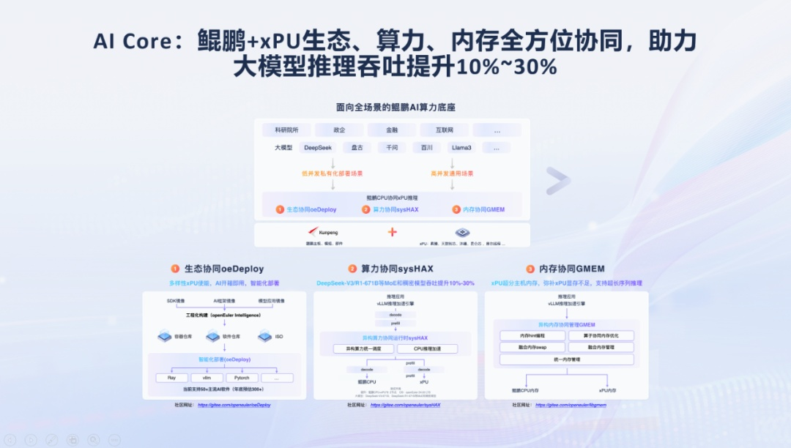
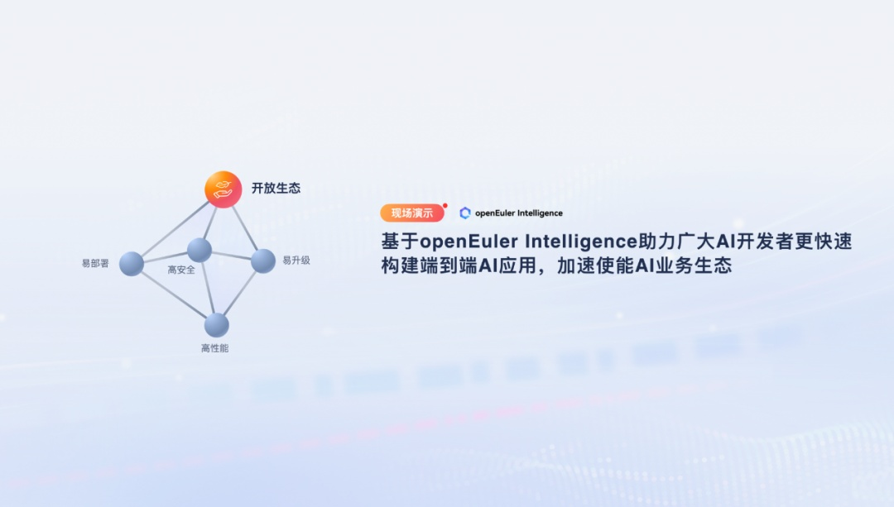
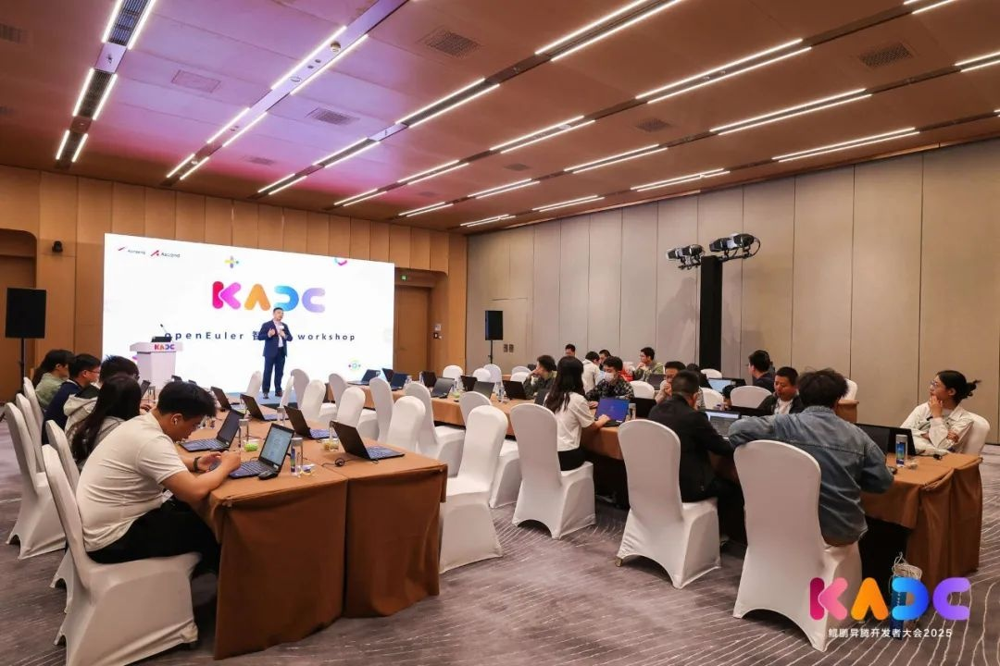
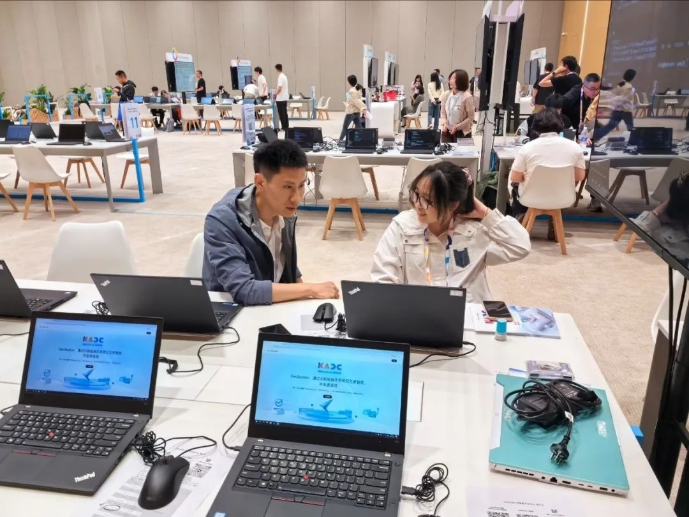

2025年5月 23 日上午举行的鲲鹏开发者大会上，正式发布了基于 OpenAtom
openEuler（简称"openEuler"） 的鲲鹏+xPU 推理解决方案和基于 openEuler
Intelligence 的 AI 开发组件，为开发者呈现一场 AI
创新与算力融合的前沿技术盛宴。

> 迈向 AI 时代，智算、通算走向异构融合，从训练到推理，CPU
> 以其通用性、灵活性与良好的生态兼容性，构建了 AI
> 技术普惠的基石。同时以 DeepSeek 为代表，伴随高性能、低成本大模型的迅速普及，国内
> AI 算力需求呈现爆发式增长，行业焦点已从"算力供给"转向"算力高效利用"。

**openEuler 与鲲鹏协同，实现生态协同、内存协同和算力协同**
----------------------------------------------------------

> 通过 openEuler
> 的安装部署工具，开发者可以灵活地以组件化配置方式安装部署所需 AI
> 环境，实现一键分钟级 DeepSeek 环境安装部署。openEuler
> 安装部署工具当前已经默认支持了 15 款业界生态组件，包括
> K8s、OpenStack、PyTorch 等常用组件。此外，openEuler
> 还提供了插件框架，使能开发者极简快速开发组件安装插件，实现伙伴/客户私有组件也可一键安装。
>
> openEuler 通过 GMEM 打通 xPU 和 CPU 内存统一编址，使能异构 xPU
> 加速器透明超分 Host T 级内存，可用内存倍级提升，LLM 推理吞吐量提升
> 50%，实现透明超分，极致性能。同时 GMEM 使能
> OS 原生接口(malloc)异构内存编程能力，极简异构编程；异构 xPU
> 加速器仅需百行代码轻松接入 GMEM 生态，实现极简编程，极易接入。
>
> openEuler 发布的 sysHAX 组件，动态调度鲲鹏和异构 xPU
> 算力资源，计算最佳算力配比，将部分 Decode 任务卸载至鲲鹏
> CPU；同时调度算法根据集群负载自动调度，自动选择调度时机，调度方向，使数据在设备内存和主机内存之间流动，提升推理总可用内存容量，提升并发，实现
> LLM 推理吞吐量提升 10%\~30%。

> **鲲鹏+xPU 生态、算力、内存全方位协同**

**openEuler Intelligence ，加速使能 AI 业务生态**
-------------------------------------------------

> openEuler Intelligence
> 此次进行了重大升级，提供了可视化工具，帮助开发者实现 RAG 私域知识库和
> AI 助手业务的端到端快速开发。
>
> 很多客户场景有大量私域知识无法通过大模型互联网训练学习，导致知识问答结果不准确、不可用。openEuler
> Intelligence 支持用户私域 RAG 知识库的搭建，支持
> DOC、PDF、PPTX、TXT、MD
> 等多种格式，文字、表格、图片等多钟模式文档导入，结合 openEuler
> 的数据治理服务、多路召回引擎和 LLM
> 管理服务等工程能力，可以使问答准确率从 60%提升至
> 90%左右。此外，openEuler Intelligence 支持了可视化的 MCP
> 工作流编排，快速生成 AI 应用，开发效率由 3-6 周缩短至天级。

> **基于 openEuler Intelligence 助力广大 AI 开发者**
>
> **更快速构建端到端 AI 应用，加速使能 AI 业务生态**

**openEuler 开发平台引爆体验区，备受开发者好评**
------------------------------------------------

> openEuler 开发平台内置了鲲鹏软件开发流水线，配合 openEuler
> Intelligence 的智能大模型入口，使开发更智能、更方便。openEuler
> 在大会现场分别组织了 WorkShop 和 CodeLab 体验区，均受到开发者追捧。
>
> openEuler 开发者体验 Workshop 现场由 40
> 台设备构建了一个多小时的沉浸式实操体验课堂。活动开场由 openEuler
> 委员会执行总监胡正策致辞，阐述 AI
> 赋能操作系统的技术愿景。近百名开发者在 openEuler
> 开发平台上深度体验了代码生成、部署、发布等场景，深度验证\"开发需求口语化，系统自动解析执行\"的创新模式。现场开发者反馈\"希望能了解更多有关
> openEuler
> 开发平台的内容\"，实操中涌现的交互优化建议将驱动智能体持续进化。这场大规模实战验证了
> openEuler 描绘的新型开发范式的落地可行性。

> **openEuler 委员会执行总监胡正策为 WorkShop 致辞**
>
> 在 openEuler 开发平台 Codelab 展区现场，12
> 台体验设备持续满载，两天吸引数百名开发者深度参与，通过自然语言交互体验
> AI 重构的智能化 openEuler
> 社区工具链。开发者亲身感受\"对话即编程\"的创新工作流。多位资深程序员评价\"智能体精准理解开发意图，调试效率提升明显\"，更有开发者赞叹\"非常震撼\"。展区收集的百余条优化建议将融入社区演进路线。这场沉浸式
> AI 开发体验不仅验证了 openEuler
> 的技术前瞻性，更点燃了开发者拥抱智能操作系统的热情。

> **开发者在 CodeLab 现场讨论**
>
> openEuler基于"鲲鹏+xPU"组合，将不断为企业提供更灵活组合的智能化基础软件底座，加快
> AI 在各行业应用。
