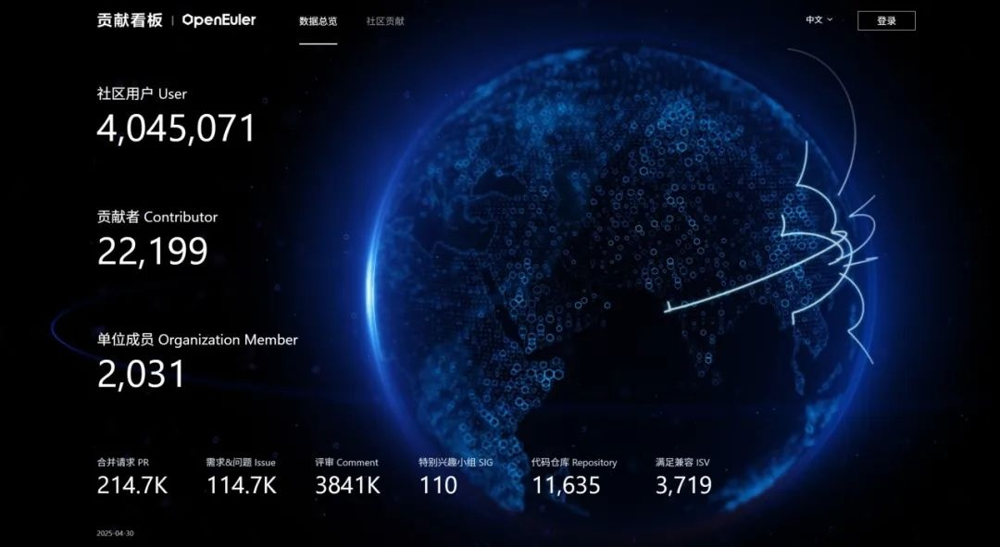
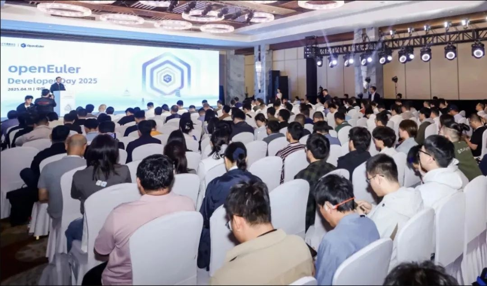
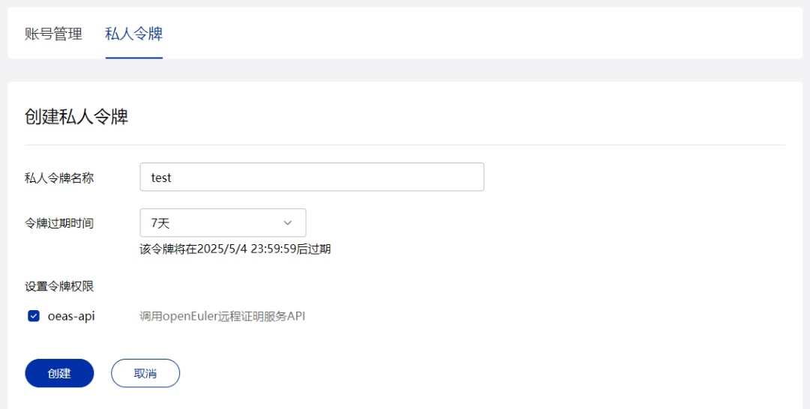
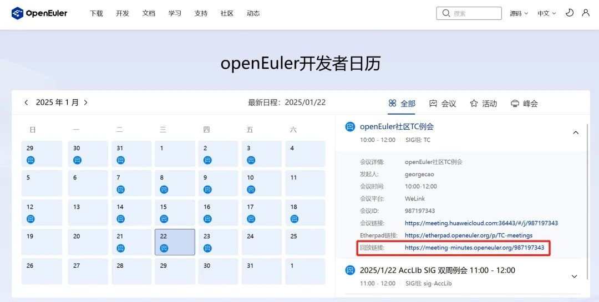
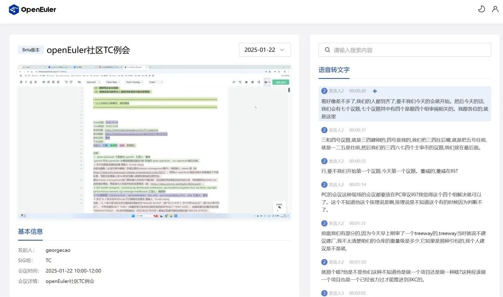
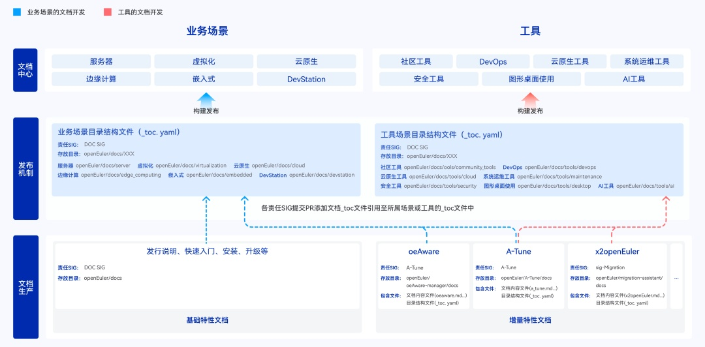
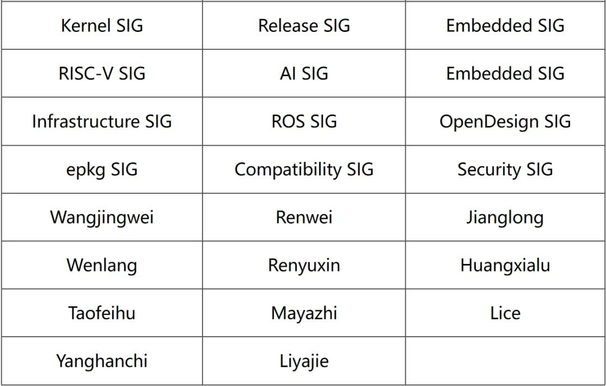

**概述**

2025年4月，OpenAtom openEuler（简称:
openEuler）社区持续稳健发展，在技术发展与开发者体验等方面均取得一些令人欣喜的成果。

在系统优化方面，社区专家任玉鑫博士提出的《基于eBPF的全系统PGO优化方案》，通过eBPF技术突破传统
PGO
的局限性，显著提升性能，实测降低容器启动时延4.6倍，机器学习训练效率提升
1.7 倍，相关成果已入选CCF
A类顶会FAST\'25。在内核与嵌入式方面，openEuler完成对 SpacemiT K1
的基础支持，完整适配预计将于9月完成并计划随 openEuler 25.09
版本发布。此外，openEuler Embedded 25.03 成功支持新一代 epkg
软件包机制，并新增 STM32MP257 芯片支持，优化系统稳定性和兼容性。在AI
与大模型生态方面，openEuler联合 vLLM 完成 Qwen3
大模型在昇腾设备的推理适配，开发者可以基于openEuler和vLLM在昇腾设备上完成
Qwen3 推理。

在开发者工具与体验优化方面，openEuler推出私人令牌功能，增强 API
访问安全；上线智能会议回放服务，结合 AI
剪辑与关键词定位，提升会议内容检索效率；此外，文档中心完成生产机制升级，优化开源协作模式与信息架构，提升文档质量与易用性。

在社区活动方面，openEuler Developer Day 2025
成功举办，来自108个SIG小组的300多名开发者聚焦社区下半年重要规划、技术方案、开发计划等进行深入探讨，推动社区生态发展与协作。开源之夏2025启动学生报名，openEuler提供60个项目任务，持续培育开源人才。openEuler
即将在5月份亮相 RISC-V Summit Europe 2025（法国巴黎） 和 Linaro Connect
2025（葡萄牙里斯本），与全球开发者分享社区创新实践，敬请期待。

本月报阅读时长10分钟。

欢迎细品。

**社区规模**

截至2025年4月30日，openEuler
社区用户累计超过400万。超过2.2万名开发者在社区持续贡献。社区累计产生
214.7K个PRs、114.7K条Issues。目前，加入openEuler社区的单位成员2031家，4月新增24家。

社区贡献看板（截至2025/04/30）

**社区事件**

**openEuler Developer Day 2025 成功举办**

4月11日，openEuler Developer Day 2025 （简称 ODD
2025）在杭州成功举办，吸引了众多技术专家、开发者和企业代表共同探讨
openEuler 的技术发展与生态建设。

大会期间，
来自108个SIG小组的300多名开发者聚焦openEuler社区重要规划，围绕内核开发、全场景应用、AI生态支持、openEuler高效开发、上游生态支持、用户体验设计、RISC-V
、云与云原生等八大技术方向展开深入讨论，推动 openEuler 生态发展与协作。

**openEuler参加第三届eBPF开发者大会**

4月19日，第三届eBPF开发者大会在西安邮电大学举办。
openEuler社区多名技术专家在现场进行了专题分享和交流。其中，openEuler TC
委员会委员唐葛亮老师带来了题为《BPF on
MPTCP》的主题演讲，深入探讨BPF技术在多路径传输控制协议中的创新应用与实践经验。openEuler
Valuable Professional任玉鑫博士则带来了《基于 eBPF 的全系统 PGO
优化方案》的分享，该方案通过eBPF技术突破传统 PGO
的局限性，显著提升性能，实测降低容器启动时延4.6倍，机器学习训练效率提升
1.7 倍。其相关成果已入选CCF A类存储顶会FAST\'25：

https://www.usenix.org/conference/fast25/presentation/liu-yubo

**开源之夏 2025 正式启动学生报名**

目前，开源之夏 2025 学生报名通道正式开启。openEuler 社区项目累计上线 60
个项目任务，涵盖内核、云与云原生、编译器、嵌入式、AI等多个技术方向。同学们可以在开源之夏官网浏览社区的项目信息，主动联系感兴趣的项目导师，深入了解项目内容。

开源之夏：

https://summer-ospp.ac.cn/

**技术进展**

**openEuler完成对SpacemiT K1的基本支持**

近期，进迭时空与软件所 OERV 团队合作，完成了 openEuler 内核 6.6
版本主线对 SpacemiT K1
的基本支持，主要包括对设备树（DTS）、时钟（CLK）、复位控制器（reset）、引脚控制（pinctrl）、GPIO
子系统以及 UART 串口的支持。相关工作通过 OERV 内核同源工程完成，并在
OERV 小组的指导下达到合入 OLK6.6 分支的质量要求。openEuler 对 SpacemiT
K1 完整支持将在 2025 年 9 月完成，并计划随 openEuler 25.09
版本正式发布。

**openEuler Embedded 25.03版本率先支持新一代软件包机制epkg**

4月底，openEuler Embedded 25.03分支正式拉出，该版本主要亮点包括：

率先支持openEuler新一代软件包机制epkg，

对以往遗留的深层次的问题做了系统性的清理，包括但不限于Yocto
Poky升级到4.0 LTS的最新版本，Systemd支持优化，内核配置清理与优化等等，

在南向支持上新增意法半导体STM32MP257系类SoC的支持，完善鲲鹏及鲲鹏模组的支持。

**openEuler联合vLLM完成Qwen3大模型昇腾推理适配**

4月29日，阿里巴巴发布新一代Qwen大语言模型系列（Qwen3与Qwen3-MoE），在模型规模与性能上实现多方面升级。openEuler社区团队与vLLM社区通力合作，在第一时间完成Qwen3模型验证。目前，开发者可以基于openEuler和vLLM在昇腾设备上完成
Qwen3 推理。

原文阅读：

https://mp.weixin.qq.com/s/tlmPNqWyJRVE0VFpxmcWew

**openEuler社区账号服务推出私人令牌功能**

openEuler社区账号服务平台(https://id.openeuler.org/login)现已正式上线私人令牌功能。用户可通过社区平台个人中心直接生成和管理私人令牌，用于调用社区开放API，实现更细粒度的访问控制。该功能现已优先支持远程证明服务API，提供机密计算的远程验证能力。

**功能实现细节：**

令牌管理

● 个人中心新增私人令牌模块

● 支持创建、查看、更新和删除操作

权限控制

● 初始权限范围限定为oeas-api（后续将逐步扩展）

安全机制

● 关键操作（生成/更新/删除）需通过邮箱验证

● 令牌仅在首次生成时明文显示（需用户自行保存）

openEuler API Documentation：

https://www.openeuler.org/api-workspace/oneid-workbench/docs

**openEuler智能会议回放服务正式上线**

openEuler社区推出智能会议视频回放服务。开发者只需通过 "openEuler小程序"
预定线上会议，并开启 "录制" 功能，在会议结束后的
24小时内，系统将自动生成回放链接。视频回放服务还支持关键词定位，帮助开发者快速跳转到视频中的关键内容，大幅提升信息获取效率。

**核心功能亮点：**

智能剪辑，高效观看

● 基于 FFmpeg
工具，系统自动识别并删除会议中的静默片段（如休息时间、无人发言等），平均缩减
40% 的无意义时长，让观看更聚焦！

清晰易用的回放界面

● 告别传统低效的B站回放模式，全新系统集成 大模型能力（whisperx），实现
高精度语音转写 与 发言人识别。

● 完整展示会议详情：会议发起人、会议时间、SIG组信息等，一目了然。

● 时空关联检索：输入关键词即可 精准定位
视频对应内容，点击直接跳转，告别手动拖进度条。

开发者可在「openEuler开发者日历」查看会议回放，如下图TC会议：

https://meeting-minutes.openeuler.org/987197343

**openEuler文档生产机制发布与体验升级**

针对用户反馈的"查找困难、内容冗杂、更新滞后、逻辑混乱"等问题，openEuler文档中心进行了系统性优化。此次升级聚焦两大方向：

文档生产机制改进：建立开源协作模式，文档开发下沉至各 SIG
组，制定标准化模板与规范，结合自动化门禁管理，提升文档质量和更新效率。同时，社区上线《文档开发指南》，开发者可以根据指南参与openEuler文档开发：

https://docs.openeuler.org/zh/docs/common/contribute/directory\_structure\_introductory.html

信息架构重构：按业务场景与用户角色拆分文档，形成 6 大场景、7
个工具模块、70+
手册，优化搜索精准度、视觉交互、反馈机制等，帮助用户快速定位所需内容。

新版文档中心已上线，欢迎访问：

https://docs.openeuler.org/

**软硬件兼容性测评**

截至2025年4月30日，openEuler软硬件兼容性测评新增47个，其中北向（ISV）新增38个，南向（IHV）新增8个，OSV新增1个。

兼容性列表：\
https://www.openeuler.org/zh/compatibility/\
OSV技术测评列表\
https://www.openeuler.org/zh/approve/

**安全公告**

2025年4月社区共发布安全公告112个，修复漏洞299个（其中 Critical 9个，High
74个，其它 216个）。

**重点漏洞提醒**

如下漏洞评估影响较大，请重点关注。

在OTP-27.3.3、OTP-26.2.5.11和OTP-25.3.2.20版本之前，SSH服务器可能存在允许攻击者执行未经身份验证的远程代码执行（RCE）的安全漏洞。通过利用SSH协议消息处理中的缺陷，恶意行为者可以在没有有效凭证的情况下获得对受影响系统的未经授权访问，并执行任意命令。**（CVE-2025-32433）**

CVSS评分为10.0分 

公告链接：

https://www.openeuler.org/zh/security/cve/detail/?cveId=CVE-2025-32433&packageName=erlang

影响范围：

openEuler-20.03-LTS-SP4

openEuler-22.03-LTS-SP3

openEuler-22.03-LTS-SP4

openEuler-24.03-LTS

openEuler-24.03-LTS-SP1

在Artifex Ghostscript
10.05.0之前的版本中发现了一个问题。BJ10V设备中的contrib/japanese/gdev10v.c文件存在打印缓冲区溢出漏洞。**（CVE-2025-27836）**

CVSS评分为9.8分

公告链接：

https://www.openeuler.org/zh/security/cve/detail/?cveId=CVE-2025-27836&packageName=ghostscript

影响范围： 

openEuler-20.03-LTS-SP4

openEuler-22.03-LTS-SP3

openEuler-22.03-LTS-SP4

openEuler-24.03-LTS

openEuler-24.03-LTS-SP1

**漏洞防护**

openEuler社区针对在维版本例行修复漏洞，发布安全补丁。建议用户关注openEuler官网安全公告，及时安装漏洞补丁进行防护。

openEuler 安全公告：

https://www.openeuler.org/zh/security/security-bulletins/

**感谢每一位朋友、开发者的支持**

因为大家的辛勤贡献，openEuler
的每一天都发生着好的事情。小编限于视野和能力，难免有所遗漏，在此表示歉意。同时，衷心感谢社区成员单位、SIG组和开发者朋友们的贡献：

\* 以上不分先后顺序

如果您希望在月报中增加您的工作内容，或对内容有任何改进建议，请联系wengqiaozhen@openeuler.sh。
