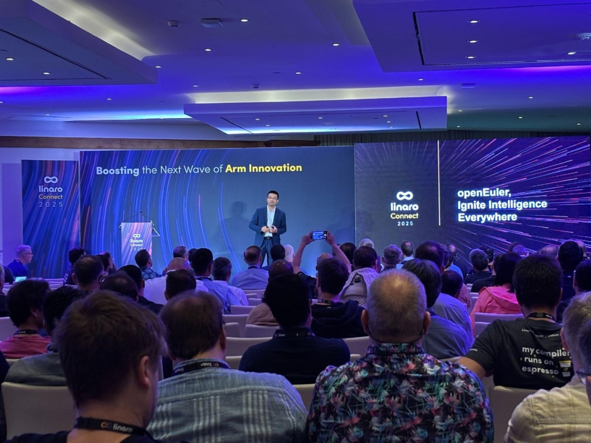
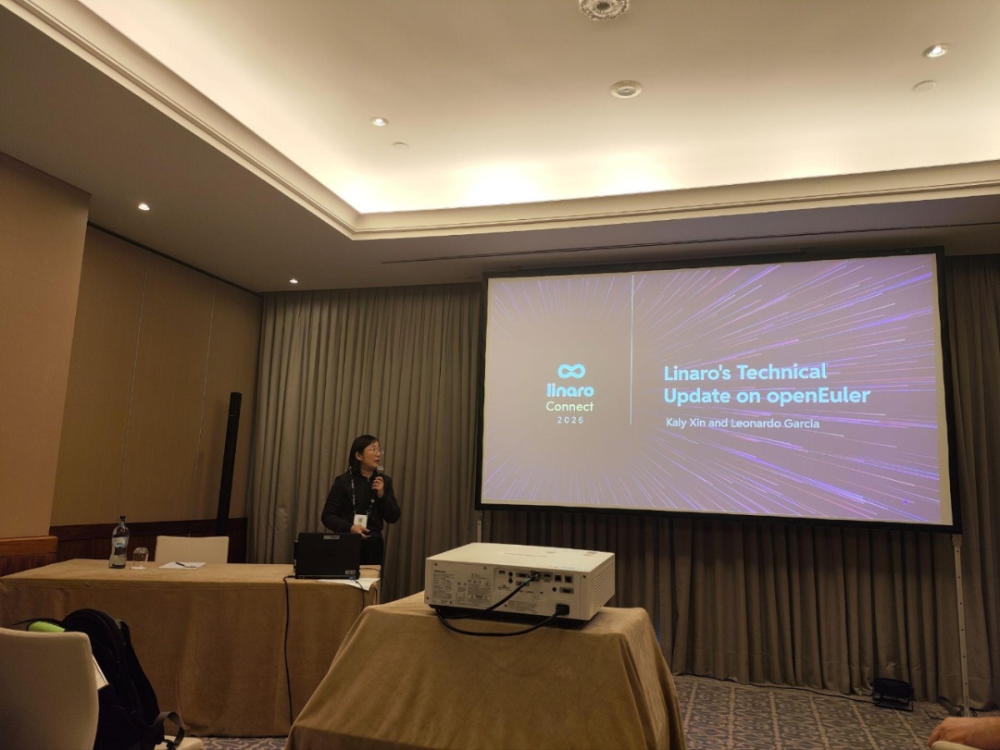
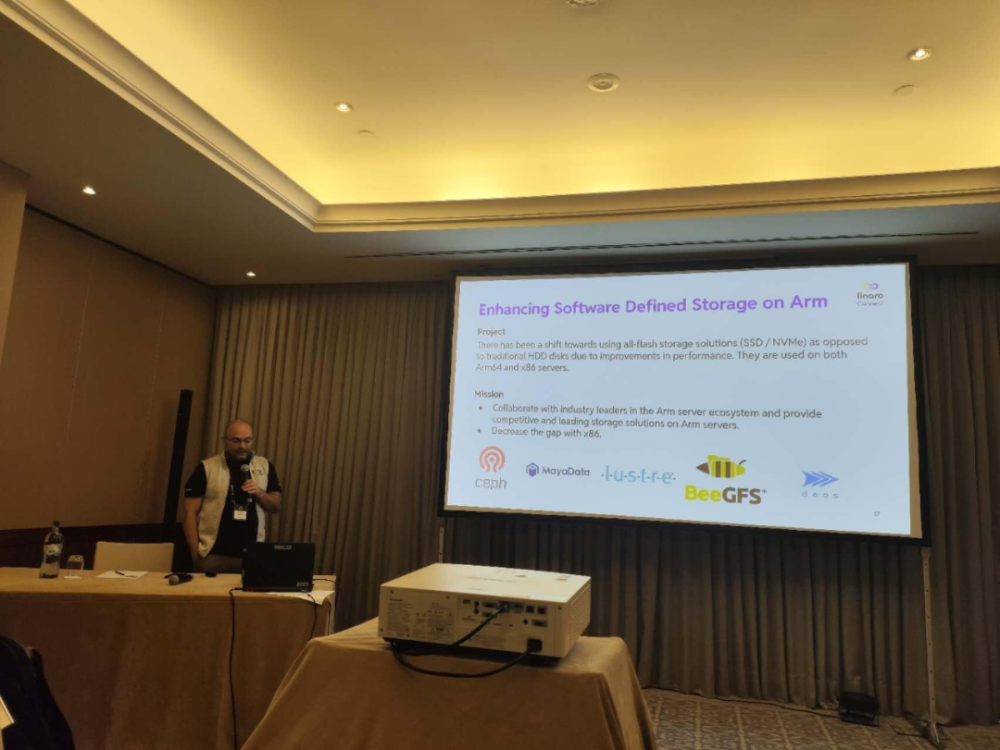
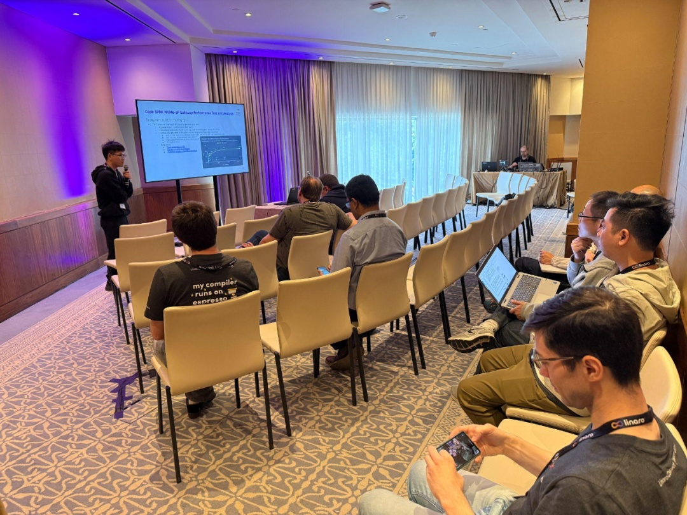
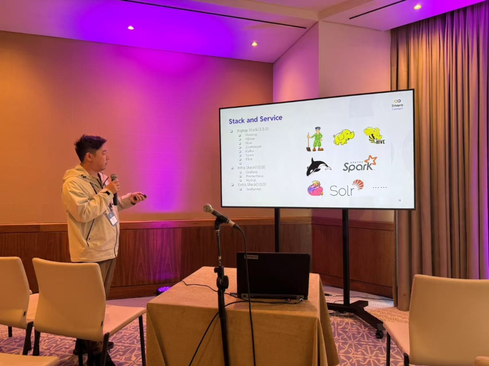
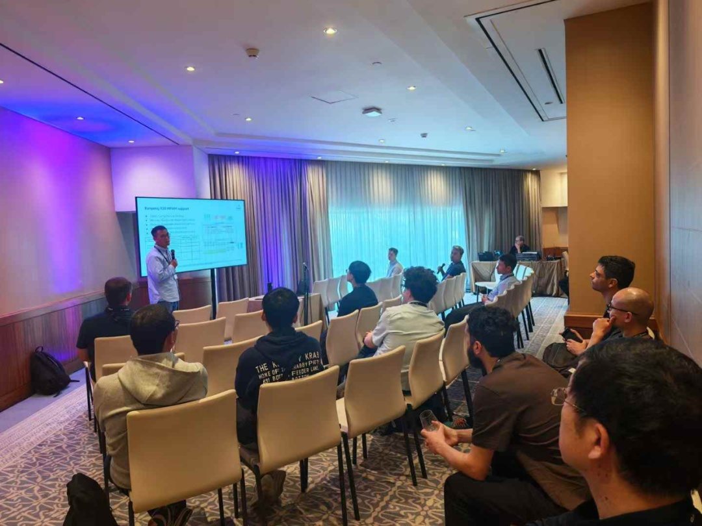

自2021年Linaro与OpenAtom
openEuler（简称openEuler）社区携手以来，双方在Arm服务器领域展开深度技术合作，从标准化、数据存储到大数据，不断突破创新！Linaro的国际影响力为openEuler注入了全球化视野，推动社区生态加速走向世界舞台。

Linaro Connect
2025于5月14～16号在葡萄牙首都里斯本举行的峰会已经顺利闭幕，此次会议吸引了五十多个全球Arm生态行业的领先合作伙伴的积极参与和讨论，此次会议举办了12场主题演讲，130多场技术演讲，Workshop和技术demo。让我们来回顾下openEuler社区在Linaro
Connect 2025上的精彩呈现!

主题演讲1：

**当openEuler 和它的朋友们遇见 DeepSeek**

演讲嘉宾：

熊伟，OpenAtom openEuler委员会主席，开放原子开源基金会TOC副主席
 

openEuler最新的版本中除了对全场景能力提升外，进一步增强了对人工智能技术的支持，例如openEuler开发的GMEM、混合推理、openEuler
Intelligence、AI开发桌面DevStation等，当所有这些技术和开源的DeepSeek大模型、openGauss向量数据库以及即将开源的云原生和人工智能平台结合时，一个强大的全开源人工智能软件栈清晰地呈现在我们面前。本次演讲熊伟博士带领大家一起探索"开源系列"中的几款开源软件与DeepSeek结合所带来的奇妙成果。

视频链接：

[https://resources.linaro.org/en/resource/grQde72CRHUWTWbw33fmu5]

演讲议题2: 

**Linaro的openEuler技术更新**

演讲嘉宾：

Leonardo Garcia， Linaro首席工程师

Kaly Xin，Linaro 软件工程总监

Linaro从2021年开始加入openEuler社区，在大数据与数据科学、软件定义存储、机密计算以及高性能加速技术等多个领域积极参与SIG组的运营，推动解决方案的使能和落地。演讲嘉宾着重分享了各个领域合作的技术成果，解决方案介绍，以及后续的具体规划。Linaro长期致力于对openEuler社区生态的贡献，期待与openEuler社区和合伙伙伴一起，共同推动openEuler的生态繁荣和国际化。

视频链接：

[https://resources.linaro.org/en/resource/sfmEECZCg5emd8aMNhypAX]{.underline}

演讲议题3：

**存储系统性能分析之旅：以 Ceph SPDK NVMe-oF 网关为例**

-   

演讲嘉宾：

-   

刘新良，Linaro工程师 

-   

Ceph SPDK NVMe-oF 网关是一种类似 SAN
的网络块磁盘解决方案。可用于虚拟化、云计算、数据湖、人工智能等领域。与
Ceph-iSCSI 网关相比，它支持现代存储网络 NVMe-oF 协议，该协议具有多 IO
队列能力和高性能的特点。本次演讲首先介绍了存储系统Ceph SPDK
NVMe-oF网关的设计概念，应用场景，上游Arm架构支持工作，最后重点分享了如何在基于Arm架构和openEuler操作系统平台上进行存储系统搭建、性能测试、性能问题分析定位和调优。同时在多架构支持方面，我们还分享了Arm64和x86\_64
混合部署案例。会上嘉宾反映对SPDK相关存储技术方案的极大兴趣。作为openEuler
SDS
SIG的重点关注的创新项目，该项目得到了来自社区伙伴的持续关注，后续我们会持续推动在openEuler平台上分布式存储方案上的原生支持和性能调优。

视频链接：

[https://resources.linaro.org/en/resource/itJdrHETP9RFeYCnw6hBPM]{.underline}

演讲议题4：

**大数据和数据科学项目更新**

演讲嘉宾：

赵帅， Linaro 技术主管

吴治国，Linaro工程师

本次分享聚焦在大数据开源项目生态：首先介绍了 Bigtop 及其管理工具 Bigtop
Manager 的起源背景，包括项目孵化的行业需求与技术演进逻辑，接着同步了
Bigtop 3.3.0 版本的最新开发进展，涵盖核心模块优化与社区协作动态。针对
Bigtop Manager 1.0.0
版本，重点阐述了集群自动化部署、多集群/多Stack管理等核心功能特性。此外，还分享了团队在
Gluten/Velox 开源社区的技术贡献，包括 ARM CI 的支持、openEuler
操作系统兼容性适配等工作，展现了跨平台技术落地的实践经验。

视频链接：

[https://resources.linaro.org/en/resource/qYFjVf3ksXjxFxtgrgomPy]{.underline}

主题演讲5：

**在ARM64服务器上为云部署MPAM**

演讲嘉宾：

郭寒军，华为操作系统内核架构师

李硕，华为CPU专家

ARM 的 MPAM 指的是"内存系统资源分区与监控"，这是 ARMv8.4
的一项特性，能够为虚拟机（VMs）和容器做缓存和内存带宽隔离。本次主题介绍了
MPAM 在鲲鹏 ARM
服务器上的工作原理，以及openEuler操作系统+鲲鹏920使能MPAM后在云计算等真实场景的应用。结论表明，MPAM在云原生混部场景下可有效降低虚拟机和容器间cache和内存带宽干扰，提升前台业务性能。

视频链接：

[https://resources.linaro.org/en/resource/4fDFD2L9KKyWpsR1PRtSoP]

**所有演讲视频链接：**

[https://resources.linaro.org/en/events/p8omrJfuQTFBgJ87mMa9Af]

**Youtube：**

[https://www.youtube.com/playlist?list=PLKZSArYQptsODycGiE0XZdVovzAwYNwtK&si=aGY6U2gTa99r28ls]
