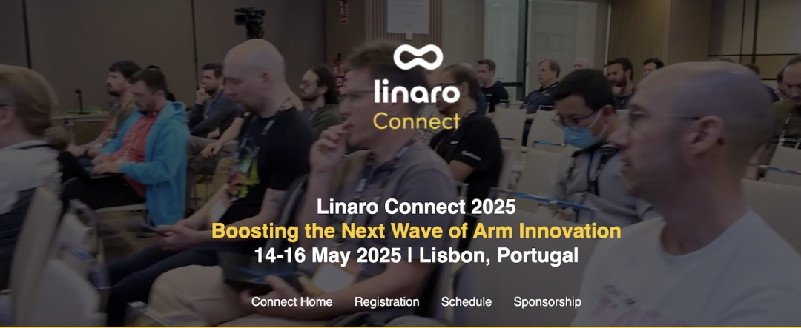

Linaro Connect 2025 日程发布，openEuler 社区5个议题入选
=======================================================

OpenAtom openEuler 2025年05月13日 19:45 广东

自2021年Linaro与OpenAtom
openEuler（简称openEuler）社区携手以来，双方在Arm服务器领域展开深度技术合作，从标准化、数据存储到大数据，不断突破创新！Linaro的国际影响力为openEuler注入了全球化视野，推动社区生态加速走向世界舞台。

今年，openEuler社区5个技术议题成功入选Linaro Connect
2025，精彩内容即将呈现，诚邀开发者一同关注！

**具体安排参考如下：**

主题演讲1：

**当openEuler 和它的朋友们遇见 DeepSeek**

-   

**时间：**5月16日 16:35～16:50（北京时间）

-   -   

**地点：**主题演讲室

-   -   

**演讲嘉宾：**

-   

熊伟，OpenAtom openEuler委员会主席，开放原子开源基金会TOC副主席

-   

openEuler最新的版本中除了对全场景能力提升外，进一步增强了对人工智能技术的支持，例如openEuler开发的GMEM、混合推理、openEuler
Intelligence、AI开发桌面DevStation等，当所有这些技术和开源的DeepSeek大模型、openGauss向量数据库以及即将开源的云原生和人工智能平台结合时，我们惊喜的发现一个强大的全开源人工智能软件栈清晰地呈现在我们面前。本次演讲熊伟博士将带领大家一起探索"开源系列"中的几款开源软件与DeepSeek结合所带来的奇妙成果。

演讲议题2: 

**Linaro的openEuler技术更新**

-   

**时间：**5月16日 17:10～17:35（北京时间）

-   -   

**演讲嘉宾：**

-   

Leonardo Garcia， Linaro首席工程师

-   

Kaly Xin，Linaro 软件工程总监

-   

Linaro一直是openEuler的重要贡献者。参加本次会议，您将了解到openEuler在市场上的技术重要性，以及Linaro在大数据与数据科学、软件定义存储、机密计算以及高性能加速技术与解决方案等多个领域和openEuler的合作以及在openEuler上取得的最新进展。

演讲议题3：

**存储系统性能分析之旅：以 Ceph SPDK NVMe-oF 网关为例**

-   

**时间：**5月15日 17:30～17:55（北京时间）

-   -   

**演讲嘉宾：**

-   

刘新良，Linaro工程师 

-   

Ceph SPDK NVMe-oF 网关是一种类似 SAN
的网络块磁盘解决方案。可用于虚拟化、云计算、数据湖、人工智能等领域。与
Ceph-iSCSI 网关相比，它支持现代存储网络 NVMe-oF 协议，该协议具有多 IO
队列能力和高性能的特点。在本次演讲中，您将了解 Ceph SPDK NVMe-oF
网关是什么，它的重要性，以及在上游为支持 Arm架构所做的工作，包括了Arm64
和 x86\_64 混合部署，以及是如何在基于
Arm架构和openEuler操作系统的平台上进行的存储系统上进行性能测试、分析和调优的。作为openEuler
SDS
SIG的创新项目，该项目得到了来自社区伙伴的持续关注，后续我们会持续推动在openEuler平台上分布式存储方案上的原生支持和性能调优。

演讲议题4：

**大数据和数据科学项目更新**

-   

**时间：**5月16日 18:10～18:35（北京时间）

-   -   

**演讲嘉宾：**

-   

赵帅， Linaro 技术主管

-   

吴治国，Linaro工程师

-   

Bigtop-manager是openEuler Bigdata
SIG重点孵化和运作的项目，从诞生之日起就获得了openEuler社区各个伙伴的大力支持。同时，Apache
Bigtop在3.3.0版本引入了对openEuler的原生支持，推动Bigtop社区将openEuler作为基础支持的操作系统。考虑到向量化是大数据工作负载中最大化
CPU 性能的关键路径，我们一直在积极探索加速机会。我们将分享通过 Gluten
向量化框架和 Velox 执行引擎对 Spark SQL
优化所取得的进展。此外，我们还将分享对大数据基础设施未来潜在方向的见解。

主题演讲5：

**在ARM64服务器上为云部署MPAM**

-   

**时间：**5月16日 19:10～19:35

-   -   

**演讲嘉宾：**

-   

郭寒军，华为操作系统内核架构师

-   

李硕，华为CPU专家

-   

ARM 的 MPAM 指的是"内存系统资源分区与监控"，这是 ARMv8.4
的一项特性，能够为虚拟机（VMs）和容器分区缓存和内存带宽。本次主题将介绍
MPAM 在鲲鹏 ARM
服务器上的工作原理，以及openEuler操作系统使能MPAM后在云计算等真实场景的应用。结论表明，MPAM
是一个多场景下非常有用的特性。

诚邀您来参加（线上线下均可）！

注册二维码：（线上选择Virtual）

**期待与您线下和线上相见！**
