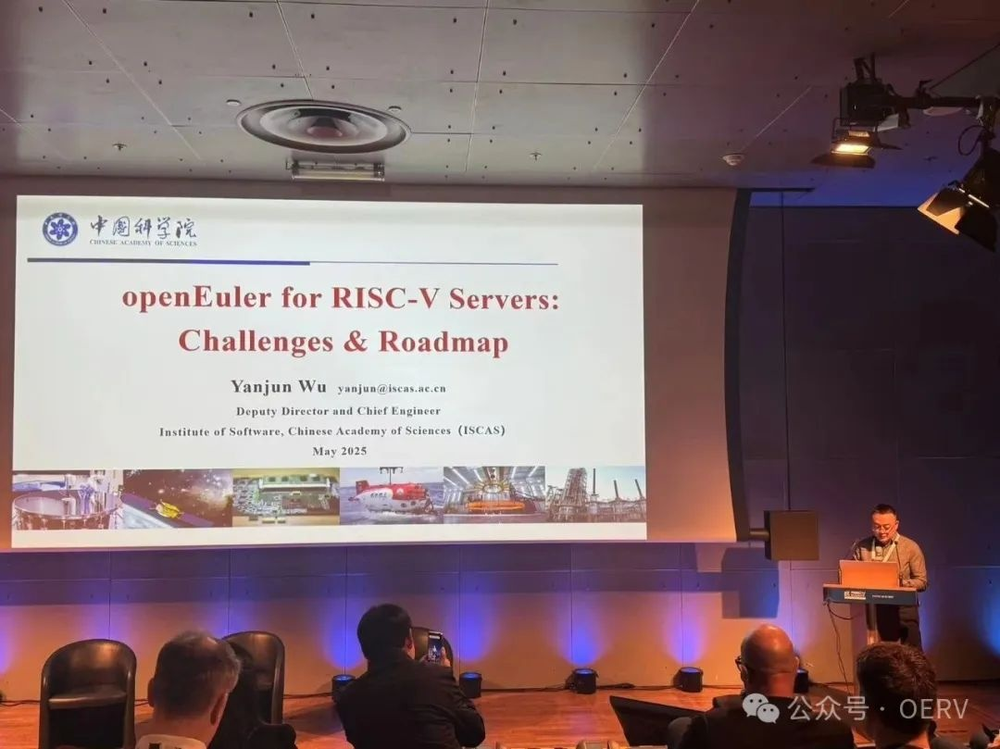
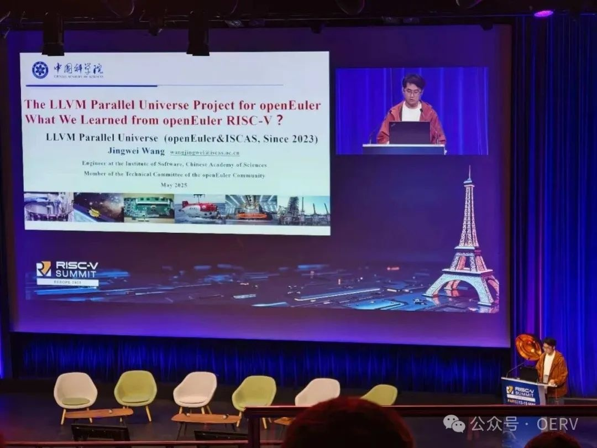
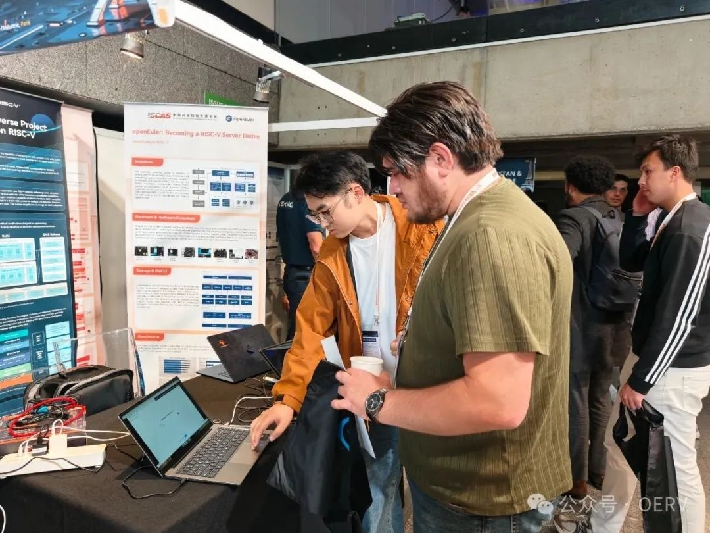
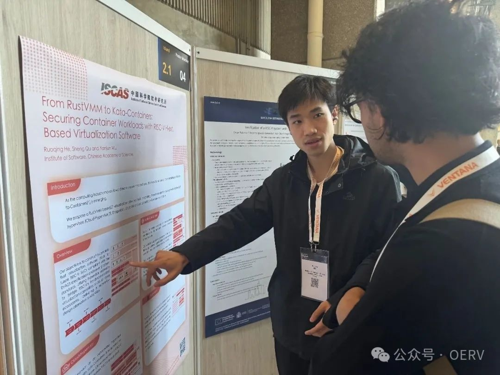
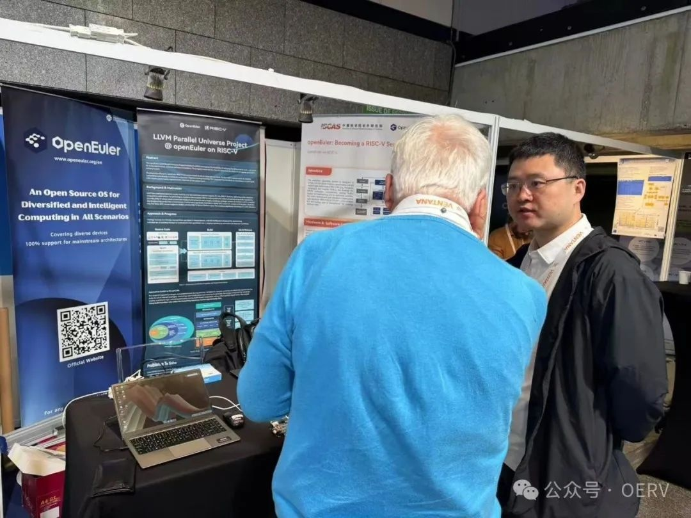

RISC-V Summit Europe

2025年5月12日至15日，RISC-V Summit Europe 2025 在巴黎成功举办。作为全球
RISC-V
年度盛会之一，来自全球的技术专家、行业领袖和相关学者通过主题演讲、技术研讨和成果展示，深入交流了开源软硬件领域的创新实践，共同探讨
RISC-V 生态的未来发展。

OpenAtom openEuler（简称\"openEuler\"）  on RISC-V
SIG在本次大会上分享了关于 openEuler 服务器操作系统在 RISC-V
生态中的一些实践成果。接下来，让我们一起回顾大会的更多精彩内容！

**Plenary Talks**

软件所研究员，副所长、总工程师，中电标协RISC-V工委会轮值会长武延军在会上深入探讨了
RISC-V 服务器操作系统标准化进程以及 openEuler 在 RISC-V
上的发展策略。openEuler 计划在 26.03 版本中全面支持 RISC-V
服务器平台规范，重点完善 6.6 LTS 内核，集成服务器平台通用驱动并验证
RVA23 标准，随后逐步优化用户态功能。openEuler 社区与 RISC-V
硬件厂商紧密合作，聚焦编译和存储服务器的场景构建，推动操作系统与软硬件生态协同发展。\

openEuler 技术委员会委员，RISC-V SIG Maintainer 王经纬在会议上介绍了
LLVM 平行宇宙计划。该项目致力于将 LLVM 模块化优势与 openEuler
既有的软件生态深度融合，并建立了 RISC-V
操作系统的专属定制化解决方案。目前项目已完成 RVA22
标准编译器基线升级，率先激活向量扩展支持。在未来，LLVM
平行宇宙项目将凭借其积累优势，加速 RVA23 生态的到来。

**Posters 展示**

\
王经纬向现场的参会者介绍了 openEuler 操作系统适配 RISC-V
服务器平台的实践路径。团队正推动 openEuler
成为首个全面支持该标准的服务器发行版。\

何若轻介绍基于 Rust-VMM 开发的一套 RISC-V
轻量级虚拟化开源解决方案，旨在为机密计算环境提供高效的隔离与性能保障。目前，团队已在
Rust-VMM、Cloud-Hypervisor 等开源项目中贡献多项代码，持续推动 RISC-V
生态在云计算领域的技术标准化与实践落地。

**展台交流**

会议期间，openEuler
专属展台集中展示了社区在软硬件领域的最新成果。现场，搭载 openEuler
系统的 RISC-V 如意笔记本高清视频播放流畅；k1 开发板在 openEuler
上成功运行轻量化 DeepSeek 推理应用；运行贪吃蛇游戏的 openHarmony RISC-V
平板则彰显了跨平台兼容与创新的活力。这些成果吸引众多参会者驻足，就技术细节、应用场景及未来趋势展开热烈探讨，现场气氛活跃。来自法国南特综合理工学院的 Przemyslaw
BAKOWSKI 教授表达了对 openEuler
项目在适配众多硬件平台方面所做工作的赞许。他期望能与社区开展协作，将我们的社区能力引入到他的实验室教学实践之中，以推动相关知识的落地应用。openEuler
在 RISC-V
架构上做的工作，为社区与高校、学术机构合作创新提供了新的机会与未来。

**会后联动**

大会结束后，RISCV 国际基金会发表了 《High RISC, High Reward: RISC-V at
15》，回顾 RISC-V 架构15年来的演进之路。文章中特别表达了对中科院软件所和
openEuler 社区的感谢------中科院软件所和 openEuler
社区于2020年推出中国首个 RISC-V 开源 Linux 发行版 openEuler，并在 Kata
Containers、Cloud Hypervisor 等虚拟化领域持续创新，近期更实现基于 LLVM
的矢量加速镜像在 K1 开发板的成功部署，为全球 RISC-V
生态树立开源协作标杆。OERV 与 RISC-V 国际基金会保持共识，相信 RISC-V
一定会为全球数字基建注入更普惠、更可持续的架构生命力。
