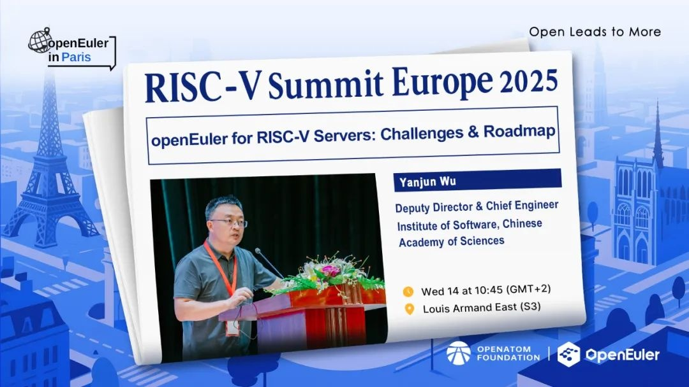
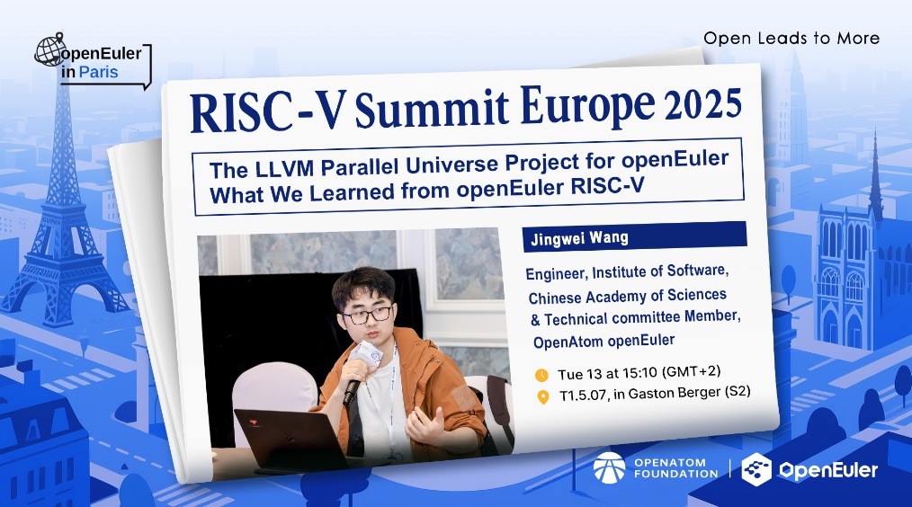

RISC-V Summit Europe 2025 将于当地时间 5 月 12日 至 15
日，在法国巴黎举行。作为全球年度 RISC-V
盛会，本次大会将汇聚来自世界各地的行业领袖、技术专家和研究学者，共同探讨、展示
RISC-V
在计算机架构、嵌入式系统、物联网、人工智能等领域的最新技术突破、行业里程碑和应用实践。openEuler将亮相本次大会，与全球开发者深入探讨RISC-V的前沿趋势，欢迎朋友们关注！日程链接：https://riscv-europe.org/summit/2025/

**openEuler相关议题**

**欢迎关注openEuler社区账号，与开发者们一起讨论：**

X（Twitter）：\
https://x.com/openEuler

Linkedin：\
https://www.linkedin.com/company/openEuler

YouTube：\
https://www.youtube.com/@openEuler
