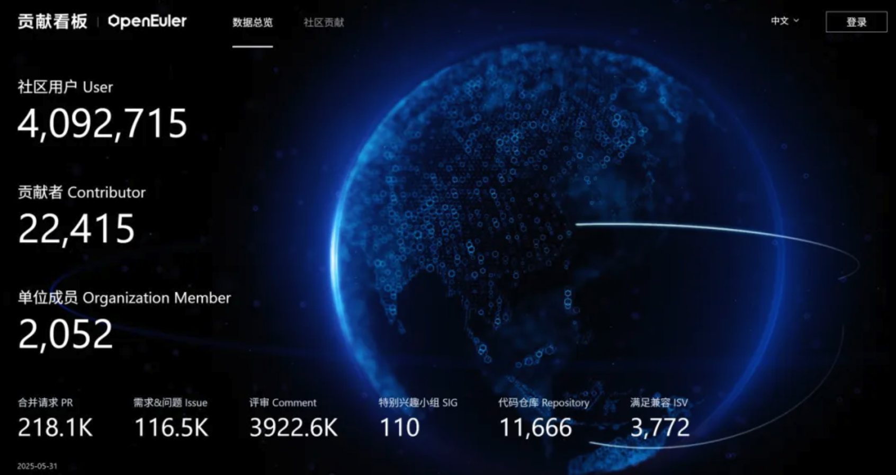
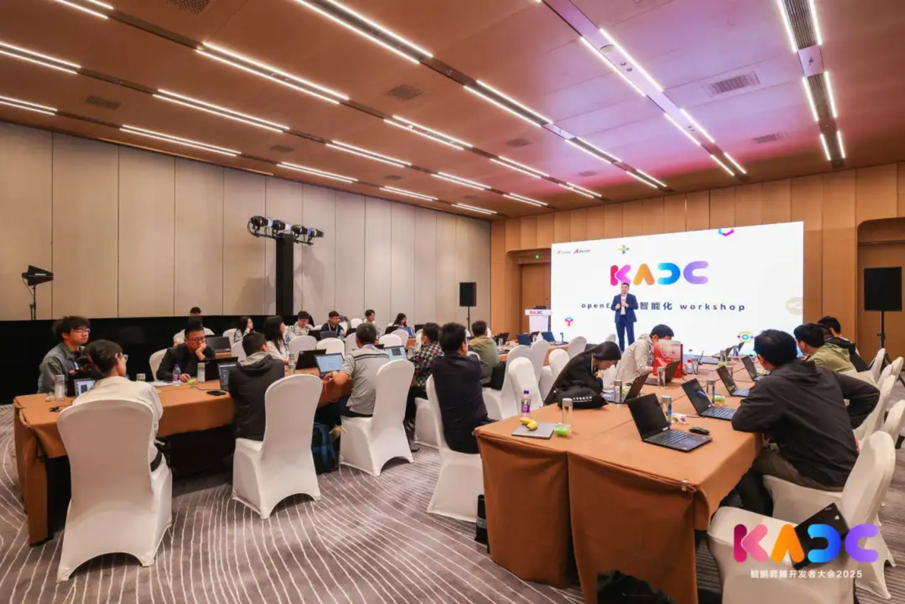
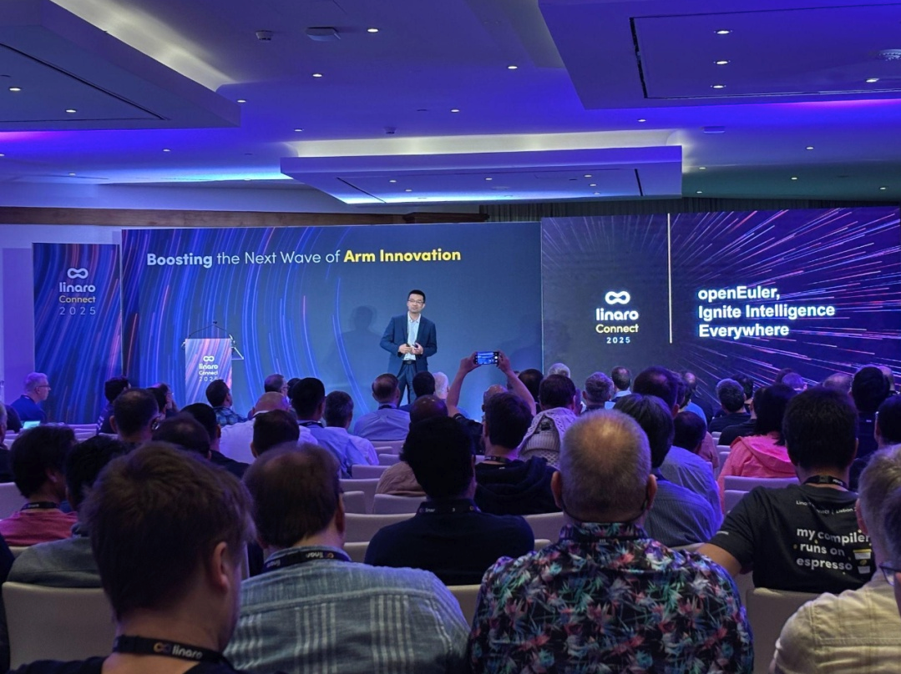
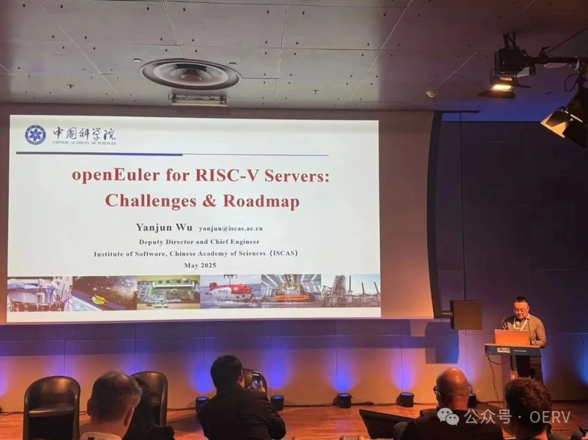
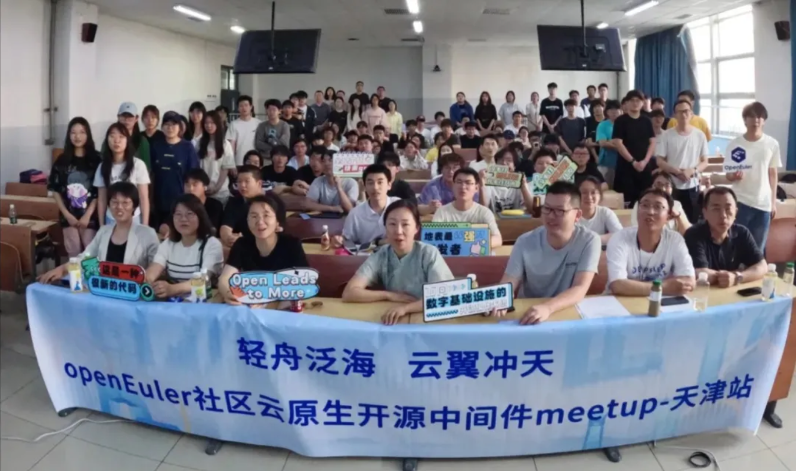
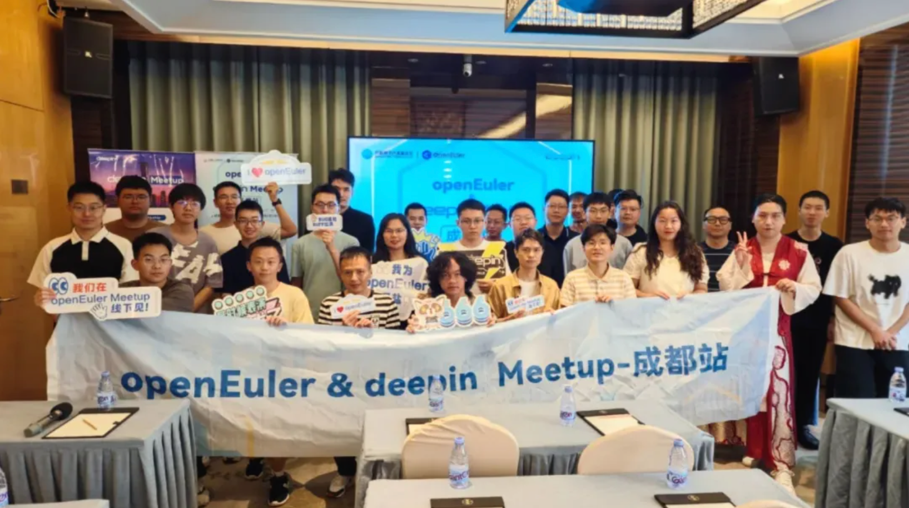
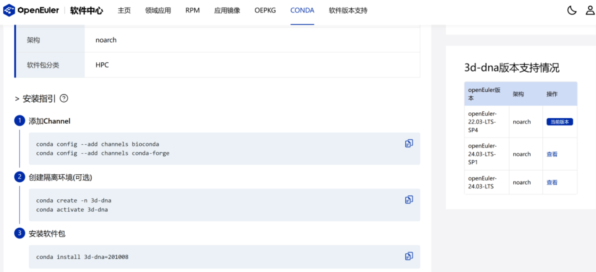
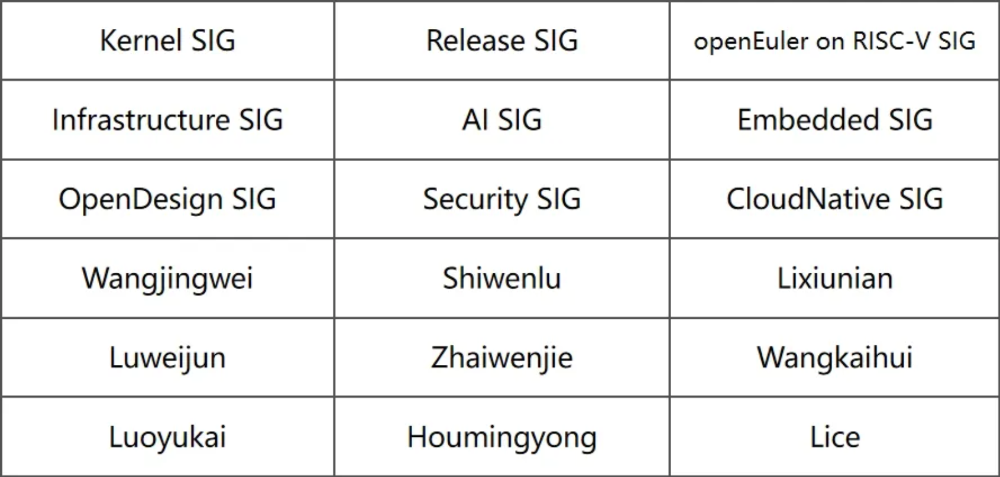

**概述**

2025年5月，OpenAtom openEuler（简称: openEuler）社区迎来了多项技术创新，覆盖了从开发者工具链到硬件适配的全方位发展。首先，社区推出了智能软件包自动升级工具链，利用大模型技术优化软件包维护流程，显著提升开发效率。Conda软件包的引入丰富了openEuler软件中心的生态发展。作为 openEuler DevStation 的核心组件，DevKit 为开发者提供了更智能的编译调试能力，显著提升开发效率。此外，社区发布了轻量化Distroless镜像和远程证明服务，分别提升了容器安全性和机密计算能力。

在应用层面，openEuler联合ST和米尔科技推出了基于STM32MP257处理器的高性能AI Demo，实现了高效的图像和视频识别。另外，openEuler LLVM RVA23 通过香山"昆明湖"RISC-V平台验证（OERV团队实施），推动RISC-V软硬件协同创新。

openEuler社区持续活跃，多维度推动开源生态的发展。在技术合作方面，深化多样性算力的生态合作，积极在鲲鹏开发者大会、Linaro Connect 2025、RISC-V Summit 2025等大会活跃，展示社区最新发展成果；通过开展Workshop实践及多地Meetup活动，促进技术交流与社区共建。

openEuler始终重视开源人才培养，积极为开发者提供成长平台。今年社区再度深度参与"开源之夏2025"活动，提供60个涵盖内核、云原生、AI等技术领域项目，报名通道将于6月9日截止，欢迎高校开发者们踊跃参加。

本月报阅读时长15分钟。

欢迎细品。

**社区规模**

截至2025年5月31日，openEuler 社区用户累计超过409万。超过2.2万名开发者在 社区  持续贡献。社区累计产生 218.1K个PRs、116.5K条Issues。目前，加入openEuler社区的单位成员2052家，5月新增21家。

社区贡献看板（截至2025/05/31）

**社区事件**

**openEuler助力鲲鹏+xPU全方位协同，加速使能AI业务生态**

在5月23日举办的鲲鹏开发者大会上，基于openEuler 的鲲鹏+xPU 推理解决方案正式发布。 openEuler 通过与鲲鹏的协同，实现了生态、内存和算力的全方位协同。

大会期间，openEuler通过沉浸式Workshop和Codelab体验区，吸引了众多开发者参与。在openEuler 开发平台，开发者深度体验，验证了“开发需求口语化，系统自动解析执行”的创新模式和“对话即编程”的创新工作流，均获得了开发者的高度评价和积极反馈。

原文阅读：

[openEuler 助力鲲鹏+xPU全方位协同，加速使能AI业务生态](https://www.openeuler.org/zh/news/20250530-dkadc/20250530-dkadc.html)

**openEuler社区亮相Linaro Connect 2025**

5月14日-16日，Linaro Connect 2025在在葡萄牙里斯本举办。openEuler在会上展示了与Arm生态的深度合作成果。作为Linaro的重要合作伙伴，openEuler通过5场主题演讲，分享了从AI全栈支持、存储优化到大数据技术的创新突破，吸引了全球开发者的关注。相关的回放视频可在openEuler Youtube查看，欢迎感兴趣的朋友访问： https://www.youtube.com/@openeuler/community

原文阅读：

[openEuler社区精彩亮相Linaro Connect 2025](https://www.openeuler.org/zh/news/20250530-linaro1/20250530-linaro1.html)

**openEuler参加RISC-V Summit Europe 2025**

5月12日-15日，RISC-V Summit Europe 2025 在法国巴黎举办。作为全球RISC-V领域的年度盛会，本次大会汇聚了来自全球的行业领袖、技术专家及学术研究者，共同探讨RISC-V在服务器、AI、云计算等领域的最新进展。openEuler 以黄金赞助的身份深度参与，分享社区在RISC-V生态中的多项技术突破与未来规划。

原文阅读：

[openEuler参加 RISC-V Summit Europe 2025](https://www.openeuler.org/zh/news/20250530-riscv1/20250530-riscv1.html)

**openEuler云原生开源中间件Meetup在天津举办**

5月27日，由东方通与openEuler社区联合主办的openEuler云原生开源中间件Meetup在天津职业技术师范大学圆满落幕。此次活动通过深入解析轻舟、云翼两大开源项目，结合实际案例演示，让更多年轻开发者接触到前沿云原生技术，吸引更多新鲜力量参与openEuler社区贡献开源力量。

原文阅读：

[东方通＆openEuler Meetup走进高校，携手年轻开发者解锁云原生开发效率变革](https://www.openeuler.org/zh/news/20250530-dft/20250530-dft.html)

**openEuler & deepin Meetup 在成都举办**

5 月 24 日，由 openEuler社区、deepin社区联合主办，如意玲珑社区承办的openEuler & deepin Meetup在成都举办，活动以 “共建开源生态” 为核心，围绕文档生态、应用分发、AI 编程、开源工具等主题进行分享讨论，推动开源生态的发展。

原文阅读：

[探索开源生态进化路径！openEuler & deepin Meetup 成都站全景回顾](https://www.openeuler.org/zh/news/20250530-deepin1/20250530-deepin1.html)

**开源之夏 2025 | openEuler热门项目课题招募中，欢迎报名**

开源之夏 2025 openEuler项目申请已进入最后冲刺阶段。在6月9日之前， 学生可通过开源之夏官网注册、与导师沟通项目并提交项目申请。对 openEuler社区课题感兴趣的同学，可以提前联系导师沟通课题需求，找到最适合自己的课题方向。

当前，openEuler 社区累计开放60个项目任务，涵盖内核、云与云原生、编译器、嵌入式、AI等多个技术方向。学生可访问开源之夏官网，筛选“openEuler”社区，按编号或关键词查找并申请感兴趣的课题。

本次活动中成功结项的同学可根据项目难度获得结项成果及奖金，并有机会获选主办方优秀学生。

开源之夏2025：  https://summer-ospp.ac.cn/

原文阅读：

[1]  [开源之夏2025 | openEuler社区热门项目课题招募中！快来抢占席位！](https://mp.weixin.qq.com/s?__biz=MzkyMjYzNjU0Ng==&mid=2247515316&idx=2&sn=2de19a71e7ee1996c10f2256165e0eae&scene=21&poc_token=HNeTnmijrKnJ_B0KAnmRcQP4x34WDyE7ETAfLGQJ)

[2]  [开源之夏2025学生报名启动，openEuler社区60个项目课题正式上线！](https://mp.weixin.qq.com/s?__biz=MzkyMjYzNjU0Ng==&mid=2247515222&idx=2&sn=bcd1c7fea6d37a65e0b367ec0eeff4bc&scene=21&poc_token=HOWTnmijtGDMIxRLhEgQ1W5Uk1JeWVvqf63Qiybc)

[3]  [开源之夏2025 | openEuler项目课题讲解回放一键get！](https://mp.weixin.qq.com/s?__biz=MzkyMjYzNjU0Ng==&mid=2247515249&idx=1&sn=6205fb54eb624d18691f4313d3984bf3&scene=21&poc_token=HPCTnmijW589iK6eDmTyJL57bTV0dnX6X9Z1CVIt)

**技术进展**

**openEuler推出智能软件包自动升级工具链**

为解决软件包维护中版本感知滞后、编译繁琐、日志分析复杂等痛点，openEuler推出智能软件包自动升级工具链。  这是一款基于大模型LLM技术构建的开发者效率增强系统，  聚焦于解决软件包升级全流程中的关键难点，包括"升级-编译-日志分析-修复-验证-引包"等环节，显著提升软件包维护效率。

**核心功能：**

1. 上游感知升级: 实时感知上游软件包版本变化，创建自动升级PR，帮助开发；
2. 智能修复：使用大模型COT思维链自动分析编译错误日志，结合源码目录树，自动触发修改；
3. 一键重编译：联动EulerMaker一键重编译；
4. 智能Changelog：智能提取上游Changelog版本变化；
5. 智能引包分析：智能分析升级后依赖缺失，创建引包issue；
6. 对话式修改：支持自然语言交互，开发者可通过自然语言。

**获取与使用方式：**

1. 工具链已集成至openEuler基础设施，开发者可通过参考以下文档快速接入 ：

	自动升级仓库配置指南：  https://gitee.com/openeuler/infrastructure/blob/master/autoupgrade/readme.md
2. 查看实际应用案例：

	智能修复示例： https://gitee.com/src-openeuler/perl-Sub-Quote/pulls/8

	引包分析示例： https://gitee.com/src-openeuler/perl-MooseX-Types-Common/pulls/3

	对话式修改示例： https://gitee.com/src-openeuler/rubygem-puma/pulls/62
3. 如需技术支持或功能咨询，可通过openEuler社区论坛讨论交流： https://forum.openeuler.org/tag/sig-infratructure

该工具链将持续迭代更新，欢迎开发者反馈使用体验。

**openEuler软件中心新增Conda生态支持**

Conda是一个开源的跨平台环境管理和软件包管理系统，广泛应用于数据科学、人工智能等领域，其中包含了大量的科学计算、数据分析等领域的高质量软件包。

为方便openEuler开发者使用Conda生态软件包，社区现已支持将已验证的Conda软件包上架至openEuler软件中心。相关软件包信息统一存放在 openEuler/conda-ecopkgs  仓库。

**上架流程：**

1. 向openEuler/conda-ecopkgs仓库提交新增软件包信息的PR；
2. 等待仓库门禁验证PR提供的版本支持信息；
3. 验证通过后，Maintainer将合入PR；
4. PR合入后24小时内，软件包将自动上架至openEuler软件中心。

欢迎开发者提交更多经过验证的Conda软件包，共同丰富openEuler的软件生态。

[1] openEuler/conda-ecopkgs仓库：  https://gitee.com/openeuler/conda-ecopkgs

[2] openEuler软件中心：  https://easysoftware.openeuler.openatom.cn/zh

**openEuler推出Distroless镜像**

近期，openEuler社区推出Distroless镜像系列，涵盖Base、Static、CC、Ruby、Python、Node.js、PHP、JRE等多个版本，旨在为开发者提供更轻量化、更高安全性的容器运行时环境。

Distroless镜像是移除所有非必要组件（如Shell、包管理器、系统工具）的极简容器镜像，仅保留应用运行所需的最小依赖。其核心亮点在于：

- 安全加固：无Shell和包管理器，攻击面减少
- 镜像瘦身：相比传统镜像体积缩小50%~90%，更利于存储和传播

当前，开发者可通过 Docker Hub, Quay, hub.oepkgs（中科院软件所，国内推荐）等平台获取所有Distroless镜像。

镜像获取：

- Docker Hub：  https://hub.docker.com/u/openeuler
- Quay：  https://quay.io/organization/openeuler
- hub.oepkgs（中科院软件所）：  https://hub.oepkgs.net/

原文阅读：

[极简安全——openEuler Distroless镜像](https://www.openeuler.org/zh/blog/20250512-openeuler-distroless/202505120-openeuler-distroless)

**DevKit 增强 openEuler DevStation 开发体验**

作为 openEuler DevStation 开发者工作站的核心组件，DevKit for DevStation 进一步优化鲲鹏平台的开发体验。该工具深度融入 openEuler 生态，支持从开发、编译到调试、调优的全流程，帮助开发者更高效地构建鲲鹏应用。

工具覆盖开发全流程，包括编译、调试、调优等环节，特别针对 x86 向鲲鹏架构迁移的场景，DevKit 提供高效、精准的源码级迁移与转换能力，显著降低迁移门槛与成本，帮助开发者平滑过渡，并更加高效地利用 openEuler 生态资源。

欢迎大家体验：

https://easysoftware.openeuler.org/zh/field/detail?oepkgPkgId=openEuler-25.03extrasaarch64kunpeng-devkit1.0.0-1aarch64;

**openEuler Embedded联合ST与米尔科技推出高性能AI Demo**

openEuler Embedded联合ST（意法半导体）和米尔科技，经过半年多的深度合作，完成了AI Demo（目标检测与分类）的开发适配。

该Demo基于米尔MYD-LD25X开发板（搭载STM32MP257处理器，带NPU加速单元），支持以太网、WIFI/BT、USB、RS485/RS232、CAN、AUDIO、LVDS/HDMI以及摄像头功能，实现了AI模型部署的推理服务，对静态图片识别准确度达99.6%，对40fps视频识别达到时延25ms，准确率87%。

**openEuler推出远程证明服务OEAS测试版，欢迎申请体验**

openEuler社区推出openEuler Attestation Service (OEAS)测试版，这是一项基于secGear远程证明统一框架的机密计算远程证明服务。OEAS致力于提供简单、易用的多TEE平台兼容方案，推动机密计算技术的普及与生态建设。

当前，OEAS-Web测试版已开放基线管理、证明策略管理、资源策略管理等功能，同时提供API接口支持远程证明验证。欢迎开发者通过社区申请体验。

**申请方式：**

1. 发送申请邮件至：openeuler-security@openeuler.org
2. 邮件主题：OEAS远程证明服务使用申请
3. 邮件正文需提供申请人信息、社区用户名及其账号。

openEuler远程证明服务（测试版）地址：

https://oeas.openeuler.openatom.cn/management/home

相关阅读：

[openEuler secGear远程证明统一框架](https://www.openeuler.org/zh/blog/20250409-secGear/20250409-secGear.html)

**OERV 团队完成 openEuler LLVM RVA23 在香山"昆明湖"平台的验证**

近期，OERV 团队（openEuler on RISC-V）在香山“昆明湖” V2 FPGA 平台上成功完成了对 openEuler LLVM RVA23 最小镜像的第二轮验证工作。本轮验证完全通过软件流程执行，并成功输出了稳定的 BUG 复现报告。该成果基于团队与北京开源芯片研究院的合作，将支持 RVA23 新标准（包含向量扩展等关键特性）的 openEuler LLVM 演示版本成功移植至昆明湖处理器，并完成了操作系统及典型应用的测试验证。

此进展作为“LLVM 平行宇宙计划”在 RISC-V 服务器场景下的重要实践，已在 RISC-V Summit 2025 通过海报形式展示，突显了 LLVM 构建链对新硬件平台及 RVA23 标准的有效支持能力，为后续软硬件协同发展奠定了基础。

**软硬件兼容性测评**

截至2025年5月31日，openEuler软硬件兼容性测评新增46个，其中北向（ISV）新增39个，南向（IHV）新增3个，OSV新增4个。

- 兼容性列表：  https://www.openeuler.org/zh/compatibility/ 
- OSV技术测评列表  https://www.openeuler.org/zh/approve/

**安全公告**

2025年5月社区共发布安全公告122个，修复漏洞180个（其中 Critical 7个，High 35个，其它 138个） 。

- **重点漏洞提醒**

如下漏洞评估影响较大，请重点关注。

OWASP ModSecurity 核心规则集（CRS）受到HTTP multipart请求的部分规则绕过影响。通过在Content-Type或已废弃的Content-Transfer-Encoding multipart MIME头字段中提交使用某种字符编码方案的有效载荷，这些有效载荷将不会被Web应用防火墙引擎解码和检查，因此multipart有效载荷将绕过检测。支持这些编码方案的后端可能存在潜在漏洞并被利用。受影响的版本包括旧版的3.0.x和3.1.x，以及目前支持的版本3.2.1和3.3.2。集成商和用户建议升级到3.2.2和3.3.3版本。针对这些漏洞的缓解措施依赖于安装最新版本的ModSecurity（v2.9.6 / v3.0.8）。 **（CVE-2022-39956）**

CVSS评分为9.8分

公告链接：

https://www.openeuler.openatom.cn/zh/security/cve/detail/?cveId=CVE-2022-39956&packageName=mod_security

影响范围：

- openEuler-20.03-LTS-SP4
- openEuler-22.03-LTS-SP3
- openEuler-22.03-LTS-SP4

Apache Tomcat 中存在未正确中和转义、元或控制序列的漏洞。对于一小部分不太可能的重写规则配置，特别构建的请求可能会绕过某些重写规则。如果这些重写规则有效地实施了安全限制，则这些限制可能会被绕过。此问题影响以下版本的 Apache Tomcat：从 11.0.0-M1 到 11.0.5，从 10.1.0-M1 到 10.1.39，从 9.0.0.M1 到 9.0.102。建议用户升级到修复此问题的版本[FIXED_VERSION]。 **（CVE-2025-31651）**

CVSS评分为9.8分

公告链接：

https://www.openeuler.openatom.cn/zh/security/cve/detail/?cveId=CVE-2025-31651&packageName=tomcat

影响范围：

- openEuler-20.03-LTS-SP4
- openEuler-22.03-LTS-SP3
- openEuler-22.03-LTS-SP4
- openEuler-24.03-LTS
- openEuler-24.03-LTS-SP1

- **漏洞防护**

openEuler社区针对在维版本例行修复漏洞，发布安全补丁。 建议用户关注openEuler官网安全公告，及时安装漏洞补丁进行防护。

openEuler 安全公告：

https://www.openeuler.org/zh/security/security-bulletins/

**感谢每一位朋友、开发者的支持**

因为大家的辛勤贡献，openEuler 的每一天都发生着好的事情。小编限于视野和能力，难免有所遗漏，在此表示歉意。同时，衷心感谢社区成员单位、SIG组和开发者朋友们的贡献：

* 以上不分先后顺序