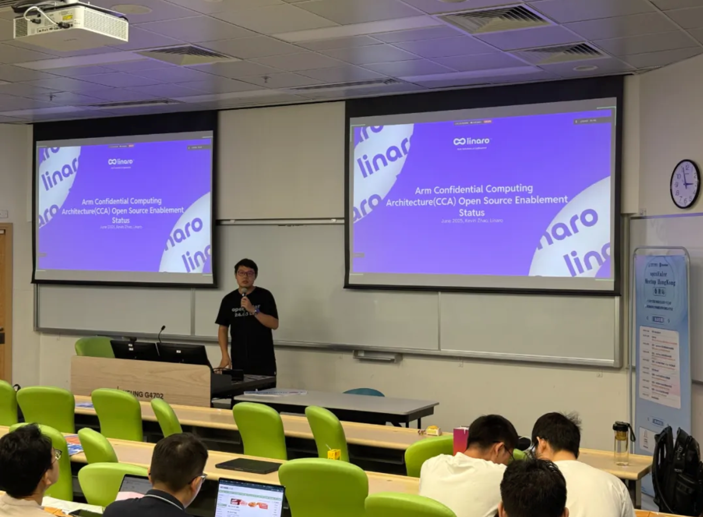

2025 年 6 月 12 日， OpenAtom openEuler（简称：“openEuler”或“开源欧拉”） Meetup 首次登陆香港，该活动由香港城市大学学联CSSA承办。作为连接粤港澳大湾区技术力量的重要活动，本次活动汇聚了开源领域专家、高校学者与开发者，共同探讨面向数字基础设施的操作系统创新与机密计算技术落地路径。

## 郑振宇：openEuler 社区发展进展及未来规划

openEuler 社区运营工作组组长郑振宇以 “面向数字基础设施的开源操作系统” 为核心，系统介绍了 openEuler 的技术定位与生态发展。他提到，openEuler 不仅是一个支持服务器、边缘计算、嵌入式设备的操作系统，更兼容 ARM、x86、RISC-V 等多元硬件架构，通过集成 7000 + 开源软件与孵化 500 + 创新项目，构建了开放的技术孵化平台。

在应用落地层面，openEuler 装机量已突破 1000 万，成为国内新增市场份额第一的服务器操作系统，深度服务于电力、金融、运营商等关键领域。针对 AI 时代的挑战，郑振宇重点解读了 “OS for AI” 与 “AI for OS” 的双向战略：前者优化大模型部署底座，实现 Qwen3 等模型的 “0day 支持”，后者通过智能运维工具与 openEuler Intellgence，让操作系统具备集群负载优化、问题诊断等 AI 能力。此外，openEuler 在 RISC-V 架构上的全球领先支持，获 RISC-V Summit 官方致谢，展现了其在开源硬件生态中的核心地位。

## 侯明永：openEuler 机密计算技术与实践

openEuler 机密计算 SIG Maintainer 侯明永以数据计算安全为切入点，剖析了机密计算的技术价值和 openEuler 的解缺方案。

他指出，云计算中数据“明文计算” 的现状以及法律法规驱动数据安全的合规监管催生了机密计算— 基于硬件可信执行环境(TEE)保护数据计算安全，相比同态加密更具性能与通用性优势。 在技术架构上，openEuler 面向高安应用场景构建了进程级 EE (Trustzone 等)：面向通用应用场景，构建了系统级 TEE(CCA 机密虚机、Kuasar 机密容器）实现应用无改造迁移，提升易用性；面向 AI 大模型场景，规划了集群异构 EE 等完整机密计算软件栈，其中基于 Kuasar 安全容器、机密虚机、secGear 统一 TEE 纳管等技术，构建了南向兼容多种 TEE 硬件，北向提供统一容器管理面的 Kuasar 机密容器，解决云原生场景下的易用性难题，并在 openEuler 24.03 LTS SP2 发布。另外 openEuler 正通过“最小化可信计算基(TCB) " 原则精简系统内核，降低漏洞风险，未来将聚焦多架构兼容与异构集群 TEE 数据流通，推动机密计算在金融、医疗等敏感领域的落地。

## Kevin Zhao：Arm 机密计算架构(CCA)的开源进展

openEuler SIG-Arm Maintainer Kevin Zhao 以 “Arm 机密计算架构（CCA）的开源进展” 为题，分享了 Arm 在云服务器安全领域的技术布局。

Kevin Zhao 指出，Arm 基于 Armv9-A 架构推出的 CCA 技术，通过 Realm Management Extension（RME）和内存加密机制，实现与 Intel TDX、AMD SEV 类似的机密虚拟机隔离能力。当前 Arm CCA 相关的软件特定支持正在回合至 openEuler 6.6 内核，目前已经初步完成了功能开发，支持通过虚拟平台进行开发测试，目标在 25.09 版本完全引入 CCA 软件栈功能。CCA 软件栈同时已经与 Kata-containers 和 Confidential Containers 项目集成，后续会与 Secgear 项目协作，实现机密容器的远程证明功能。

在开源生态协作方面，Arm 架构与 openEuler 深度整合，优化内核适配与容器支持，基于 Kata 的机密容器已实现开箱即用。未来计划推进 CCA 1.1 标准，支持设备分配与加密 I/O，并探索跨架构机密计算协同。Kevin Zhao 强调，通过社区协作，Arm CCA 正助力 openEuler 构建更安全的云原生计算底座，为金融、医疗等领域的机密计算应用提供开源解决方案。

## RustSBI 社区：从系统引导到开源协作的五年实践

RustSBI 社区 maintainer 洛佳以《RustSBI 社区项目与近期进展》为主题，分享了基于 RISC-V 架构的安全固件与引导解决方案。他提到，RustSBI 作为开源项目，已形成 “零阶段引导程序 - 安全固件 - 内核引导程序” 的完整技术链，不仅支持 Linux、openEuler 等内核在 RISC-V 开发板上的启动，还通过组件化设计实现模块跨架构复用，显著降低驱动开发成本。

在开源社区运营方面，洛佳强调 “兴趣驱动” 的协作模式：社区通过 20 余届开源工坊，以 “低门槛任务”（如漏洞修复、基础代码优化）吸引新手参与，同时与高校合作将竞赛项目融入开源实践。值得关注的是，RustSBI 正探索航空航天等高安全性场景的应用，计划将固件系统搭载于人造卫星，并尝试结合大模型技术开发开源智能问答工具，推动底层技术与前沿生态的融合。

## 密码学 GPU 加速：从学术研究到开源工程的落地实践

香港城市大学博士后杨昊博士带来《密码学 GPU 加速开源进展》演讲，聚焦全同态加密（FHE）等新兴密码技术的工程化挑战。

他指出，传统密码算法在 CPU 上的计算开销已无法满足 FHE 等场景需求，而 GPU 凭借数万核心与 TB 级内存带宽（如 A100 达 2TB/s），可将密文运算性能提升 50 倍以上。

其主导的开源库 PHANTOM 通过优化数论变换（NTT）、余数系统（RNS）等核心模块，实现了 TFHE、BFV 等全同态加密方案的 GPU 加速 —— 例如密文乘法运算从 CPU 的 20ms 降至 400 微秒。未来，PHANTOM 计划接入 CUDA 后端并与蚂蚁集团编译器团队合作，通过 “密码学算法 + AI 编译器” 集成降低应用开发门槛，推动隐私计算在 AI 领域的落地。

## 开源协作：从高校到社区的生态构建

最后，本次 Meetup 的协办方，OSCA-HK（香港高校开源联盟）的创始人李想、徐小玥进行了相关宣讲与招募。

OSCA-HK 的通过“跨校联动 + 本地化落地”模式，汇聚香港多所高校学生，搭建开源项目平台，推动开源文化在香港地区的传播。团队联合香港大学、香港中文大学、香港城市大学等高校，以“操作系统安全”、“移动应用”、“AI 本地化应用”为核心方向，展示了开源社区的技术实践成果，如基于智能体实现的的操作系统内核漏洞复现方案。其“企业-高校-社区”协同机制尤为突出——通过与 openEuler 社区等开源社区合作举办技术分享会、线下 Meetup 等活动，不仅为学生提供参与开源之夏等高含金量项目的实践机会，更有着打造活跃社区、培养香港地区开源人才的长期目标。

未来，OSCA-HK 计划以“短期项目孵化 + 长期人才培养”双轨并进：一方面通过开源之夏 2025 打磨高质量开源项目，另一方面搭建基于香港本地高校的开源社区平台，扩大其研究成果的影响力。正如其成员所言：”开源不是独行，而是让每个高校的代码，成为城市创新的基石。“这种从校园到产业的生态连接，正在书写香港开源新篇。