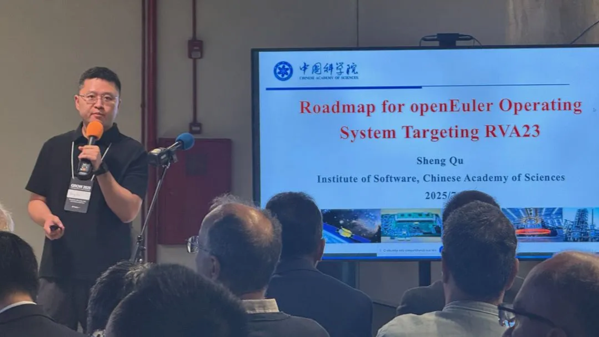
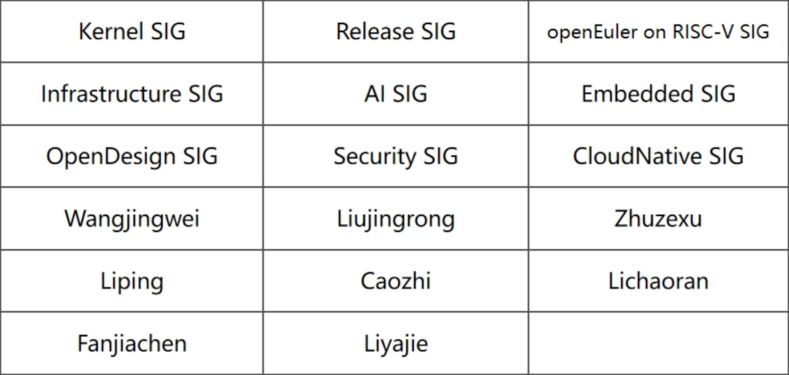

## 概述

2025年6月，OpenAtom openEuler（简称：“openEuler”或“开源欧拉”）社区在技术演进、生态拓展和治理优化方面取得一些进展。openEuler 24.03 LTS SP2版本发布，增强了内核、AI推理、机密计算等关键能力。在社区治理方面，技术委员会确定了2026年openEuler LTS版本的内核选型（Linux 6.6），并推动RISC-V双架构（RVA20/RVA23）支持，进一步降低开发者的适配成本。

技术突破方面，TrIO容器启动加速技术实现21倍性能提升，大幅优化AI训练等场景的容器部署效率，相关源码均已在 openEuler 社区开源，并已集成至openEuler 25.03版本；Kuasar机密容器方案结合TEE技术，为敏感数据应用提供便捷的安全保障。社区协作流程也持续优化，PR（Pull Request）评审支持Maintainer和Committer直接修正描述，软件包贡献平台新增自动化通知机制，显著提升开发效率。

生态层面，CODESYS全系列支持openEuler，为工业自动化领域的开发者提供完整工具链；新推出的MCP Servers项目构建了大模型与操作系统的标准化协议框架，助力智能应用开发。此外，全球技术研讨会（香港、巴西等）和AI工作组的成立，展现了社区国际化与跨领域协作的活力。

值得一提的是，openEuler文档中心迎来机制升级后的首批贡献者，社区特别感谢这些技术布道者为完善文档所做的努力。我们期待更多开发者加入文档优化工作，共同打造更完善的技术文档体系，让知识共享惠及整个社区。

openEuler正通过技术创新、生态共建和知识共享，持续推动开源操作系统生态的繁荣发展。

本月报阅读时长15分钟。

欢迎细品。

## openEuler 24.03 LTS SP2发布

6月30日，openEuler 24.03 LTS SP2发布，该版本基于6.6内核的24.03LTS版本增强扩展版本，面向服务器、云、AI和嵌入式场景，持续提供更多新特性和功能扩展，包括内核优化、异构协同推理、众核高密、机密容器、多核多实例混部等，给开发者和用户带来全新体验。

下载地址：

https://www.openeuler.openatom.cn/zh/download/

技术白皮书：

https://www.openeuler.openatom.cn/zh/showcase/technical-white-paper/

## 社区规模

截至2025年6月30日，openEuler 社区用户累计超过415万。超过2.2万名开发者在社区持续贡献。社区累计产生 221.6K个PRs、118.3K条Issues。目前，加入openEuler社区的单位成员2070家，6月新增18家。

社区贡献看板（截至2025/06/30）

## 社区事件

### GROW 2025全球RISC-V研讨会：openEuler推进RVA23适配，助力RISC-V生态发展

6月30日，在巴西圣保罗大学举办的GROW 2025全球首届RISC-V开放研讨会上，中科院软件所高级工程师屈晟发表主题演讲 "Roadmap for openEuler Operating System Targeting RVA23"，他阐释了 openEuler 开源操作系统如何通过适配RVA23规范，推动RISC-V基础设施生态的战略升级，进一步巩固了openEuler在RISC-V生态中的关键角色。

### openEuler Bigdata Meetup 线上举办

6月25日，openEuler Bigdata Meetup 在线上举办，通过社区B站和视频号直播间与开发者们进行了深入交流。活动围绕大数据与AI技术的融合创新展开，内容涵盖开源数据库优化、异地多活系统架构、智能查询优化技术、大数据集群管理平台实践，以及基于鲲鹏服务器的大数据性能优化等多个前沿议题。本次活动为开发者提供了宝贵的学习与交流机会，展现了openEuler在大数据领域的创新与生态活力。

### openEuler Meetup在香港举办

6月12日，openEuler Meetup在香港城市大学成功举办。活动围绕openEuler社区发展、机密计算技术、Arm架构开源进展、RustSBI项目、密码学GPU加速以及开源社区合作等主题展开深入探讨。本次活动为香港地区的开发者提供了宝贵的开源技术分享平台，进一步推动了openEuler社区的国际化发展。

## 社区治理

### openEuler 技术委员会会议摘要（6月）

在6月召开的openEuler技术委员会会议上，社区就多项重要议题达成共识。会议审议通过了2026年openEuler LTS版本的内核选型方案，确定采用Linux 6.6内核作为基础版本。该方案经过Kernel SIG充分讨论和为期两周的社区公示后，获得全体委员一致通过。后续工作将聚焦kABI兼容性方案制定，同时评估是否需要调整发布计划或引入双内核机制以提升对新硬件的支持能力。

在RISC-V生态建设方面，会议决定在openEuler 24.03 LTS SP3版本中同步推出RVA20和RVA23双架构版本。经与Compiler SIG沟通确认，将采用GCC 14.3作为基础编译工具链，并计划升级RISCV工程的JDK版本。此外，会议还宣布推动组建AI工作组，致力于推动操作系统与人工智能技术的深度融合，欢迎社区开发者积极参与相关工作。

## 技术进展

### openEuler TrIO技术实现21倍启动加速

容器技术作为云计算核心基础设施，其启动性能直接影响弹性扩容、故障恢复等关键场景效率。针对当前容器镜像体积大、启动慢的行业痛点（如PyTorch容器启动需数分钟），openEuler创新推出TrIO容器启动加速技术。在PyTorch 和 TensorFlow 容器的测试结果中，TrIO 相比于默认容器加载，容器启动加速分别从从 127 秒和 35 秒提升到 6 秒和 8 秒，加速比达 21 倍和 4.3 倍。

TrIO 相关源码均已在 openEuler 社区开源，并已集成至openEuler 25.03版本；相关技术发表已被计算机存储领域 A 类顶会 FAST’25 收录： https://www.usenix.org/conference/fast25/presentation/liu-yubo

原文阅读：

[TrIO：让容器启动性能最高提升21倍](https://www.openeuler.org/zh/blog/20250619-TrIO/20250619-TrIO.html)

TrIO 软件仓库地址：

https://gitee.com/openeuler/kernel/tree/openEuler-25.03/tools/trio

### openEuler社区推出PR评审流程优化方案

为提升开发协作效率，openEuler社区近日通过一项基础设施改进方案：经技术委员会委员授权的SIG组Maintainer和Committer在评审Pull Request（PR）时，若发现描述信息不准确或不完整，可直接进行修改，无需再通过评论区反复确认。

此前评审流程中，Maintainer和Committer遇到PR描述问题时，只能通过评论方式与提交者沟通，往往需要多次交互才能完成修正，这一过程显著延长了PR合入周期。新方案实施后，获得授权的Maintainer和Committer可直接完善PR内容，这将大幅提升评审效率。

该方案已在社区完成部署，后续，基础设施SIG组将持续关注该方案实施效果，并根据开发者反馈进行进一步优化。

### openEuler社区软件包贡献平台接入消息通知功能

为提升软件包贡献流程效率，openEuler社区近日在软件包贡献平台 （ https://software-pkg.openeuler.org/zh/package ） 上线了消息通知功能。该功能实现自动化流程提醒，当新贡献的软件包通过CI测试后，系统将通过消息中心自动发送邮件通知至相关责任人。

此项功能包括：

- 精准通知机制：系统自动识别并邮件通知对应SIG组的Maintainer和TC成员
- 流程可视化：通过消息中心集中管理所有软件包引入申请通知
- 时效性提升：即时提醒，帮助新软件包评审工作及时开展

此项优化有效解决了以往人工跟踪软件包审核状态的不便，使Maintainer能够更快速、便捷地处理软件包引入申请，进一步优化了社区贡献体验。基础设施SIG组将持续收集用户反馈，不断完善消息通知机制。

### openEuler 发布Kuasar机密容器解决方案

在数据安全领域，隐私保护法规（如GDPR）和云计算技术对传统保护机制提出挑战。机密计算通过硬件级可信执行环境保障数据使用安全，但云原生环境中容器共享内核的特性增加了泄露风险，且技术门槛较高。机密容器创新性地将TEE封装为轻量化运行时，使开发者无需改造应用即可实现云原生环境的数据全周期保护。openEuler提出iSulad+Kuasar+secGear方案，为AI等高敏感场景提供了安全高效的解决方案。

该方案基于轻量级沙箱容器和机密计算结合构建机密容器，保护容器镜像的机密性和完整性，保护工作负载的机密性，防止非授权实体的非法访问，同时兼容云原生生态，提高机密计算的易用性。

相关链接：

[探秘 Kuasar 机密容器解决方案](https://www.openeuler.org/zh/blog/20250701-Kuasar/20250701-Kuasar.html)

### CODESYS全系列开发平台全面支持openEuler，加速智能制造升级

全球领先的工业自动化开发平台CODESYS宣布全系列产品（包括CODESYS Runtime核心运行平台、新一代低代码工具CODESYS Go及Virtual Control平台）已全面支持openEuler。此次合作将显著提升工业控制系统的实时性、兼容性和开发效率，为智能制造、能源电力和工业物联网等领域提供更优解决方案。未来用户可通过 CODESYS 无缝调用 openEuler 社区超 800 + 工业级软件包，涵盖 HMI 开发、仿真测试、工业总线适配等全流程工具链。

原文阅读： [重磅官宣！工业自动化开发平台CODESYS全面适配 openEuler，开启新型工业化新征程](https://www.openeuler.org/zh/blog/20250609-CODESYS/20260609-CODESYS.html)

### openEuler MCP Servers：构建操作系统领域的AI智能体生态

为拓展大模型在操作系统领域的能力边界，openEuler社区推出MCP（Model Context Protocol）Servers项目。该仓库聚焦于提供通用的大模型上下文协议实现，通过集成各类操作系统工具增强openEuler的智能交互体验。核心能力包含以下三方面：

- **标准化协议架构**

采用模块化目录结构，每个MCP Server独立封装完整功能组件（说明文档/配置文件/源码），支持快速扩展操作系统工具链。通过mcp_config.json统一协议配置，确保Server的易用性和兼容性。

- **开箱即用部署**

提供yum/RPM自动化安装渠道（即将上线），用户可通过yum install直接部署预构建的MCP Server。同时支持主流MCP客户端（如EulerCopilot、Roo Code）无缝接入，通过编辑全局配置实现即插即用。

- **高效开发支持**

基于Python-SDK提供快速开发框架，开发者可通过uv工具链和python3-mcp环境，将操作系统工具（如oegitext）改造为MCP Server。结合DevStation的Roo Code插件，实现从编码调试到协议部署的全流程支持。

欢迎贡献更多聚焦操作系统领域的MCP Server实现，共同推动openEuler智能化生态建设： https://gitee.com/openeuler/mcp-servers

## 软硬件兼容性测评

截至2025年6月30日，openEuler软硬件兼容性测评新增39个，其中北向（ISV）新增35个，南向（IHV）新增2个，OSV新增2个。

- 兼容性列表：  https://www.openeuler.org/zh/compatibility/
- OSV技术测评列表  https://www.openeuler.org/zh/approve/

## 安全公告

2025年6月社区共发布安全公告128个，修复漏洞102个（其中 Critical 2个，High 32个，其它68个）。

### 重点漏洞提醒

如下漏洞评估影响较大，请重点关注。

在 TINITA YAML-LibYAML 的 Perl 版本 0.902.x 及以下版本中发现了一个漏洞。该漏洞已被分类为有问题的。CWE 将此问题归类为 CWE-552。该产品使得文件或目录对未经授权的用户可访问，尽管它们不应该被访问。这将影响机密性。升级到版本 0.903.0 可以消除此漏洞。应用补丁也可以解决此问题。修复程序已在 github.com 上准备好下载。建议的最佳缓解措施是升级到最新版本。 **（CVE-2025-40908）**

CVSS评分为9.1分

公告链接：

https://www.openeuler.openatom.cn/zh/security/cve/detail/?cveId=CVE-2025-40908&packageName=perl-YAML-LibYAML

影响范围：

- openEuler-20.03-LTS-SP4
- openEuler-22.03-LTS-SP3
- openEuler-22.03-LTS-SP4
- openEuler-24.03-LTS
- openEuler-24.03-LTS-SP1

在某些 Intel(R) Xeon(R) 处理器内存控制器配置中使用 Intel(R) SGX 时，不正确的条件检查可能允许具有特权的用户通过本地访问潜在地启用权限提升。 **（CVE-2024-23918）**

CVSS评分为8.8分

公告链接：

https://www.openeuler.openatom.cn/zh/security/cve/detail/?cveId=CVE-2024-23918&packageName=microcode_ctl

影响范围：

- openEuler-20.03-LTS-SP4
- openEuler-22.03-LTS-SP3
- openEuler-22.03-LTS-SP4
- openEuler-24.03-LTS
- openEuler-24.03-LTS-SP1

### 漏洞防护

openEuler社区针对在维版本例行修复漏洞，发布安全补丁。 建议用户关注openEuler官网安全公告，及时安装漏洞补丁进行防护。

openEuler 安全公告：

https://www.openeuler.org/zh/security/security-bulletins/

## 感谢每一位朋友、开发者的支持

因为大家的辛勤贡献，openEuler 的每一天都发生着好的事情。小编限于视野和能力，难免有所遗漏，在此表示歉意。同时，衷心感谢社区成员单位、SIG组和开发者朋友们的贡献：

* 以上不分先后顺序