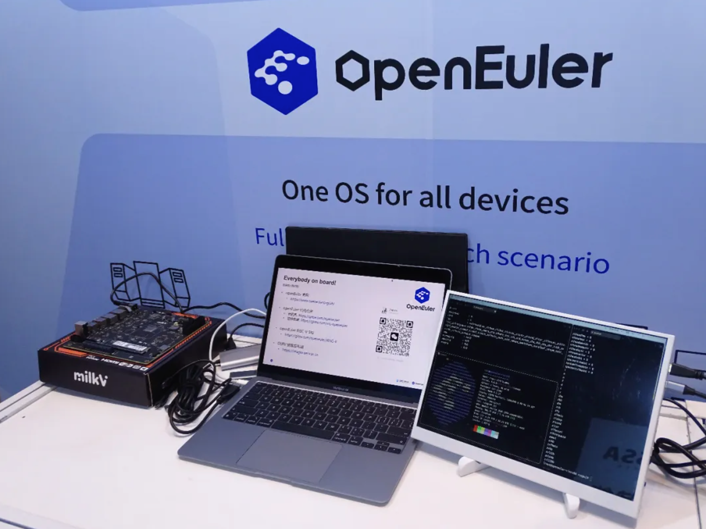

****OpenAtom openEuler（简称：“openEuler”或“开源欧拉”）**** RISC-V SIG 参与 2025 RISC-V 中国峰会，发布符合 RVA23 标准的试验镜像。本次镜像采用 LLVM20 工具链，内核采用基于 openEuler Kernel 6.6 版本的 24.03 LTS SP2 分支。openEuler RVA23 试验镜像完全基于 openEuler 社区源码和基础设施开发，符合最新 RISC-V Profile 的规范，是 openEuler 迈向 RISC-V 通用服务器标准的关键一步

RVA23 镜像已经在 QEMU、FPGA 等环境进行测试验证，本次峰会 RISC-V SIG 将 Demo 布置在 𝐂𝟑𝟒-𝟎𝟑 号展位，感兴趣的伙伴们可以移步体验

代码仓：[https://repo.tarsier-infra.isrc.ac.cn/openEuler-RISC-V/testing/openEuler-LLVM-RVA23-Demo/QEMU/](https://repo.tarsier-infra.isrc.ac.cn/openEuler-RISC-V/testing/openEuler-LLVM-RVA23-Demo/QEMU/)

### 基于 LLVM 的 openEuler RVA23 试验镜像

openEuler RVA23 试验版本基于 LLVM 20.1 工具链与新版 binutils、glibc 等基础库构建，目前已成功编译生成超过 4600 个软件包及对应操作系统镜像，支持 openEuler 官方版本 94% 的软件包。这一试验版本不仅为 RVA23 标准的技术评估提供了重要参考，也为后续正式版本的发布奠定了坚实基础

### 完成在香山昆明湖 FPGA 的验证工作

软件所 OERV 团队与香山昆明湖团队合作，将 RVA23 试验版本移植到 FPGA 验证阶段的昆明湖 v2 处理器，并进行了典型应用测试。自 2025 年 3 月起，团队在单核与双核 FPGA 环境中完成了 4 轮系统性测试，覆盖了 C++、Python、Golang、Java 等编程语言的编译器及运行时环境，并在 Web 服务、数据库等网络 I/O 密集型、磁盘 I/O 密集型、内存 I/O 密集型、计算密集型等主要应用场景中进行了全面验证，以确认系统的稳定性和兼容性

### 完成在知合计算高性能核的验证工作

知合计算公布了高性能 RISC-V CPU 内核的研发进展，该 IP 符合 RVA23 规范，现已在 openEuler RVA23 试验镜像完成验证

Demo 在新思 D10 号展位，欢迎大家体验

### 后续计划介绍

在 openEuler 24.03 SP3 版本中支持 RVA23

#### 内核

当前应用于 RVA23 镜像的 openEuler OLK 6.6 内核由 RVCK（RISC-V Common Kernel）项目支持，RVCK 已帮助 openEuler 完成 RVA23 HWPROBE、基础 ACPI、高级中断能力 IOMMU 等 RISC-V 标准服务器场景支持。目前 RVCK 项目正在积极推进和进一步完善对 RISC-V 内核服务器能力的提升

#### 基础工具链

根据 openEuler 社区的讨论结果，openEuler 24.03 SP3 版本在 RISC-V 架构中选择 GCC 14.3 版本作为编译器，软件所正在推进对应的 RVA23 backport，而 Bintuils 2.42 的 RVA23 backport 则由中兴通讯的合作伙伴负责推进

### RVA23 Profile

RVA (RISC-V Application Profile) 是 RISC-V 国际基金会为通用计算领域的应用处理器制定的指令集扩展集合规范。2024 年 10 月新近确立的 RVA23 规范将向量扩展和虚拟化扩展等关键 ISA 扩展纳入必选范围，填补了 RISC-V 生态在并行计算与虚拟化等领域的空白。在香山昆明湖处理器上成功运行这一基于 LLVM 构建并支持 RVA23 的 openEuler 版本，不仅验证了 openEuler 对新标准的支持，也为香山等各类 RVA23 兼容处理器提供了坚实的软件栈基础

### RVCK 内核同源项目

RVCK 内核同源项目（也称 RVCK）是 kernel.org 以及 openEuler 等 linux 内核分支的下游，旨在为目前基于不同硬件平台的 RISC-V 开发生态提供一个统一的内核平台，维护公共开发演进需求，减少维护复杂度并增强软硬件上下游生态协同能力。目前该项目的主要贡献厂商为中兴通讯、算能、进迭时空等知名 RISC-V 厂商。其中中兴通讯和算能为 RVCK 回合通用服务器能力做出了重要的贡献

代码仓：[https://github.com/RVCK-Project](https://github.com/RVCK-Project)

### 相关链接

- [Gitee 协作主页](https://gitee.com/openeuler/RISC-V)
- [构建仓库协作地址](https://build.tarsier-infra.isrc.ac.cn/)
- [第三方 repo 源](https://repo.tarsier-infra.isrc.ac.cn/openEuler-RISC-V)
- [OERV 工作中心](https://github.com/openeuler-riscv)
- [邮件列表](riscv@openeuler.org)
- [Discord 邀请链接](https://discord.gg/drG6qUsRc4)