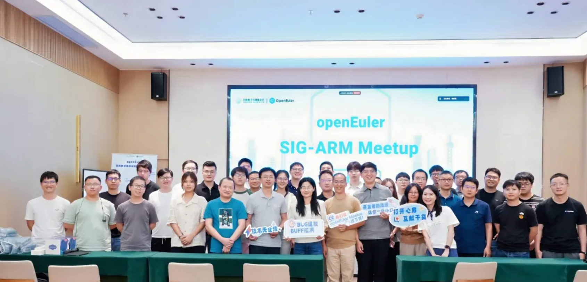
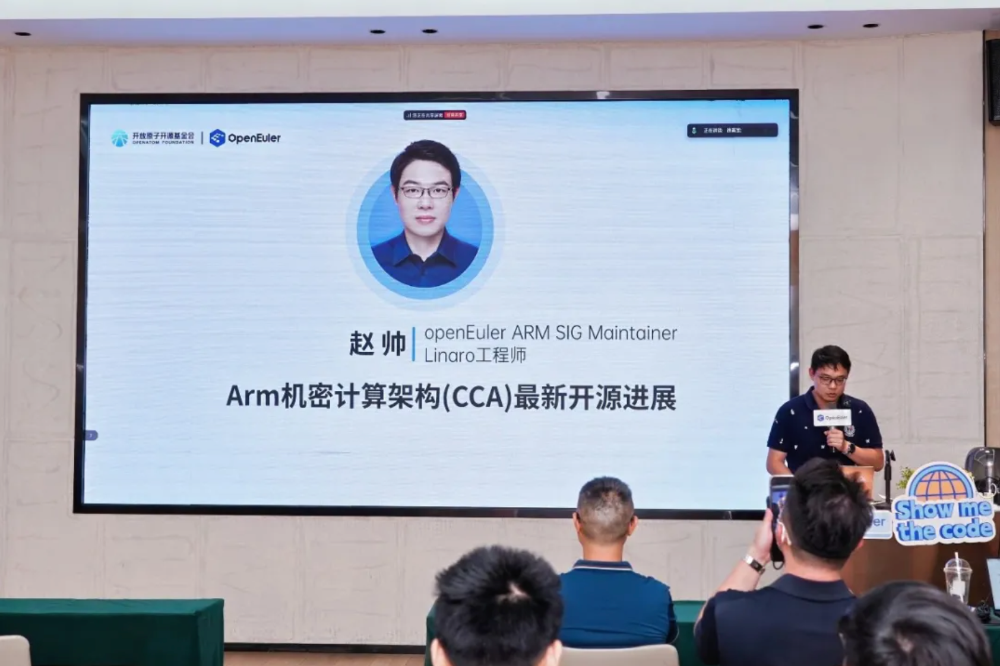
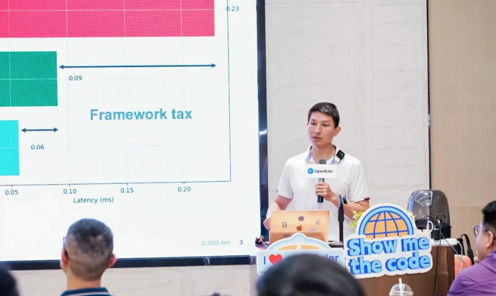
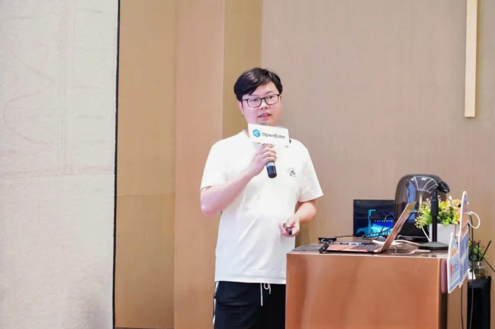
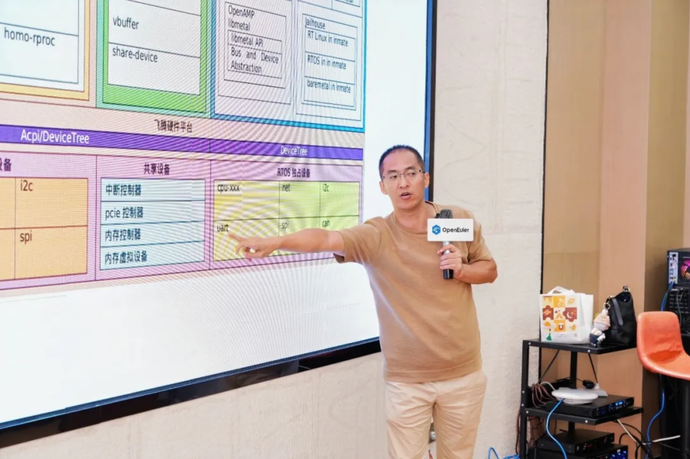
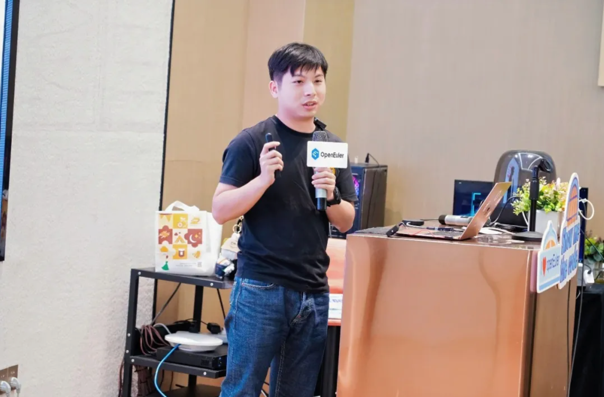
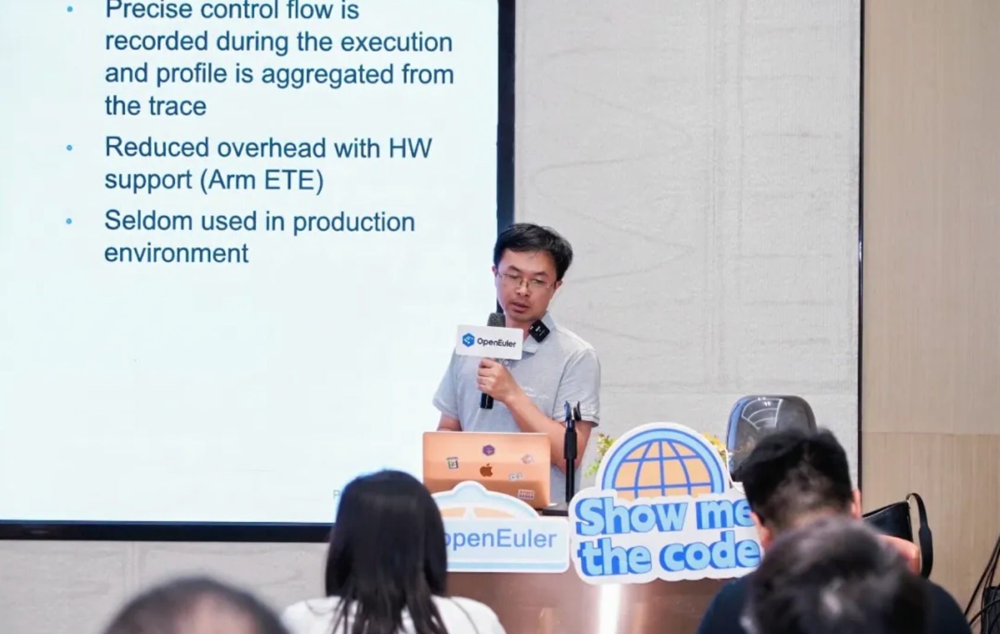
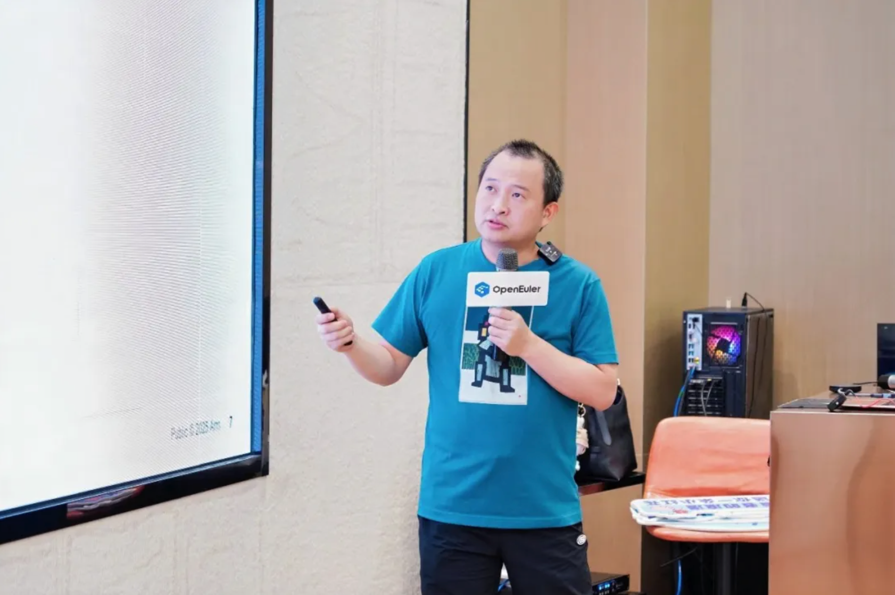
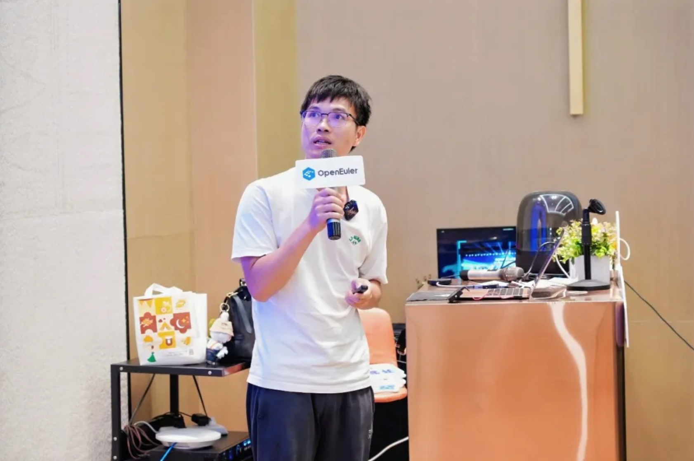

7 月 18 日，OpenAtom openEuler（简称“openEuler”或“开源欧拉”）SIG-ARM 年度技术聚会 Meetup 在深圳成功举办。这场汇聚了 Arm 生态头部芯片厂商与软件巨头嘉宾的盛会，围绕 openEuler 在 Arm 架构的最新性能优化与创新实践、云原生/AI 等关键负载在 Arm 服务器的迁移部署调优、核心挑战及基础软件栈 Arm 适配方案，以及 Arm 服务器生态未来趋势与标准化进展等核心议题展开深度探讨，为 Arm 生态发展注入了新的思路与动力。

**下面就让我们来回顾本次 Meetup 的精彩内容**

### Arm 机密计算架构(CCA)最新开源进展

openEuler ARM SIG Maintainer、Linaro 工程师赵帅分享了 Arm 机密计算架构 (CCA) 最新开源进展。基于 Armv9-A 架构的 Arm CCA 技术，借助 Realm Management Extension（RME）和内存加密机制，实现了与 Intel TDX、AMD SEV 类似的机密虚拟机隔离能力。

目前，Arm CCA 软件栈特性在开源社区推进迅速：RMM 1.0 对应的 firmware、edk2 和 guest Linux kernel 已完成社区合入，KVM 和 QEMU 的社区合入正加速；随着 RMM1.0 软件栈成熟，上层机密容器、Kata-containers、libvirt 和 openstack 的支持在社区进展显著，其中 Kata-containers 和 CoCo 大部分功能已获社区完整支持。

RMM 1.1 spec 的重要特性 MEC、Planes 和 Device Assignment 持续开发，DA 已完成基于 Qemu sbsa-ref Host 的基本功能流程开发，用户可依指导文档完成 DA 流程。此外，还介绍了基于 Veraison 的远程证明方案，包括 CoCo 与 Veraison 的整合及本地 token 验证，并重点分析了 endorsement API 在 IETF 和 Veraison 社区的进展。

### KleidiAI+PyTorch--加速 Arm Neoverse 云平台

Arm 工程师王瑞峰分享了 KleidiAI+PyTorch 如何加速 Arm Neoverse 云平台的议题。Arm KleidiAI 是一个轻量化的机器学习算子库。该库以源码形式发布，其中包含一系列针对 Arm 处理器平台高度优化的 AI 任务算子。KleidiAI 提供的接口无状态，使用时可以避免内存状态维护及线程管理带来的开销。通过将 KleidiAI 的对称 4bit 权重量化内核和动态非对称激活量化直接与 PyTorch 集成，大模型线性层的内存占用减少了高达 87%。在 Llama3-8B 这样的模型上，相比于量化之前 4 tokens 每秒的生成速度，量化之后能达到 14tokens 每秒的生成速度，满足实时交互式 AI 应用的要求。同时，对于进一步提升大模型的性能提出了一些可以尝试的方向。

KleidiAI 仓库地址

https://gitlab.arm.com/kleidi/kleidiai

### ARM64 MPAM 特性支持与应用实践

openEuler Kernel SIG Committer，华为工程师汪少博分享了 ARM64 MPAM 的特性在 openEuler 的支持与应用实践。MPAM 是 ARM 架构中用于内存系统资源分区和监控的一个功能。鲲鹏 MPAM 已支持 L2/L3 缓存和内存带宽分区、缓存和内存带宽使用监控等主要特性，并在混部场景中获得应用效果。MPAM 已在 openEuler 社区合入，其主体功能也陆续合入上游 Linux kernel 主干。

### 飞腾 CPU 上嵌入式异构和虚拟化的探索和实践

飞腾工程师杨绍军分享了基于飞腾平台对 OpenAMP、Jailhouse、KVM+QEMU 等开源技术的适配探索与实践成果。飞腾的嵌入式异构分为硬件定义域软件定义，这两种定义相辅相成，构成了飞腾在嵌入式芯片领域独特的竞争力。在这样的硬件架构下，杨绍军又分享了业界主流 Hypervisor 在飞腾嵌入式平台上的适配进展、优化错失以及实时性能表现。

### ARM SVE 指令在编解码场景的应用与实践

华为工程师苏喜康介绍了在编码场景下 ARM SVE/ SVE2 指令的核心特性；结合业界研究及其与 NEON 指令的异同点，基于编解码器的计算特性，深入剖析 SVE/ SVE2 指令的具体应用方法和实践，包括新增统计指令 cntp 直接计算非零元个数、新增 whilelt/cnth 指令增强代码复用性、新增 SVE gather load 减少数据组装等应用案例。

### 使用 TRBE 和 BRBE 释放效率潜能

openEuler ARM SIG Maintainer、Arm 工程师贺军介绍了如何使用 TRBE 和 BRBE 释放效率潜能。在 AArch64 平台，硬件级的 ETE+TRBE 和新一代的 BRBE 为 PGO 带来了先进的精准分支追踪能力。贺军深入解析了 Arm 架构中 TRBE 和 BRBE 的工作机制，详细介绍了 TRBE 的高效缓冲机制及其为系统性能采样带来的显著优势，并进一步介绍了 BRBE 如何以更细粒度、低延迟的方式记录分支路径，实现与软件的高效协同，从而为 PGO 提供更丰富且准确的优化数据。这些创新技术的结合，不仅为复杂系统带来极致性能优化的可能，也为未来软件与硬件协同优化开辟了新方向。

### 安全三重奏：深入解析 Arm PAC、BTI 与 GCS

Arm 工程师陈玮介绍了 Arm 架构下三种关键的控制流保护技术：PAC、BTI 和 GCS。它们分别从指针验证、跳转目标识别和硬件级返回地址保护三个角度，有效提升了系统对 ROP/JOP 攻击的防御能力。随着 openEuler 等社区逐步支持这些特性，我们正朝着更安全、低开销的执行环境稳步前进。

### JuiceFS 在 Arm64 平台上的性能分析和调优

openEuler SDS SIG Committer、Linaro 工程师刘新良介绍了 JuiceFS AI 文件系统的特性，应用场景，实现架构以及线程模型等；接着重点分享了对已发现性能问题的剖析，分析与定位的经验；最后分享了 JuiceFS 在 Arm64 平台上的调优经验。

### 演讲 PPT 下载

本次 Meetup 的 **分享材料** 已上传至 openEuler Gitee 仓库。如果您需要本次活动的 PDF，可前往 下方链接获取，期待您的下次参与！

[演讲PPT链接](https://gitee.com/openeuler/presentations/tree/master/meetup)

本次 Meetup 的 **直播回放** 已上传至 B 站 openEuler 官方账号。如果您错过了本次线下活动，可前往 B 站回看

[回放链接](https://www.bilibili.com/video/BV1jAgqzGE2o/)