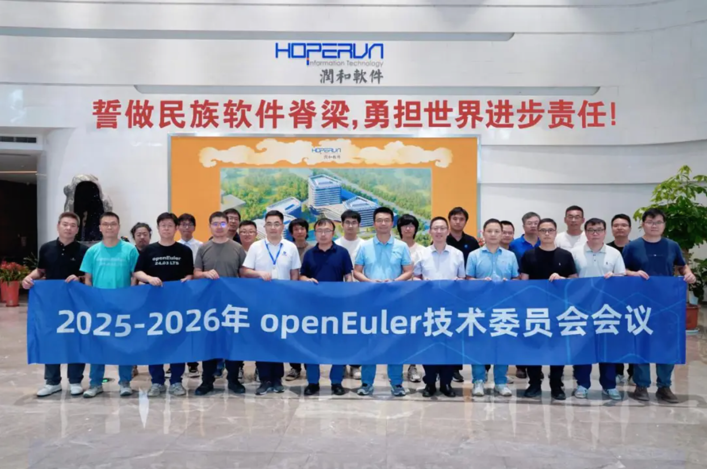
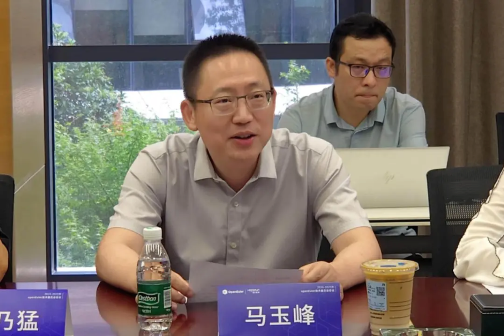
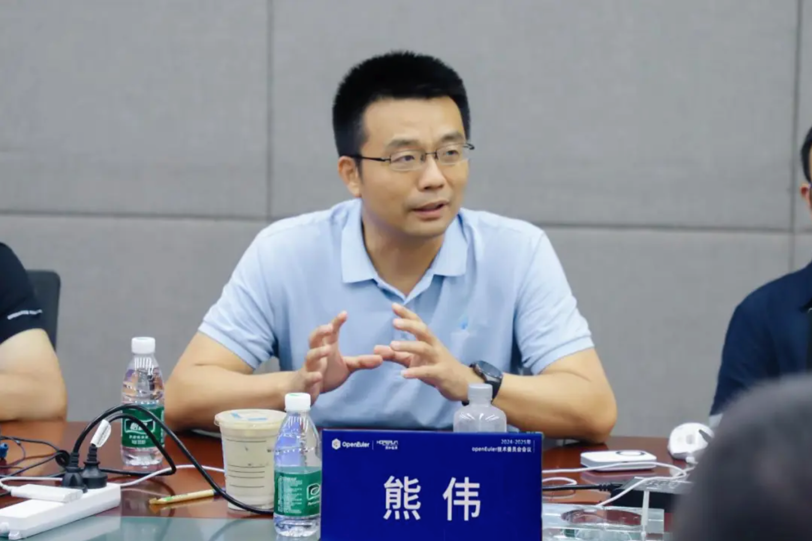
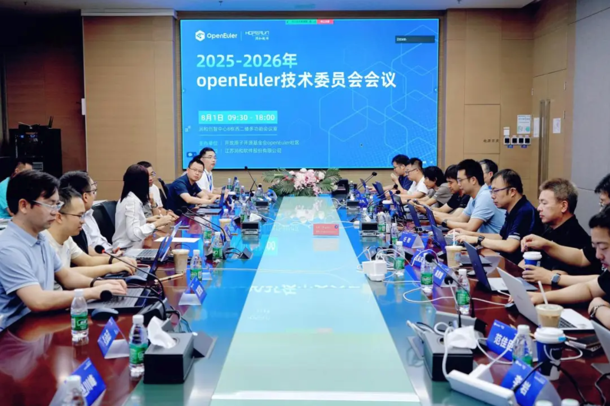
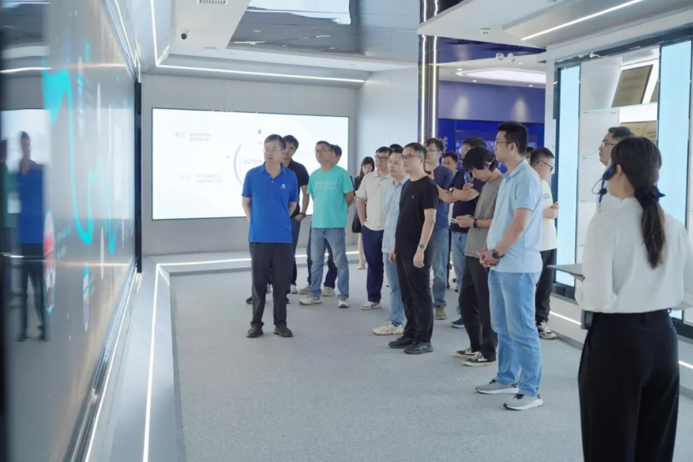

8月1日，由 OpenAtom openEuler（以下简称“openEuler”或“开源欧拉”）社区发起、江苏润和软件股份有限公司（以下简称“润和软件”）承办的2025-2026年openEuler技术委员会会议在南京圆满召开。来自华为、麒麟软件、统信软件、 润和软件、Intel、中国移动、 中科院软件所、一汽、windriver等 openEuler 生态共建企业的多位openEuler技术委员会委员齐聚一堂，围绕 openEuler 社区技术规划建设及openEuler未来发展方向开展深入研讨。润和软件副董事长马玉峰受邀出席并做开场致辞。

马玉峰在致辞中表示，社区最新数据显示，openEuler装机量已突破1000万套、汇聚2.2万全球贡献者，已成为数字中国的根力量。作为openEuler项目群黄金捐赠人，润和软件深度参与这一进程并在社区各领域共建中取得了一些进展和成果，包括推出AI原生操作系统HopeOS V24，实现昇腾芯片全适配与AI全栈兼容并大幅提升分布式训练效能，打造“云-边-端”智能物联解决方案，在应急安全领域创下单项目交付15000套的落地标杆。未来，润和软件将携手openEuler社区深耕AI与操作系统的融合创新，让开源之力浇灌千行百业。

openEuler 委员会主席熊伟在致辞中首先对润和软件长期以来对社区做出的贡献表示了感谢和肯定。他指出，openEuler将持续深耕全场景、智能化与多样性算力三大技术方向。社区现已成立AI联合工作组，加速操作系统与AI技术的深度融合，为千行百业提供更强大的智能化开源基础设施。未来，社区将联合润和软件等社区优秀伙伴，加速释放openEuler在AI时代、全球范围的商业潜能。

本次会议重点审议了openEuler版本发布节奏与维护生命周期调整方案、社区软件生产与开发者支持渠道运作情况、基础设施关于“大型套组软件”支撑方案等议题，并就AI工作组进展（Intelligence BooM开源全栈开箱即用生态共建）及下一步计划、智能基础设施异构融合计算框架等关键技术方向展开深入研讨。此外，与会专家就汽车电子开源生态与openEuler融合可行性行了专题讨论并明确了下半年技术试点的具体方向和目标。

作为社区核心共建单位，润和软件2024-2025年交出一份硬核成绩单：

**技术研发领域 ：** 公司推出AI原生操作系统HopeOS V24，通过智能调度算法实现昇腾910芯片全适配，AI软件栈兼容性达100%；针对边缘场景优化的HopeOS Edge版，以128MB轻量化内核达成10毫秒级实时响应；而HopeOS Bigdata版更助力某省移动公司完成HDP平台零中断迁移，数据吞吐效率提升40%。

**解决方案层面 ：** 润和软件深度融合DeepSeek大模型技术，推出“基于openEuler的智能物联解决方案”，彻底打通工业控制系统与业务链壁垒。该方案已应用于某电力企业配网系统，实现能效优化与故障自诊断；同时，润和软件信创全栈服务助力某省政府完成200+业务系统国产化替代，获评“2024年度openEuler领先商业实践项目”。

**商业落地规模** ：HopeOS年内获160+项生态认证，覆盖鲲鹏、飞腾等国产芯片及MySQL等主流软件；在金融保险领域，为头部寿险公司构建高可用信创云平台；在应急安全行业，HopeOS针对大数据场景进行专项优化，使业务性能综合提升10%以上，为行业数字化转型提供有力支撑。

荣誉见证实力。润和软件以突出的生态贡献和卓越的商业表现屡获殊荣——蝉联“2024年openEuler社区突出贡献单位”，HopeOS V24斩获“新质生产力杰出成果奖”，并入围博鳌论坛创新案例集。

openEuler生态正从“技术驱动”向“场景驱动”跨越成为本次会议共识。未来，润和软件将与openEuler生态伙伴们一起深化社区协同，攻坚AI与操作系统的基因级融合，赋能更多创新场景，持续引领开源操作系统的创新浪潮。