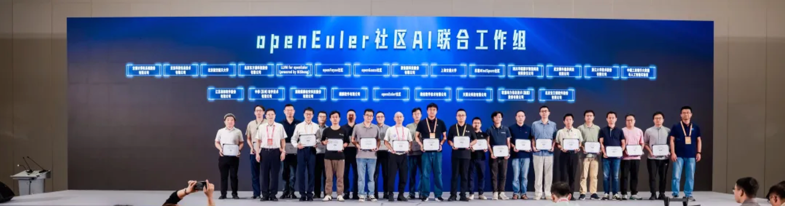
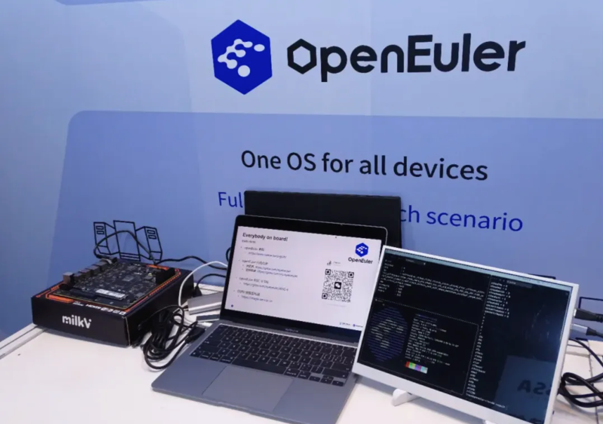
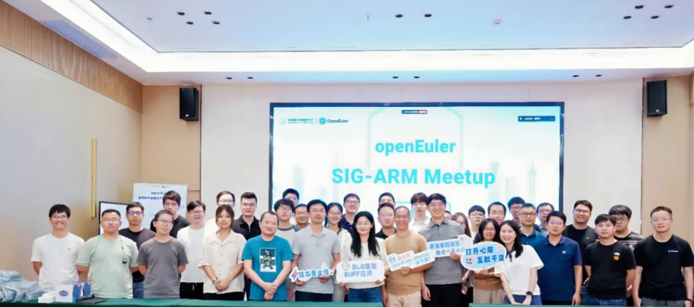
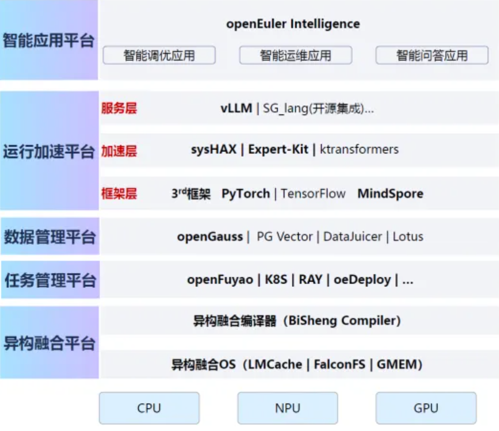
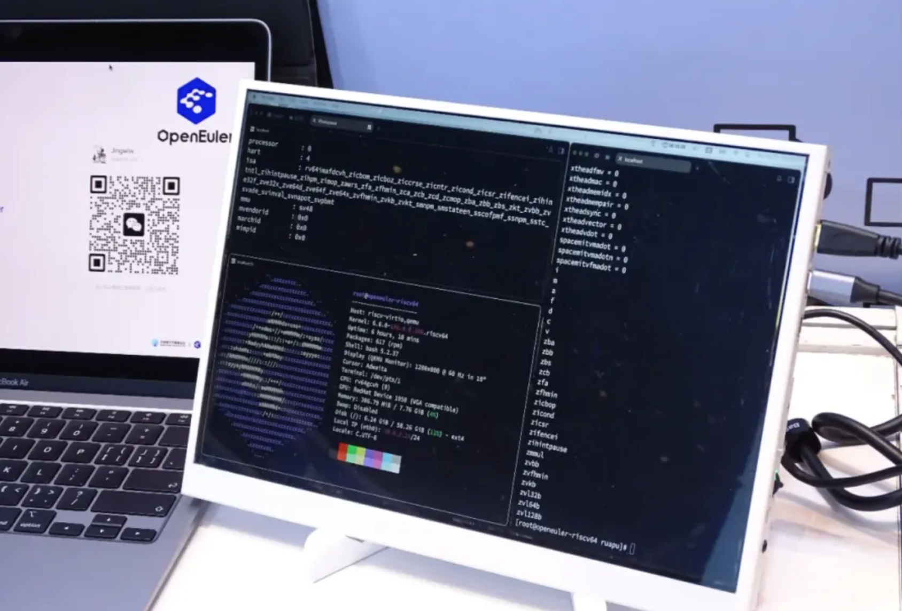

## 概述

2025年7月，OpenAtom openEuler（简称：“openEuler”或“开源欧拉”）社区在技术突破和社区生态方面取得一些进展。openEuler for RVA23 25.03 试验镜像发布，标志 openEuler 向 RISC-V 通用服务器标准的迈出关键一步。

技术突破方面，openEuler Intelligence BooM AI 开源基础软件参考实现发布。该基础软件通过将操作系统、数据库、AI框架、模型优化工具、云化部署编排系统集成于一体，为开发者提供可安装、开箱即用的AI应用能力。极大简化企业数据中心内部署 AI 模型的成本，目前 Intelligence BooM 提供三种系统镜像，欢迎大家下载试用。

生态方面，Greenbone的社区版（OpenVAS）和企业版（GSM）已经完成对所有已经发布的 openEuler LTS版本（包括SP版本）的系统支持。Greenbone 是一家全球领先的开源漏洞管理解决方案供应商，提供开源领域占主导地位的漏洞评估解决方案，旨在帮助组织识别、评估和修复其 IT 基础设施中的安全漏洞。

## 社区规模

截至2025年7月31日，openEuler 社区用户累计超过420万。超过2.2万名开发者在 社区 持续贡献。社区累计产生 226.4K个PRs、120.7K条Issues。目前，加入openEuler社区的单位成员2092家，7月新增22家。

社区贡献看板（截至2025/07/31）

## 社区事件

**开放原子开源生态大会开源欧拉生态分论坛成功举办**

开放原子开源生态大会开源欧拉生态分论坛，7月23日在北京成功举办。在分论坛上，为了更好推动智能化场景竞争力提升，20家社区成员成立 AI 联合工作组 ，共同建构基于开源欧拉的AI基础软件实施标准，推动企业智能应用生态的繁荣。

在分论坛坛上，openEuler 委员会主席熊伟向大家分享了 openEuler 未来在 AI 上的发展规划： **第一** ，操作系统 Agent 化，系统组件 Agent 化是未来的发展方向，社区已经开始在这方面进行技术创新，大家敬请期待。 **第二** ，openEuler 希望在AI时代为开发者提供一个开箱即用的 AI 栈，方便开发者基于 openEuler 提供的各种智能化能力，构建上层业务。

点击查看演讲内容：

[openEuler深度参与2025开放原子开源生态大会，共绘开源未来新蓝图](https://mp.weixin.qq.com/s?__biz=MzkyMjYzNjU0Ng==&mid=2247516211&idx=1&sn=743f965a9a0f6b93bce096e9312c524c&scene=21&poc_token=HP2SomijvZuM3yghXsKMi6dp-v_XqPud78_5m8sx)

**2025 RISC-V 中国峰会，openEuler on RISC-V 展示最新进展、创新成果与生态实践**

在本次峰会中，openEuler 社区 RISC-V SIG 参与了服务器平台技术工作组（Server Platform TG）和认证指导委员会（Certification Steering Committee）的会员日会议并展开了深入讨论，在软件与生态系统分论坛上发表了四场主题演讲，内容涵盖 openEuler on RISC-V 的总体生态建设、RVCK 内核同源项目、虚拟化生态以及硬件生态支持等议题，并与参会者们进行了广泛交流。

相关链接：

[OERV 团队参加 2025 RISC-V 中国峰会会议回顾](https://www.openeuler.org/zh/news/20250718-oerv-2025-riscv-china-summit/index.html)

**开源之夏 2025 中选名单公示，55名开发者将为 openEuler 带来更多技术创新**

openEuler 社区 2025 年开源之夏项目共收到 122 份 项目申请，最终 55 位优秀学生脱颖而出！他们将在导师指导下，开启为期 3 个月的开源项目开发之旅，为 openEuler 生态注入新的创新活力。

查看中选名单 ：

[openEuler开源之夏2025中选名单公示！55位开发者即将启程](https://mp.weixin.qq.com/s/v0Ps4ReM-hWwUAHjyEuTVw)

**openEuler SIG-ARM Meetup 在深圳举办**

本次 Meetup 汇聚了 Arm 生态的头部芯片厂商与软件巨头嘉宾，众人围绕多个核心议题展开深度探讨：包括 openEuler 在 Arm 架构上的最新性能优化与创新实践，云原生、AI 等关键应用场景中 Arm 服务器的迁移部署调优、面临的核心挑战及基础软件栈的 Arm 适配方案，以及 Arm 服务器生态的未来趋势与标准化进展。这些探讨为 Arm 生态的发展注入了新的思路与动力。

精彩回顾：

[openEuler SIG-ARM Meetup 精彩回顾：聚焦 Arm 生态创新与实践]()

## 技术进展

**openEuler Intellgence BooM AI 开源基础软件参考实现发布**

Intelligence BooM 是一套 AI 开源基础软件栈，通过将操作系统、数据库、AI框架、模型优化工具、云化部署编排系统集成于一体，提供可安装、开箱即用的AI应用能力。极大简化企业数据中心内部署 AI 模型的成本，易于与现有的企业业务流程集成，为企业数智化转型提供一个新思路。

目前已经发布 docker 系统镜像，欢迎大家下载使用：

- ARM+Atlas 800I A2 ：hub.oepkgs.net/oedeploy/openeuler/aarch64/intelligence_boom:0.1.0-aarch64-800I-A2-mindspore2.7-openeuler24.03-lts-sp2
- X86+Atlas 300I Duo ：hub.oepkgs.net/oedeploy/openeuler/x86_64/intelligence_boom:0.1.0-x86_64-800I-A2-mindspore2.7-openeuler24.03-lts-sp2
- ARM+300I Duo ：hub.oepkgs.net/oedeploy/openeuler/aarch64/intelligence_boom:0.1.0-aarch64-300I-Duo-mindspore2.7-openeuler24.03-lts-sp2
- X86+300I Duo ：hub.oepkgs.net/oedeploy/openeuler/x86_64/intelligence_boom:0.1.0-x86_64-300I-Duo-mindspore2.7-openeuler24.03-lts-sp2
- ARM+NVIDIA A100 ：hub.oepkgs.net/oedeploy/openeuler/aarch64/intelligence_boom:0.1.0-aarch64-A100-openeuler24.03-lts-sp2
- ARM+NVIDIA A100+sysHAX ：hub.oepkgs.net/oedeploy/openeuler/aarch64/intelligence_boom:0.1.0-aarch64-syshax-openeuler24.03-lts-sp2

点击查看部署教程：

https://gitee.com/openeuler/llm_solution

**Kuasar 机密容器解决方案，为高敏感场景提供隐私保护与算力弹性的新一代可信基础设施**

Kuasar 机密虚机解决方案使用了iSulad + Kuasar + secGear 三种技术，每个组建在解决方案中的能力如下：

- **Kuasar 容器运行时** ：对接 QEMU 实现机密虚机生命周期管理，向上屏蔽不同类型的机密虚机，如鲲鹏 virtCCA[6]、鲲鹏 CCA 等。
- **iSulad 轻量级容器引擎** ：将拉取容器镜像动作卸载到机密容器内的 Kuasar-task，在机密容器内部拉取并解密容器镜像，保护容器镜像的机密性和完整性。
- **secGear** ：屏蔽 TEE 硬件差异，提供统一的远程证明和镜像加解密密钥获取流程。

原文阅读：

[探秘 Kuasar 机密容器解决方案](https://www.openeuler.org/zh/blog/20250701-Kuasar/20250701-Kuasar.html)

**isocut 镜像裁剪定制工具，打造精简高效、契合自身需求的安装介质**

随着 openEuler 软件生态的不断发展，光盘镜像所包含的软件包数量持续增加，镜像体积也随之变大。为满足多样化的部署需求，openEuler 提供了灵活实用的镜像裁剪定制工具 —— isocut，用户使用该工具，裁剪出仅包含所需 RPM 软件包的轻量化镜像从而打造精简高效、契合自身需求的安装介质。

查看使用指南：

[镜像裁剪工具 isocut 使用指南](https://www.openeuler.org/zh/blog/20250716-isocut-user-guide/20250716-isocut-user-guide.html)

**openEuler for RVA23 25.03 试验镜像发布**

openEuler 社区 RISC-V SIG 参与 2025  RISC-V 中国峰会时，发布符合 RVA23 标准的试验镜像。本次镜像 LLVM20 工具链，内核采用基于 openEuler Kernel 6.6 版本的 24.03 LTS SP2 分支。openEuler RVA23 试验镜像完全基于 openeuler 社区源码和基础设施开发，符合最新 RISC-V Profile 的规范，是 openEuler 迈向 RISC-V 通用服务器标准的关键一步。

**Greenbone 全版本适配 openEuler**

Greenbone是一家全球领先的开源漏洞管理解决方案供应商，提供开源领域占主导地位的漏洞评估解决方案，旨在帮助组织识别、评估和修复其 IT 基础设施中的安全漏洞。本次适配完成将进一步丰富 openEuler在安全领域的应用解决方案，为企业的数字化转型提供了更多安全解决方案。目前Greenbone的社区版（OpenVAS）和企业版（GSM）已经完成对所有已经发布的 LTS版本（包括SP版本）的系统支持。

点击查看使用指南：

[Greenbone 全版本适配 openEuler，为企业的数字化转型提供另一个安全解决方案](https://www.openeuler.org/zh/blog/20250724-greenbone-openeuler/20250724-greenbone-openeuler.html)

## 软硬件兼容性测评

截至2025年7月31日，openEuler软硬件兼容性测评新增46个，其中北向（ISV）新增33个，南向（IHV）新增11个，OSV新增2个。

- 兼容性列表：  https://www.openeuler.org/zh/compatibility/
- OSV技术测评列表  https://www.openeuler.org/zh/approve/