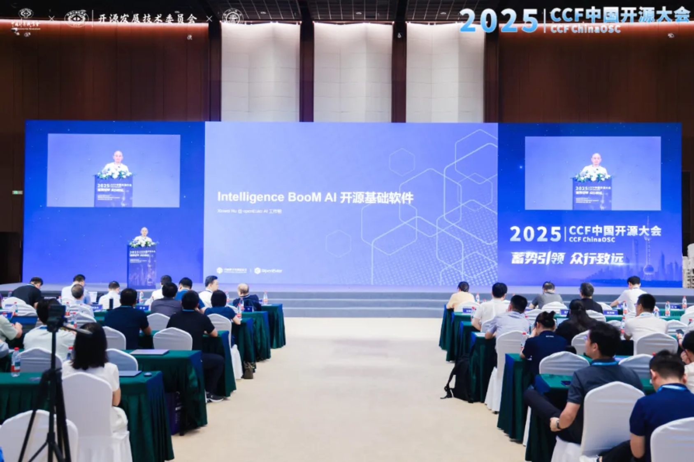
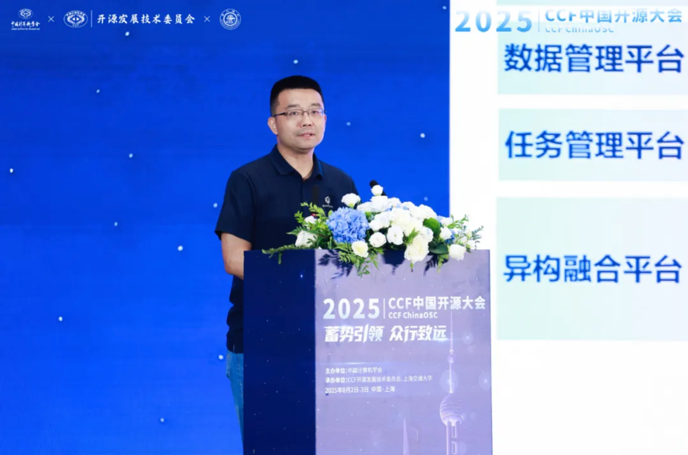
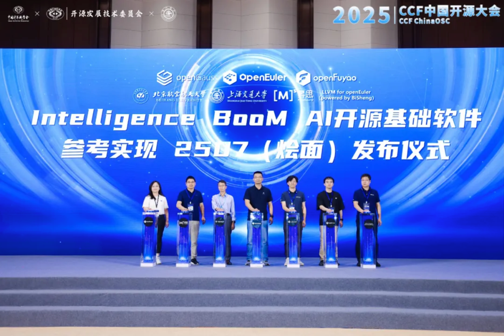

备受业界瞩目的 2025 CCF 中国开源大会（CCF ChinaOSC）于 2025 年 8 月 2 日 - 3 日在上海正式召开。大会以“蓄势引领、众行致远”为主题，依托上海国际化创新生态与科技产业集聚优势，汇聚顶尖专家学者，以及多位来自高校、企业的开源领军人物共同参与。本次大会，OpenAtom openEuler（简称：openEuler或开源欧拉）作为开源社区代表之一，深度参与探索开源生态，分享关键领域的前沿发展。

### Intelligence BooM: AI 开源基础软件

openEuler技术委员会主席胡欣蔚在《Intelligence Boom：AI开源基础软件》中强调 ，当前的产业智能化转型，需要一个面向应用场景的全栈开源解决方案，推动 AI 技术的普及和平民化，促成 AI 创新的多样化和繁荣。他分享了如何通过 openEuler AI 联合工作组践行落地：
- 一、拥抱社区，积极参与优秀开源项目，向上游共享代码；
- 二、组件解耦，将能力组件化，特性与代码跨项目复用；
- 三、积极创新，探索软件全栈中各层应用 AI，针对 AI 优化的创新技术；
- 四、打破技术烟囱，联合社区、高校与企业统一技术标准并增强生态兼容。

openEuler技术委员会主席胡欣蔚

### Intelligence BooM AI 开源基础软件参考实现 2507（烩面）发布仪式

openEuler 委员会主席熊伟在《Intelligence BooM AI开源基础软件参考实现发布》中介绍 ，Intelligence BooM AI开源基础软件栈是联合23家社区、伙伴成员一起打造的大模型全栈开源解决方案，包含异构融合平台、任务管理平台、数据管理平台、运行加速平台、智能应用平台及全栈安全平台等6大平台，20+开源组件。伙伴可以基于本次发布的参考实现进行商业场景应用，参与社区代码开发，进行技术及Agent应用创新等。

全栈方案及部署教程链接：[https://gitee.com/openeuler/llm_solution](https://gitee.com/openeuler/llm_solution)，欢迎大家访问和提issue。

**当天上午，“Intelligence BooM AI 开源基础软件参考实现 2507（烩面）”正式发布！** openEuler 开源社区将持续依托开源力量，深耕面向 AI 推理的全栈开源解决方案建设，助力企业加速迈入智能化时代，力争成为赋能行业智能化转型的重要标杆。

最后， CCF 中国开源大会为开源领域搭建了优质交流平台。 openEuler 开源社区在此收获颇丰，不仅加深与各方交流合作，还展示了自身在 AI 领域的创新成果。未来， openEuler 将带着大会给予的启发与动力，持续创新技术、壮大生态，为推动开源事业迈向新高度贡献更多力量，携手业界伙伴，在开源之路上行稳致远 。