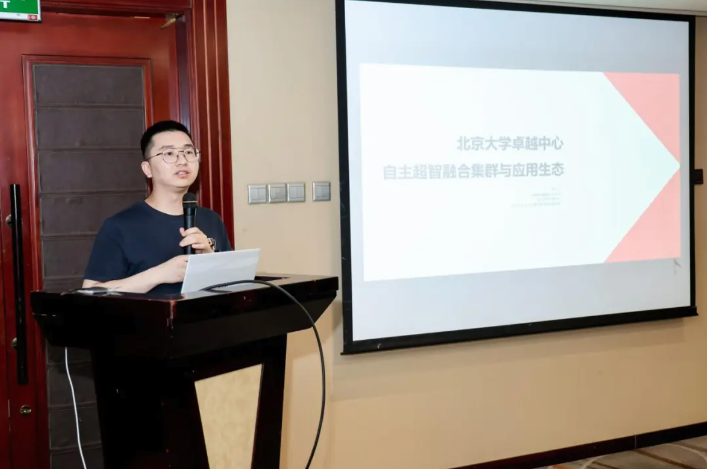

2025 年 8 月 22 日， OpenAtom openEuler（简称：“openEuler”或“开源欧拉”）sig-Long异构融合技术Meetup在北京成功举办。本次活动聚焦异构计算技术前沿，吸引了来自腾讯、京东、百度、快手、Intel等知名企业及北京大学、北京航空航天大学等高校的40余位技术专家齐聚一堂，就异构热迁移、异构融合调度、异构融合内存等关键技术进行了深入分享与探讨。

下面就让我们来回顾本次Meetup的高光时刻。

## 01 自主超智融合集群与应用生态

来自北京大学计算中心工程师龙汀汀介绍了北大卓越中心超智融合集群以及与openEuler 联动的应用案例。卓越中心超智融合集群整合北大自研的SCOW算力平台系统、大模型服务调度系统等模块，基于统一的国产算力底座，提供科学计算、智能计算、大模型推理部署等能力。随后，龙老师向我们分享了超智融合集群的部分应用案例，其中重点介绍了北京大学联合openEuler发布的DeepSeek全栈开源推理方案，以操作系统+AI框架+模型生态的三层开放架构，替换操作系统和AI框架，秉承代码开源+标准开放+生态共建的理念，逐步成为智能时代的数字基座。

## 02 大模型训练运行时快速轻量故障恢复技术研究

随着大型语言模型（LLM）训练集群的快速扩展，GPU错误频繁发生并干扰训练过程。虽然传统的错误恢复方法是有效的，但它们在日常操作和恢复过程中都会产生大量开销。即时检查点作为一种代表性的替代方案，但其复杂的GPU上下文解耦机制和通信后端的全局重新初始化仍然占用大量资源且速度缓慢。

在本次分享中，来自北京航空航天大学的张梦豪副教授提出了 Mnemosyne，一种用于LLM 训练的轻量级快速错误恢复框架。为了最小化日常开销和恢复开销，Mnemosyne通过基于共享内存的IPC和基于索引的句柄映射优化了GPU上下文解耦组件，并设计了一个灵活的集合通信库，该库可以动态调整已构建通信器的链接，而无需重新初始化。在开源原型上进行的初步实验表明，与最先进的技术相比，Mnemosyne将日常开销减少了高达58.8%，将通信重建时间减少了高达91.3%。

## 03 sig-Long 社区技术介绍与进展

为了向社区成员更加清楚地展示sig-Long社区情况，openEuler sig-Long 的 maintainer郑弦首先介绍了sig-Long成立的基本信息，包括技术背景、目标及名字的由来, 随后介绍自sig成立以来sig-Long的项目情况，例如全栈开源大模型推理解决方案llm_soluton、针对AI负载加速的高性能分布式文件系统FalconFS、面向MoE架构的系统推理引擎Expert Kit等。最后展望了对sig后期的项目情况，将计划围绕易用性与Agent开源3个项目。

## 04 异构融合调度技术

对于AI基础设施用户而言，能否有效提高利用率、充分发挥设备潜力，已成为评判性价比和竞争力的关键维度之一。来自openEuler sig-Long的Committer郝明哲向我们介绍了NPU OS，一种专门结合多任务调度以改善利用率的设备内操作系统。此外，针对此技术的具体实践，郝明哲分享了图模式下高低优先级抢占、细粒度L2Cache管控、设备内PD并行等竞争力实践，与大家一起探讨实践中的技术挑战。最后，本议题描述了整体部署形态、试用方式，以及未来开源计划。

## 05 异构融合内存技术与落地

现在是体系结构（加速器发展）的黄金时代，而内存是异构生态核心组成，是AI基础设施性价比和竞争力的关键考量因素。来自openEuler sig-Long 的Committer何文良介绍了AI基础设施异构融合内存面临的问题和技术诉求，同时向大家分享sig-Long所做的一些技术成果，包括共享内存语义、内存自动swap、碎片整理等关键特性。最后介绍社区在最近一年以来异构融合内互联网客户的实践以及相关技术的开源计划。

## 06 新型系统总线技术研究

随着AI/LLM浪潮的兴起以及计算系统架构的演进，通过新型互联技术构架的异构ScaleUP计算系统中的基础系统软件面临着新的挑战与机会。本议题基于方兴未艾的各种ScaleUP总线的观察以及华为将要发布的Unified Bus，来自sig-Long的maintainer 黎亮带领我们开展了有关基础系统软件基于大规模扩展的内存语义之上合理的编程范式、优选的软硬件机制的激烈讨论。

## 07 CXL在英特尔至强处理器平台上的创新应用

CXL（Compute Express Link）是一项专为主机与设备间数据传输设计的新兴高速互连技术，具有高带宽和低延迟的显著优势。目前，CXL已发展至3.2版本，新增了更高速率、多级交换、设备池化、内存扩展以及安全加密等功能。CXL正逐步成为新一代数据中心和高性能计算平台的关键互联标准。

来自英特尔的云软件架构师范飞飞为我们介绍了至强6处理器全面支持CXL 3.0，能够实现高效内存扩展、加速器互连和资源池化等功能，为未来数据中心基础架构奠定坚实基础，并为CXL在数据中心和高性能计算领域的广泛应用提供了有力技术支撑。

## 演讲 PPT 下载

本次 Meetup 的 分享材料 已上传至 openEuler Gitee 仓库。如果您需要本次活动的PDF，可前往下方链接获取，期待您的下次参与！

[https://gitee.com/openeuler/presentations/tree/master/meetup](https://gitee.com/openeuler/presentations/tree/master/meetup)

本次Meetup的直播回放已上传至B站openEuler官方账号。如果您错过了本次线下活动，可前往B站回看。

[https://www.bilibili.com/video/BV1s6exzDEhL](https://www.bilibili.com/video/BV1s6exzDEhL)
