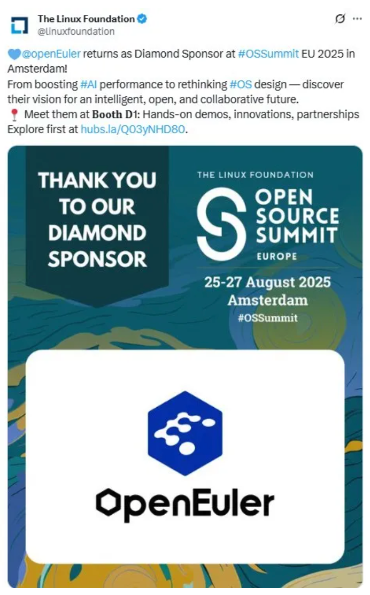
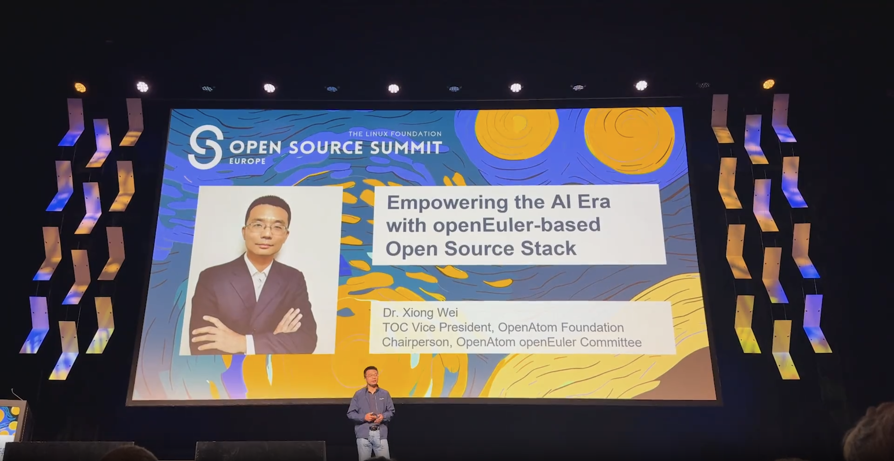
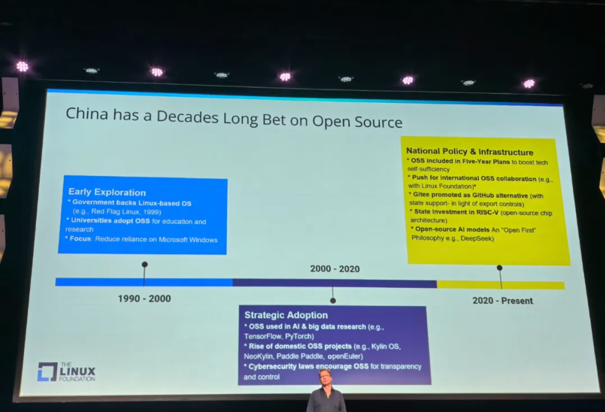
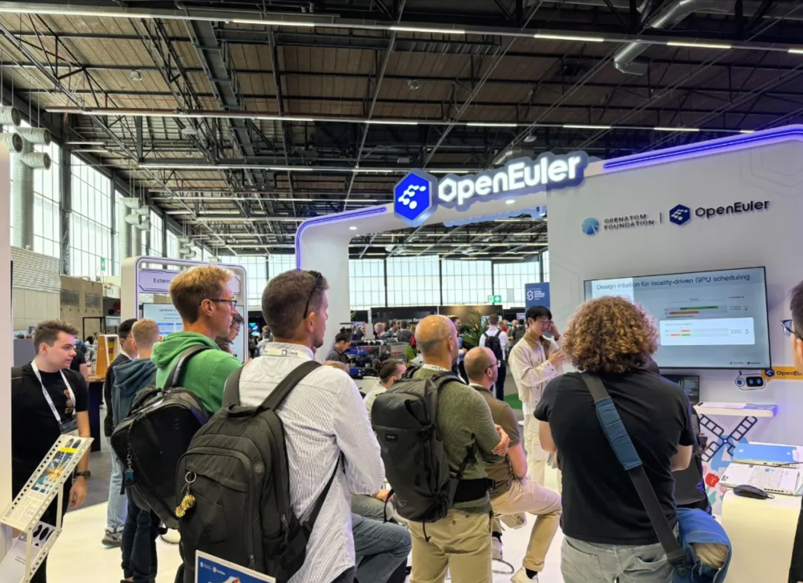
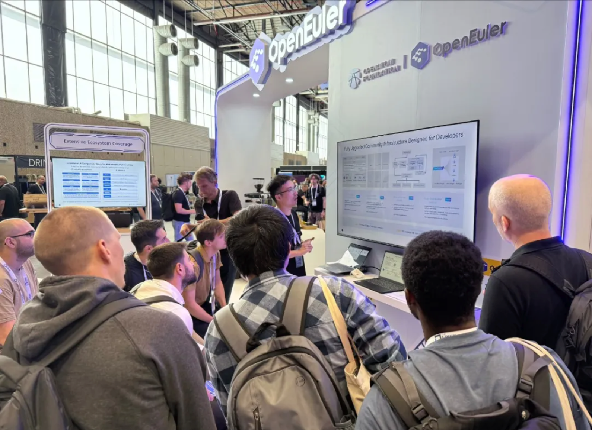
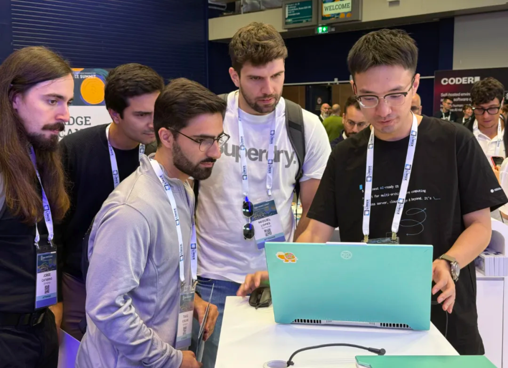
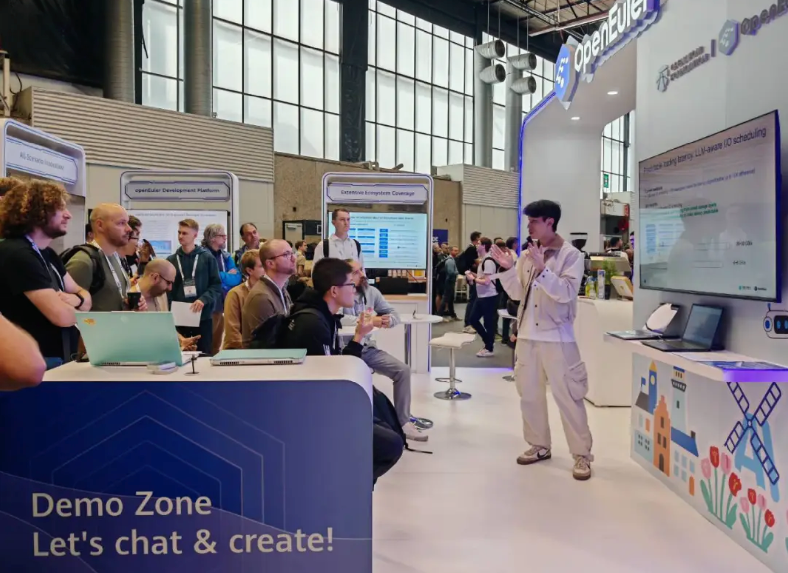

2025年8月25-27日，国际开源盛会 OSSUMMIT EU 2025 在阿姆斯特丹成功举办。OpenAtom openEuler（简称：“openEuler”或“开源欧拉”）深度参与此开源盛会，全面展示openEuler在AI与国际化方面的最新进展。本次会议，openEuler 不仅 在主会场 进行Keynote分享，还设置了openEuler交流区， 在大会现场 与全球开发者深入探讨开源操作系统与AI的前沿趋势、与企业代表共探开源机遇，交流实践成果与生态发展思路， 携手为构建开放协同的全球开源环境聚力。

openEuler 委员会主席熊伟在Keynote现场发表了主题演讲《Empowering the AI Era with openEuler-based Open Source Stack》，演讲立足 AI 发展趋势，剖析了openEuler Intelligence BooM AI开源基础软件栈，对openEuler 在"AI for OS, OS for AI"领域的探索进行了分享，为开源与 AI 协同发展注入新动力！

The Linux Foundation 执行董事 Jim Zemlin 在 OSSummit EU 2025上发表 Keynote，在中国开源项目的崛起部分中特别提及 openEuler，展现了openEuler项目在技术创新和全球开源社区的贡献，更凸显了中国开源项目在全球开源领域日益增长的影响力。

除了精彩纷呈的  Keynote，openEuler展台也空前火爆，来自不同社区和企业的开发者来到openEuler 交流区，与openEuler社区专家们进行了详尽的技术探讨。

openEuler的成功离不开社区开发者的贡献和持续努力。经过过去6年的发展，openEuler已成为一个充满活力和创新的社区项目。未来，openEuler将继续发展，为各种场景和应用提供强大的操作系统支持，推动智能化未来的实现。
