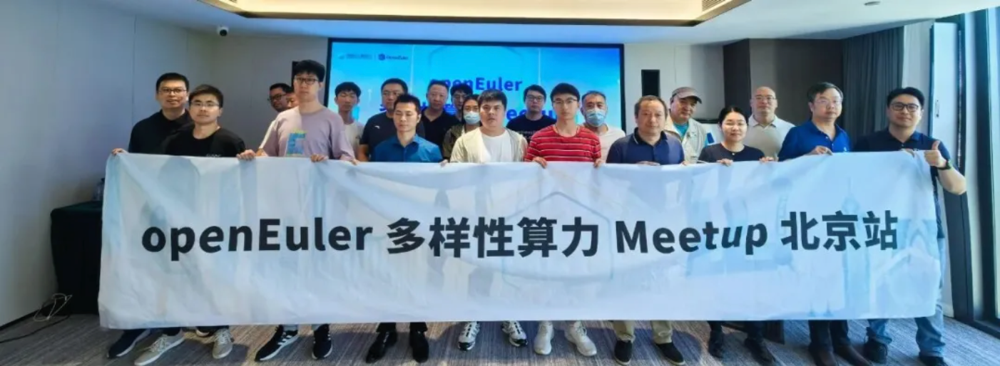
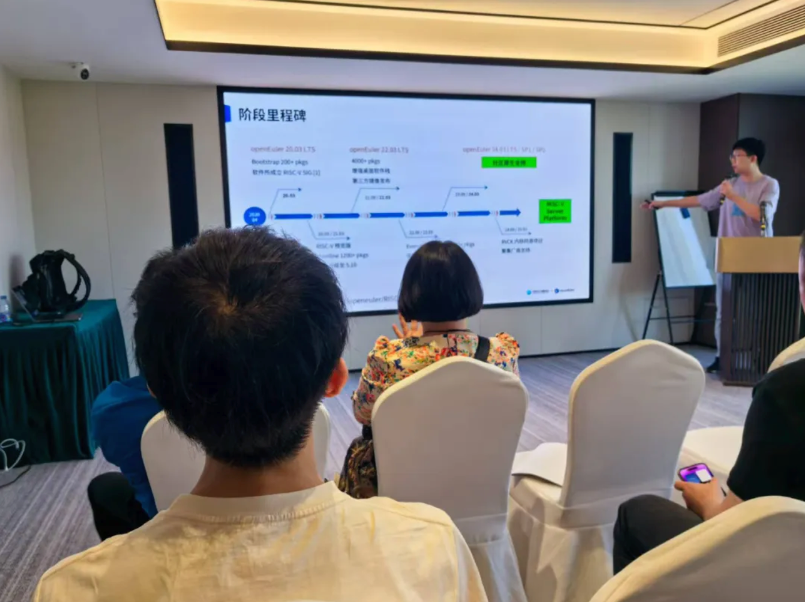
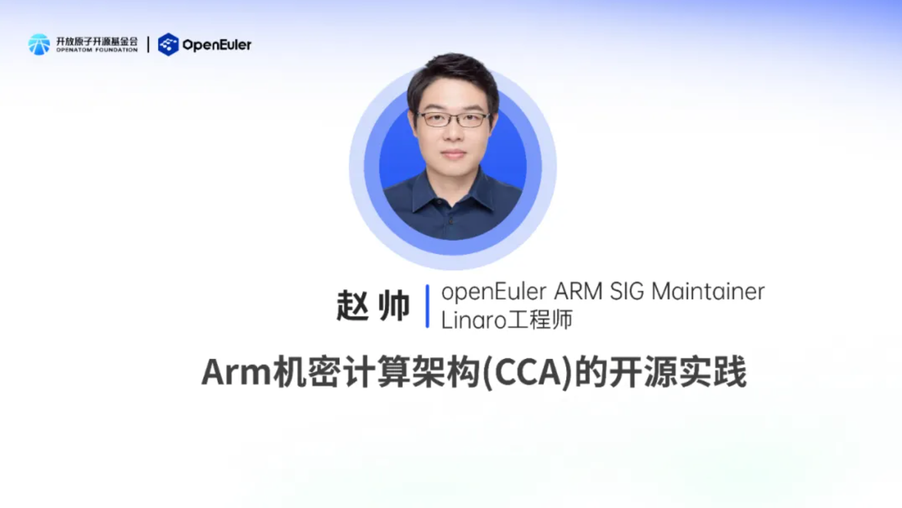
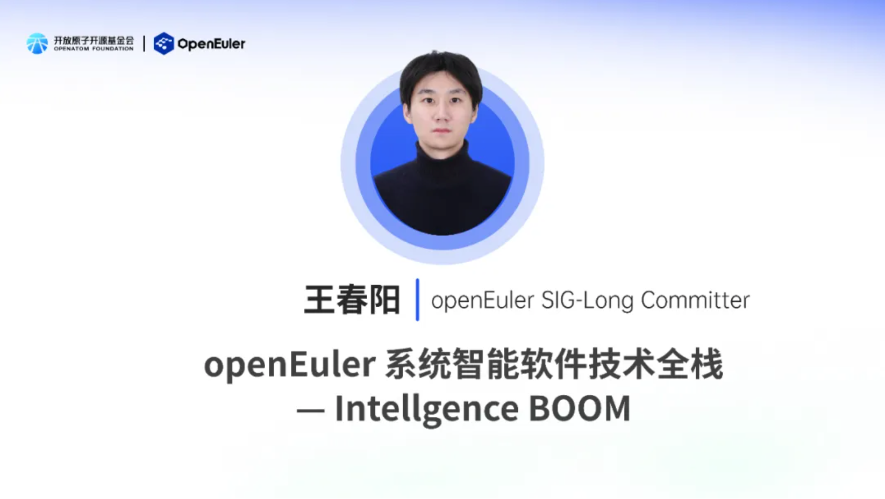
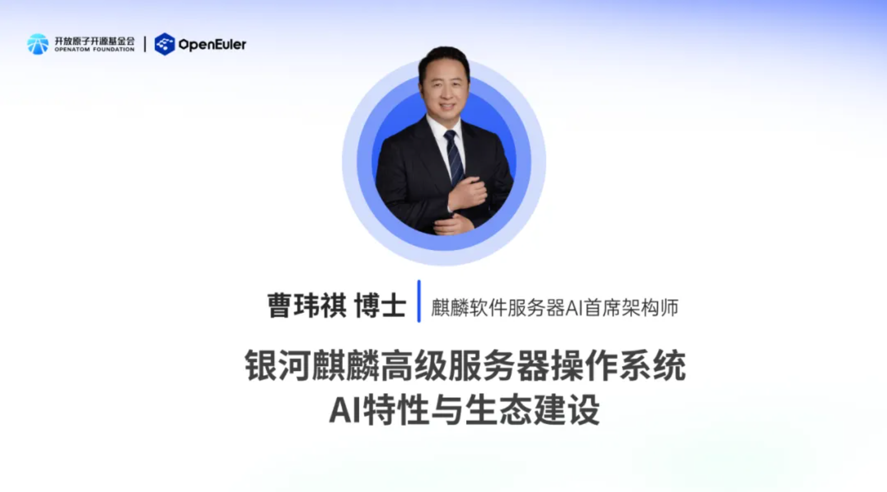

2025 年 9 月 6 日， OpenAtom openEuler（简称：“openEuler”或“开源欧拉”）多样性算力Meetup在北京成功举办。本次 Meetup 北京站将进一步聚焦多样性算力，汇聚各方力量，深入交流创新实践与技术成果，携手推动多样性算力的落地与生态繁荣。

# 01 openEuler on RISC-V：RVA23 标准，构建服务器生态新基座

**来自 openEuler on RISC-V SIG Maintainer、中科院软件所工程师周嘉诚分享了 openEuler 在 RISC-V RVA23 标准上的最新进展。** openEuler在RISC-V领域持续深耕，核心推进RVA23及服务器平台规范支持与上游原生开发，以破解生态碎片化难题。

RVA23研发方面，GCC 14.3 和 Binutils 2.42 均已完成 RVA23U/S64 必选范围支持的 backport 并合入，与五家厂家共建的RVCK 6.6 同源内核已合入 RVA23必选扩展 hwprobe 等支持，计划在2025年内进行 LTS 版本的基线提升，基于上述工具链发布原生支持 RVA23 的openEuler 24.03 LTS SP3 版本，支持即将到来的 RVA23 及服务器平台标准兼容硬件。

同时，虚拟化领域推进安全容器技术，存储/网络栈借向量 (RVV)、位操作(RVB) 等扩展优化关键库，加速RISC-V服务器商业化落地。RVCI 计划推动完善上下游关键开源软件社区 RISC-V 基建，推动上游原生支持与原生开发；RAVA 计划联合厂家共建软硬件测试测评基建，保障商业化落地质量。

# 02 Arm 机密计算架构(CCA)最新开源进展

**openEuler ARM SIG Maintainer、Linaro 工程师赵帅分享了 Arm 机密计算架构 (CCA) 最新开源进展。**  基于 Armv9-A 架构的 Arm CCA 技术，借助 Realm Management Extension（RME）和内存加密机制，实现了与 Intel TDX、AMD SEV 类似的机密虚拟机隔离能力。

目前，Arm CCA 软件栈特性在开源社区推进迅速：RMM 1.0 对应的 firmware、edk2 和 guest Linux kernel 已完成社区合入，KVM 和 QEMU 的社区合入正加速；随着 RMM1.0 软件栈成熟，上层机密容器、Kata-containers、libvirt 和 openstack 的支持在社区进展显著，其中 Kata-containers 和 CoCo 大部分功能已获社区完整支持。

RMM 1.1 spec 的重要特性 MEC、Planes 和 Device Assignment 持续开发，DA 已完成基于 Qemu sbsa-ref Host 的基本功能流程开发，用户可依指导文档完成 DA 流程。此外，还介绍了基于 Veraison 的远程证明方案，包括 CoCo 与 Veraison 的整合及本地 token 验证，并重点分析了 endorsement API 在 IETF 和 Veraison 社区的进展。

# 03 openEuler Intelligence Boom：构建 AI 全栈开源新生态

**来自 openEuler SIG-Long Committer 王春阳分享了 openEuler Intelligence Boom AI全栈开源解决方案。**  以全栈开源破解 AI 生态壁垒，推动技术普惠与产业智能化转型。

该方案构建五大核心平台：智能应用平台支持 Agent 开发与 RAG 等能力，运行加速平台适配 50 + 主流模型并优化资源消耗，任务管理平台实现平滑扩展，硬件融合平台统一异构算力，全栈安全平台保障全链路可信。首版提供 CPU+NPU（800I A2/300I Duo）、CPU+GPU（A100）三种交付形态，借 oeDeploy 实现分钟级部署，性能亮眼，如支持 DeepSeek V3 671B 模型高并发推理。

同时，推出 Expert-kit 分布式 MoE 推理框架，通过注意力与专家分离计算、异构资源协同等，提升硬件利用率与扩展性，还强化 OS 原生智能，加速 Agent 生态成熟，目标打造 AI 基础软件开源事实标准，联动多方共建繁荣生态。

# 04 银河麒麟高级服务器操作系统V11：AI特性与生态双轮驱动

来自麒麟软件的服务器AI首席架构师曹玮祺博士分享了银河麒麟V11的AI特性与生态建设进展。  银河麒麟V11是适配国内外主流算力芯片的服务器操作系统，内核升级至6.6，覆盖预训练、推理、微调与后训练等多场景支持；政府、金融、制造等多行业诉求。其AI能力分为“OS For AI”与“AI For OS”：前者提供易配易用的AI生态库，如麒麟优化版Kylin-Ollama支持一键部署2000+大模型，麒麟优化版Kylin-vLLM等推理引擎提升吞吐20%，Chitu在A800集群部署DeepSeek-R1-671B时成本降低50%，推理速度不降反升3.15倍；后者借助LLM、通过自研kyCopilot、exTuner等工具实现系统管理与编程副驾、优化运维与性能调优。还打造多样算力融合容器平台（KFA），云原生纳管CPU、GPU等异构算力资源，提供算力调度增强、算力编排检测与工作流支持。针对LLM生产环境部署，提供计算优化、通信优化、算子优化、双向流水线并行、专家动态负载均衡、存储优化如3FS文件系统读取吞吐量达6.6TiB/s等训推场景深度支持。

生态上，广泛适配海光DCU、昇腾、沐曦、天数、寒武纪等加速卡，推出AI安全大模型防护栏、模型扫描、检测与攻击防御，对接MaaS服务、提供Dify、n8n等预制环境，构建“易配易用-即用即优”的AI全栈生态，助力企业迈向智能化转型深水区。

本次 openEuler 多样性算力 Meetup 北京站，集中展现了社区在多领域的技术突破与生态进展。这些成果为 openEuler 生态注入强劲动能。未来，期待更多伙伴加入，携手深耕多样性算力、AI 开源等领域，推动技术转化为产业价值，共筑开放繁荣的开源生态，为数字经济发展注入开源动力。
