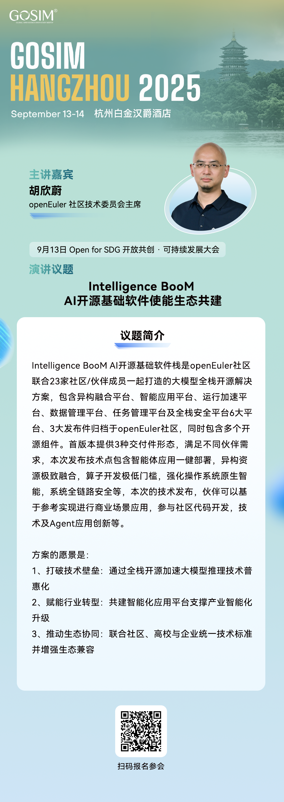

9 月 13–14 日，GOSIM HANGZHOU 2025 大会将在杭州隆重启幕。GOSIM作为一个开源社区平台，致力于为全球开源开发者提供一个协作和交流的空间。此次大会不仅是开源界的一次盛会，更是探讨未来技术趋势、共建智能基础设施的关键平台。届时，OpenAtom openEuler（简称：“openEuler”或“开源欧拉”）将与全球开发者、企业代表以及技术领袖一起，深入探索开源技术在AI时代的新可能。

# 01 openEuler议题亮点抢先看

开源浪潮席卷AI时代，openEuler 社区以 Intelligence BooM 全栈开源解决方案推动技术普及与产业繁荣。本次大会上，openEuler社区技术委员会主席胡欣蔚将带来题为 “基于Intelligence BooM AI开源基础软件使能生态共建 ” 的技术分享。

# 02 来现场，与openEuler互动

届时，欢迎来到 GOSIM 2025 杭州大会 openEuler 展台，与我们一起探讨AI开源基础软件的未来发展，共同见证开源力量如何推动人工智能技术的普及与普惠。

# 03 大会信息

- 会议名称：GOSIM HANGZHOU 2025

- 会议时间：2025年9月13日~9月14日

- 会议地点：中国·杭州白金汉爵酒店

- 会议官网：https://hangzhou2025.gosim.org/zh/

让我们相约杭州，不见不散！
