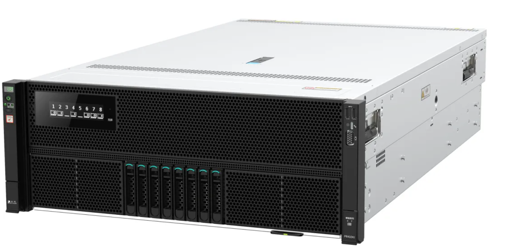
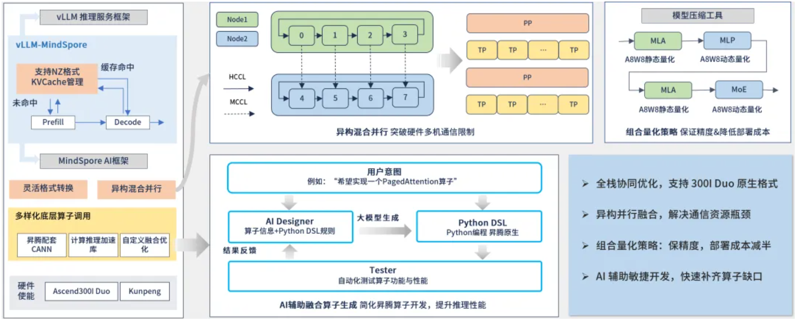

今年以来，DeepSeek正以卓越的性能和极致的成本优势，在多个行业落地生花，公开数据显示：在金融领域，其信贷欺诈识别准确率高达99.3%，智能投研助手可实现研报分钟级生成；在医疗健康场景，它融合病理影像、基因与病历数据，将肺癌早期误诊率从18%降至2.4%；在政务应用中，DeepSeek数智人可处理百类事项、千条语料，大幅提升服务效率与群众满意度。

然而，尽管DeepSeek表现惊艳，传统部署方式下的百万级成本却让众多中小企业望而却步。

瞄准这一痛点，聚焦中小企业“小并发、低成本、高性价比 ” 的核心需求，宝德携手OpenAtom openEuler（简称“openEuler”或“开源欧拉”），打破AI部署百万门槛，推出最具性价比的满血DeepSeek一体机方案——仅需单机8张Atlas 300I Duo推理卡，即可流畅运行671B大模型，单机吞吐量突破 300 tokens/s，而且成本30万级别可控，让中小企业也能以低成本享受到顶级 AI 算力。

# 01 方案硬件基础与性能表现

该方案基于宝德自强®AI推理服务器PR410KI，创新融合了鲲鹏与昇腾等多种加速卡，最大支持10张Atlas全高全长单/双宽PCIe标卡，能实现CPU与NPU的指令级协同，具有高算力密度、高扩展、极致能效比与高网络带宽等特点，在自然语言处理、图像识别等推理场景中，可实现单位算力成本降低40%，推理时延缩短至毫秒级。该方案实测数据显示，单机8卡部署DS-671B INT4量化模型，512-512序列的非首token吞吐单并发11 tokens/s，最高达321 tokens/s；单机4卡部署Qwen/QWQ-32B INT8 稀疏压缩模型，512/256序列吞吐最高可达487 tokens/s，性能表现处于业界领先水平。

# 02 全栈协同优化技术

如此强劲的性能背后，是宝德与openEuler在系统层、框架层与算子层的全栈协同优化：

- 通过vLLM服务化框架、MindSpore计算框架与昇腾自定义算子的深度融合，充分释放Atlas 300I Duo的硬件潜力；

- 针对MoE结构、量化计算等关键模块作融合优化，端到端推理时延降低超30%；

- 采用张量/流水线/数据并行的混合并行策略，结合内存融合技术，突破单芯片内存限制，高效支撑超大规模参数模型；

- 依托openEuler的高可靠性与兼容性，确保系统稳健运行和生态广泛支持。

# 03 方案价值与生态意义

这一方案不仅性能“满血” ，更具“极致的性价比” 。用户无需复杂集群设计和高昂运维投入，单机即可完成部署应用，大幅降低模型推理成本，真正实现“小投入、大效能”，中小企业客户再也不用望AI而兴叹了。

作为openEuler社区AI联合工作组首批成员，宝德始终积极参与开源生态建设，推动操作系统与AI技术的深度融合。本次推出的满血DeepSeek一体机，不仅是技术成果的体现，更是宝德携手社区推动多样性计算发展的关键里程碑。

从“望而却步”到“触手可及”，宝德基于openEuler的满血DeepSeek一体机方案，正在重新定义中小企业AI 部署的成本与性能边界。如今，顶级大模型不再是大企业的专属，更多中小企业和创业者们，都能以更低门槛拥抱智能变革，在AI浪潮中站稳脚步、抢占发展先机。

未来，宝德将继续携手openEuler，共同打造更加坚实可靠的算力基石，为千行百业的数智化转型升级注入持续动力，共创智能新纪元。

转载自宝德自强公众号