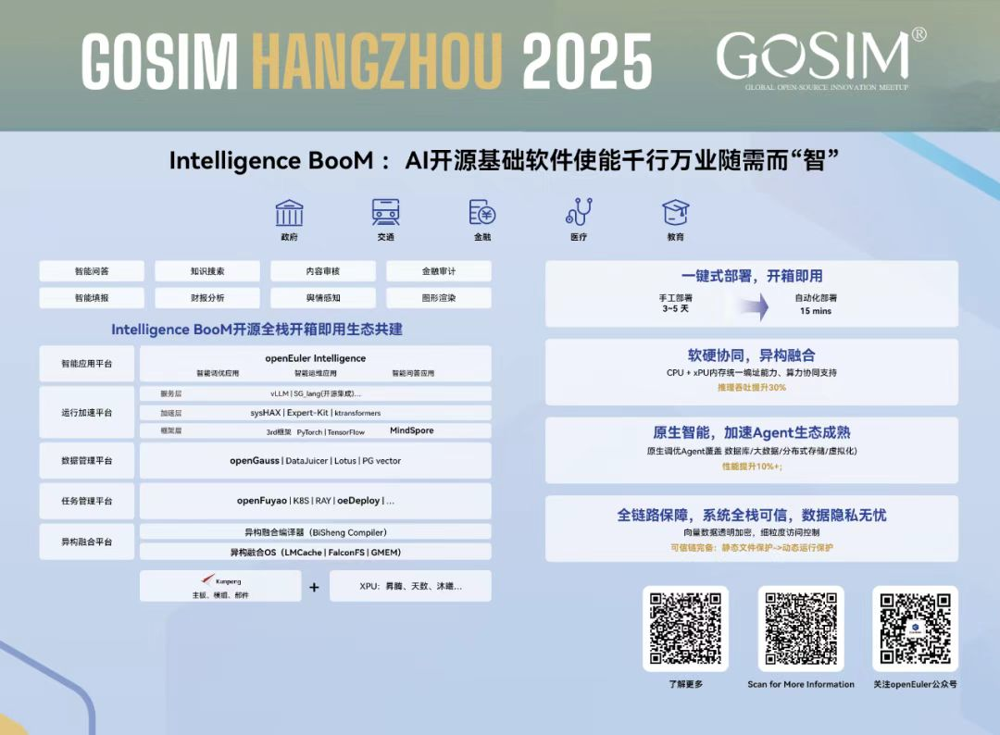

[9月13日,中国,杭州] GOSIM HANGZHOU 2025峰会盛大开幕，openEuler社区技术委员会主席胡欣蔚带来题为 “基于Intelligence BooM AI开源基础软件使能生态共建” 的技术分享。

Intelligence BooM AI开源基础软件栈是openEuler社区联合23家社区/伙伴成员一起打造的大模型全栈开源解决方案，包含异构融合平台、智能应用平台、运行加速平台、数据管理平台、任务管理平台及全栈安全平台6大平台，3大发布件归档于openEuler社区，同时包含多个开调源组件。首版本提供3种交付件形态，满足不同伙伴需求。这一方案不仅是一次技术突破，更是 openEuler 社区推动“AI + OS 深度融合”的重要里程碑。

Intelligence BooM 构建了智能体应用、模型层、数据处理、推理服务、开发框架及操作系统+硬件的完整技术栈。

# 01 模型生态与易用性
在模型生态方面，该方案构建了开放兼容的"AI模型超市"，兼容多元大模型生态，普惠AI。目前平台已适配包括Deepseek、Qwen、Llama等在内的主流大语言模型，同时兼容诸如MinerU等多模态模型和DeepResearch等研究型模型，利用多模态内容理解与生成能力，为RAG等智能应用提供文本、图片等多模态文档内容的提取与语义关联能力；该方案还支持DeepResearch（深度研究）能力，即基于整合网络搜索结果+知识库内容，生成专业化深度研究报告；支持多Agent协同支持能力，满足多角色Agent分工协作，分别负责分解任务、工具执行、评估反思，提升任务效果。在易用性方面，通过环境部署工具oeDeploy"开箱即用"的部署模式，用户可在分钟级完成模型适配，配合天级服务上线能力，显著降低AI应用开发门槛。

# 02 向量数据存储和加速
在向量数据存储和加速方面，openGauss 提供了向量扩展能力，通过集成 PG Vector扩展，支持向量数据类型及相似性搜索操作，可直接在数据库层完成向量检索，简化架构复杂度，适应快速原型开发的 AI 应用。面向多模态大模型等海量向量数据场景，兼容FalconFS支持横向扩展，通过分片与副本机制实现 PB 级数据存储，支持与 GPU/NPU 协同，通过内核级加速（如 RDMA、SPDK）降低向量传输延迟，提升推理效率。

# 03 操作系统层面优化
操作系统层面，利用vLLM+MindSpore满足“高易用“、”高吞吐”需求，打造昇腾最优开源推理框架，通过openEuler异构融合调度技术，利用MoE模型稀疏化明显特点，拆分成多进程，进程动态部署在鲲鹏CPU和昇腾NPU上，充分利用闲置鲲鹏算力和带宽资源。提供轻量推理运行时，NPU硬件亲和(L2Cache按需、共享资源QoS等)的推理运行时，并将整模型下沉执行，实现系统原生轻量推理；通过异构融合内存GMEM，在长序列及多轮对话场景，将CPU与NPU内存池化，构建基于GMEM内存管理底座的LMCache缓存能力，以存代算，提升吞吐和用户并发数。提供定制文件系统，针对AI推理业务流程不同存储特点和诉求，定制场景化的高效率文件系统服务；TriIO面向推理服务，ModelFS面向模型权重，FalconFS面向KV和小文件存储。

openEuler异构融合调度实测推理吞吐量相比业界提升15%，openEuler异构内存融合技术，在32K/128K长文本处理场景中，TTFT（首token生成时间）降低20%，推理吞吐提升50%，显著提升交互体验。

- 力硬件兼容：算力硬件兼容方面，为了更好的支持异构算力，openEuler在内核层对CPU、NPU等不同算力资源进行统一抽象，同时通过对CPU DDR、NPU HBM中数据一致性管理，实现虚拟内存统一编址和直接访问；结合异构并行调度算法，实现对计算节点的多种算力和内存等关键资源的池化和灵活调度，促进系统性能从局部最优到全局最优。

- 推理框架：推理框架方面，技术框架层采用MindSpore与PyTorch双引擎驱动。特别是针对国产化需求，我们对昇腾NPU进行了深度适配，通过算子融合、内存复用等技术，使计算密度提升35%。开发者可无缝切换推理框架，保持模型精度一致性。

# 04 未来展望
展望未来，我们将持续深化"AI+OS"的深度融合创新，重点突破多模态推理等场景，打造更高效、更智能、更安全的开源推理新范式。欢迎各界伙伴加入openEuler生态，共同推动人工智能技术的普惠发展。