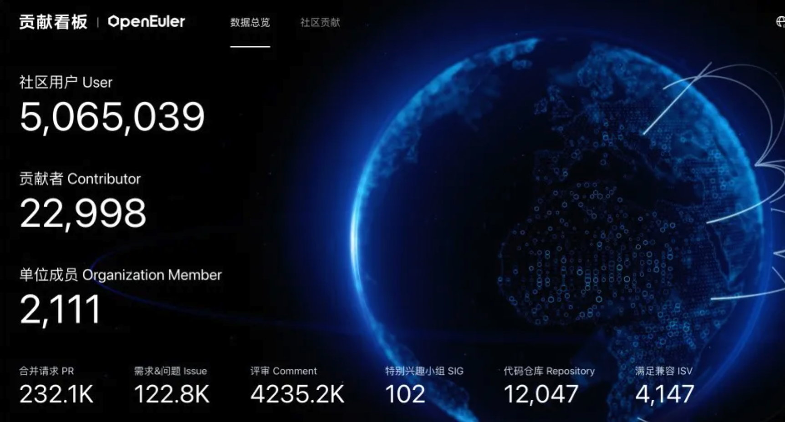
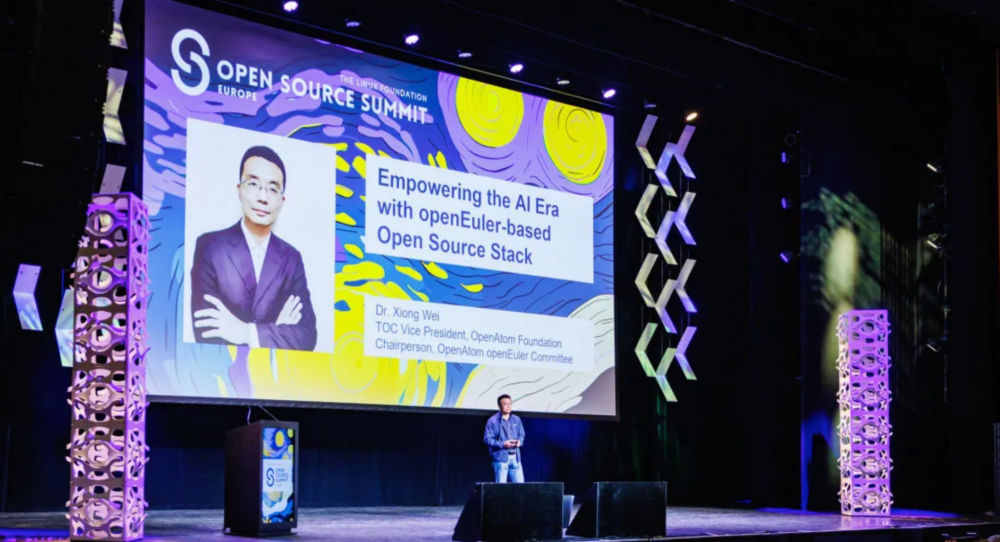
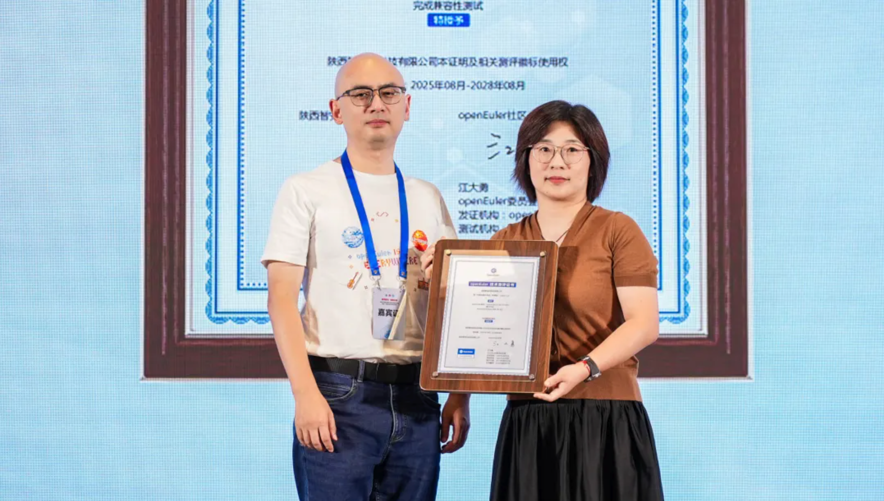
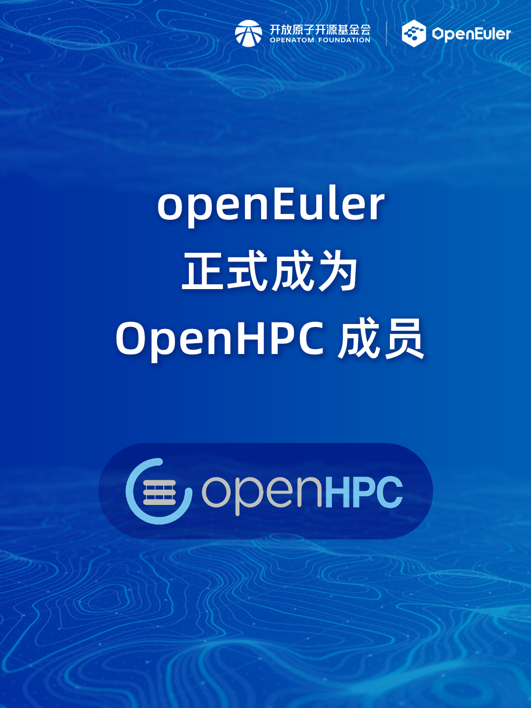
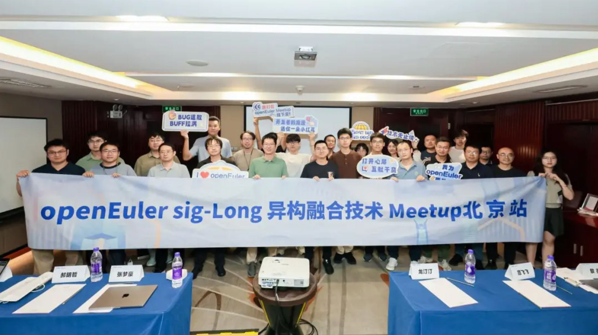
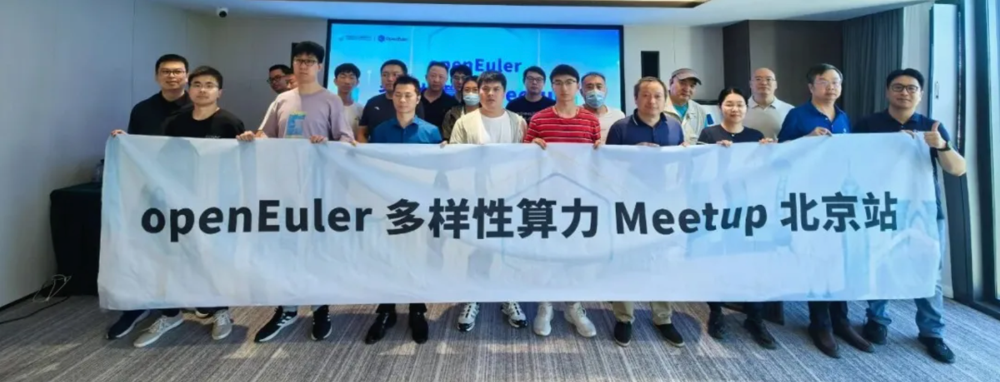
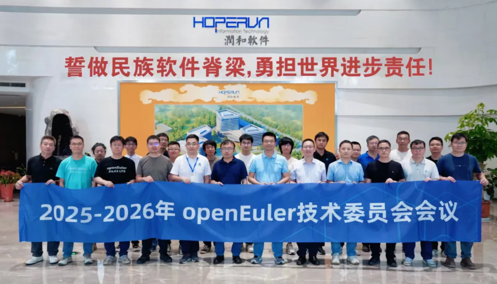

# 概述

2025年8月，OpenAtom openEuler（简称：“openEuler”或“开源欧拉”）社区在技术演进、生态拓展和治理优化方面取得一些进展。openEuler for RVA23 25.03 试验镜像发布，标志 openEuler 向 RISC-V 通用服务器标准的迈出关键一步。

在社区治理方面，2025-2026年技术委员会线下会议召开。会议明确推动 openEuler 在汽车领域的应用试点，重点投入 soafee 软件、现有仿真方案与 openEuler 进行适配。

技术突破方面，openEuler Intellgence BooM AI 开源基础软件参考实现正式发布。该基础软件通过将操作系统、数据库、AI框架、模型优化工具、云化部署编排系统集成于一体，提供可安装、开箱即用的AI应用能力。极大简化企业数据中心内部署 AI 模型的成本，目前 Intelligence BooM 提供三种系统镜像，欢迎大家下载试用。同时 openEuler 社区在 Open Source Summit 2025 上向全球的开发者分享了该方案，收到了现场很多开发者的关注。

生态层面，新一代智控操作系统 ZaxOS 在西安正式发布，openEuler 技术委员会主席胡欣蔚为ZaxOS颁发 openEuler 技术测评证书 。

继续阅读了解更多社区进展！

# 社区规模

截至2025年8月31日，openEuler 社区用户累计超过500万。接近2.3万名开发者在 社区  持续贡献。社区累计产生 232.1K个PRs、122.8K条Issues。目前，加入openEuler社区的单位成员2111家，8月新增22家。

社区贡献看板（截至2025/08/31）

# 社区事件

## Intelligence BooM AI 开源基础软件参考实现 2507（烩面）正式发布！

在2025 CCF 中国开源大会上，openEuler技术委员会主席胡欣蔚分享了openEuler AI 联合工作组在AI开源基础软件上的成果：

1. **拥抱社区，积极参与优秀开源项目，向上游共享代码。**
2. **组件解耦，将能力组件化，特性与代码跨项目复用；**
3. **积极创新，探索软件全栈中各层应用 AI，针对 AI 优化的创新技术**
4. **打破技术烟囱，联合社区、高校与企业统一技术标准并增强生态兼容。**

随后，openEuler 委员会主席熊伟联合23家社区、伙伴成员一起发布了Intelligence BooM AI开源基础软件参考实现。这是一套大模型全栈开源解决方案，包含异构融合平台、任务管理平台、数据管理平台、运行加速平台、智能应用平台及全栈安全平台等6大平台，20+开源组件。伙伴可以基于本次发布的参考实现进行商业场景应用，参与社区代码开发，进行技术及Agent应用创新等。

- 部署教程：https://gitee.com/openeuler/llm_solution

## openEuler 亮相国际开源盛会 OSSUMMIT EU 2025

2025年8月25-27日，国际开源盛会 OSSUMMIT EU 在阿姆斯特丹举办。openEuler 在本次峰会中分享了在AI和海外生态上的最新进展。

openEuler 委员会主席熊伟在Keynote现场发表了主题为《Empowering the AI Era with openEuler-based Open Source Stack》的演讲，为现场观众带来了Intelligence BooM AI开源基础软件栈。

相关链接：https://mp.weixin.qq.com/s/LtveQWuKaCqry47mx8kKKA

## 新一代智控操作系统 ZaxOS 发布

2025年8月15日，“面向AI端侧装备应用的系统解决方案暨新一代智控操作系统发布会”在西安圆满举行。新一代智控操作系统ZaxOS 在本次活动上正式发布。

ZaxOS 首创“认知皮层”、“智能大脑”与“控制小脑”的时空并发编织机制，实现了IDCA智能体循环链路的动态协同优化，可支撑关键性业务微秒级环境感知与毫秒级智能决策，赋能关键性与高时敏场景业务植入“条件反射式”响应回馈。

openEuler 技术委员会主席胡欣蔚代表开放原子开源基金会openEuler社区为ZaxOS颁发openEuler技术测评证书。

## openEuler 正式成为 OpenHPC 成员

## openEuler sig-Long 异构融合技术 Meetup 北京站成果举办

来自腾讯、京东、百度、快手、Intel 等知名企业及北京大学、北京航空航天大学等高校的40余位技术专家齐聚一堂，就异构热迁移、异构融合调度、异构融合内存等关键技术进行了深入分享与探讨。

精彩回顾：https://mp.weixin.qq.com/s/1_n11h6DZDtb7770CoW6Pw

## openEuler 多样性算力 Meetup 北京站圆满举办

来自中科院软件所、Linaro、华为、麒麟软件的嘉宾分享在 openEuler 上的多样性算力解决方案和技术创新，携手推动多样性算力的落地与生态繁荣。

精彩回顾：https://mp.weixin.qq.com/s/iILfE_4VKgNp1LQVxiSQvQ

# 社区治理

## 2025-2026年 openEuler 技术委员会议在南京召开

8月1日，2025-2026年openEuler技术委员会第二次线下会议在南京召开。本次会议由江苏润和软件股份有限公司承办。

本次会议对 openEuleer LTS 版本和创新版本的发布节奏进行调整。 会议明确，推动 openEuler 在汽车领域的应用试点，重点投入 soafee、现有仿真方案与 openEuler 进行适配。相关成果计划在 openEuler Summit 2025 公布。

本次会议为下半年openEuler社区的技术工作提供了明确指导，也为深度参与社区建设的成员单位在技术布局与战略创新方面明确了方向。

点击查看会议纪要：

https://etherpad.openeuler.org/p/TC-meetings

# 技术进展

## 在 openEuler 上使用 KServe 部署 Qwen3

KServe 是一种基于 Kubernetes 的模型服务（Model Serving）平台，能够简化机器学习模型在生产环境中的部署和管理。通过标准化的接口和 CRD（自定义资源定义），KServe 支持多种主流推理后端（如 TensorFlow Serving、TorchServe、Triton Inference Server 及 Hugging Face Server），适用于各类深度学习模型的在线推理服务。

如何部署：https://mp.weixin.qq.com/s/YxqvHei6aNA_FGCfUiEJTw

## 软硬件兼容性测评

截至2025年8月31日，openEuler软硬件兼容性测评新增48个，其中北向（ISV）新增31个，南向（IHV）新增11个。

- 兼容性列表：https://www.openeuler.org/zh/compatibility/  
- OSV技术测评列表：https://www.openeuler.org/zh/approve/
