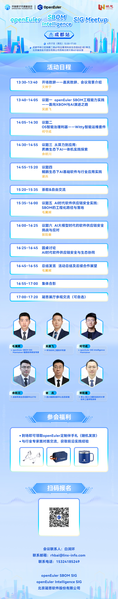

随着人工智能、大模型与云原生技术的快速发展,软件系统复杂度持续提升，AI的引入和广泛应用也对软件系统的运维、软件供应链安全提出了新的挑战。从传统组件管理演进为面向模型、数据与算力协同的新型体系，安全风险呈现出更强的隐蔽性与动态性。

在此背景下，如何在引入智能能力的同时保障软件供应链安全，实现风险前移、漏洞可控与全生命周期治理，已成为关键行业数字化建设中的核心议题。

为推动 AI 时代软件供应链安全能力体系建设，促进相关技术在行业中的工程化落地，**OpenAtom openEuler（简称 “openEuler” 或 “开源欧拉”） SBOM SIG、Inteligence SIG 联合北京凝思软件股份有限公司，拟于 2026 年4月17 日在成都举办“AI时代软件供应链安全与运维实践沙龙。**

## 活动重点

本次活动将立足关键行业实际场景，围绕 AI时代软件供应链安全挑战、智能化技术在操作系统与基础软件中的应用、工程实践路径及生态协同机制展开深入交流。

活动将重点关注系统智能化演进方向，探讨以 AI Agent、智能运维、运行态势感知等为代表的智能能力，如何与操作系统及基础软件深度融合,推动系统从“被动支撑”向“主动智能”转型。

## 活动安排

**活动时间：**

4月17日（周五）13:30-17:00

**活动地点：**

成都市锦江区锦鹏二街69号白鹭湾科技生态园B区1栋1单元北京凝思软件股份有限公司西南总部大楼601会议室

让我们携手应对AI时代软件供应链安全挑战共建安全可信的数智底座！期待与您相聚成都！

