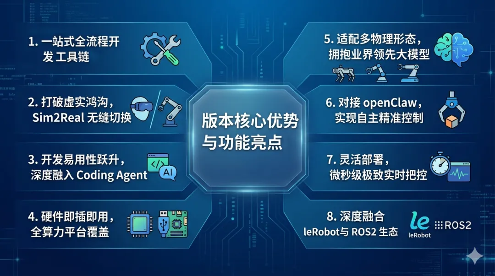

近日，OpenAtom openEuler（简称“openEuler”或“开源欧拉”）社区正式发布 openEuler Embedded 26.03 新版本，这一版本的推出将标志着 openEuler 在具身智能领域取得重大进展。

openEuler Embedded 26.03 版本基于 openEuler 社区 Intelligence BooM 开源全栈，成功孵化了IB-Robot 具身智能机器人软件全栈项目。**这一重大集成，不仅丰富了 openEuler 社区的生态系统，还标志着 openEuler Embedded 26.03 将正式成为 openEuler 社区首个开箱即用的具身智能 OS 版本，为广大开发者和行业伙伴提供从底层硬件到上层算法的全链路端到端解决方案。** 

## 版本核心优势与功能亮点

### 1.一站式全流程开发工具链

 为大幅降低具身智能的开发门槛，新版本提供了一站式全流程工具链，全面覆盖环境搭建、仿真调试、数据录制、一键部署以及可视化运维，让开发者能够专注于算法创新与业务逻辑。

### 2. 打破虚实鸿沟，Sim2Real 无缝切换

 在具身智能特别是模仿学习的研发中，跨越仿真与真实物理世界的鸿沟、解决算法泛化难题一直是核心痛点。IB-Robot 架构原生支持 mujoco、gazebo 等主流仿真工具，确保开发者在仿真环境中训练与验证的策略代码，能够直接在仿真环境与真实机器人之间进行无缝切换运行，极大提升了研发效率。

### 3. 开发易用性跃升，深度融入 Coding Agent

 系统提供了编译、运行、代码提交及 review 等丰富 skill，并深度融入了 coding agent 能力，构建起完善的 harness engineering 体系。通过智能化的开发辅助，代码管理与策略迭代的体验得到了跨越式提升。

### 4. 硬件即插即用，全算力平台覆盖

 在南向硬件生态方面，新版本预装了主流的电机、相机、激光雷达、语音等传感器与执行器驱动。无论是高算力的中央控制器，还是资源受限的中低算力边缘平台，均能实现真正的“南向即插即用”与完美兼容。

### 5. 适配多物理形态，拥抱业界领先大模型

 系统全面适配机械单双臂、四足机器狗、AGV 小车等多种复杂机器人场景。同时支持 ACT、Pi0.5、gr00t 等业界领先的大模型，从容应对搬运、多机协作等极具挑战的真实任务场景。

### 6. 对接 openClaw，实现自主精准控制

 新版本原生对接并支持 openClaw，打造面向智能机器人的具身claw，进一步完善了机器人末端执行器的精准把控，大幅增强了机器人的自主控制逻辑与操作能力。

### 7. 灵活部署，微秒级极致实时把控

 针对工业控制与协作机器人对实时性的严苛要求，系统提供了多种形式的灵活部署方案。在实时控制场景下，可实现微秒级（μs）的极致响应时延，确保机器人动作的顺滑与精准。

### 8. 深度融合 leRobot 与 ROS2 生态

 系统并非孤岛，而是深度融合了 leRobot 及广泛的 ROS/ROS2 开源生态，支持底层互联通信。海量的开源机器人资产、节点与算法包能够快速迁移并融入 openEuler Embedded 的操作系统底座中，助力开发者快速搭建扩展能力。

此次openEuler Embedded 26.03 新版本的发布，将是一次面向具身智能时代的全面进化。通过内置孵化的 IB-Robot 软件全栈，它以极简的开发体验、强大的跨环境迁移能力和繁荣的软硬件生态，为机器人前沿算法研究与商业落地提供了一个真正开箱即用的智能底座。

## 获取代码与探索更多：

欢迎广大开发者访问 IB-Robot 项目官方代码仓，下载体验、了解最新动态并参与开源共建！

🔹IB-Robot 代码仓：<https://gitcode.com/openeuler/IB_Robot.git>

🔹IB-Robot 说明文档链接：<https://pages.openeuler.openatom.cn/embedded/docs/build/html/master/features/embodied_ai/ib_robot.html>

🔹版本归档路径：<https://repo.openeuler.org/openEuler-Embedded-26.03/embedded_img>

🔹开发小组：sig-embedded、sig-ROS

🔹交流社区：<https://www.openeuler.openatom.cn/zh/sig/sig-embedded>

