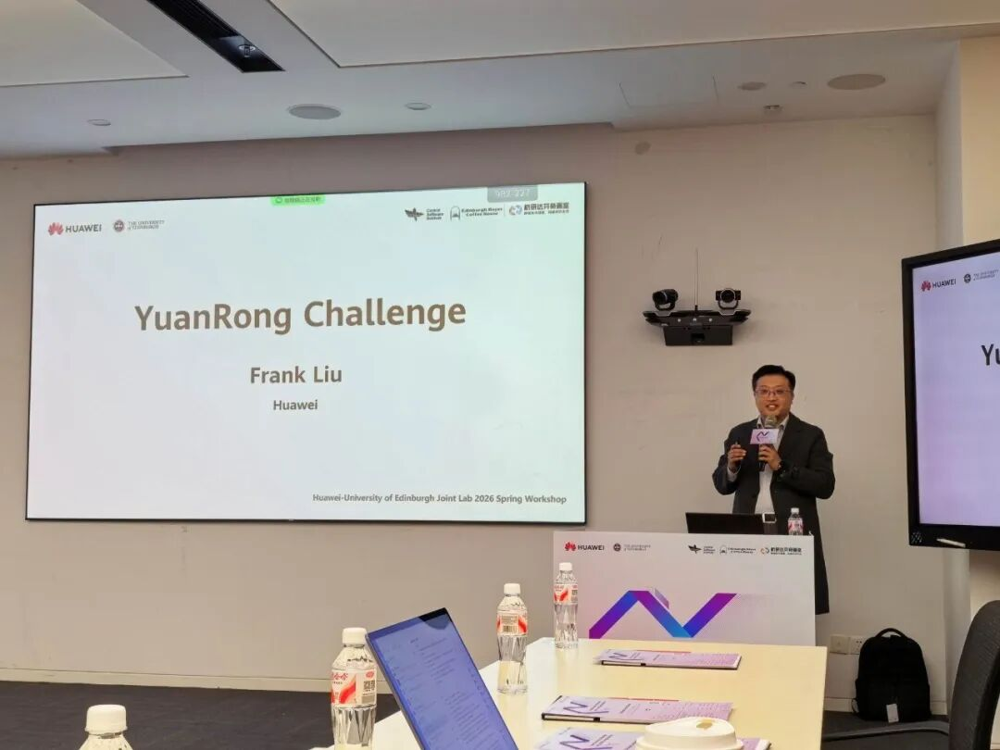
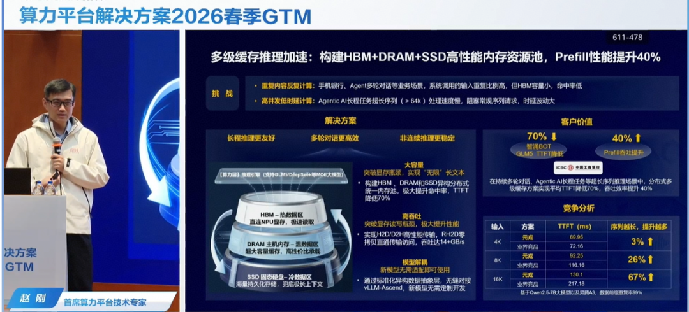
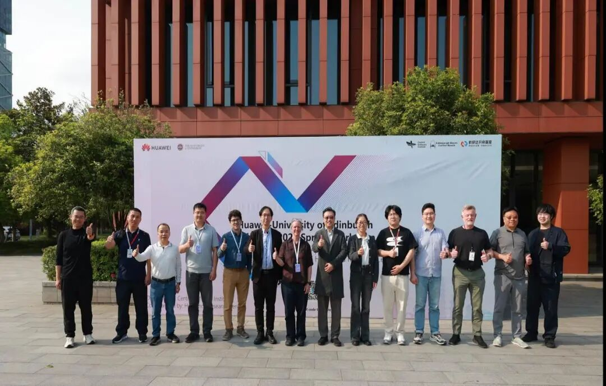

2026 年 4 月 9 日 14:00，华为 - 爱丁堡大学联合实验室（Huawei-University of Edinburgh Joint Lab）2026 Spring Workshop 分布式计算论坛（Distributed Computing Forum）顺利召开。来自华为分布式并行计算实验室的 Frank Liu 在论坛上分享了开源项目 openYuanrong 的最新进展。

## openYuanrong 最新进展

openYuanrong于 2025年底在 OpenAtom openEuler（简称“openEuler”或“开源欧拉”）社区正式开源，标志着项目从华为内部走向开放生态。进入 2026 年，openYuanrong 在技术落地和生态建设方面持续取得突破。

3 月 20 日，在华为伙伴大会上，华为昇腾计算总裁张迪煊重点介绍了基于 openYuanrong 实现的异步流式数据引擎 TransferQueue，在超节点上实现数据传输效率提升 3～4 倍，RL 端到端性能提升 40%。紧接着在 3 月 29 日，分布式 KV Cache 多级缓存推理加速技术落地工行，并在算力平台春季GTM上发布，标志着 openYuanrong 在金融核心场景的商业化应用取得重要进展。

本次研讨会上，Frank Liu 进一步展示了 openYuanrong 在 AI 场景的核心成果：大模型推理实例秒级启动，分布式KV Cache访问性能提升1倍以上；强化学习训推任务调度端到端时延减半，训推转换参数同步时延从分钟级缩短至秒级。

### 核心设计理念:

openYuanrong 的设计哲学是"单机编程，分布式执行"——类比操作系统内核，让开发者像编写单机程序一样构建分布式应用，支持 Python、Java、C++ 等多语言，大幅降低分布式开发门槛。

### 三大核心组件:

- **1.多语言函数运行时：** 支持无状态和有状态函数，仅需少量修改即可实现自动化分布式并行化。

- **2.大规模分布式调度系统：** 采用分层调度架构，支持 gang、range、affinity、拓扑感知等丰富调度策略，实现秒级弹性伸缩与跨节点迁移。

- **3.高性能分布式共享内存：** 提供 K/V 与 Stream 双重语义，结合多级缓存机制，针对内存语义网络优化。

## 未来规划
openYuanrong 将继续演进，聚焦以下方向：Agentic AI/RL：构建高可靠、高性能的 Serverless 智能体基础设施，探索多智能体强化学习。SuperPoD affinity：利用新硬件特性优化调度与缓存性能。开源共建：欢迎全球开发者加入社区，共同构建云原生未来。

[1] 官网地址：
<http://docs.openyuanrong.org/>

[2] 源码地址：
<https://atomgit.com/openeuler/yuanrong>

[3] 技术论文：
<https://dl.acm.org/doi/10.1145/3651890.3672216>

[4] 问题反馈：
<https://atomgit.com/openeuler/yuanrong/issues>

欢迎添加 openYuanrong 小助手微信，由小助手拉您进我们的官方群获得最新资讯~

