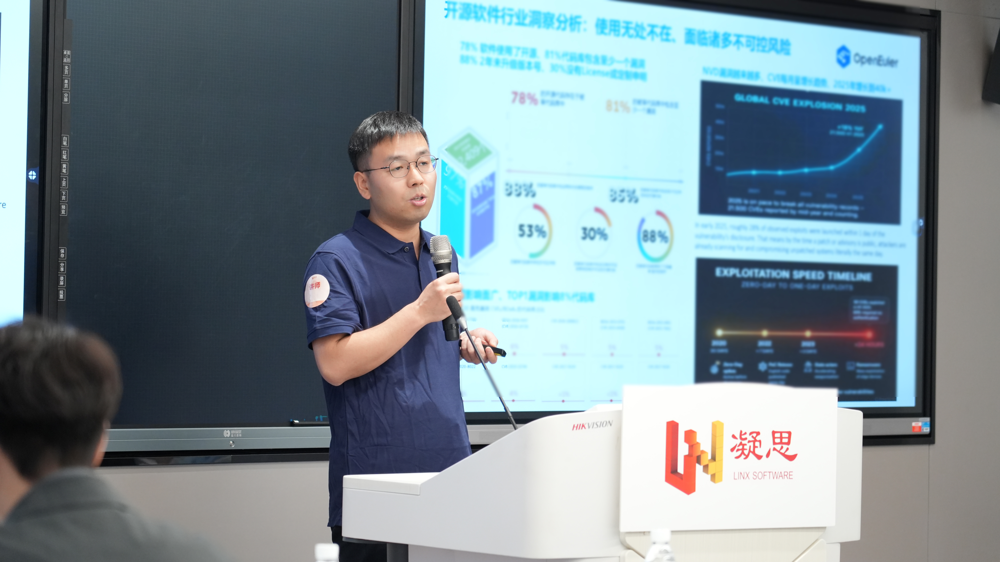
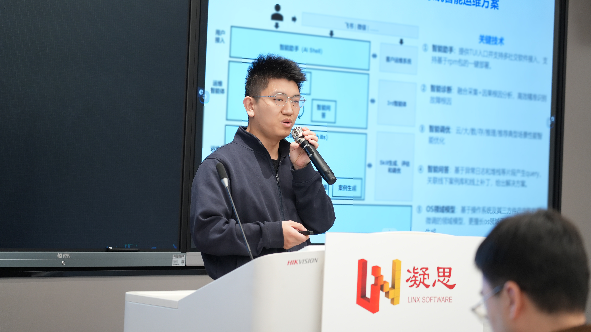
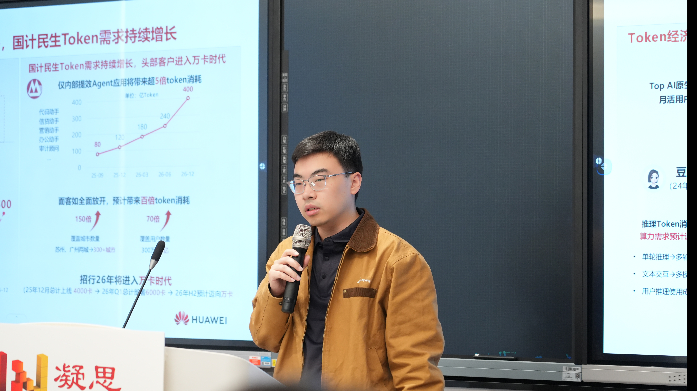
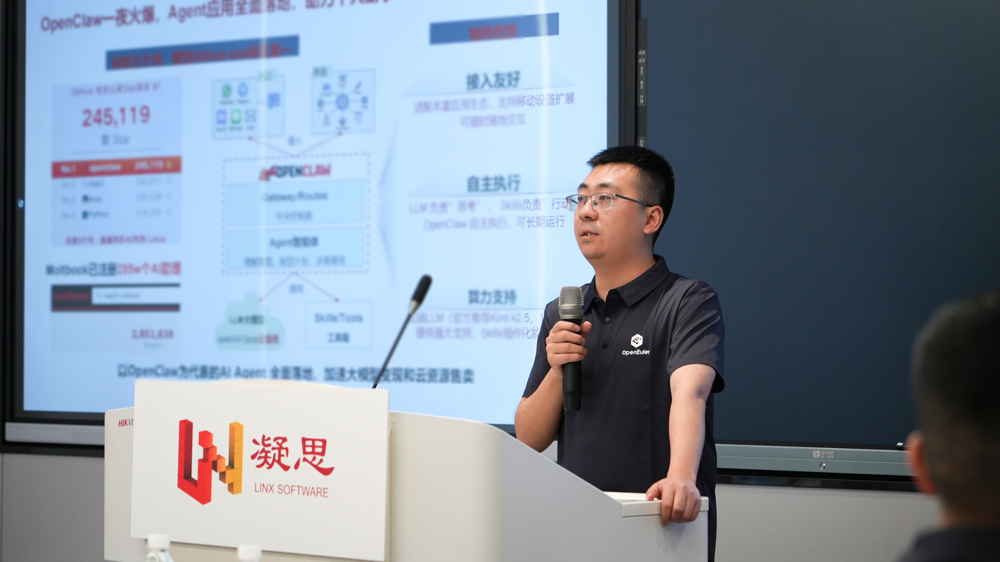
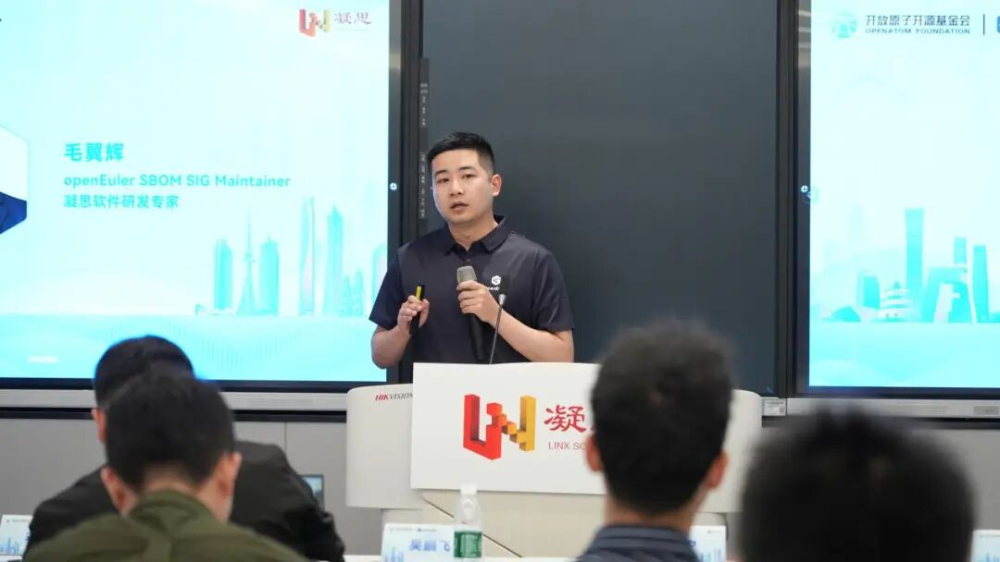
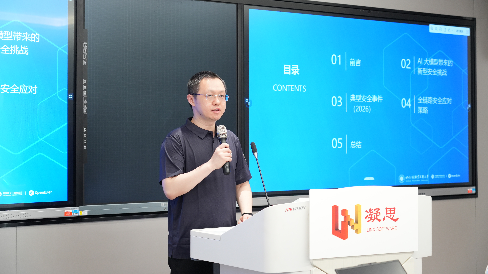

春和景明，聚力同行。4月17日，由OpenAtom openEuler（简称 “openEuler” 或 “开源欧拉”）社区与北京凝思软件股份有限公司（以下简“凝思软件”）联合举办的openEuler SBOM & IntelligenceSIG Meetup在成都凝思软件西南总部大楼圆满举办。本次活动以“筑牢供应链安全防线，赋能数字化智能升级”为核心，汇聚产业界、学术界多方力量，共探软件供应链安全的破局之路，为行业构建可信、透明、可追溯的软件供应链体系提供实践参考与技术指引。

## openEuler SBOM 工程能力实践：面向 XBOM 与 AI 演进之路

华为软件工程技术专家吴鹏飞围绕开源供应链安全痛点展开分享，结合 Log4j、XZ Utils 等典型事件，强调软件成分追溯的重要性。他详细介绍 openEuler SBOM 在多语言依赖解析、漏洞与 License 合规分析、正反向依赖追溯等方面的工程化能力，并展示社区落地实践效果。同时展望 SBOM 向 XBOM 扩展，结合 AI 实现自动化漏洞分析与后量子密码安全治理，为生态伙伴提供全栈安全使能方案。

## OS 智能治理利器 ——Witty 智能运维套件

openEuler SlG Intelligence Maintainer何守成带来 Witty 智能运维套件主题分享，该套件面向操作系统打造精准高效、全栈最优的智能运维方案。核心涵盖智能诊断、智能问答、智能调优、Skill 自动生成与评估调优等能力，通过日志异常检测、RAG 检索增强、OS 领域模型微调等关键技术，实现故障快速根因定位、智能问答解决方案输出与自动化性能优化。实测显示，经 Skill 优化后故障诊断准确率大幅提升，耗时与 Token 消耗显著降低。

从算力到应用：昇腾生态下 AI 一体机实践探索

成都昇腾生态创新中心CTO余明川分享 AI 产业趋势与技术布局，解读大模型长序列、多模态、Agent 化带来的算力与安全挑战。重点介绍昇腾 AI 一体机在推理、强化学习、多模态生成等场景的性能优势，以及 CANN 开源开放、生态兼容与优化能力。结合金融、医疗、政务等行业案例，展示昇腾如何以全栈算力底座支撑 AI 应用安全高效落地，并通过生态激励与赋能体系助力伙伴方案规模化落地。

## 鲲鹏 AI Agent 智能体解决方案：安全高效国产化落地

四川鲲鹏创新中心生态经理谢兵针对 OpenClaw 等 AI Agent 在企业场景的安全与效率痛点，推出基于鲲鹏硬件的全栈解决方案。通过 openViking 记忆系统大幅降低 Token 消耗，依托 Firecracker 沙箱实现毫秒级隔离部署，结合可信计算与机密环境保障数据安全。方案已完成 600 + 工具生态适配，提供标准化一体机镜像与部署路径，可在智能客服、知识库、DevOps 等场景快速落地，助力国产化 AI Agent 安全规模化应用。

## AI 时代软件供应链安全实践：SBOM 的工程化路径与落地

openEuler SBOM SlG Maintainer、凝思软件研发专家毛翼辉分享 AI 时代 SBOM 工程化落地路径。他指出，传统 SBOM 已无法覆盖模型、数据集、Agent 等新型物料，需要向扩展 SBOM 演进。演讲提出覆盖对象、来源、关系、生命周期的最小信息模型，并给出开发、构建、发布、运行全流程采集与治理方案，实现全链路溯源、漏洞快速排查、合规审查与运行漂移检测，推动 SBOM 从静态文档转变为持续运营的安全能力。

## AI 大模型时代的软件供应链安全挑战与应对

四川工程职业技术大学软件工程学院郭阳秦博士剖析 AI 带来的供应链新型风险，包括依赖爆炸、中间件攻击、模型投毒、容器逃逸、后门植入等，并结合 LiteLLM 投毒、数据投毒等真实事件说明风险危害。他提出全链路安全应对策略：构建 AI 专用 AIBOM、建立组件安全白名单、遵循最小权限与最小依赖原则、强化运行时隔离与行为监测、完善应急响应机制，为企业构建 AI 时代供应链安全防御体系提供参考。

本次 Meetup 紧密结合关键行业实际应用场景，围绕 AI 时代下软件供应链安全挑战、智能化技术在操作系统及基础软件中的应用、工程实践路径与生态协同机制等议题开展深度研讨交流，为构建 AI 时代软件供应链安全能力体系提供了清晰的技术方向与实践指引。活动有效搭建了产学研用交流合作平台，也为后续上下游资源协同、开源生态共建等工作奠定了坚实基础。

未来，凝思软件将与 openEuler 社区携手，持续深耕 SBOM 工程化落地与安全技术实践，共建可信、可靠的开源生态，为千行百业数字化转型筑牢坚实安全底座。
