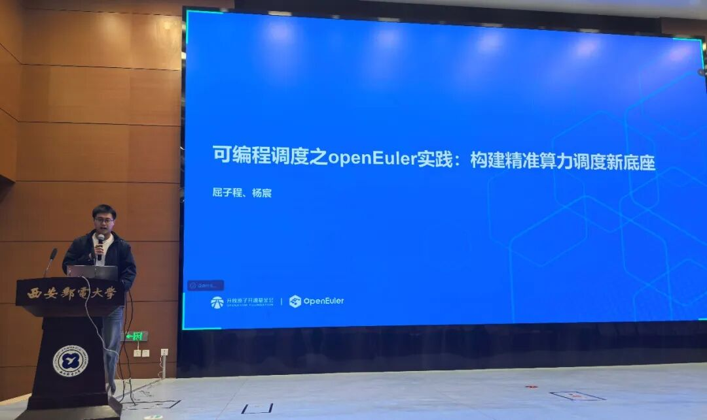
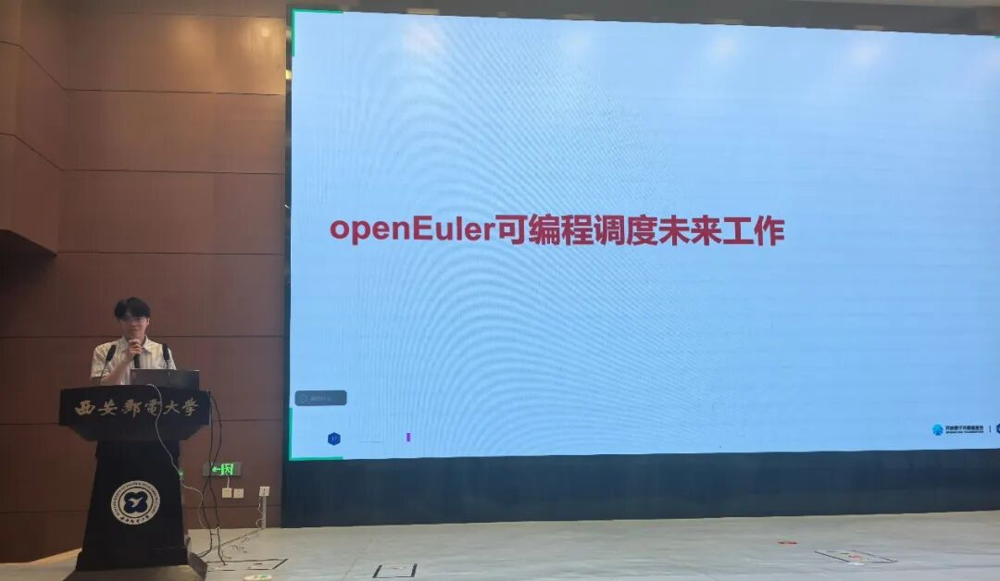
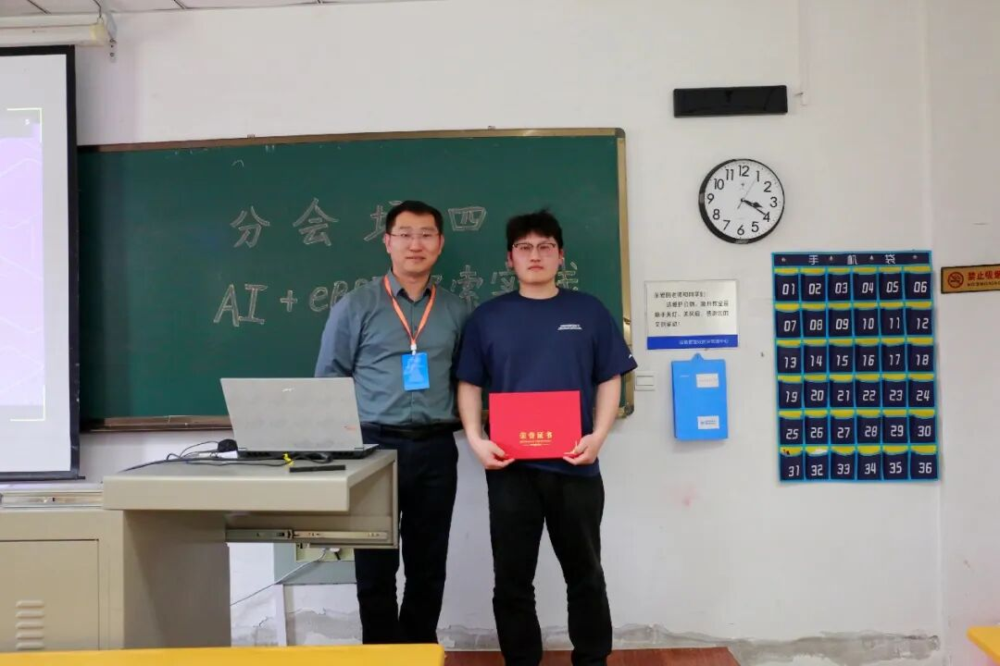
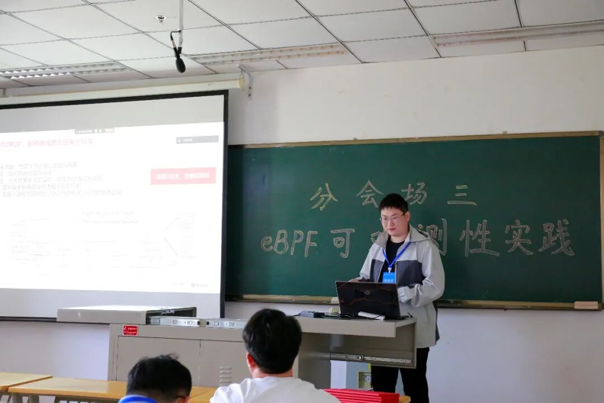
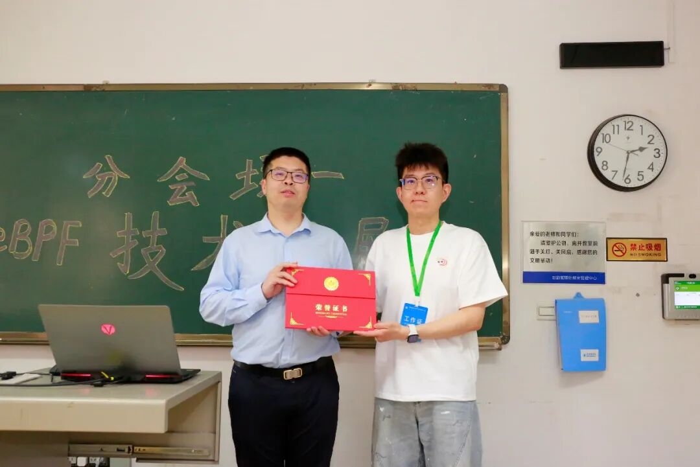
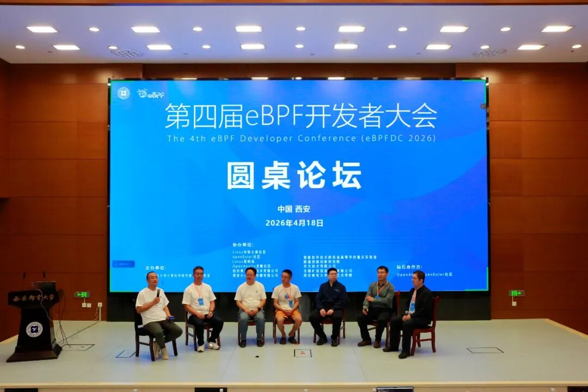

2026 年 4 月 18 日，以“eBPF + AI，重塑系统性能与安全新生态”为主题的第四届 eBPF 开发者大会在西安邮电大学圆满落幕。大会汇聚国内外知名企业与高校技术领袖，围绕 eBPF 与 AI 融合创新展开深度研讨，OpenAtom openEuler （简称 openEuler）社区作为钻石合作方，携多项核心技术成果亮相，全方位展现社区在 eBPF 领域的技术积累与生态共建能力。

本次大会，openEuler 社区多位技术专家带来专题分享，覆盖调度、运维、安全等操作系统核心技术领域，所有相关技术项目均已面向社区开源。

## Keynote主题演讲：可编程调度之 openEuler 实践：构建精准算力编排新底座

社区两位技术专家杨宸、屈子程在主论坛共同带来带来 《可编程调度之 openEuler 实践：构建精准算力编排新底座》主题分享，系统介绍 openEuler 社区在 eBPF 可编程调度领域的全链路实践成果。基于 sched_ext 框架，openEuler 通过动态注入自定义调度策略，搭建起精准算力调度供给底座，有效解决高并发场景下的长尾延迟与优先级反转问题，同时分享了社区在调度器生态共建与未来技术演进的核心思考。

## 分会场技术分享：三大成果落地，赋能 AI 与系统安全

### 1.sysTrace：基于 eBPF 的 AI 全栈性能观测方案

面向 AI 大模型训练与推理场景，openEuler 社区推出基于 eBPF 的sysTrace 全栈性能观测与智能诊断方案。该方案实现算子语义与系统事件纵向数据贯通，常态化监测性能损耗低于 1%，可精准捕捉 CPU 调度、缺页异常、通信抖动等复杂性能瓶颈，将性能问题定位周期从周级缩短至分钟级。

### 2.A-SysArmor在openeuler创新与实践：高可信系统审计框架

东南大学硕士生张涵在报告中分享了openEuler 与北京大学、东南大学等合作的开源项目A-SysArmor。该框架基于 eBPF 技术重构审计处理路径，依托进程级隔离、内嵌式事件处理与可编程分析能力，确保审计日志完整可信，显著减少对业务性能的影响，为 openEuler 提供完善的高可信系统审计支撑。

### 3.控制面可编程策略：重新定义 eBPF 内核能力

本报告由 openEuler Valuable Professional 任玉鑫博士带来，聚焦openEuler 社区在控制面可编程领域的前沿探索。团队以大模型推理启动阶段的模型加载优化为切入点，在 openEuler 内核中设计了非侵入式、灵活轻量的可编程页缓存框架，支持用户自定义文件系统页缓存策略，比原生EXT4有4倍模型加载优化。相关成果已入选CCF A类存储顶会FAST'26。

论文链接：<https://www.usenix.org/conference/fast26/presentation/liu-yubo>

## 圆桌论坛：共探 AIOS 时代 eBPF 核心价值 

在圆桌讨论环节，任玉鑫博士与学界、产业界专家齐聚，共同展望 AI 时代 eBPF 技术发展前景。

与会专家一致认为，未来 AIOS 将成为具备自演进能力的自治系统，依托全系统垂直整合与 AI 代码生成，呈现场景化、个性化的多元发展形态。而 eBPF 凭借可观测性、可编程性、可验证性核心优势，将成为 AIOS 不可或缺的核心技术底座，这与 openEuler 聚焦 AI 时代操作系统创新的发展路径高度契合。

未来，openEuler 社区将持续深耕 eBPF 技术创新，联合产学研各界力量，推动 eBPF 与 AI 深度融合，共建开放、共赢的操作系统技术生态，为 AI 时代算力基础设施提供坚实支撑。

