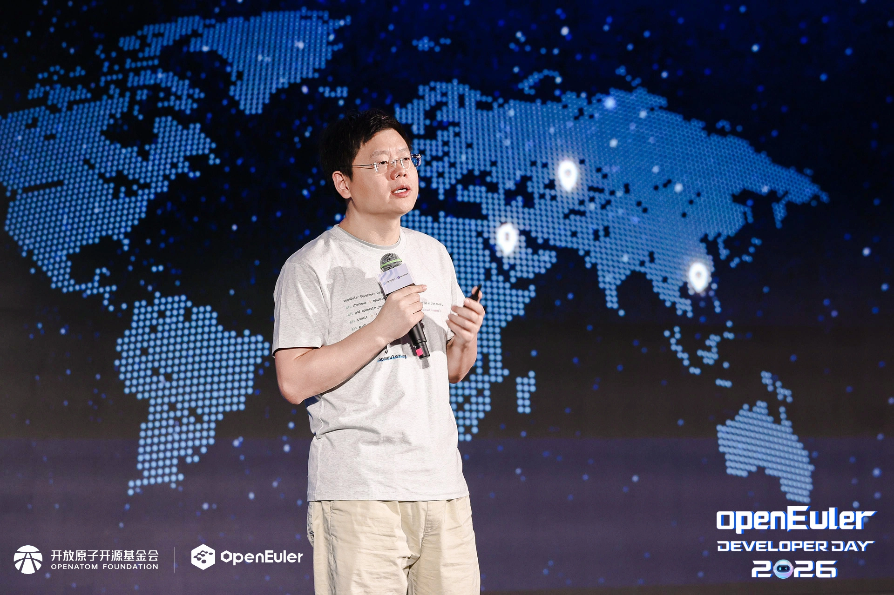
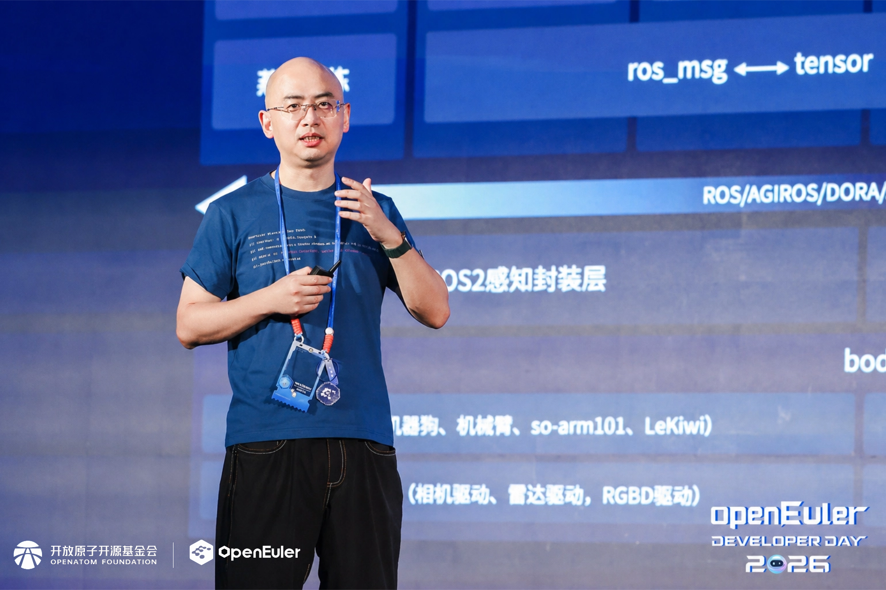

openEuler Developer Day 2026（以下简称本次大会）于2026年4月25日在长沙成功举办。本次大会由OpenAtom openEuler（简称“openEuler”或“开源欧拉”）社区发起，450多名社区技术专家、开发者、贡献者及生态合作伙伴齐聚现场，围绕操作系统在AI时代面临的新需求、新场景与新机遇，深入探讨技术创新、技术演进与生态协同。

开放原子开源基金会秘书长助理李博在欢迎辞中表示，作为基金会重点培育的明星毕业项目，基金会为开源欧拉提供全周期、体系化的支撑与保障，全方位支持社区品牌推广、产权合规、资金募集、社区治理等工作，全力护航开源欧拉的繁荣与可持续发展。在基金会的全面赋能与倾力培育下，开源欧拉社区凝聚各成员单位、共建伙伴及生态参与各方的力量，实现跨越式发展。面向未来，基金会始终秉持以开发者为中心的理念，坚守中立开放、平等共治的治理准则，为开发者倾力打造公平透明、开放包容的协作平台，让大家平等参与、共建共享、共同成长，共同推动开源欧拉高质量发展。

▲开放原子开源基金会秘书长助理李博致辞

开放原子开源欧拉委员会执行总监刘飞发表《云开天地阔，再赴新智程》主题演讲，回顾社区六年的蓬勃发展：2100+家单位成员加入，2025年新增海光信息、AMD、浪潮云、神州数码4家捐赠人；18所高校联合成立学术与教育委员会。2025年，openEuler系操作系统累计装机量超过1600万套，市场份额达到57.3%，成为中国数字基础设施的中流砥柱。社区活跃度持续提升，开发者与用户数量显著增长。技术创新驱动发展，openEuler基础设施持续基于AI升级，使开发效率大幅提升。 未来，openEuler将聚焦AI与全球化两大战略：南向适配超节点等异构硬件，北向构建Agent全新架构；同时持续拓展亚太、中东等全球市场，让openEuler走向世界。

▲开放原子开源欧拉委员会执行总监刘飞发表主题演讲

开放原子开源欧拉技术委员会主席胡欣蔚发表《openEuler技术前沿与展望》主题演讲。他从超节点OS，具身智能、开发者工具升级，再到当下最关心的 Agent 落地企业应用挑战，全方面介绍了openEuler的最新技术进展。openEuler面向超节点实现从硬件管理到AI算力编排的跨越，在易用性、可靠性和低时延方面持续提升；openEuler Embedded 26.03创新版本基于Intelligence BooM孵化IB-Robot具身智能机器人软件全栈，发布社区首个开箱即用的EmbodiedClaw；DevStation开发者工作站创新版让AI软件随时可更新；社区基础设施持续更新，对开发者和Agent都更友好。尤其值得关注的是，openEuler开始向AgentOS演进，尝试通过AI技术与系统能力的深度融合，分层打造开箱易用、安全可信、Token高效的Agent时代生产级操作系统；既包含openEuler系统智能中枢，也支持JiuwenClaw等Agent的接入。

▲开放原子开源欧拉技术委员会主席胡欣蔚发表主题演讲

现场Demo演示全面展示了openEuler AgentOS四大核心能力：一是智慧中枢系统，支持Polymind图形界面和TUI终端等多模态交互，快速集成社区专业级技能模块，长任务运行内存占用低，尽显轻量级优势；二是全链路安全防护，依托行为分析与eBPF监控构建主动防御网络；三是Conch沙箱引擎，采用快照技术实现百毫秒级启动，为智能体提供强隔离执行环境；四是极致Token能效优化，基于开源推理栈一键集成X-LITE、LMCache等加速组件，TTFT和TPOT提升20%-30%。四大演示全方位展现了AgentOS安全、高效、开放的核心价值，助力企业开启智能化新纪元。

▲现场Demo演示

## SIG Gathering

大会期间，来自109个SIG的450+名开发者聚焦openEuler社区重要规划，SIG Gathering 环节围绕八大技术方向展开深入讨论，包括 Kernel&基础服务 、AI生态支持&技术创新 、超节点技术创新 、具身智能&嵌入式 、AI时代高效开发与生态包管理 、全场景&Agent Infra 、RISC-V 、AI使能安全与漏洞处理。这些专题研讨汇聚不同 SIG 的维护者、贡献者、开发者与伙伴，共同展开更深入的交流，旨在解决技术难题，推动 openEuler 在更多领域的应用。

**Kernel&基础服务专题**

聚焦openEuler内核及周边基础库，围绕关键业务低延迟调度、基于Profile的负载感知优化、容器级分域调度隔离、高性能内存分配、USB子系统容错恢复及高可靠弹性集群协议等方向进行探讨，全面展示从调度、内存、存储到I/O子系统的深度内核技术创新与工程实践。

**AI生态支持&技术创新专题**

聚焦AI 生态工具的适配集成与 AI Infra 技术创新两大主线，探讨内容涵盖XPU异构推理、AArch64 SVE指令集编译、FusionBoost加速套件、xlite轻量运行时、UCM KV Cache管理、超低带宽视频编解码、AgentOS、大模型训推运维等技术方案，全面展现从底层算力优化到上层智能应用的全栈创新生态。

**超节点技术创新专题**

聚焦超节点场景硬件使能、中间件与应用创新，围绕内存统一编址、设备池化管理、异构资源融合、全局资源视图等技术特点进行分享，全面展示从硬件互联、系统软件到应用开发的全链路超节点技术创新。

**具身智能&嵌入式专题**

面向新型工业自动化与具身智能场景，聚焦嵌入式核心技术（MICA、UniProton、嵌入式虚拟化）的演进，议题探讨涵盖基于openEuler的卫星数智基座构建、实时OS虚拟化、具身智能OS、嵌入式Agent自动维护及星云原生星座框架，全面展示openEuler Embedded实时性与智能化融合的技术创新。

**AI时代高效开发与生态包管理专题**

聚焦AI时代开源社区基础设施与开发者体验进行讨论，议题展示AI技术如何深度赋能开源社区：从在CI流程中添加AI review辅助内核审查、MCP协议打破信息孤岛，到AI Agent实现多语言spec自动生成与漏洞深度分析，全面推动社区开发效率与质量的双重跃升。

**全场景&Agent Infra专题**

聚焦openEuler在云原生、大数据、数据库等领域的技术创新与生态和AI Agent时代的安全沙箱等技术创新。议题涵盖智能运维、原生OS交互、多Agent协作在IT服务中的实践、容器安全底座、故障智能诊断及Agentic沙箱六大方向。全面呈现Agent技术在运维效率、系统安全与交互体验上的深度创新实践。

**RISC-V 专题**

聚焦RISC-V架构与openEuler深度融合，涵盖操作系统内核维护、openEuler生态下的混合关键性系统、芯片验证加速、RISC-V内核生态共建、I/O虚拟化及服务器标准化等核心方向。议题展现了openEuler在RISC-V服务器领域的最新进展：从RVA23规范适配、6.6内核长期维护方案，到混合关键性系统解决方案。

**AI使能安全与漏洞处理专题**

聚焦AI赋能操作系统安全与漏洞治理，涵盖智能体原生操作系统安全能力探索、AI 技术在漏洞分析与修复中的应用、跨版本修复自动化、基于AI的CVE 修复的工具链及基于多Agent的智能防御主动预警等。全面呈现AI技术在漏洞挖掘、修复效率提升及安全治理智能化方面的深度创新实践。

## 开发者体验

大会期间，开发者体验区成为现场备受关注的技术展示区域之一。体验区重点展示了 openEuler 在 AI 技术、操作系统能力、开发工具以及开源生态建设方面的最新进展，吸引了众多开发者。

**➢DemoShow Case**

15+技术创新Demo全天展示，现场展示灵渠机器人、两轮自平衡小车、机械臂实景操控演示。

**➢AI Workshop**

围绕DevStation、Witty、AIDFS存储、AgentOS、Inteligence BooM等主题打造的深度技术实操工坊，手把手解锁核心应用!

**➢Poster session**

10+技术创新Poster，深度展示openEuler技术细节，Poster作者也在现场与开发者面对面交流。

openEuler Developer Day 2026 不仅是一次技术盛会，更是 openEuler 社区生态建设的重要里程碑。通过展示最新技术成果、分享行业实践经验和推动社区协作，为全球开发者和企业提供更加坚实的技术基础和创新动力。未来，openEuler 将继续与开发者携手，共同构建更加开放、创新的开源生态。