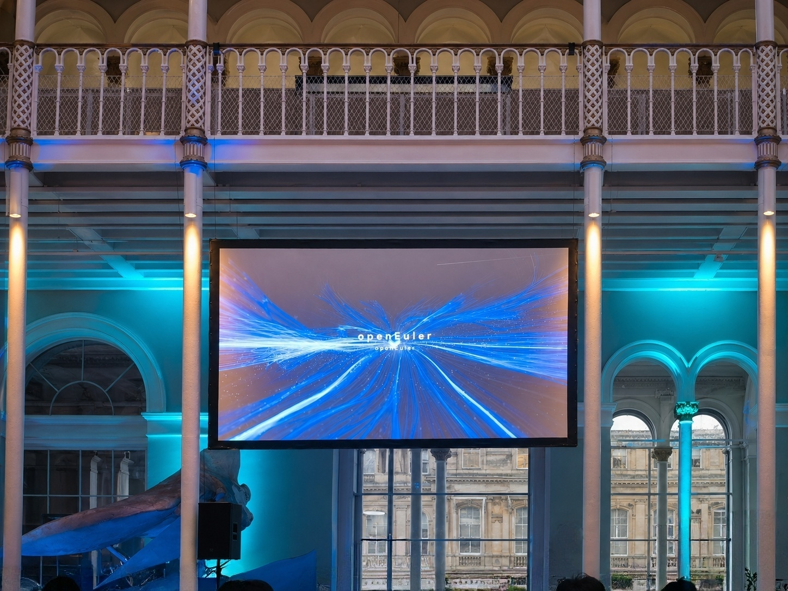
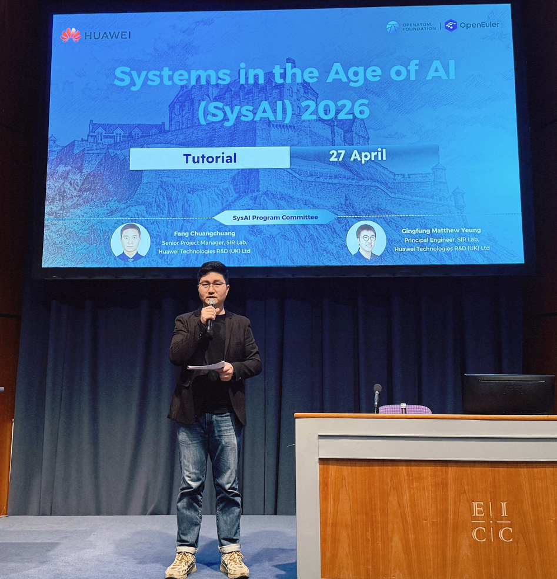
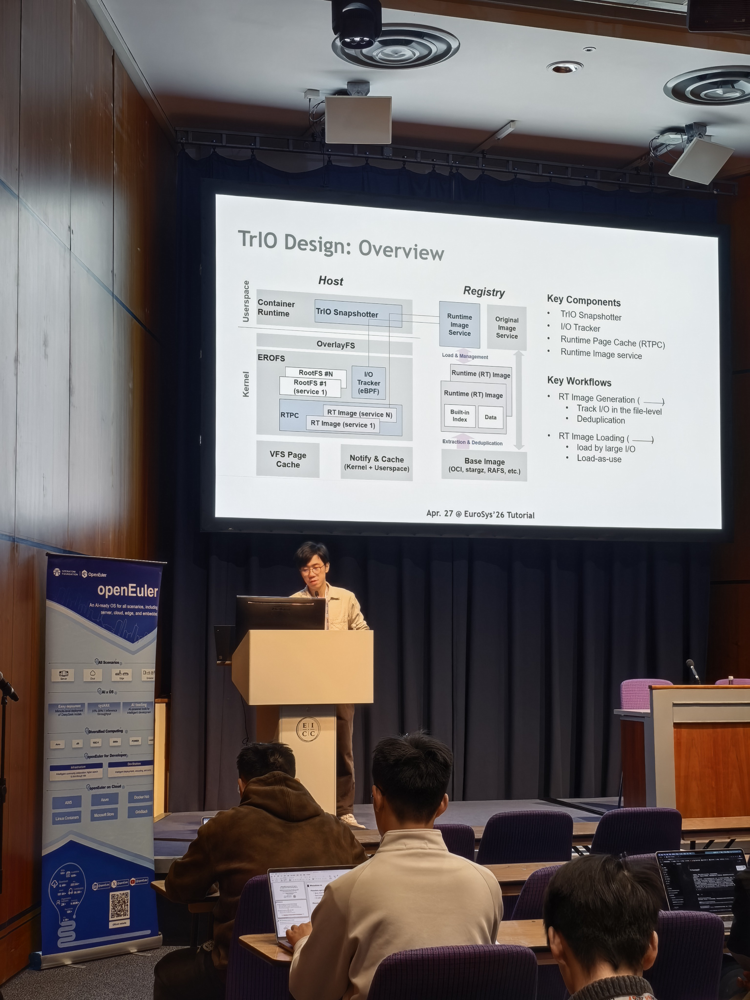
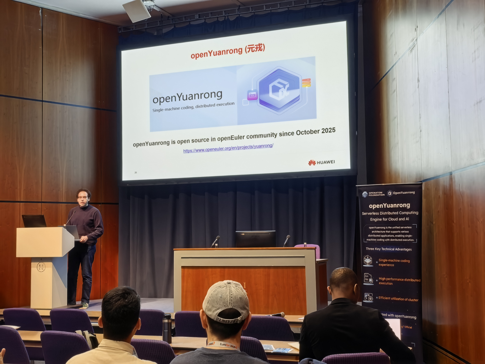
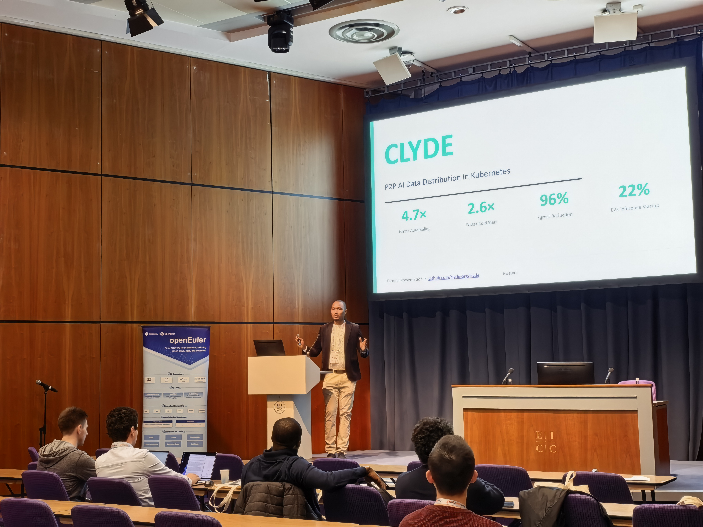
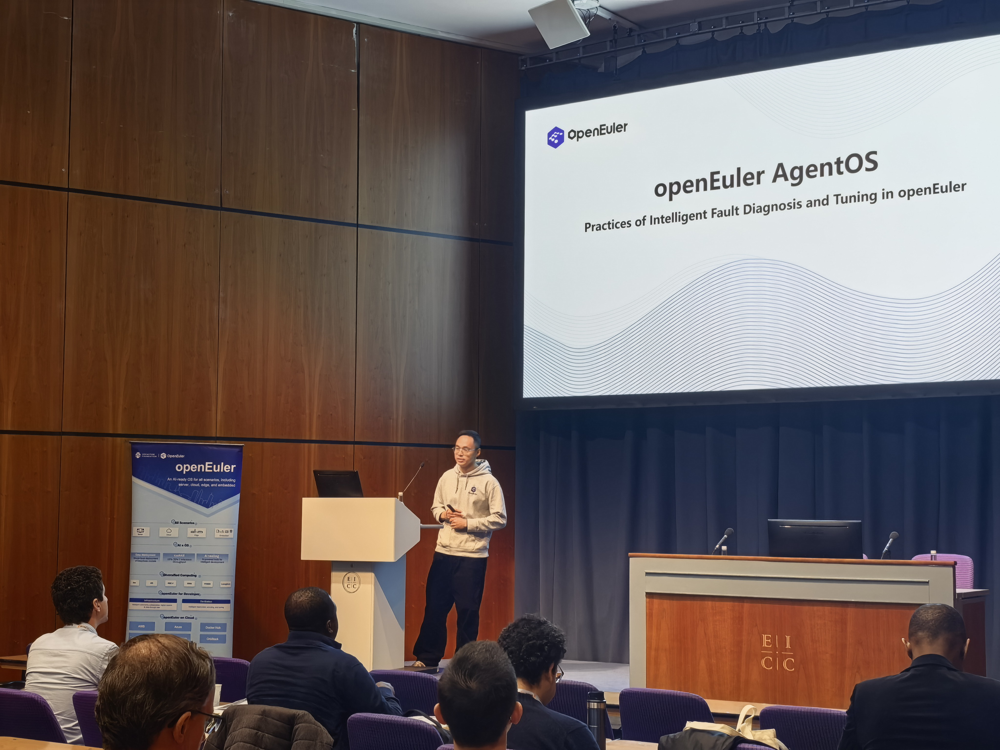
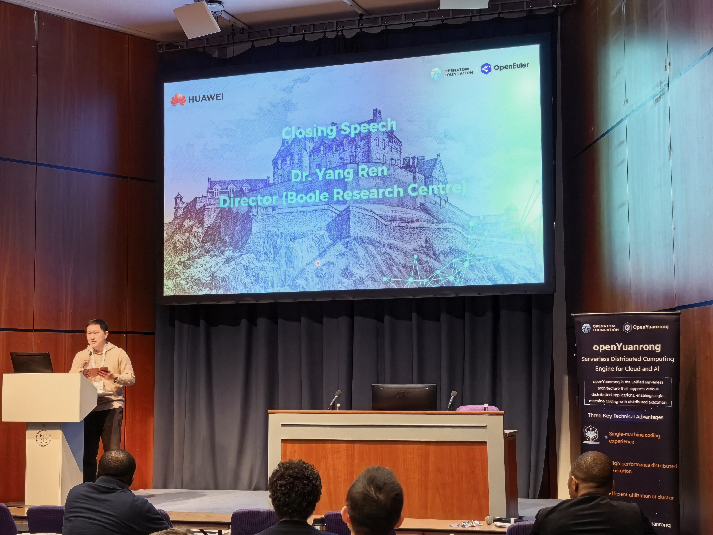
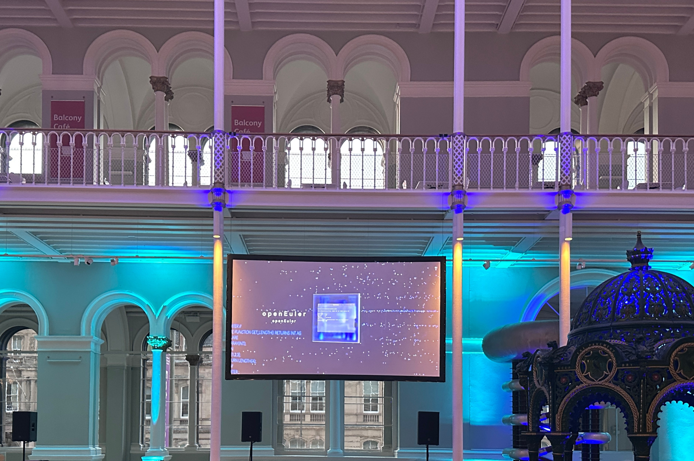
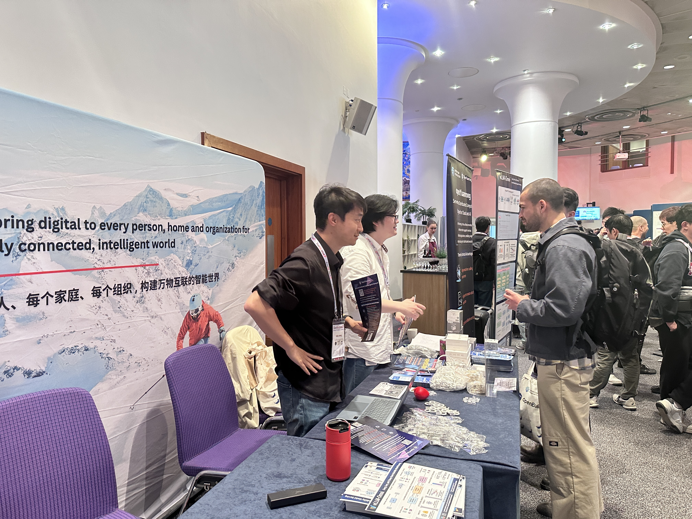

2026年4月27日至30日，国际系统领域顶级学术会议EuroSys在英国爱丁堡隆重举行。作为系统软件领域最具影响力的国际学术盛会之一，EuroSys汇聚了来自世界各地的顶尖学者与科技企业，共同探讨操作系统与基础软件的前沿趋势。

OpenAtom openEuler（简称“openEuler”或“开源欧拉”）携分布式Serverless计算引擎openYuanrong深度参与此次盛会，通过Tutorial技术分享、官方晚宴与专属展台等实现多维度、多层次生态联动，现场反响热烈，实现了欧洲开源生态影响力的厚积薄发。

## 精彩回顾

### Tutorial专场：openEuler走上国际学术讲台

4月27日，openEuler与华为联合开展的“SysAI”Tutorial专场精彩开幕，活动围绕“Systems in the Age of AI”主题，系统性地展示了openEuler在AI时代的创新探索，吸引近50位学术研究者注册参与，现场互动踊跃。

华为爱丁堡研究所高级项目经理房闯闯为本次主题活动开场，并简要介绍整体活动流程。

本次Tutorial围绕两大主线展开，共包括4个主题Session：

#### 主线一：System Operations and Optimization Acceleration in the AI Era

openEuler社区内核文件系统专家刘育擘，围绕容器镜像加载的I/O瓶颈，提出TrIO技术，通过扁平化数据路径与运行时页缓存机制大幅降低冷启动延迟。

华为专家Dr. Mohamed Kassem，以Serverless架构为基础，展示了openYuanrong作为智算时代Serverless AI引擎的弹性调度能力，以及AI应用提供的开箱即用的执行环境。

#### 主线二：System and Distributed Scheduling Solutions for AI Workloads

openEuler社区云原生专家Dr. Sheriffo Ceesay，展示了研究团队基于openEuler开发的数据传输加速引擎Clyde。该引擎针对云原生场景提出点对点数据加速方案，有效提升大规模集群下的数据吞吐效率。

openEuler社区专家卢景晓，展示了openEuler AgentOS如何将大语言模型引入操作系统生态，探索AI驱动的自主诊断与智能管理新范式，引发与会者的广泛兴趣与热烈讨论。

最后，华为爱丁堡研究所所长任阳对本次Tutorial进行总结致辞。

他指出，AI负载的大规模、复杂化与实时化趋势，正在推动系统软件从内核、运行时到分布式系统进行全栈演进。AI时代的系统创新不能停留在单点优化，而需要内核机制、运行时系统、分布式调度、数据加速与智能运维等能力的跨层协同。

未来，华为爱丁堡研究所将继续依托openEuler等开放平台，连接全球学术创新、开源社区与产业实践，共同推动AI时代开源基础软件生态发展。

### 官方晚宴：钻石光芒，助力openEuler点亮欧洲开源视野

4月28日，EuroSys 2026官方晚宴在苏格兰国立博物馆隆重举行，现场汇聚了500余位来自全球系统领域的顶尖学者、工程师与产业专家。作为本届大会钻石级赞助商，华为依托高规格赞助权益，在官方晚宴现场获得重要品牌展示资源。

为助力社区生态出海全球，华为作为openEuler关键社区成员，在全场主屏循环展播了openEuler的品牌生态宣传视频，集中呈现了openEuler面向AI操作系统领域的创新实践与全球开源生态愿景。

通过这一高关注度场景，openEuler的技术理念与生态影响力生动展示在全球系统领域核心人群面前，进一步提升了openEuler在国际顶级系统学术与产业社区中的品牌认知度。

### 展台交流：欧拉筑基，元戎破浪，基础软件开源生态在欧洲绽放新篇

大会期间，openEuler & openYuanrong展台成为会场内最受欢迎的展示区域之一，吸引了众多开发者、高校研究人员及企业代表驻足交流。

展台集中呈现了openEuler在操作系统创新、产业应用与开源生态建设方面的最新进展，并展示了社区技术演进、生态合作成果及面向AI时代的基础软件能力。活动现场同步发放openEuler专属技术刊物，内容涵盖社区最新技术动态与生态建设成果，受到与会者广泛关注，诸多产学研专家围绕相关技术议题展开深入交流。

openYuanrong也在本次EuroSys 2026迎来欧洲首秀。openYuanrong围绕异构资源调度、分布式执行与AI基础设施支撑能力进行了重点呈现，获得了多位学者与工程师的关注与积极反馈，现场技术探讨持续升温。

## 总结展望

此次亮相EuroSys 2026，openEuler生态在英国爱丁堡取得了显著成果，进一步拓展了其在欧洲系统领域学术界的影响力。

大会期间，Tutorial平均每场吸引约30余位研究者参与交流；openEuler展台也成为会场内重要的技术交流窗口，吸引了来自海内外高校教授及博士生群体在内的40余位与会者加入社区交流群，持续开展深度互动。多位开发者、学者与顶尖高校学生主动留下联系邮箱，表达后续交流与合作意向，标志着openEuler国际学术“朋友圈”实现了又一次实质性扩展。

社媒与开源社区的数据同样令人振奋：openEuler各类社媒，包括YouTube/LinkedIn/X等平台，新增关注累计突破1000+；openYuanrong社区自Tutorial首秀以来，Star数在一天内突破百位，充分体现出国际开源社区对openYuanrong的关注与兴趣。

面向未来，openEuler将持续深化国际开源生态建设，携手全球开发者、学术伙伴与产业力量，共同推动AI时代开源操作系统与基础软件生态的创新发展，书写面向全球的开源新篇章。