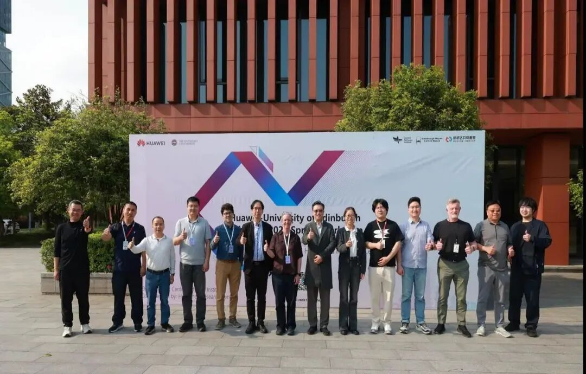
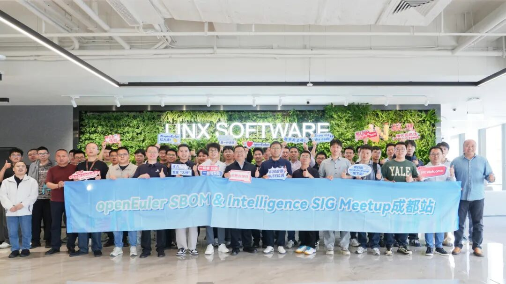
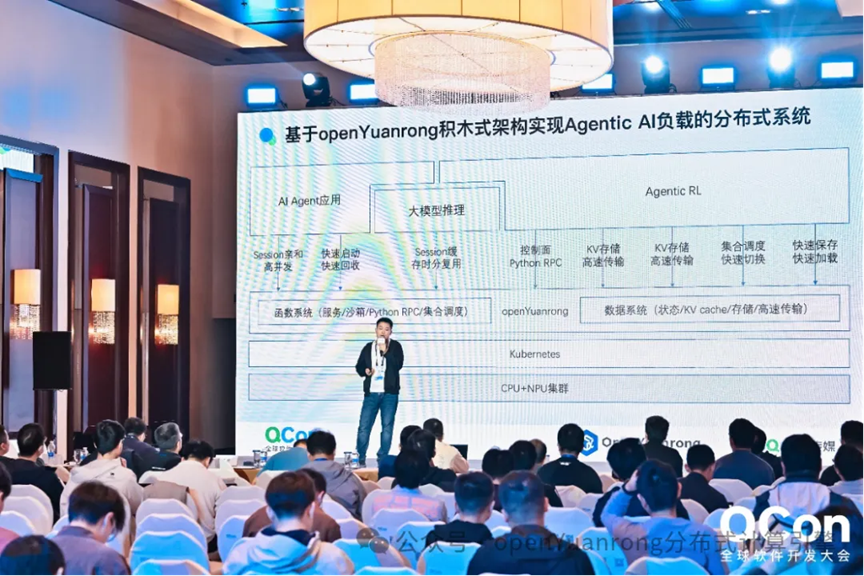
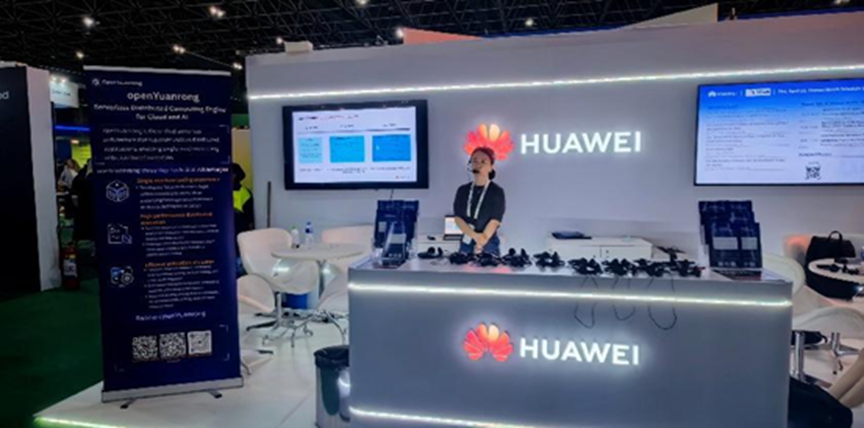
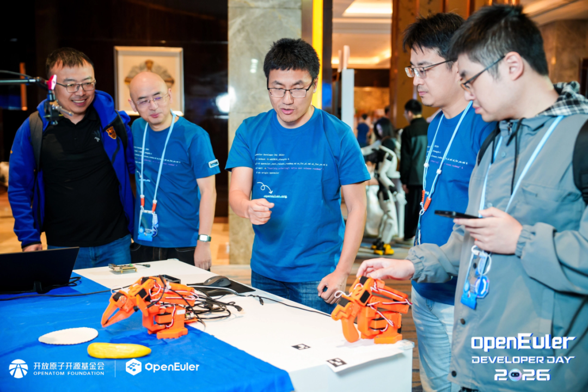
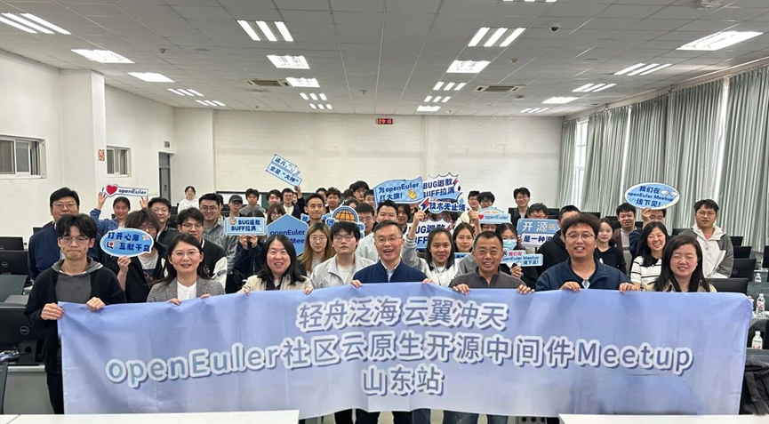

## 概述

2026 年 4 月，OpenAtom openEuler（简称 “openEuler” 或 “开源欧拉”）社区在稳步发展的基础上，持续推进技术演进与生态建设协同发力。社区规模与活跃度持续增长，截至4月底，用户、开发者及单位成员数量稳步提升，社区贡献持续积累。

在社区运营与生态建设方面，4月成功举办openEuler Developer Day 2026，大会吸引 450 多名社区技术专家、开发者及生态合作伙伴参会，围绕操作系统创新与 AI 场景应用展开深入交流，进一步凝聚社区共识并推动生态协作。同时， openYuanrong 项目亮相 QCon、ICLR 、EuroSys等全球性论坛，持续扩大国际开源影响力。

在技术方面，openEuler Embedded 26.03版本正式发布，成为 openEuler 社区首个开箱即用的具身智能 OS 版本；openYuanrong 项目在大模型推理、分布式 KV Cache 性能优化等方面实现突破；智能运维 Agent 与日志分析能力持续增强，为社区构建高效、安全的软件基础能力; infrastructure SIG 推出的 CVE 智能修复agent team，大幅缩短漏洞修复周期。

整体来看，openEuler 社区正以“技术创新+生态共建”双轮驱动为核心，持续夯实开源操作系统生态基础，稳步推动社区向高质量发展迈进。

（本月报阅读时长约12分钟）

## 社区规模

截至2026年4月30日，openEuler 社区用户累计超过698万。超过2.7万名开发者在社区持续贡献。社区累计产生 275.4K个PR、142.9K条Issues、4901.1K条Comment。目前，加入openEuler社区的单位成员2148家。

社区贡献看板（截至2026/04/30）

## 社区事件

### ➣openEuler Developer Day 2026成功举办

4月25日，openEuler Developer Day 2026在长沙成功举办。本次大会由 openEuler社区发起，450多名社区技术专家、开发者、贡献者及生态合作伙伴齐聚现场，围绕操作系统在AI时代面临的新需求、新场景与新机遇，深入探讨技术创新、技术演进与生态协同。

openEuler Developer Day 2026 不仅是一次技术盛会，更是 openEuler 社区生态建设的重要里程碑。通过展示最新技术成果、分享行业实践经验和推动社区协作，为全球开发者和企业提供更加坚实的技术基础和创新动力。未来，openEuler 将继续与开发者携手，共同构建更加开放、创新的开源生态。

原文阅读：[openEuler Developer Day 2026成功举办](https://mp.weixin.qq.com/s/GnteByHjeuxUOvZbm7K7_A)

### ➣openYuanrong 亮相华为 - 爱丁堡大学联合实验室 2026 春季研讨会

4 月 9 日 ，华为 - 爱丁堡大学联合实验室（Huawei-University of Edinburgh Joint Lab）2026 Spring Workshop 分布式计算论坛（Distributed Computing Forum）顺利召开。来自华为分布式并行计算实验室的 Frank Liu 在论坛上分享了开源项目 openYuanrong 的最新进展。

openYuanrong于 2025年底在 openEuler社区正式开源，标志着项目从华为内部走向开放生态。进入 2026 年，openYuanrong 在技术落地和生态建设方面持续取得突破。

原文阅读：
[openYuanrong 亮相华为 - 爱丁堡大学联合实验室 2026 春季研讨会](https://mp.weixin.qq.com/s/owh9tRY-I4YAmkdc58cbFg)

### ➣openEuler AI 时代软件供应链安全与运维实践 Meetup 成都站圆满举办

4月17日，由openEuler社区与北京凝思软件股份有限公司（以下简“凝思软件”）联合举办的openEuler SBOM & IntelligenceSIG Meetup在成都凝思软件西南总部大楼圆满举办。本次活动以“筑牢供应链安全防线，赋能数字化智能升级”为核心，汇聚产业界、学术界多方力量，共探软件供应链安全的破局之路，为行业构建可信、透明、可追溯的软件供应链体系提供实践参考与技术指引。

原文阅读：[活动回顾 | openEuler AI时代软件供应链安全与运维实践 Meetup 成都站圆满举办](https://mp.weixin.qq.com/s/uY0x9_PNYeg-HU8OE7SHkg)

### ➣openYuanrong 亮相 2026 QCon 全球软件开发大会

4 月 18日，在openEuler社区开源的openYuanrong 亮相 2026 QCon 全球软件开发大会，大会在北京国家会议中心举行。

在梁义博士出品的"AI原生基础设施"专题论坛上，openYuanrong 架构师吴杰发表主题演讲，正式发布 openYuanrong v0.8.0 版本。新版本面向 Agentic AI 场景全面升级，强化了对 Agent 调度、强化学习训推协同、推理服务缓存等核心能力的支持。演讲同时深入分享了 openYuanrong 在 Agentic AI 时代的架构演进思路与关键技术实践。

原文阅读：[openYuanrong 亮相 2026 QCon 全球软件开发大会](https://mp.weixin.qq.com/s/7S39EO5yXlM_xfSuyXgfrA)

### ➣openEuler 亮相第四届 eBPF 开发者大会

4 月 18 日，以“eBPF + AI，重塑系统性能与安全新生态”为主题的第四届 eBPF 开发者大会在西安邮电大学圆满落幕。大会汇聚国内外知名企业与高校技术领袖，围绕 eBPF 与 AI 融合创新展开深度研讨，OpenAtom openEuler （简称 openEuler）社区作为钻石合作方，携多项核心技术成果亮相，全方位展现社区在 eBPF 领域的技术积累与生态共建能力。

本次大会，openEuler 社区多位技术专家带来专题分享，覆盖调度、运维、安全等操作系统核心技术领域，所有相关技术项目均已面向社区开源。

原文阅读：[活动回顾 | openEuler 亮相第四届 eBPF 开发者大会，共探 eBPF+AI 技术新未来](https://mp.weixin.qq.com/s/Jx3CLMvRQy1Gcm8AVPWT5A)

### ➣openYuanrong开源项目亮相全球顶级AI学术会议ICLR

在4月23日至27日于巴西里约热内卢举办的全球顶级AI学术会议ICLR上，openYuanrong开源项目重磅亮相。项目团队不仅设立了专属展台，还通过现场宣讲及“华为之夜”技术分享活动，向全球顶尖专家展示了其最新成果，引发广泛关注。

### ➣openEuler Embedded SIG深度参与oDD 2026

在4月25日举办的openEuler Developer Day 2026，openEuler Embedded SIG组织“具身智能 & 嵌入式”专题论坛，聚焦嵌入式 AI与具身智能、实时虚拟化、航天应用与智能体开发，展示 openEuler Embedded 技术创新。议题覆盖卫星数智基座、ZVM 实时 OS 原生虚拟化、具身智能 OS 探索、嵌入式 Agent 自动化维护及星云原生星座框架，推动实时性与智能化融合，为工业自动化、航天、端侧智能提供自主可控底座。

 此外，openEuler Embedded SIG基于IB-Robot具身智能AI软件栈打造首个一站式全流程开发、开箱即用具身Claw解决方案，在Demo演示及Poster发布现场展示基于IB-Robot的机械臂控制能力，与智元等机器人厂商达成初步联创意向。

### ➣openEuler生态亮相 EuroSys

4月27日至30日，国际系统领域顶级学术会议EuroSys在英国爱丁堡隆重举行。作为系统软件领域最具影响力的国际学术盛会之一，EuroSys汇聚了来自世界各地的顶尖学者与科技企业，共同探讨操作系统与基础软件的前沿趋势。

openEuler社区携分布式Serverless计算引擎openYuanrong深度参与此次盛会，通过Tutorial技术分享、官方晚宴与专属展台等实现多维度、多层次生态联动，现场反响热烈，实现了欧洲开源生态影响力的厚积薄发。

原文阅读：[扬帆爱丁堡，共探AI开源未来：openEuler生态亮相 EuroSys 2026](https://mp.weixin.qq.com/s/49dAu-e9eTO9CulOA69ZyA)

### ➣openEuler社区与东方通联合举办的Meetup在中国石油大学（华东）成功举办

4月28日，由openEuler社区与东方通联合举办的“轻舟泛海 云翼冲天”Meetup交流活动在中国石油大学（华东）成功举办。活动聚焦云原生中间件、数据缓存技术、开源社区实践等前沿话题展开深入交流，面向高校师生分享前沿技术成果与产业实践，现场气氛热烈，互动频频。活动旨在与高校携手，共同培养具备开源精神与实战经验的复合型技术人才，为社区注入更多年轻力量。

## 技术进展

### ➣openEuler Embedded 26.03 新版本正式发布

openEuler Embedded 26.03 版本基于 openEuler 社区 Intelligence BooM 开源全栈，成功孵化了IB-Robot 具身智能机器人软件全栈项目。这一重大集成，不仅丰富了 openEuler 社区的生态系统，还标志着 openEuler Embedded 26.03 将正式成为 openEuler 社区首个开箱即用的具身智能 OS 版本，为广大开发者和行业伙伴提供从底层硬件到上层算法的全链路端到端解决方案。此外，openEuler Embedded团队还推出了IB-Robot技术系列文章，将持续为大家解读IB-Robot的技术实现。 

原文阅读：[重磅！openEuler Embedded 26.03 新版本正式发布：打造首个开箱即用的具身智能OS](https://mp.weixin.qq.com/s/HdYSn6uSDJF7gsDOzqnGwQ)

### ➣智能诊断 Agent：开启openEuler生态OS故障诊断的智能化时代

在操作系统运维领域，故障诊断一直是保障业务稳定运行的关键环节。然而，随着系统规模不断扩大、业务形态向超节点演进，传统依赖人工经验的诊断方式已难以满足高效、规模化的运维需求。

在此背景下，智能诊断 Agent 应运而生，通过融合 AI 技术与内核可观测能力，为 openEuler（生态提供全流程自动化故障诊断方案，彻底重构传统排障模式，推动 OS 故障诊断迈入智能化时代。

原文阅读：[智能诊断 Agent：开启openEuler生态OS故障诊断的智能化时代](https://mp.weixin.qq.com/s/bpRjwwuN_V4G32ReVkZExA)

### ➣基于 openEuler 和 vLLM Ascend，DeepSeek-V4 快速上手全攻略

4月24日，DeepSeek-V4模型正式发布并开源，DeepSeek-V4 拥有百万字超长上下文 ，模型按大小分为两个版本：DeepSeek V4-Pro和DeepSeek V4-Flash 。模型上下文处理长度由原有的128K显著扩展至1M，实现近10倍的容量提升，首次增加了KV Cache滑窗和压缩算法，大幅减少Attention计算和访存开销，并通过模型架构创新更好地支持了Agent和Coding场景。

vLLM 是 PyTorch Foundation 下的开源 LLM 推理引擎，为用户和开发者提供快速、易用的 LLM 推理能力，vLLM-Ascend提供了vLLM对昇腾的支持。本指南将帮助你使用  openEuler和 vLLM Ascend 在昇腾上运行DeepSeek-V4。

原文阅读：[基于 openEuler 和 vLLM Ascend，DeepSeek-V4 快速上手全攻略！](https://mp.weixin.qq.com/s/-xbdM0RXR5tgmdpyEI1KOg)

### ➣openEuler on RISC-V SIG 展示生态适配与服务器平台进展 

4 月 25 日，在openEuler Developer Day 2026 ，RISC-V 分论坛围绕 openEuler on RISC-V 的技术进展、生态适配与场景实践展开交流。

本次分论坛集中展示了 openEuler on RISC-V 在系统适配、内核能力、芯片验证和服务器场景中的阶段性成果。相关议题围绕 openEuler 在 RISC-V 架构上的系统适配与基础能力建设展开，涵盖 RVA23 规范适配、RISC-V 服务器平台规范适配、RVCK 内核维护、硬件板卡支持等内容；多家产业伙伴也分享了基于 openEuler 的硅前验证、内核特性支持、IOMMU/I/O 虚拟化、标准服务器平台和 AI 智融服务器 CPU 等实践进展。

openEuler on RISC-V SIG 计划在进一步适配 RISC-V RVA23 规范与服务器平台规范的基础上，继续与各社区伙伴通力合作，面向下一代 RISC-V 商业平台完善公共底座、扩展硬件适配，持续推动 RISC-V 软硬件生态完善与落地。

### ➣CVE 智能修复agent team：多角色协作实现漏洞自动修复

4月，openEuler infrastructure SIG 推出 CVE 智能修复agent team, agent team将修复流程拆解为 6个专业角色：项目经理统筹调度、架构师搜索方案、审核员交叉验证、开发者执行修复、QA 验证构建、运维工程师监控CI。每个角色有独立的 SKILL.md 定义职责边界，通过消息机制协作，形成"构建-审核"双角色验证，提升修复成功率。

此外，还具备自优化能力，CI 构建失败时自动触发修复流程，分析Eulermaker日志错误模式并更新规则，从历史失败中学习迭代。目前已在openEuler 社区实现从 CVE Issue 解析到 PR提交的全链路自动化，大幅缩短漏洞修复周期。

相关贡献地址：<https://atomgit.com/openeuler/agent-skills>

相关CVE修复PR均使用infra_team账户提交，前往quickissue服务：<https://quickissue.openeuler.openatom.cn/zh/pulls/ > 检索infra_team快速查看全部修复PR。

对PR有疑问可联系：infra@openeuler.sh。

## 容器镜像更新

统计周期：2026年4月1日至4月30日 

4月，openEuler 社区公有应用镜像库持续扩充。截至4月30日，基于 openEuler 24.03-LTS-SP3 基础镜像已完成97个上层应用镜像的升级。具体分类如下：

## 软硬件兼容性测评

截至2026年4月30日，通过openEuler 软硬件兼容性测评的产品达2655款，2026年4月新增52款，其中北向（ISV）新增17款，南向（IHV）新增33款，OSV新增2款。

- 兼容性列表：<https://www.openeuler.org/zh/compatibility/OSV>

- 技术测评列表:<https://www.openeuler.org/zh/approve/>

## 安全公告

2026年4月，社区共发布安全公告334个，修复漏洞72个（其中 Critical 3个，High 25个，其它44个）。

### ▐ 重点漏洞提醒如下漏洞评估影响较大，请重点关注

**CVE-2026-33168（CVSS评分：9.1分）**

简述：在Apache Tomcat Native中禁用软失效漏洞时，CLIENT_CERT身份验证在某些情况下不会按预期失败。此问题影响Apache Tomcat：从11.0.0-M1到11.0.18，从10.1.0-M7到10.1.52，从9.0.83到9.0.115;Apache Tomcat Native：从1.1.23到1.1.34，从1.2.0到1.2.39，从1.3.0到1.3.6，从2.0.0到2.0.13。建议用户升级到Tomcat Native 1.3.7或2.0.14版本和Tomcat 11.0.20、10.1.53和9.0.116版本，这些版本可以修复该问题。

**影响范围：**

openEuler-20.03-LTS-SP4

openEuler-22.03-LTS-SP4

openEuler-24.03-LTS

openEuler-24.03-LTS-SP1

openEuler-24.03-LTS-SP2

openEuler-24.03-LTS-SP3

链接：<https://www.openeuler.openatom.cn/zh/security/cve/detail/?cveId=CVE-2026-29145&packageName=tomcat>

**CVE-2026-2049 （CVSS评分：9.1分）**

简述：攻击者可利用此漏洞，将带有格式错误的`:path`标头的原始HTTP/2帧直接发送到gRPC服务器。版本1.79.3中的修复可确保任何`:path`不以前导斜杠开头的请求都会立即被拒绝，并出现`codes.UnExecuted`错误，从而阻止它到达具有非规范路径字符串的授权拦截器或处理程序。虽然升级是最安全和推荐的途径，但用户可以使用以下方法之一缓解漏洞：使用验证拦截器（推荐缓解）；基础设施级别的规范化；和/或策略加固。

**影响范围：**

openEuler-20.03-LTS-SP4

openEuler-22.03-LTS-SP4

openEuler-24.03-LTS

openEuler-24.03-LTS-SP1

openEuler-24.03-LTS-SP2

openEuler-24.03-LTS-SP3

链接：<https://www.openeuler.openatom.cn/zh/security/cve/detail/?cveId=CVE-2026-33186&packageName=kata-containers-go>

**CVE-2026-34743 （CVSS评分：9.8分）**

简述：XZ Utils 提供了一个通用的数据压缩库以及命令行工具。在 5.8.3 版本之前，如果使用了 `lzma_index_decoder()` 来解码一个不包含任何记录的索引（Index），那么生成的 `lzma_index` 会处于一种状态，即后续的 `lzma_index_append()` 会分配过少的内存，从而导致缓冲区溢出。此问题已在 5.8.3 版本中修复。

**影响范围：**

openEuler-20.03-LTS-SP4

openEuler-22.03-LTS-SP4

openEuler-24.03-LTS

openEuler-24.03-LTS-SP1

openEuler-24.03-LTS-SP2

openEuler-24.03-LTS-SP3

链接：<https://www.openeuler.openatom.cn/zh/security/cve/detail/?cveId=CVE-2026-34743&packageName=xz>

### ▐ 漏洞防护

openEuler社区针对在维版本例行修复漏洞，发布安全补丁。建议用户关注openEuler官网安全公告，及时安装漏洞补丁进行防护。

openEuler 安全公告：<https://www.openeuler.org/zh/security/security-bulletins/>

## 致谢

openEuler社区的发展离不开每一位参与者的共同努力。每一次代码提交、每一次技术讨论、每一次经验分享，都在不断推动社区向前发展，也共同汇聚成社区持续成长的动力。

由于社区实践与成果持续涌现，月报在整理过程中难免有所遗漏。如有尚未收录的重要进展或贡献，欢迎与我们联系补充，让更多努力被记录与传递。在此，向为本期月报提供资料支持的各 SIG 组以及广大开发者朋友们致以诚挚的感谢与敬意。

若您希望在月报中补充相关工作内容，或对月报内容提出意见和建议，欢迎联系：contact@openeuler.io

