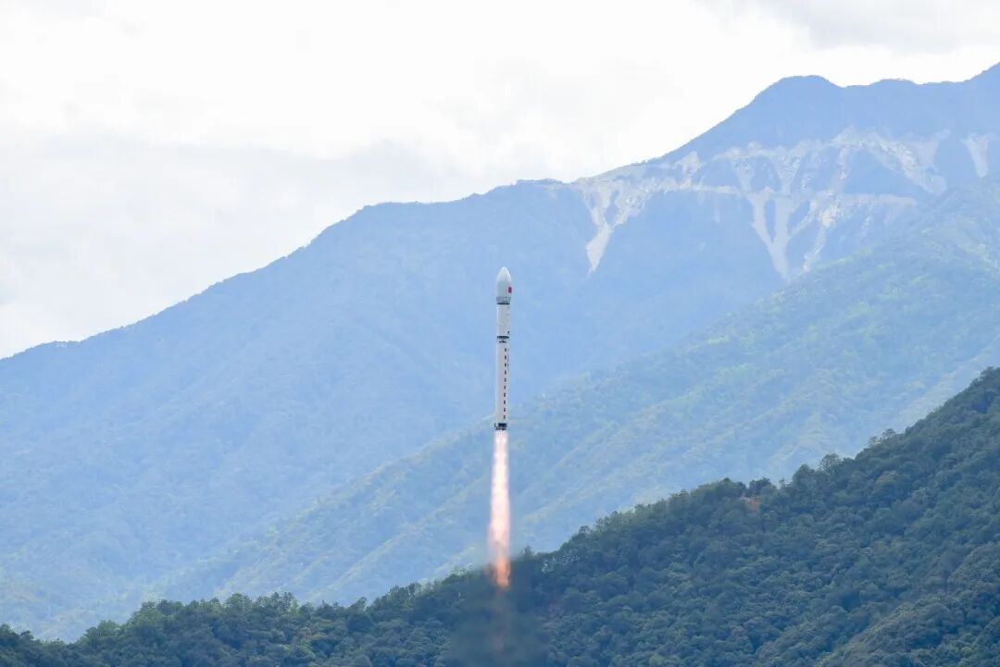
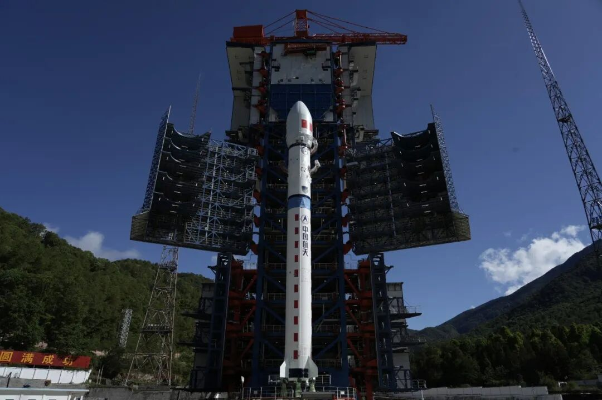

近日，基于 OpenAtom openEuler（简称 “openEuler” 或 “开源欧拉”）的宇航级嵌入式操作系统搭载某星座实验卫星成功发射并在轨稳定工作，这是基于 openEuler 的嵌入式操作系统首次在商业卫星载荷领域实现实际在轨运行，标志着基于openEuler的星载操作系统已具备支撑宇航级场景的硬核实力，标志着基于openEuler的星载操作系统在高可靠、强实时的空间智能场景中迈出里程碑式一步，为中国商业航天自主创新发展筑牢数智底座。

## 硬核能力拉满 适配太空严苛场景

太空环境兼具强辐射、超高低温、微陨石冲击等极端条件，星载操作系统需同时满足硬实时、高安全、高可靠、轻量化四大核心要求才能支撑卫星长期稳定在轨运行。此次上星的基于openEuler 的嵌入式星载操作系统，精准攻克技术难点，核心能力全面对标宇航级标准：

### 硬实时响应，微秒级精准控制

采用混合关键部署框架，重构独立硬实时内核，实现非实时域与硬实时域分离，任务切换、中断响应均小于 15μs，可精准匹配卫星姿态控制、载荷数据处理、星务管理的极致时序需求，确保卫星动作 “零延迟、零误差”。

### 全链路安全防护，筑牢太空数据防线

构建星载载荷专属安全体系，通过内核与用户空间内存隔离、内核栈溢出保护、内核地址空间布局随机化等加固技术，确保操作系统自身的内生安全；支持异常信息实时采集与地面回传，实现星地联动安全态势感知；搭载星载黑匣子功能，全程记录系统运行数据，为故障追溯提供完整依据，全方位守护太空数据安全。

### 宇航级高可靠，极端环境稳定运行

采用内核分区设计，实现单粒子翻转防护，支持错误分区自动识别与恢复，有效抵御太空辐射干扰；系统轻量化精简设计，兼顾资源利用率与稳定性，适配超宽温域环境，保障卫星长期在轨“不宕机、不失效”。

### 高适配易运维，支撑灵活迭代

兼容海思、飞腾、瑞芯微等多款宇航级芯片，适配“通导遥”各类商业卫星载荷场景；提供完整板级支持包、遥测遥控组件，支持应用软件在轨安装、运行、卸载与状态监控，无需卫星返地即可完成功能升级，大幅降低运维成本。

## 在轨运行意义深远 筑牢航天创新根基

此次基于 openEuler 的宇航级嵌入式操作系统成功在轨运行，不仅是一次技术应用突破，更是中国商业航天与国产生态融合发展的关键一步，多重战略意义重大而深远：

### 打破国外垄断，实现星载软件全栈创新 

长期以来，高端星载操作系统多依赖国外系统。此次基于 openEuler 的宇航级嵌入式操作系统在轨运行，实现自研操作系统在星载载荷领域的突破，构建起自主创新的星载软件底座，为中国商业航天安全发展提供核心保障。

### 开源赋能航天，加速产业规模化发展

依托 openEuler 全球开源生态（覆盖 178 个国家和地区、汇聚 2.3 万名贡献者），开放星载操作系统核心技术与适配能力，降低商业卫星研发门槛与成本；统一的软件栈标准，实现不同卫星载荷的兼容适配，助力商业卫星星座批量制造与快速部署。

### 天地生态协同，拓展空间智能新边界

此次在轨运行为构建 “天 - 空 - 地 - 边” 一体化生态奠定基础，后续可延伸至低轨卫星组网、深空探测等空间智能场景；同时推动星上 AI、星地智能调度、边缘 - 空天业务协同等技术落地。

### 产学研深度融合，树立开源创新新标杆

此次落地是openEuler、航天院所、科技企业协同创新的典范，验证了相关模式在高端装备、航天等关键领域的可行性，为国内基础软件与硬核产业融合提供参考。

## 未来深耕太空赛道 共筑航天强国梦

此次成功在轨运行，是openEuler联手成都菁蓉联创布局空间智能领域的新起点，面向未来，openEuler社区及合作伙伴将持续深耕航天赛道，从技术、生态、场景三大维度持续突破：

**➣技术持续迭代，打造空间操作系统标杆**

依托openEuler Space SIG，联合航天院所深化技术研发，重点突破星载 AI 原生支持、分布式任务调度、跨卫星链路智能路由等核心技术；将单粒子防护、故障自愈等空间刚性需求内化为系统原生特性，打造全球领先的空间级操作系统基线。

**➣完善航天生态，构建开放协同产业体系**

持续扩大航天领域生态伙伴规模，覆盖芯片、整机、载荷、应用全产业链；推出航天专属软件仓库，丰富星载应用、AI 算法、协议中间件等资源。

**➣拓展多元场景，赋能空天经济全面崛起**

从商业卫星延伸至深空探测、载人航天、低空经济、卫星互联网等更多空间场景；推动基于 openEuler 的嵌入式操作系统在星上智能推理、太空通信、遥感数据预处理等领域规模化应用。
