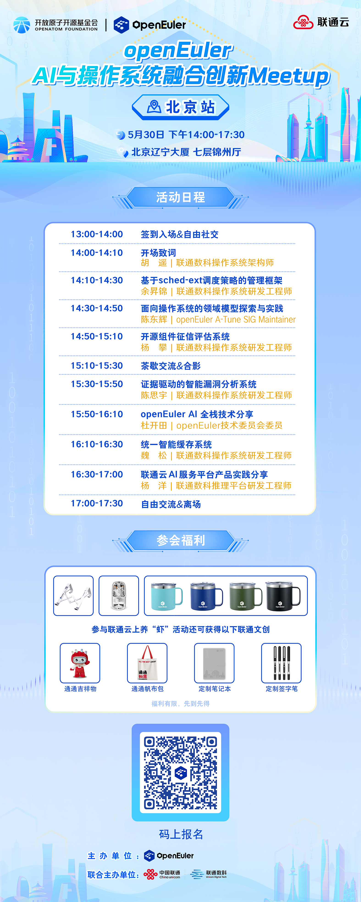

当操作系统遇见人工智能，不仅是技术的叠加，更是底层基础设施的范式革新。为深耕AI 与操作系统融合技术生态，赋能开发者实战落地，一场聚焦硬核技术、干货满满的开发者 Meetup 重磅来袭！

本次 Meetup 由 OpenAtom openEuler（简称 “openEuler” 或 “开源欧拉”）社区与联通数科联合主办，**以“智驱未来：AI与操作系统融合创新”为核心主题，聚焦当下 AI OS 领域的技术热点与行业痛点。** 活动汇聚操作系统、人工智能领域的技术专家、行业资深工程师、社区核心开发者及广大技术爱好者，搭建高效的技术交流、经验共享、生态共建平台。

## 活动重点

本次活动深度围绕 AI for OS、OS for AI，覆盖从底层内核优化、智能调度、安全治理，到领域模型探索、AI 全栈技术、行业落地实践的全链路内容：

- **AI 赋能操作系统：** 基于 sched-ext 的智能调度、面向 AI 场景的智能缓存、操作系统领域模型探索，让系统更懂 AI、更高效。

- **操作系统赋能 AI：** openEuler AI 全栈技术、异构算力优化、开源组件安全评估，为 AI 应用打造稳定、安全、高效的底层基座。

- **实战落地分享：** 联通云 AI 服务平台实践、CVE 分析排查工具、开源组件征信评估系统，直面一线开发难题，拆解可复用的解决方案。

## 活动信息

**活动时间：**

2026年5月30日 14:00-17:30

**活动地点：**

北京市海淀区北四环西路北京辽宁大厦七层锦州厅

**参与人群：**

操作系统开发者、AI算法工程师、开源爱好者、行业技术从业者

