5月22-23日，鲲鹏昇腾开发者大会（KADC 2026）在北京顺利召开。OpenAtom openEuler（简称：“openEuler”或“开源欧拉”）携前沿技术成果与生态实践重磅亮相，深度参与了鲲鹏峰会、技术分论坛、创享月直播、创新展区和开发者CodeLab等环节，围绕超节点OS基础设施建设、Agent Infra 架构创新等核心方向，与行业专家、生态伙伴、开发者，共探算力时代创新技术。

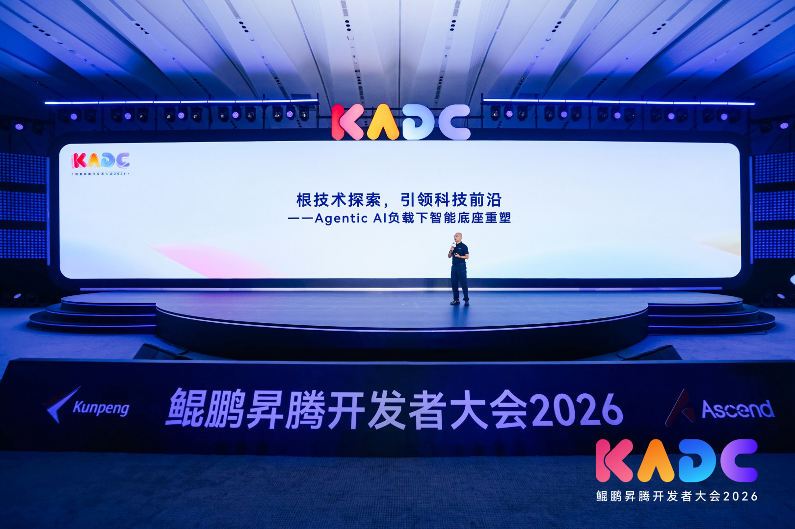

▲ openEuler技术委员会主席，华为公司Fellow 胡欣蔚 峰会演讲&分论坛致辞

openEuler技术委员会主席、华为公司Fellow胡欣蔚在鲲鹏峰会发表了题为《根技术探索，引领科技前沿——Agentic AI负载下智能底座重塑》的主题演讲。在演讲中，他首先回顾openEuler的演进，第一阶段是“资源抽象”，主要是屏蔽底层异构差异，实现算力统一调度与全场景协同。第二阶段是“异构融合”，依托灵衢（UnifiedBus）互联技术，打破异构算力之间的“内存墙”和“通信墙”，实现节点内内存池化与算力一体化。而后他提出，面向未来，操作系统由被动执行指令，逐步升级为具备意图感知能力、统筹智能体全生命周期的核心管理者。最后，他指出智能体将如云原生般普及，千行百业的数字员工都在鲲鹏底座上敏捷生长、安全运行、协同进化，释放无穷的创新生产力。

## openEuler技术分论坛：夯实超节点算力底座，面向Agentic AI演进

在openEuler分论坛中，有来自6家社区伙伴单位的8位技术专家登台演讲，为在座的开发者从超节点OS、Agentic AI等方面介绍了openEuler最新的技术进展和最佳实践案例。

---

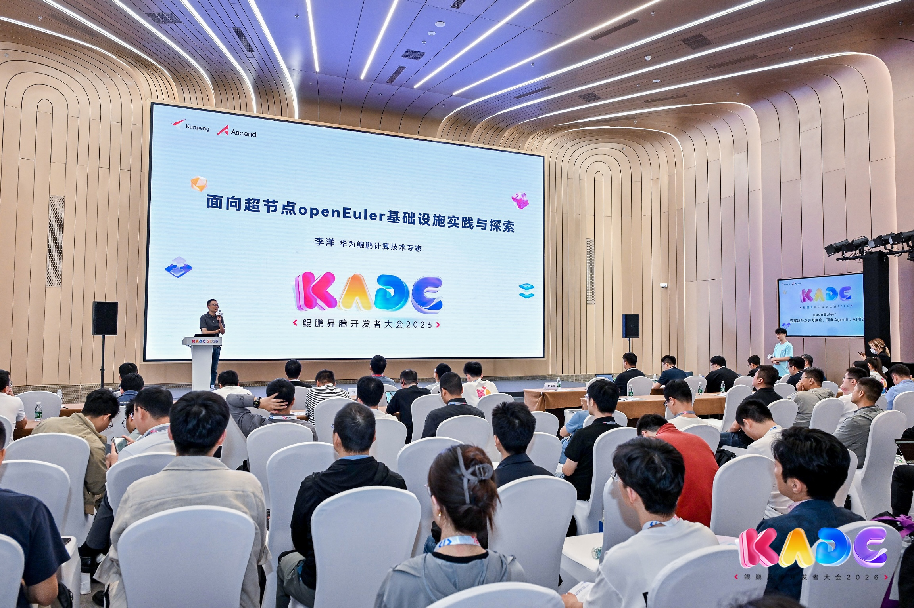

▲ openEuler社区maintainer，华为鲲鹏计算操作系统架构师 李洋 主题演讲

Agentic AI 时代，产业需要重塑底层软硬件范式。去年12月底，openEuler社区发布了首个面向超节点的操作系统—openEuler 24.03 LTS SP3，实现了三个关键能力：全局资源抽象、异构算力平等互联、高效兼容的调度接口。即将发布的SP4版本中，重点优化了易用性、可靠性、低时延三大能力。易用性上，超节点OS组件支持一键安装部署，真正做到开箱即用；可靠性上，超节点OS能感知跨节点故障，通告时间压到500ms以内；低时延上，依托超节点异构统一互联底座UMDK，实现大规模容器低时延通信。

针对超节点Severless技术，基于在openEuler社区开源的openYuanrong技术，打造高性能分布式计算引擎，支持Agent、推理、强化学习、生成式推荐等负载高效使用超节点，落地互联网、金融等场景。

---

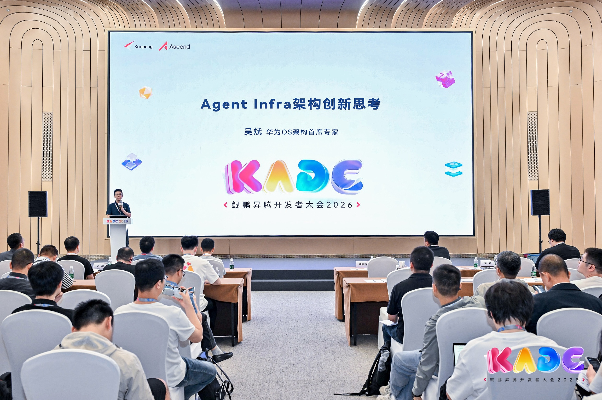

▲ openEuler社区maintainer，华为OS架构首席专家 吴斌  主题演讲

面对企业落地 Agent落地困难的痛点，openEuler打造轻量 Agent 沙箱运行时，构筑低Token消耗、全链路安全的 Agent 技术底座。

轻量 Agent沙箱运行时：通过软硬协同优化镜像快照，结合远端懒加载、分层按需加载，大幅缩短冷启动耗时；依托鲲鹏超节点实现镜像快照共享分发，规避重复拉取。双重优化叠加，显著提升多沙箱启动效率，兼顾极速响应与安全保障。

词元性能方面，采用三层方案：KVC-Gateway精准调度、LMCache多级内存池化复用、Bifrost弹性响应，目标是让Token消耗走向边际递减。

围绕这些，openEuler构建了完整Agent Infra软件栈：底层是Agent Kernel，在超节点内核中实现原生调度与安全；中间层是Agent Service，将安全、记忆、沙箱等抽象为Agent POSIX原语，让开发从“造轮子”变成“拼积木”；而在上层支持各类智能体应用。

安全方面，openEuler构筑了可控、可知、可恢复的执行环境：事前通过Prompt注入检测与硬件可信根绑定意图与行为；事中三级动态沙箱（Conch/Session/Tool沙箱）实时拦截高危操作，100%留痕审计；事后轻量级文件快照支持毫秒级回滚。

面对具身智能的迅猛发展，openEuler社区正式发布嵌入式开箱即用版本，将能力延伸至边缘与嵌入式场景，为机器人提供全栈开源的轻量化软件栈，支持组件灵活组合与自由裁剪，可快速适配多样化硬件需求。openEuler正以灵活架构，推动AI基础设施向边缘侧加速落地。

---

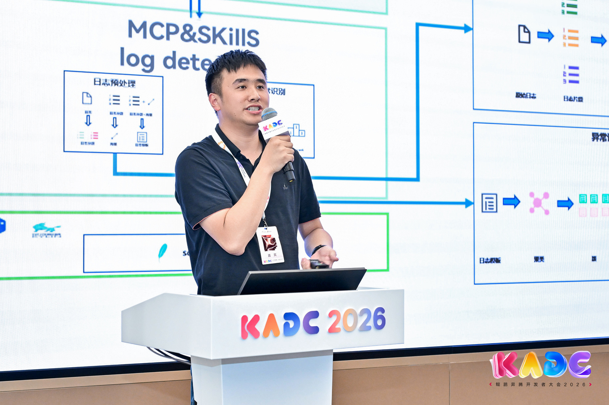

▲ openEuler 技术委员会委员，麒麟软件服务器研发中心副总经理 侯健 主题演讲

麒麟软件作为 openEuler 社区核心贡献者，在侯健副总经理分享的《AI时代，银河麒麟服务器操作系统的探索实践》中，银河麒麟智能体 OS正经历显著转变：首先，交互模式从“增强 Shell”迈向“感知 Shell”，通过全场景上下文感知与 Agent 原生化改造，让系统具备敏锐的 AI 理解力与响应力。其次，基础能力从“通用底座”深化为“专业操作”，依托深度集成的OS专属知识库，为运维提供专家级的精准支撑。

在具体落地方面，智能运维系统展现了强大的实战能力：1.智能故障诊断，秒级检测与跨域根因定位；2.自动化工具链，MCP封装了500+高频命令；3.30+Skill覆盖 80%以上的问题场景；4.整合多源知识10万+，构建起企业级运维知识库；5.在精准问答方面，方案匹配率达 85%+，自动检索相似问题复用方案。

---

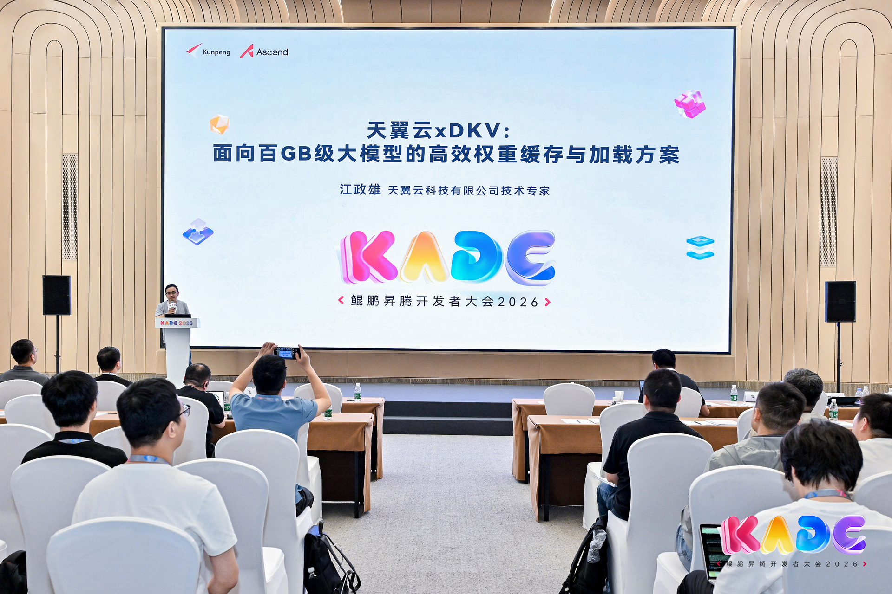

▲ openEuler AI联合工作组成员，天翼云科技有限公司技术专家 江政雄 主题演讲

天翼云科技有限公司技术专家江政雄，分享了天翼云xDKV，面向百GB级大模型的高效权重缓存与加载方案。旨在解决大模型容器化冷启动慢、资源浪费及架构僵化等瓶颈。基于鲲鹏/昇腾及openEuler等软硬件，提供了”存储底座 + 数据处理 + 加载优化 + 集群调度“ 一体化解决方案。模型下载阶段提前预热；模型切分和预热阶段，实现精细化分片与结构化组织；模型加载阶段，实现从"多级链路"到"直通显存"，大幅优化模型全流程效率。在应对大促或突发热点等高流量场景时，该方案支持模型缓存的弹性预加载，流量高峰时节点直接激活缓存，低谷时释放资源，显著提升硬件利用率，实现算力按需供给。

---

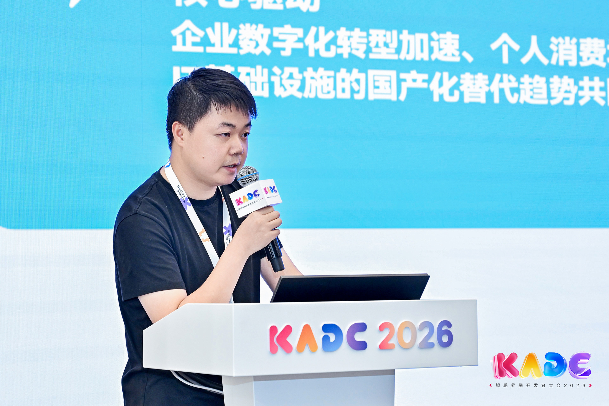

▲ 麒麟信安终端平台技术专家 刘斌 主题演讲

麒麟信安终端平台技术专家刘斌，分享了基于 openEuler 构建 ASR/NLU 框架的智能云终端实践。该方案以 openEuler 为核心，打造了高性能、高安全、高可靠的“语音+意图识别”解决方案，实现四大关键技术：

1. 实时内核调度优化：确保业务优先响应，高负载下内核层优先处理语音，显著降低延迟。

2. 负载感知与算力协同：利用 openEuler 高效的负载管理能力，实现业务需求的快速响应与算力协同。

3. 异构高效推理：通过统一加速器接口，支持模型在 CPU、GPU、NPU 上透明运行，大幅提升推理性能。

4. 内存与安全优化：采用冷热内存智能管理对非敏感数据进行性能优化，同时结合机密计算与TEE对核心数据实现隔离保护与安全可控。

---

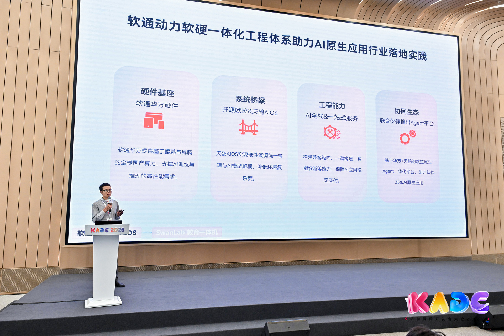

▲ openEuler全球化工作组成员，软通动力欧拉生态高级技术总监 李成鹏 主题演讲

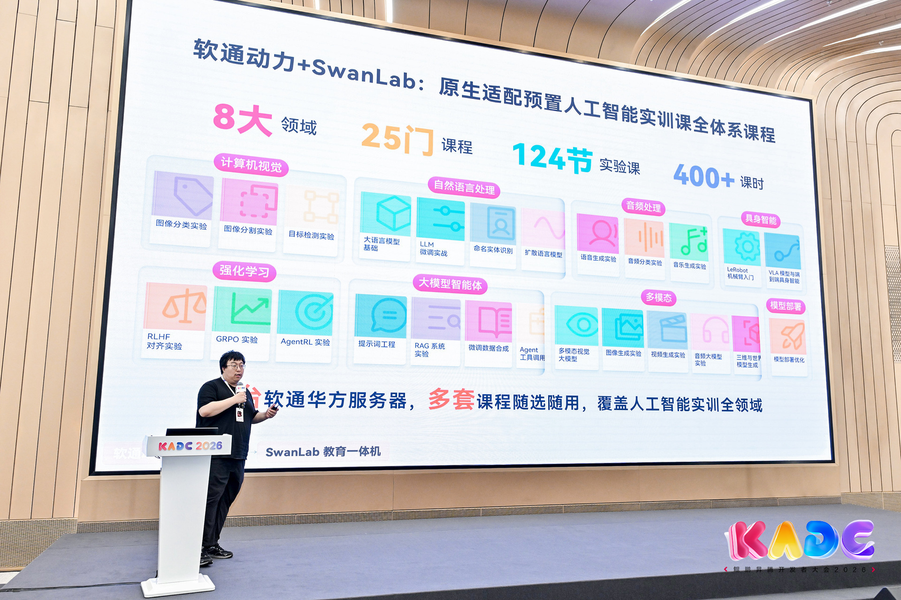

▲ 情感机器（北京）科技有限公司教育系统负责人 韩翔宇 主题演讲

软通动力欧拉生态高级技术总监李成鹏联合情感机器（北京）科技有限公司教育系统负责人韩翔宇，以“软通华方+天鹤AIOS，携手SwanLab加速AI原生应用工程化实践与探索”主题演讲，探讨AI从实验室到产业落地的路径。

软通华方基于鲲鹏/昇腾硬件及openEuler天鹤AIOS软件层，与深度适配的SwanLab工具形成全栈协同。该方案具备全栈兼容、开箱即用及支持复杂新范式等优势，实现训推一体化与教学管理全场景覆盖，为AI原生应用规模化落地提供支撑。

## openEuler创享月直播：五大技术突破，筑牢Agent Infra生态

本次直播邀请了4位技术专家为开发者介绍了openEuler与openFuyao在构筑Agent Infra方面的最新技术进展，包括agent开发工具，超节点沙箱运行时，全时覆盖沙箱安全技术，全链路可追踪的沙箱观测技术以及基于KV-Cache数据亲和的token调度机制，大幅度提升agent的安全性和运行效率。该场直播观看人次达36.4万，最高同时在线人数1.6万，评论数318条。

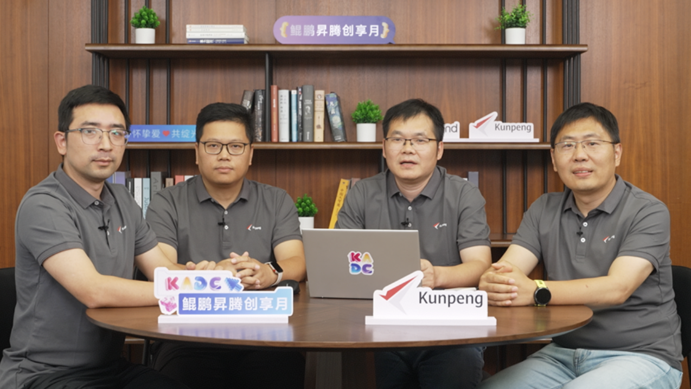

▲ 直播截图

## 展区精彩呈现：openEuler 展区生态齐聚，前沿技术成果集中亮相

在openEuler创新展区，社区与生态伙伴麒麟软件、统信软件等联袂亮相，展示最新技术成果。麒麟软件展出银河麒麟操作系统 V11，搭载高性能内核与自研架构，原生适配 AI 算力调度。系统具备三层安全防护、跨架构兼容及便捷桌面体验，契合关键领域合规标准，赋能多行业数字化场景。统信软件，基于鲲鹏昇腾硬件与统信 UOS（服务器/桌面版），提供一键部署、零代码知识库构建及全链路自主软硬件支持，配合全面运维保障，助力企业级大模型应用落地。

此外，openEuler社区超节点OS、Agent AI等最新技术成果悉数登场，其中首个嵌入式具身智能版本以及现场体验亮相，现场人气高涨，互动气氛热烈。

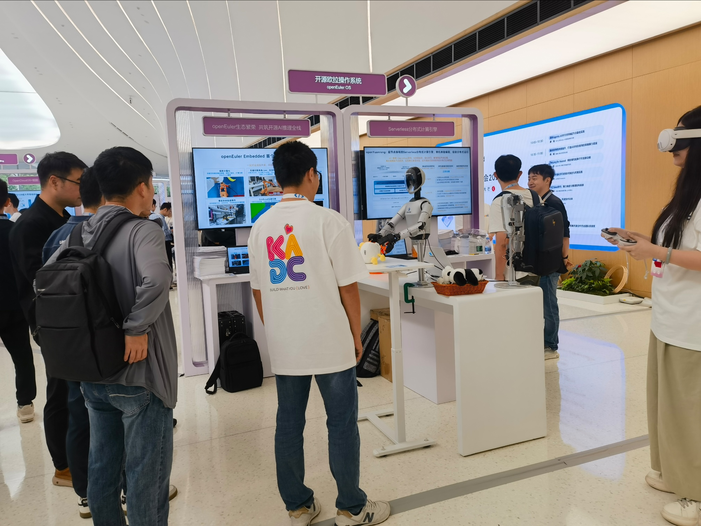

▲ openEuler技术创新展区

## 开发者CodeLab体验区：新手0帧起步，解锁openEuler社区开发

在大会的CodeLab体验区，大量开发者体验了openEuler DevStation提供的智能助手，通过智能助手可以直接使用AI完成在openEuler社区的代码review，以及内核CVE漏洞修复。对于从来没有贡献过openEuler社区的开发者，这两项功能极大的降低了开发者首次在openEuler上贡献的门槛，帮助开发者快速上手openEuler社区开发。

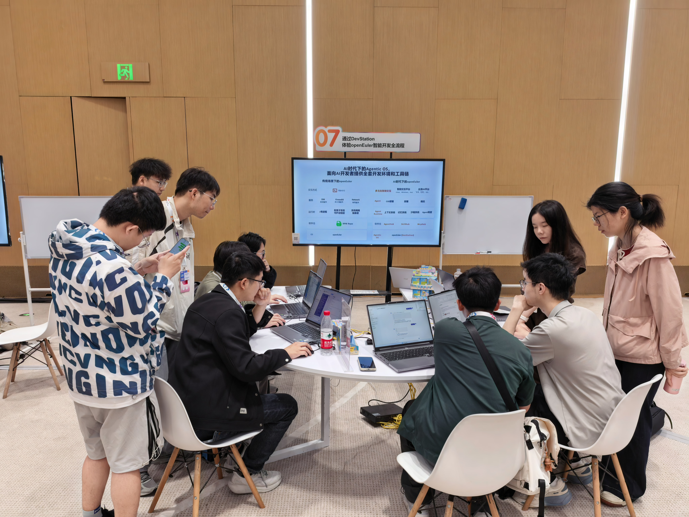

▲ CodeLab实战现场

从峰会的前沿分享，到分论坛的思想碰撞，从展区的技术成果展示，到CodeLab的动手实操，openEuler全方位亮相KADC，尽显开源操作系统根社区的技术底蕴与蓬勃生态。随着AI技术和Agent进入爆发周期，面向未来openEuler社区还会携手生态伙伴持续发力AI领域，打造领先的AI智能基础设施底座。
