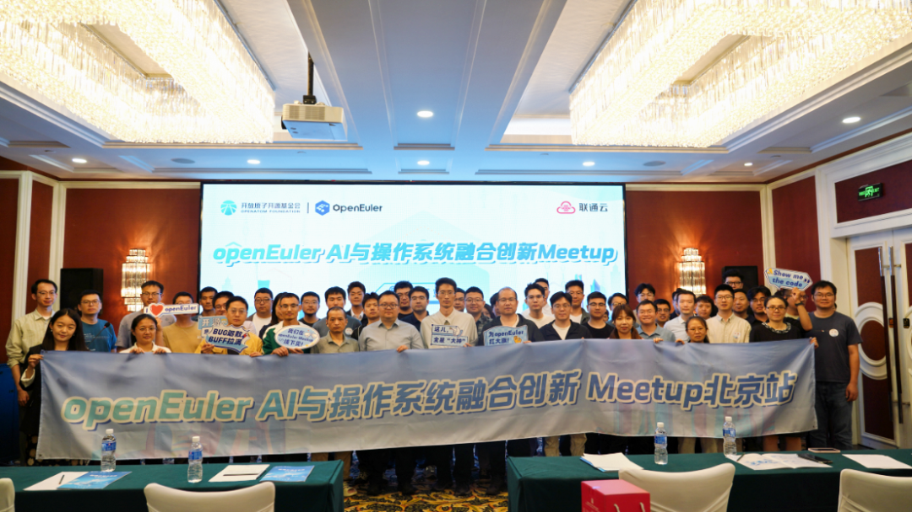
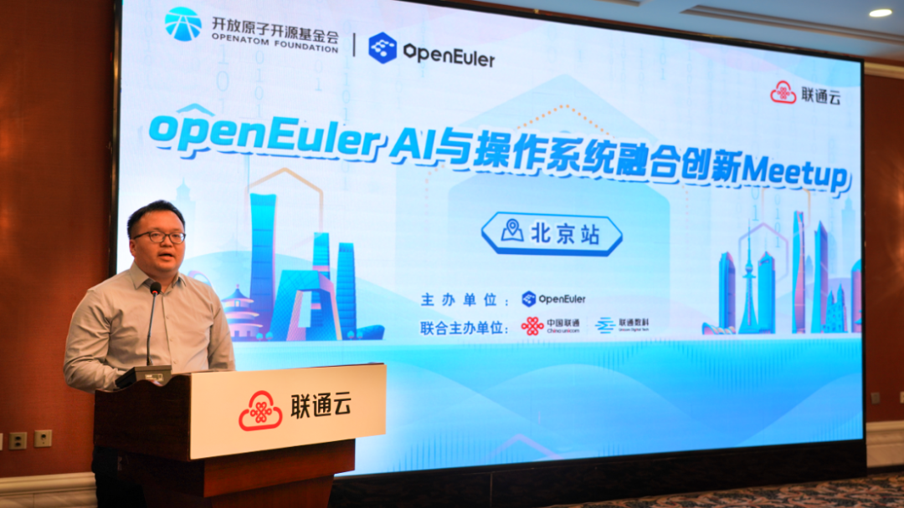
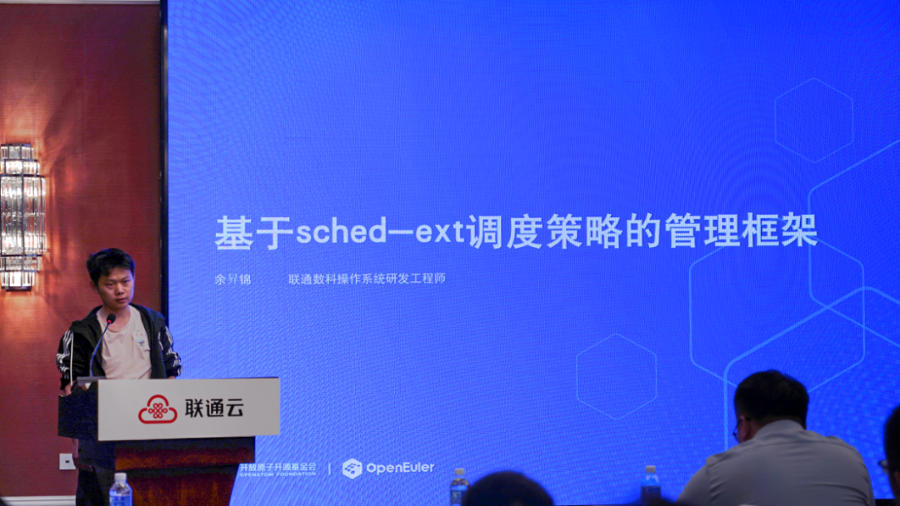
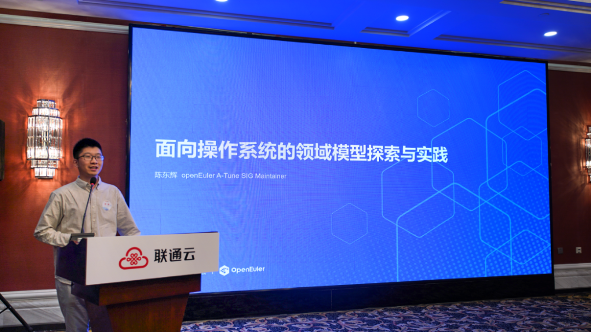
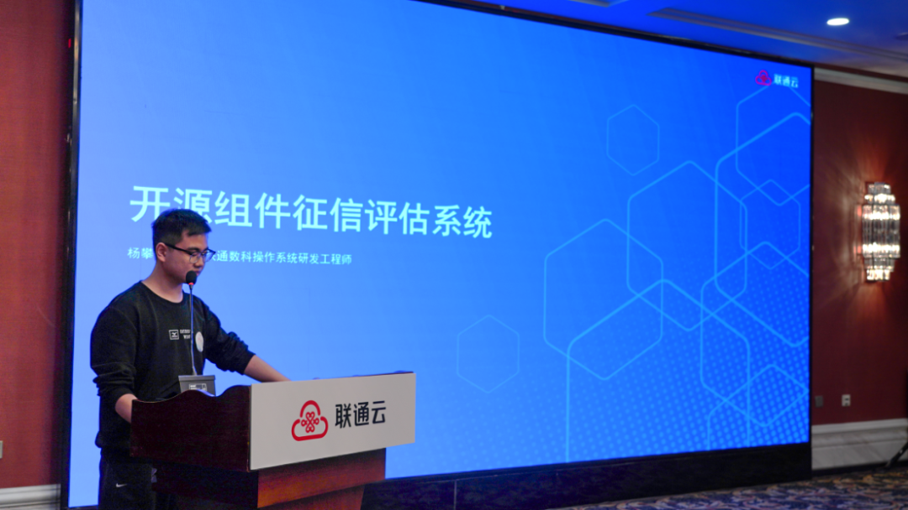
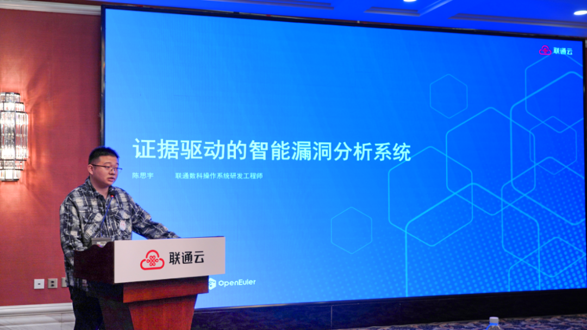
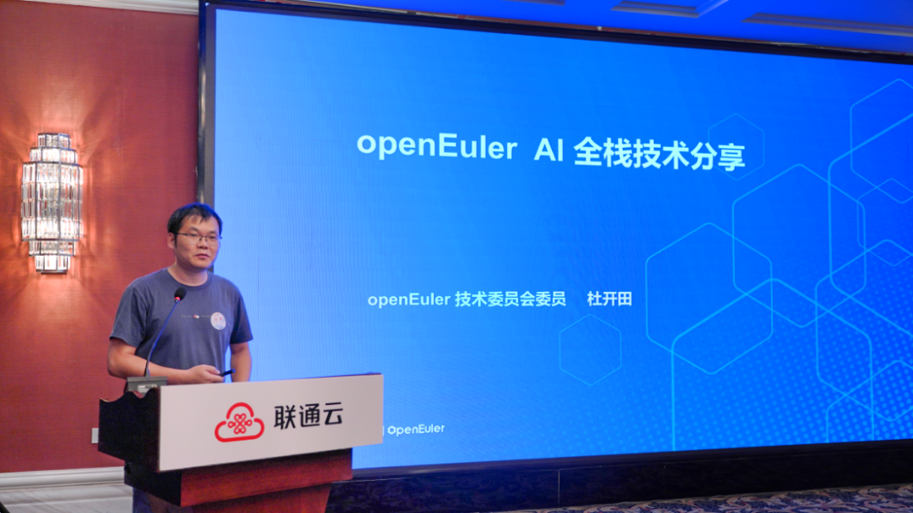
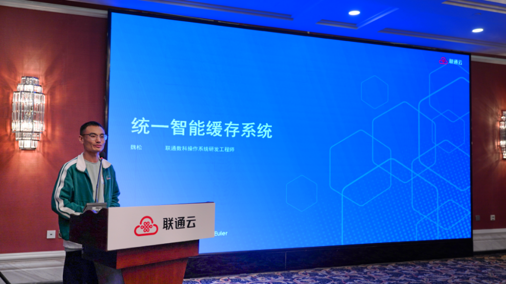
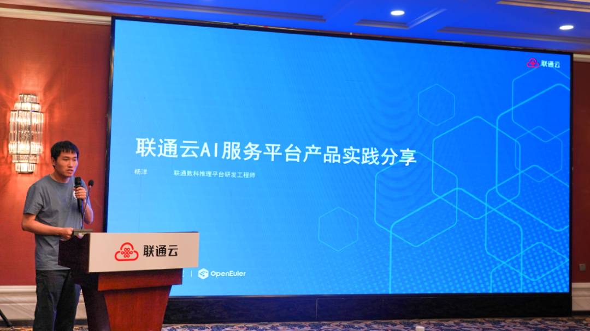

5月30日，由OpenAtom openEuler（简称“openEuler”或“开源欧拉”）社区与联通数字科技有限公司（以下简称“联通数科”）联合举办的openEuler AI 与操作系统融合创新 Meetup在北京圆满举办。本次活动以“AI与操作系统融合创新”为核心主题，聚焦当下AI和OS领域的技术热点与行业痛点，汇聚操作系统、人工智能领域的技术专家，共同探索面向AI时代的新一代操作系统创新路径，为开放、智能、安全、高效的数字基础设施建设贡献力量。

活动伊始，联通数科操作系统架构师胡遥进行活动开场致辞。联通云深耕算网一体与数智服务建设，依托联通云操作系统CUOS V4.0，夯实内核、虚拟化、容器等基础能力，以内生安全构筑全链路纵深防御体系，以内生智能深度适配异构算力、智算训推与智能运维场景。联通数科持续深化与openEuler社区开源共建、技术共创，在安全防护、内核调度、漏洞治理等领域贡献多项开源项目。未来双方将携手探索AI与操作系统融合新路径，推动更多创新成果在社区沉淀、在场景落地。

## 基于sched-ext的调度策略管理框架

联通数科操作系统研发工程师余昇锦分享了基于sched-ext的调度策略管理框架。目前Linux sched-ext 可扩展调度框架已正式合入内核，为调度策略快速迭代奠定基础，但仍面临策略分散难复用、实验方案难工程化、生产运维门槛高等痛点。为此联通数科打造scx-loader调度策略管理框架，依托Policy-as-Process设计，实现策略热切换、故障隔离与自动恢复。配套搭建scx_hub云端生态，提供策略托管、版本管理、签名核验与场景推荐能力。同时拓展sub-cgroup细粒度调度隔离，适配容器业务，并融入AI智能调度体系，通过观测、决策、执行全链路，实现调度策略智能推荐、参数调优与异常回退，助力服务器、桌面、容器场景实现调度能力标准化、工程化与智能化升级。

## 面向操作系统的领域模型探索与实践

openEuler A-Tune SIG Maintainer陈东辉分享了openEuler社区在面向操作系统的领域模型上的探索与实践。随着AI大小模型走向长期共存，操作系统运维却面临内核参数繁杂、故障排查困难、人为配置失误高发等痛点。通用大模型又存在语义鸿沟、系统生态碎片化、硬件架构多样等适配难题，难以满足专业运维需求。openEuler社区深耕操作系统领域模型探索与实践，依托高质量数据清洗流水线，通过SFT、GRPO强化学习完成模型精调，打造专属OS领域模型。采用大小模型协同、CPU量化推理加速技术，构建完整评估体系，实现负载感知、参数智能推荐与全场景协同调优。在数据库、大数据、虚拟化、分布式存储等场景性能提升显著，调优效率大幅跃升，支持网页与命令行自然语言交互，为操作系统智能运维、自动调优提供开源可靠的全新解决方案。

## 开源组件征信评估系统

联通数科操作系统研发工程师杨攀分享了开源组件征信评估系统。在开源组件广泛应用下，面对供应链安全、许可证合规、社区运维及舆情争议等企业引入治理的核心难题，联通数科打造开源组件征信评估系统，构建全流程组件准入治理综合征信平台。系统从安全性、合规性、社区成熟度、外部争议四大维度开展四维评估，融合AI大模型实现漏洞风险研判、外部争议语义感知与智能评分分级。支持多语言开源生态，可自动生成标准化SBOM物料清单，提供自动准入、人工审核、组件替代推荐能力。平台具备完整规则治理、决策留痕与可审计证据链，未来将向项目级风险画像、持续监测预警、自动化整改延伸，为企业开源组件供应链安全筑牢可信屏障。

## 证据驱动的智能漏洞分析系统

联通数科操作系统研发工程师陈思宇分享了证据驱动的智能漏洞分析系统。面对传统漏洞分析过度依赖上游公告，存在难以识别真实修复逻辑、缺少代码验证、人工排查效率低等痛点。联通数科打造证据驱动的智能漏洞分析系统，重塑漏洞分析全新范式。系统以本地CVE官方镜像为权威基线，依托语义对齐技术穿透代码表象，结合证据驱动机制严控结论可信度，规避AI幻觉问题。基于MCP协议实现任务编排与工具调用，自动产出标准化Markdown与JSON分析报告，支持批处理任务断点续跑、错误归因留痕。可实现大规模补丁智能审查、风险分级与自动化分流，大幅减少人工重复工作量，提升漏洞分析精准度与修复效率，为开源安全治理、补丁审核及漏洞全生命周期管理提供可靠智能底座。

## openEuler AI 全栈技术

openEuler技术委员会委员杜开田分享了openEuler AI全栈技术。随着大模型与Agent技术飞速普及，AI训推效率低、异构算力适配难、运维复杂度高等痛点愈发凸显。openEuler打造AI全栈技术体系，构建智能化操作系统底座，全方位赋能千行百业AI落地。平台覆盖训练高可用、推理高吞吐、AI全栈与Agent生态四大方向，自研慢卡检测、容器快照恢复、异构算力协同等核心能力，大幅提升训练稳定性与推理吞吐。推出Intelligence Boom全栈方案，适配CPU、NPU、GPU多类硬件，实现一键部署、异构融合、极致推理加速。同时完备Witty智能运维、DevStation开发者平台、Skill工程化与低时延沙箱能力，构筑完整Agent Infra生态，兼顾高性能、低成本、易开发与强生态，为AI原生应用提供全栈开源基础支撑。

## 统一智能缓存系统

联通数科操作系统研发工程师魏松分享了统一智能缓存系统。目前大模型推理、AI训练业务飞速发展，KV Cache显存占用高、训练断点恢复慢，同时数据中心普遍存在近30%内存资源闲置浪费，资源利用率与业务性能双双承压。联通数科打造统一智能缓存系统，以OS层面构建缓存即服务CaaS能力，采用软件定义缓存架构，统一纳管HBM、DRAM、SSD等异构存储介质。依托智能分层调度、弹性内存池伸缩与高速传输引擎，打通多路径数据流转。系统适配大模型长上下文推理、AI训练Checkpoint缓存等核心场景，大幅提升缓存命中率、显著降低推理时延，盘活闲置内存资源，实现业务高性能与资源高利用率双赢，为智算场景提供轻量化、可扩展的全域缓存基础能力。

## 联通云AI服务平台产品实践分享

联通数科推理平台研发工程师杨洋介绍了联通云AI服务平台产品。联通云推出AI服务平台AISP，作为星罗智算体系核心产品，面向业务型用户打造一站式大模型服务平台。平台汇聚丰富模型广场，提供模型体验、精调、评测、API调用及批量推理全链路能力，支持公有云、私有云多种交付形态。依托自研AI智能网关，构建全域多级调度架构，实现就近接入、智能路由、安全审计与精细计费。通过分布式KV Cache池化、PD分离架构、RDMA零拷贝传输等核心技术，大幅提升缓存命中率与推理吞吐，显著降低首包时延。兼容多类异构算力，开箱即用、按需计费，助力企业低成本、高效率快速落地智能客服、内容生成、营销创作等大模型应用。

---

本次活动成果丰硕、成效显著。活动搭建了产研协同、技术互通、生态共融的高水平交流平台，推动AI与操作系统融合创新理念广泛传播；六大技术成果集中亮相，展现双方在底层内核、智能调度、安全治理、智算加速等领域的领先实践；双方进一步凝聚合作共识，明确技术攻关方向与生态共建路径，为后续联合研发、场景落地、开源贡献奠定坚实基础；活动有效提升产业影响力，为基础软件自主创新与AI规模化应用提供可借鉴、可复制的实践方案。

