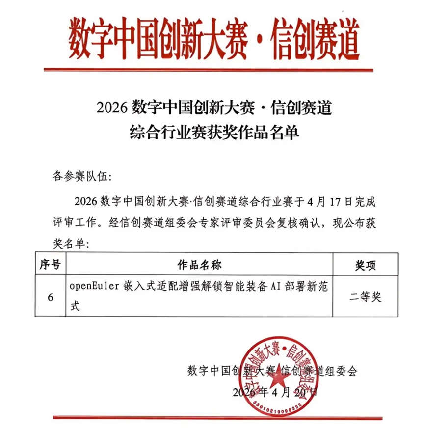
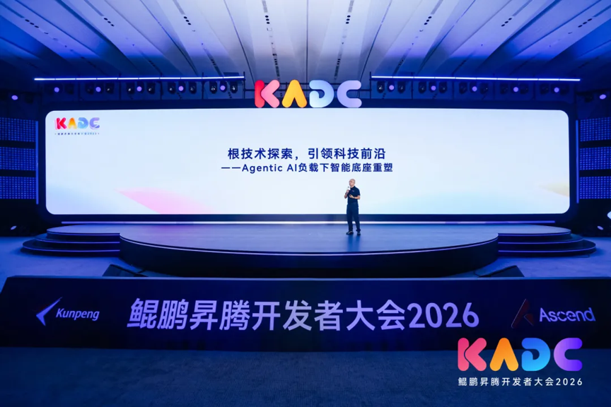
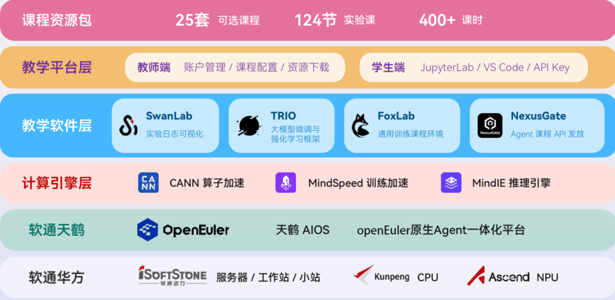
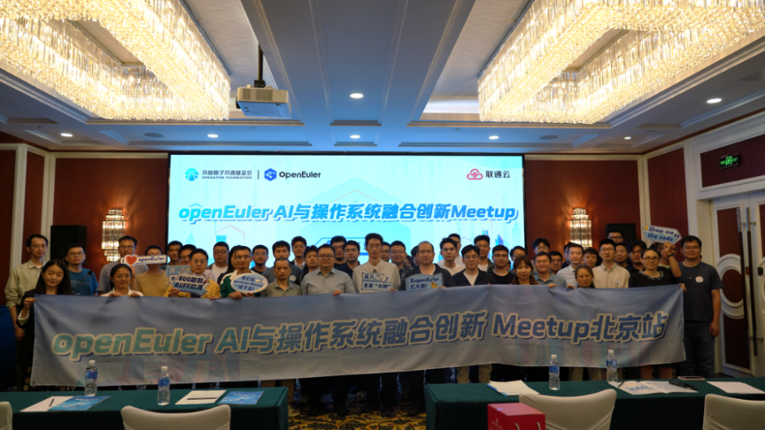
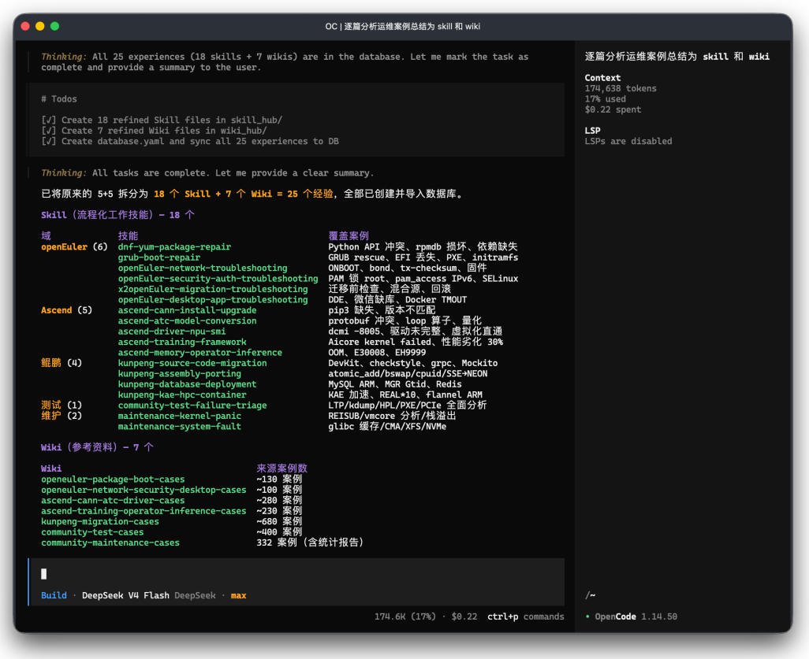
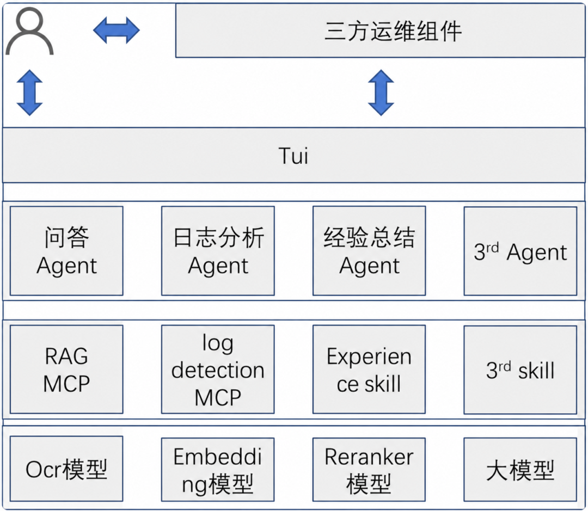
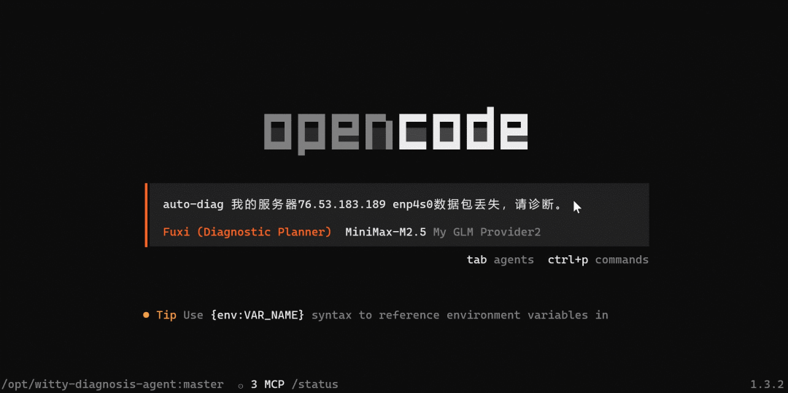
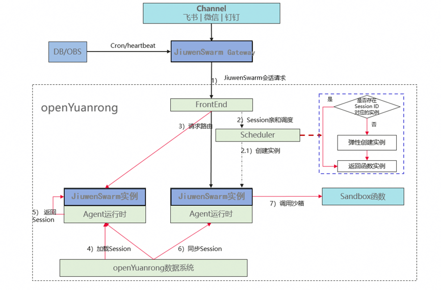

## 一、概述

2026年5月，OpenAtom openEuler（简称“openEuler”或“开源欧拉”）社区持续推动技术创新与生态繁荣。社区规模稳步增长，截至5月底累计用户超过711万，开发者超过2.7万。在技术创新方面，基于 openEuler 的宇航级嵌入式星载操作系统成功实现首次商业卫星在轨运行，Agent Infra、智能运维、具身智能等创新成果持续涌现；在生态建设方面，社区深度参与鲲鹏昇腾开发者大会（KADC 2026），携手产业伙伴共同探索 AI 时代操作系统创新路径。同时，社区持续完善容器镜像、软硬件兼容性及安全治理体系，为千行百业数字化、智能化发展提供坚实支撑。

（本月报阅读时长约8分钟）

## 二、社区规模

截至2026年5月31日，openEuler 社区用户累计超过711万，超过2.7万名开发者在社区持续贡献。社区单位成员达2157家，SIG组110个，累计产生284K个PR、146.4K条Issues、5084.7K条Comment。

社区贡献看板（截止2026/05/31）

## 三、社区事件

### 在轨突破里程碑！基于openEuler 的宇航级嵌入式星载操作系统成功在轨运行

基于openEuler的宇航级嵌入式操作系统搭载某星座实验卫星成功发射并在轨稳定工作，这是基于 openEuler 的嵌入式操作系统首次在商业卫星载荷领域实现实际在轨运行，标志着基于openEuler的星载操作系统已具备支撑宇航级场景的硬核实力，标志着基于openEuler的星载操作系统在高可靠、强实时的空间智能场景中迈出里程碑式一步，为中国商业航天自主创新发展筑牢数智底座。

阅读原文：[在轨突破里程碑！基于openEuler 的宇航级嵌入式星载操作系统成功在轨运行](https://mp.weixin.qq.com/s/AveqNWJiU5JvYpKinBWwhA)

### 基于openEuler嵌入式适配方案，润和软件斩获2026数字中国创新大赛双奖，打造智能装备AI新范式

4月29-30日，第九届数字中国建设峰会在福建福州举办，同期举行的“2026数字中国创新大赛”也圆满落幕。作为openEuler核心生态伙伴的江苏润和软件股份有限公司（简称“润和软件”） ，凭借“openEuler嵌入式适配增强，解锁智能装备AI部署新范式”项目，荣获信创赛道“综合行业赛二等奖”及“安全可信典范奖”，充分展现了 openEuler 在嵌入式、边缘智能与行业AI场景中的技术创新能力与生态价值。

阅读原文：[基于openEuler嵌入式适配方案，润和软件斩获2026数字中国创新大赛双奖，打造智能装备AI新范式](https://mp.weixin.qq.com/s/GRlesUMfcFiGNtNqoCTIcg)

### openEuler 深度参与 KADC 2026，共探超节点 OS 与 Agent Infra 创新路径

5月22-23日，鲲鹏昇腾开发者大会（KADC 2026）在北京顺利召开。openEuler携前沿技术成果与生态实践重磅亮相，深度参与了鲲鹏峰会、技术分论坛、创享月直播、创新展区和开发者CodeLab等环节，围绕超节点OS基础设施建设、Agent Infra 架构创新等核心方向，与行业专家、生态伙伴、开发者，共探算力时代创新技术。

阅读原文：[openEuler 深度参与 KADC 2026，共探超节点 OS 与 Agent Infra 创新路径](https://mp.weixin.qq.com/s/JxgXvkfCeBlUXW5aPsDvGw)

### 软通华方+软通天鹤AIOS，加速AI原生应用工程化落地

5月22日，软通动力应邀出席鲲鹏昇腾开发者大会2026，与广大开发者共同探讨分享创新技术与实践成果，携手定义AI时代。在 openEuler分论坛中，软通动力联合情感机器（北京）科技有限公司，以“软通华方+天鹤AIOS，携手SwanLab加速AI原生应用工程化实践与探索”为题发表演讲，聚焦AI项目从实验室走向产业落地的核心挑战，系统阐述软硬一体化工程体系及生态协同方案，为AI原生应用的规模化落地提供全路径支撑。

阅读原文：[KADC 2026 | 软通华方+软通天鹤AIOS，加速AI原生应用工程化落地](https://mp.weixin.qq.com/s/PoEqaU617fX-iEe-JOcuLA)

### IB-Robot亮相 KADC 2026 展区

openEuler Embedded 基于 IB-Robot 具身智能 AI 软件栈打造一站式全流程开发、运行解决方案，在 KADC 2026 活动展区演示了人形机器人数据采集、OM模型推理并自主完成抓取等关键能力。

人形机器人演示现场

### openYuanrong 携前沿技术成果与生态实践亮相鲲鹏昇腾开发者大会

5月22-23日，鲲鹏昇腾开发者大会（KADC 2026）在北京顺利召开。openYuanrong 携前沿技术成果与生态实践重磅亮相，深度参与了昇腾峰会、openEuler技术分论坛、创新展区等环节，围绕 Serverless 分布式计算引擎架构创新，聚焦 AI Agent、Agentic RL 以及推理等应用场景，结合大规模沙箱调度以及高性能内存统一资源池案例，与行业专家、生态伙伴、开发者，共探算力时代创新技术，收获了广泛关注与热烈反响。

阅读原文：[openYuanrong 亮相 KADC 2026，共探AI原生基础设施新发展](https://mp.weixin.qq.com/s/tRtX-uORHrKwFCjXu2jlaA)

### openEuler AI 与操作系统融合创新 Meetup 北京站圆满举办

5月30日，由 openEuler社区与联通数字科技有限公司联合举办的openEuler AI 与操作系统融合创新 Meetup在北京圆满举办。本次活动以“AI与操作系统融合创新”为核心主题，聚焦当下AI和OS领域的技术热点与行业痛点，汇聚操作系统、人工智能领域的技术专家，共同探索面向AI时代的新一代操作系统创新路径，为开放、智能、安全、高效的数字基础设施建设贡献力量。

阅读原文：[活动回顾 | openEuler AI 与操作系统融合创新 Meetup 北京站圆满举办！](https://mp.weixin.qq.com/s/5OtgMdLVeYAHEYbvM1T2ng)

## 四、技术进展

### experience-skill：为「已知问题分析Agent」搭建 Wiki 与 Skill 治理流水线

openEuler基于 openCode 自研的已知问题分析Agent（下文简称“Agent”），在运维实战中面临痛点：随着运维经验库持续扩容，Agent 检索关联经验需全量加载目录文件，问答响应时延显著增加；且新增经验必须手动同步更新目录文件，运维维护成本居高不下。

针对以上痛点，团队设计落地 experience-skill——基于 SQLite FTS5 构建的轻量化经验库检索系统，作为 Agent 原生 Skill 提供结构化、高性能的经验检索能力。助力运维场景下 AI 助手持续沉淀业务经验、自主迭代进化，真正实现知识闭环复用。

阅读原文：[experience-skill：为「已知问题分析Agent」搭建 Wiki 与 Skill 治理流水线](https://mp.weixin.qq.com/s/-ZOpq3YoJhEbn9Agx4Ur4g)

### 落地「已知问题分析智能 Agent 」并规模化引入生产场景，开启智能运维全新范式

当前，大模型、智能体框架、语义日志分析、RAG 检索增强、LLM 知识库等技术日趋成熟，为日志智能解析与故障案例精准关联奠定了技术基础。基于此，openEuler社区联合麒麟软件，依托 OpenCode 平台，融合日志异常识别、轻量化 RAG、LLM 知识库能力，正式将已知问题分析 Agent落地生产环境，直击运维核心痛点，助力运维能力跨越式升级。

阅读原文：[openEuler 携手麒麟软件，落地「已知问题分析智能 Agent 」并规模化引入生产场景，开启智能运维全新范式](https://mp.weixin.qq.com/s/l_ucnDsTUZ4YruArvzlnMw)

### 智能诊断 Agent：网络故障排查的“智能解决方案”

当前，运维人员排查网络故障时，往往陷入“数据零散、流程混乱、依赖经验”的困境：监控工具能采集到大量网络数据，但如何从繁杂的日志、接口信息、路由配置中提取有效线索，成为难题；不同故障场景下的排查逻辑不统一，易出现跳过关键步骤、偏离排查重点的情况；各类诊断脚本零散分布，缺乏标准化调用规范，不仅增加了操作成本，更易因脚本误用导致诊断结果失真。

为破解这一困局，openEuler团队面向智能诊断 Agent 打造网络故障诊断技能，以流程标准化、采集自动化、分析精准化重构网络故障排查范式，将运维人员从繁重、重复的人工操作中彻底解放，实现故障根因的高效定位。

阅读原文：[网络问题无从下手？智能诊断 Agent 精准溯源，告别乱试乱查](https://mp.weixin.qq.com/s/P5xxRTfvF_EeXiLlzmGDxg)

### openYuanrong为JiuwenSwarm提供企业级支撑

在openEuler社区开源的openYuanrong作为通用Serverless分布式计算引擎，将集群资源池化，为JiuwenSwarm提供企业级支撑。它实现了Session亲和调度与多级隔离，保障多租户安全；通过Serverless弹性与分布式容错，解决了单机资源瓶颈与长任务可靠性问题，让AI Agent应用具备了高并发、高可用与高安全的企业级能力。

阅读原文：[基于openYuanrong的企业级JiuwenSwarm实践探索](https://mp.weixin.qq.com/s/99zA4Ud2g-_d_dYP0M8IjA)

## 五、容器镜像更新

统计周期：2026年5月1日-31日
数据来源：<https://gitcode.com/openeuler/openeuler-docker-images>

5月，openEuler 社区公有应用镜像库持续扩充。截至5月31日，基于 openEuler 24.03-LTS-SP3 基础镜像已完成**43**个上层应用镜像的升级，**55**个应用镜像的新增。具体分类如下：

**升级镜像43个:**

**新增镜像55个:**

## 六、软硬件兼容性测评

截至2026年5月31日，通过openEuler 软硬件兼容性测评的产品累计达2689款，5月新增34款，其中北向（ISV）新增8款，南向（IHV）新增25款，OSV新增1款。

- 兼容性列表：

<https://www.openeuler.org/zh/compatibility/>

- OSV技术测评列表：

<https://www.openeuler.org/zh/approve/>

## 七、安全公告

2026年5月，社区共发布安全公告**420**个，修复漏洞**162**个（其中 Critical 11个，High 61个，其它145个）。

### 【安全公告】Linux Kernel 本地权限提升漏洞（CVE-2026-31431）openEuler在维版本均已修复，请尽快升级

Linux 内核披露本地提权漏洞 CVE-2026-31431（Copy Fail），该漏洞源于内核加密子系统中的一处逻辑缺陷，攻击者可以利用 AF_ALG 加密接口与 splice() 系统调用的组合，向任意可读文件的页缓存写入受控的4字节数据，从而篡改 setuid 程序，无需竞争条件即可直接获得 root 权限，目前该漏洞PoC和技术细节已公开。

openEuler受影响情况：

阅读原文：[【安全公告】Linux Kernel 本地权限提升漏洞（CVE-2026-31431）openEuler在维版本均已修复，请尽快升级](https://mp.weixin.qq.com/s/qCwPRljyFoiBpdVB3pMScg)

### 【安全预警】Linux Kernel 本地权限提升漏洞（Dirty Frag CVE-2026-43284 & CVE-2026-43500）

Linux 又爆 Dirty Frag严重漏洞，该漏洞链由韩国安全研究员 Hyunwoo Kim 发现，该漏洞实际包含2个漏洞，涉及xfrm-ESP（CVE-2026-43284）和RxRPC（CVE-2026-43500）模块，两者都是通过 splice() 系统调用将文件 page cache 页直接挂到 skb，利用解密路径不复制页面内容而是原地写入的逻辑来篡改page cache内容，实现提权。

openEuler受影响情况：

xfrm-ESP引入问题补丁cac2661c53f3，经排查openEuler全版本涉及（内核4.19/5.10/6.6），esp4和esp6默认编译为ko。

RxRPC引入问题补丁d0d5c0cd1e71，经排查openEuler 20.03 LTS系列版本（内核4.19）不受影响，openEuler 22.03 LTS系列版本（内核5.10）和openEuler 24.03 LTS系列版本（内核6.6）受影响，在受影响的版本中rxrpc默认未编译，因此openEuler 22.03 LTS系列版本和openEuler 24.03 LTS系列版本默认不能攻击成功，但社区源码仍涉及，客户自主编译加载rxrpc后仍受影响。

阅读原文：[【安全预警】Linux Kernel 本地权限提升漏洞（Dirty Frag  CVE-2026-43284 & CVE-2026-43500）](https://mp.weixin.qq.com/s/47YIcMtAOYk_GDB95N6luQ)

### 【安全预警】Dirty Frag变种fragnesia(CVE-2026-46300)

继 DirtyFrag 之后，Linux kernel 又爆出同类漏洞 Fragnesia，由 William Bowling 和 V12 团队发现。它同样利用 Linux XFRM ESP-in-TCP 子系统中的逻辑漏洞，实现对只读文件内核页面缓存的任意字节写入，该漏洞可以绕过 DirtyFrag 的修复补丁，并沿用 DirtyFrag 的攻击路径，造成本地提权。

openEuler受影响情况：

openEuler发布版本中CONFIG_INET_ESPINTCP和CONFIG_INET6_ESPINTCP 默认都未编译（is not set），因此 openEuler 默认不受影响，无须实施相关修复补丁。若客户依据 openEuler 社区源码自主编译，并已开启上述编译项，仍受该漏洞影响。

阅读原文：[【安全预警】Dirty Frag变种fragnesia(CVE-2026-46300)](https://mp.weixin.qq.com/s/SzWiO2xzPPWR6vx7uH_FIQ)

### 漏洞防护

openEuler社区针对在维版本例行修复漏洞，发布安全补丁。建议用户关注openEuler官网安全公告，及时安装漏洞补丁进行防护。

- openEuler 安全公告：<https://www.openeuler.org/zh/security/security-bulletins/>

## 八、致谢

openEuler社区的发展离不开每一位参与者的共同努力。每一次代码提交、每一次技术讨论、每一次经验分享，都在不断推动社区向前发展，也共同汇聚成社区持续成长的动力。

由于社区实践与成果持续涌现，月报在整理过程中难免有所遗漏。如有尚未收录的重要进展或贡献，欢迎与我们联系补充，让更多努力被记录与传递。在此，向为本期月报提供资料支持的各成员单位、SIG 组以及广大开发者朋友们致以诚挚的感谢与敬意。

*以上排名不分先后顺序

若您希望在月报中补充相关工作内容，或对月报内容提出意见和建议，欢迎联系：contact@openeuler.io