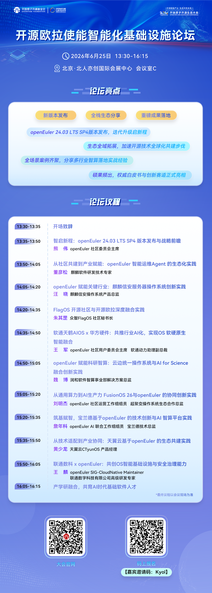

伴随着AI技术、多元算力飞速发展，操作系统已然成为智能时代技术创新与产业发展的核心基石。2026开放原子开源生态大会重磅来袭，开源欧拉使能智能化基础设施论坛蓄势待发，这场聚焦开源欧拉技术迭代、生态共建与行业落地的盛会，将于6月25日正式开启。论坛汇聚行业大咖、技术专家、生态伙伴与开发者，一同解锁开源欧拉在智能化基础设施领域的全新突破，共绘开源生态发展新蓝图。

论坛精彩亮点+完整论坛议程，即刻抢先解锁！

