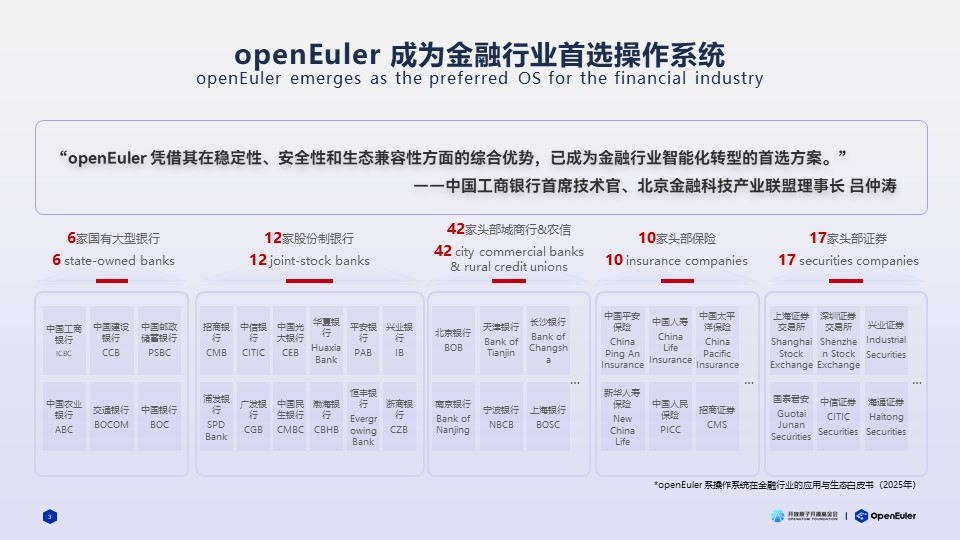
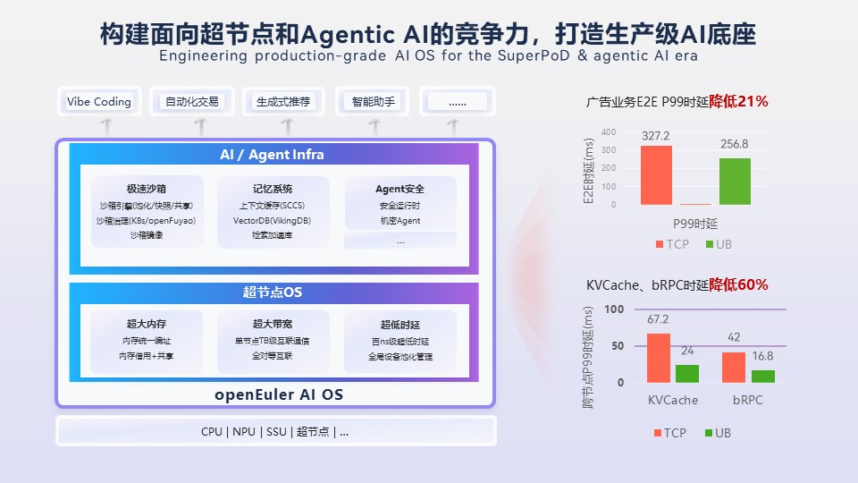
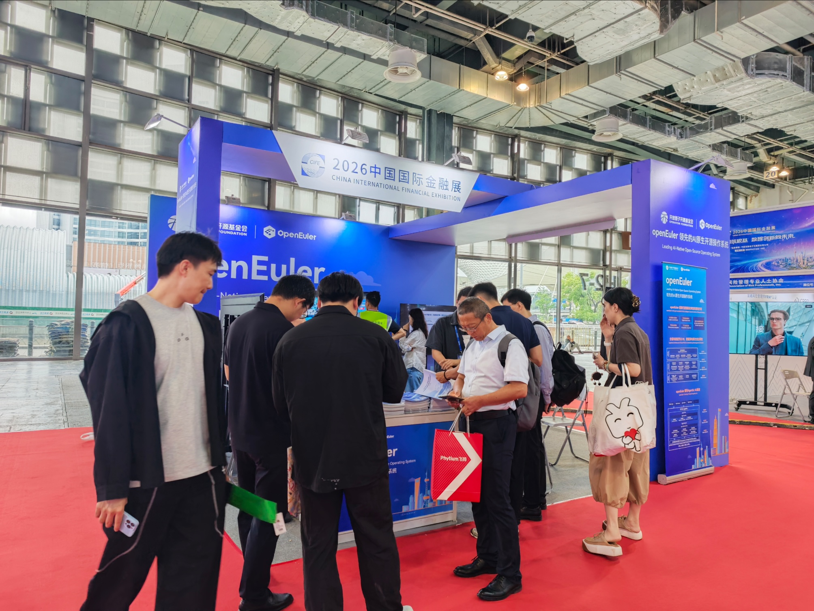

2026年6月16—18日，备受行业关注的中国国际金融展（简称“本届展会” ）在上海世博展览馆圆满开展。在央行指导、上海地方政府鼎力支持下，展会集结金融领域顶尖机构与技术力量，共同探索数字金融转型新机遇。OpenAtom openEuler（简称“openEuler”或“开源欧拉”）作为领先的开源操作系统，携金融场景技术成果与生态实践重磅亮相，深度参与海外分论坛与创新技术展区，全方位展现开源操作系统在金融行业的技术实力与产业价值。

## openEuler 成为金融行业首选操作系统

中国工商银行前首席技术官、北京金融科技产业联盟理事长吕仲涛先生曾高度评价 openEuler，称其凭借其在稳定性、安全性和生态兼容性方面的综合优势，已成为金融行业智能化转型的首选方案。目前，openEuler 操作系统在金融行业的规模化落地持续加速，已有6家国有大型银行、12家股份制银行、42家头部城商行及农信机构、8家投保保险公司以及17家头部证券公司完成批量部署应用。

## openEuler 加速金融行业智能化转型

6月16日下午，在《数字金融的双向奔赴—全球化布局与高质量发展》分论坛上，OpenAtom openEuler品牌委员会委员李明先生，现场分享了openEuler 的生态建设成果及商业化落地成效。

截至目前，openEuler 开源已6年，社区伙伴增加到2100多家，已成为规模领先的开源操作系统社区。据沙利文报告显示，2025年金融行业新增服务器市场份额openEuler占比达87.2%，是中国金融行业操作系统无可争议的领头羊。

会上，李明先生还分享了两大实践案例。一是中国工商银行基于 openEuler 的在离线业务混部方案，通过基于负载预测技术优化在离线业务的调度，以及内核层面优化进程级别的业务之间的干扰，成功实现混合资源池资源利用率超50%，优化了超2800台物理服务器、400多块 GPU 的利用率，极大节省公司成本。二是中国建设银行基于openEuler 的迁移方案，短期内便在信用卡核心银行系统中引入了Arm，openEuler，GaussDB 的技术栈，实现了双轨并行，使核心业务方案更加多样化，业务连续性得到了保障。这套系统已经服务超过1亿账户，2亿张信用卡，交易量超3万亿人民币。

OpenAtom openEuler品牌委员会委员 李明

在 Agent 时代，openEuler 致力构建面向超节点和 Agentic AI 的竞争力，打造生产级AI底座。针对南向硬件，去年底推出超节点 OS，通过内核异构设备管理优化，最大化释放硬件大内存、高带宽、低延迟能力；面向北向应用，搭建极速沙箱、记忆系统、安全管控于一体的 Agent 基础设施，大幅提升 Agent 的开发、运行效率。

分论坛上，openEuler 社区生态伙伴灵雀云（Alauda）创始人兼 CEO 左玥先生进行了介绍。灵雀云公司提供技术产品化、长周期支持、安全响应与合规适配，打通开源根技术从社区到企业生产环境的落地链路。

灵雀云 Alauda OS 是依托 openEuler 开源底座打造的成熟企业级商用操作系统。以 openEuler、openFuyao 为根技术底座，深度融合硬件算力与容器能力，解决金融业自主可控、数据安全、多类型算力融合等行业难题。目前相关解决方案已成功落地东南亚、非洲多家头部银行项目，充分彰显开源底层技术赋能金融现代化转型的价值。

灵雀云（Alauda）创始人兼 CEO 左玥

## openEuler携手生态伙伴亮相创新技术展区

在创新技术展区中，openEuler 社区与生态伙伴麒麟软件、灵雀云等联袂亮相，openEuler 社区展示了在 AI 技术、超节点 OS 及开源生态建设领域的最新成果；麒麟信安、灵雀云等生态伙伴，带来多项基于 openEuler 打造的金融创新合作案例。

展区现场

本届国际金融展上，openEuler 社区联合生态伙伴展出多项金融创新成果，依托超节点 OS 释放异构算力、支撑 Agentic AI 迭代，协同共建开源产业生态，为金融业数智转型提供完整实践路径。未来，社区将持续深耕金融场景，以开源根技术助力金融科技高质量发展。