6月25-26日，2026开放原子开源生态大会在北京圆满举办。作为开源操作系统领域的重要力量，OpenAtom openEuler（简称“openEuler”或“开源欧拉”）深度参与大会开幕式、专题论坛、生态交流等多个环节，围绕“AI+全球化”战略方向，集中展示了 openEuler 在版本演进、智能化基础设施、产业协同、国际化发展和开发者共建等方面的最新成果。

## 国际生态迈出新一步,全球开源协作持续深化

在大会开幕式上，正式宣布哈萨克斯坦自由云加入开源欧拉社区生态建设，成为 openEuler 社区首家境外实体生态伙伴。自由云将完成对社区的捐赠，openEuler的技术成果、生态经验与社区治理模式，也将进一步走向更广阔的国际产业场景。

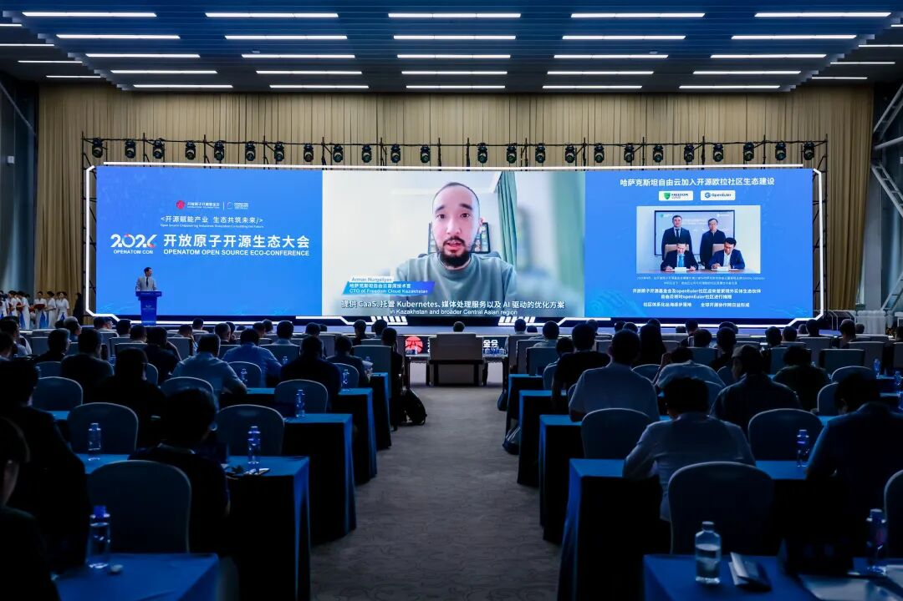

哈萨克斯坦自由云首席技术官 Arman Nurgaliyev 发表寄语

10位在开源欧拉社区作出突出贡献的开发者在开幕式的明星开源项目贡献者致谢仪式上获得荣誉致谢。开发者是开源社区持续演进的核心力量，从代码贡献、版本共建到生态协同，每一份长期投入都在推动 openEuler 技术能力持续沉淀，并进一步转化为面向产业场景的开源创新动能。

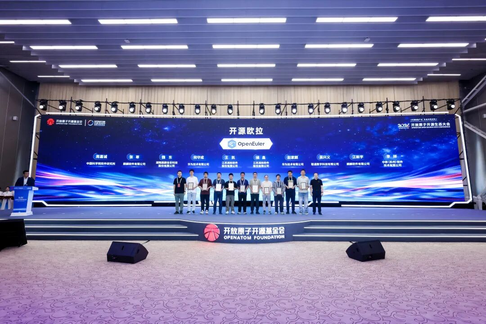

明星开源项目贡献者致谢仪式

## 聚焦智能化基础设施，展现openEuler生态共建成果

大会期间，“开源欧拉使能智能化基础设施论坛”成为 openEuler 展示生态进展与产业价值的重要窗口。论坛围绕智能化基础设施这一核心命题，集中呈现了 openEuler 在版本能力、AI 原生、行业场景和生态协同等方面的最新实践。

论坛开场环节，开放原子开源基金会副秘书长李博在致辞中表示，开源欧拉在基金会的培育与生态伙伴的共同建设下，已成长为中国基础软件生态的重要力量。面向智能化基础设施持续演进，基金会将继续支持 openEuler 在技术创新、生态治理、国际化拓展与人才培养等方面高质量发展，推动社区从操作系统底座迈向智能化基础设施底座。

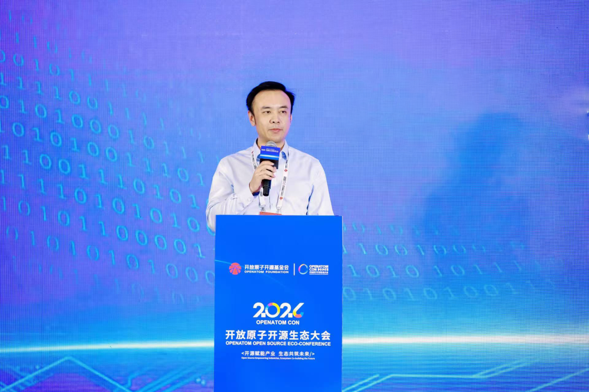

李博，开放原子开源基金会副秘书长

openEuler 24.03 LTS SP4 正式发布。该版本面向服务器、云计算、灵衢超节点和 AI 等场景持续增强能力，在弹性内存、64K 内核、AI 图编译器、虚拟化优化、低时延通信、Agent 沙箱、推理场景软件适配和智能调优等方面进一步升级，为 AI 原生基础设施、超节点异构融合和生产级应用持续夯实操作系统底座。面向未来，openEuler 将沿着“AI + 全球化”战略持续演进，加快海外开发者、镜像站点、主流公有云和上游开源社区协同布局，建设更具全球影响力的开源 OS 社区。

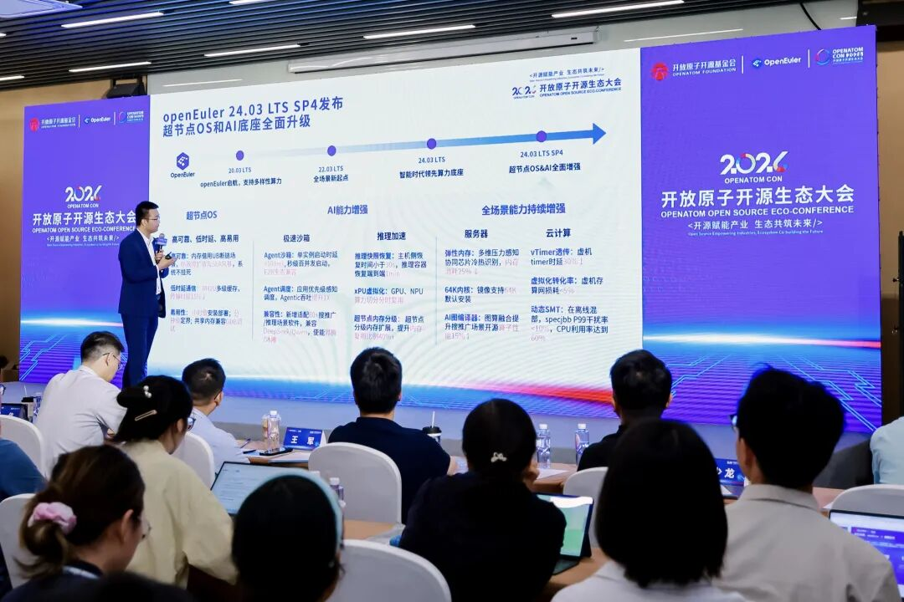

熊伟，openEuler委员会主席《智启新程：openEuler 24.03 LTS SP4版本发布与战略前瞻》

在智能运维方向，麒麟软件展示了 openEuler 智能运维 Agent 的生态化实践。面向日志分析、故障定位、知识检索和经验复用等生产现场难题，智能运维 Agent 将社区知识、系统工具与运维经验转化为可检索、可验证、可回流的能力，进一步提升生产系统的运维效率，也让社区长期积累的工程经验更直接地进入客户现场。

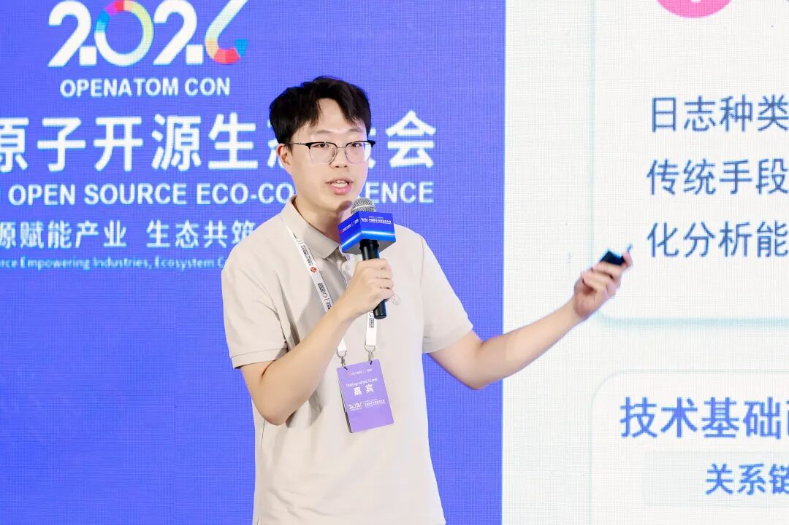

李孟虓 麒麟软件研发工程师《从社区共建到产业赋能：openEuler智能运维Agent的生态化实践》

在关键行业落地方面，麒麟信安基于openEuler打造服务器操作系统创新实践，面向电力、政务、特种行业等高可靠场景，叠加安全加固、应用适配、性能调优、运维服务和定制化能力，体现openEuler在关键行业可信落地中的基础价值。openEuler正在与行业业务需求、安全合规要求和真实应用场景深度结合，成为支撑行业数字化与智能化转型的重要底座。

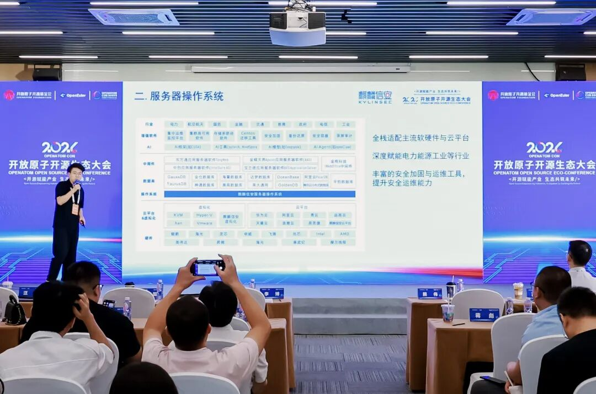

汪晓，麒麟信安操作系统产品总监《openEuler赋能关键行业：麒麟信安服务器操作系统创新实践》

软通天鹤AIOS与软通华方硬件的联合实践，展示了openEuler 生态在OS与硬件原生智能融合上的探索。天鹤AIOS 围绕AI模型管理、训推一体、异构算力调度、全栈优化和预置 AI Agent 等能力，推动操作系统从资源管理底座向 AI 应用使能平台演进。论坛期间，软通天鹤AIOS商业版及《软通天鹤OS AI开发实践白皮书》重磅发布，进一步将AIOS工程化实践沉淀为可复用、可推广的方法论成果，为更多企业基于openEuler构建 AI 原生基础设施、推进 AI 应用落地提供了实践参考。

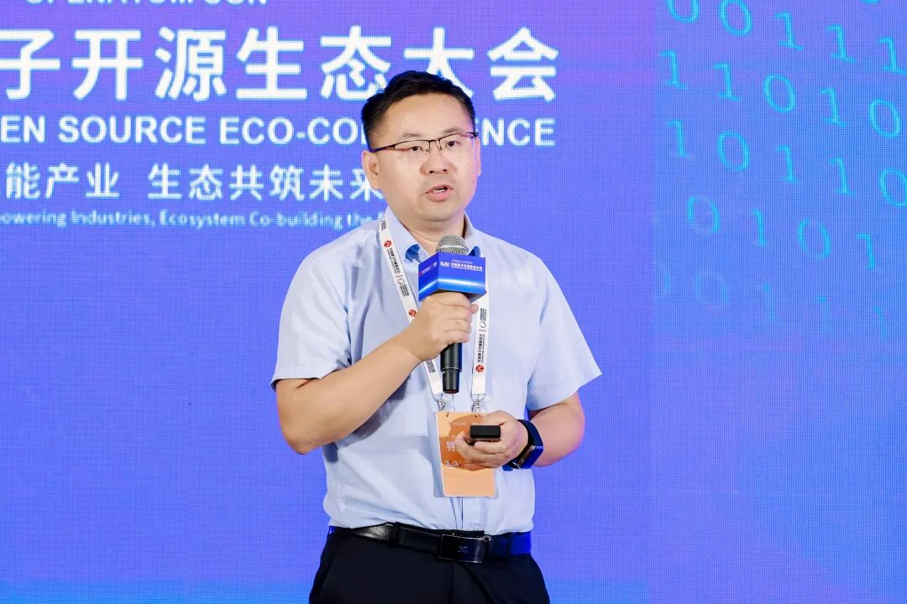

王军，openEuler用户委员会主席 软通动力助理副总裁《软通天鹤AIOS x 华方硬件：共推行业AI化，实现OS软硬原生智能融合》

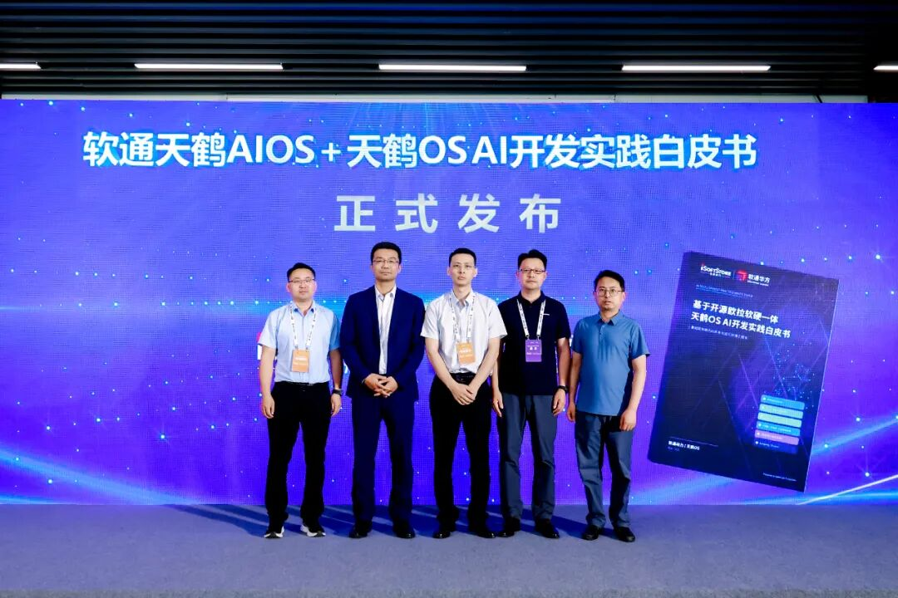

软通天鹤OS AI开发实践白皮书发布

科研智算场景同样对操作系统提出了更高要求。润和软件围绕云边统一操作系统与AI for Science融合创新实践，展示了openEuler在科研数据处理、异构算力调度、AI 分析与预测等场景中的支撑价值。openEuler作为统一基础底座，可以连接科研数据、算力资源、AI平台和现场业务系统，为AI for Science提供更加稳定、高效、可扩展的基础设施。

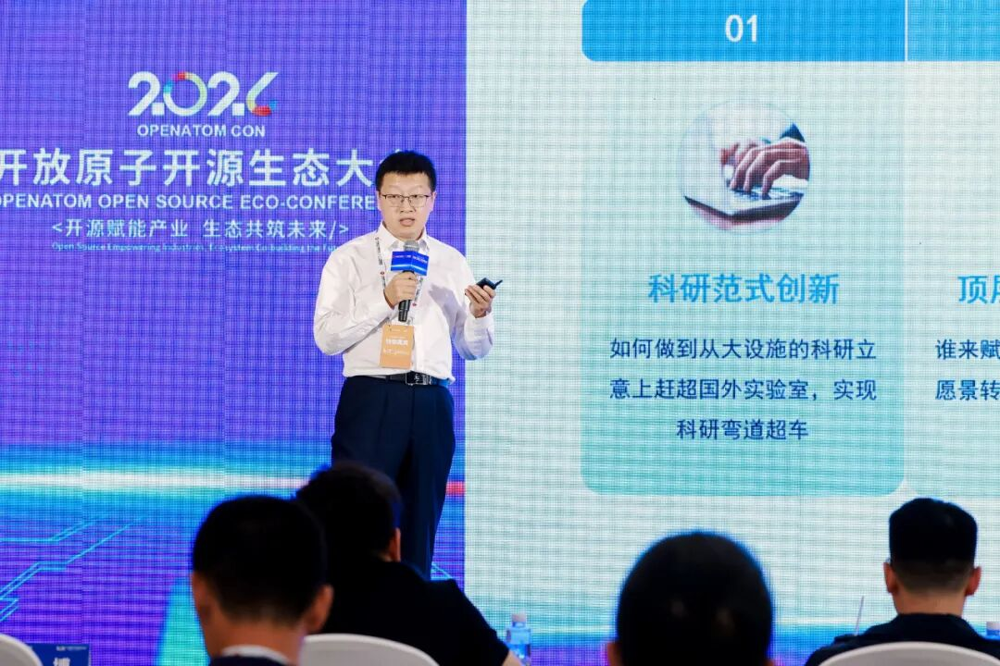

魏博，润和软件智算事业部解决方案总监《openEuler 赋能科研智算：云边统一操作系统与 AI for Science 融合创新实践》

FusionOS 26 的分享聚焦基于 openEuler 构建 AI 原生操作系统的实践探索。面向企业 AI 落地中的算力使用、Token 消耗、资源调度、安全管控和版本演进等挑战，FusionOS 26 在 openEuler 底座之上强化推理加速、双模运行时、内生安全、原生 Agent 和资源监控自愈等能力，进一步拓展了 openEuler 在 AI 生产环境中的承载边界。

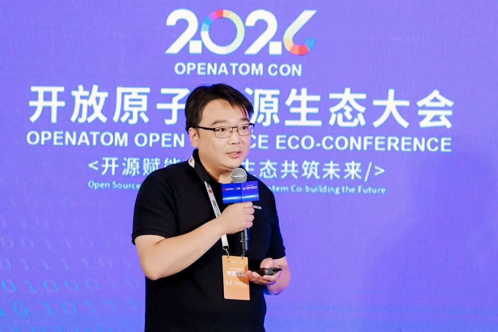

刘明杰，openEuler社区运营工作组组员 超聚变操作系统生态合作总监《FusionOS 26 AI原生操作系统：重新定义智能时代的操作系统 》

宝兰德基于 openEuler 展示了基础软件与 AI 智算平台的融合实践。围绕中间件、天工 JDK、AIOS、智算平台和智能运维等方向，宝兰德将 openEuler 底座能力延伸到企业应用运行、模型服务、算力调度和运维管理等环节，为行业客户构建稳定、高效、智能化的数字基础设施提供了新的实践参考。

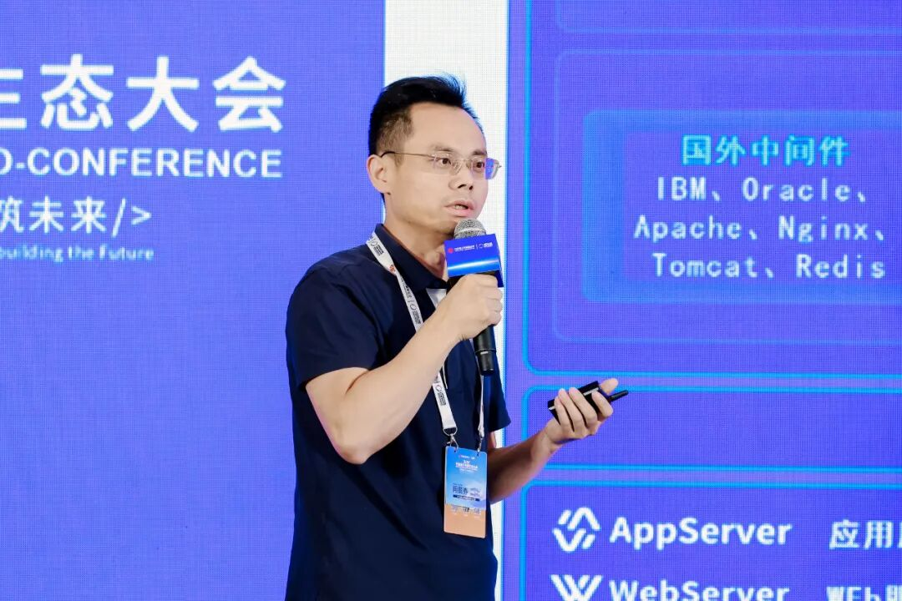

詹年科，openEuler AI 联合工作组组员  宝兰德技术总监《筑基赋智，宝兰德基于openEuler的技术创新与AI智算平台实践》

天翼云立足云上大规模生产实践，系统展示了 CTyunOS 在复杂云基础设施场景中的能力沉淀，以及与 openEuler 社区的生态共建成果。双方探索从单点技术适配，进一步拓展至长期稳定运行、AI能力融合等重点方向。一方面，CTyunOS 面向天翼云生产环境持续增强操作系统底座能力；另一方面，通过工程实践反馈与社区协同机制，推动其可靠性、智能化等核心能力在openEuler 生态中持续共建与演进。

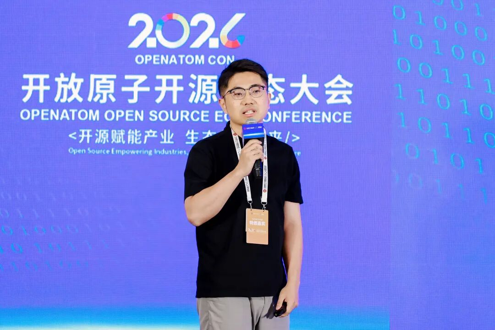

黄少龙，天翼云CTyunOS产品经理《从技术适配到产业协同：天翼云基于openEuler的生态共建实践》

联通数科围绕 CUOS 与 openEuler 的协同实践，展示了 OS 智能基础设施与安全治理能力的建设方向。通过 AI 构建流水线、发行版管理、供应链安全征信、漏洞治理与级联管控等探索，联通数科进一步拓展了 openEuler 在运营商云、行业云和安全可信基础设施中的应用边界。

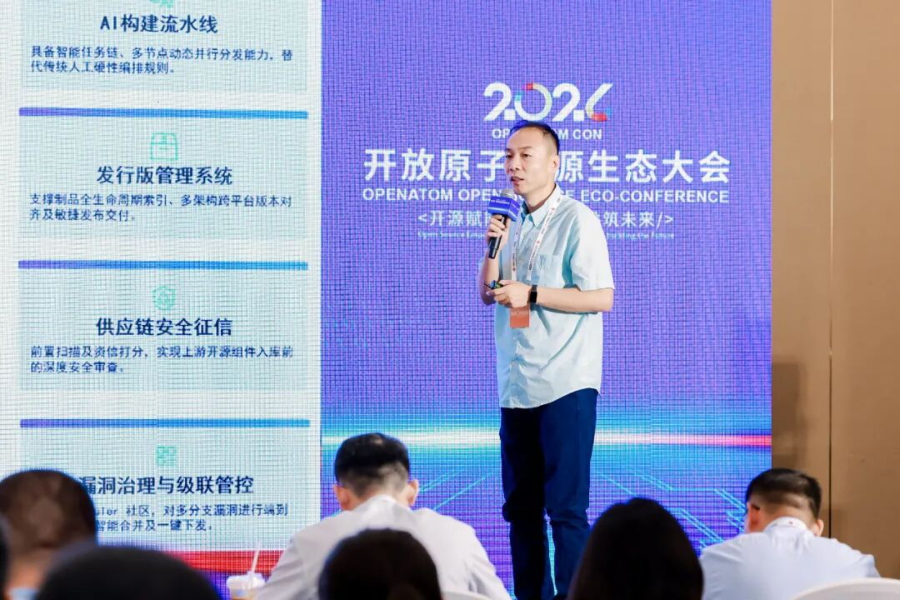

王麟，openEuler SIG-CloudNative Maintainer  联通数字科技有限公司高级研发专家《联通数科携手 openEuler 共创 OS智能基础设施与安全治理能力》

## 生态交流区：连接需求、技术与合作

大会两天期间，开源欧拉生态交流区也成为专家、开发者、行业用户和生态伙伴深入交流的重要场域。围绕版本能力、行业迁移适配、AIOS、智能运维、科研智算、云上生产级部署、安全治理等话题，现场嘉宾展开了多维度交流。通过面对面交流，openEuler 进一步连接产业需求、技术实践和生态合作，也为后续联合创新、行业落地和国际合作积累了新的连接点。

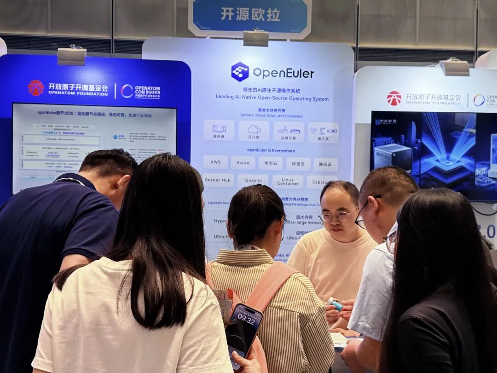

现场交流

面向 AI 原生与全球化的新周期，openEuler 将继续坚持开放协作、生态共建和产业落地，携手全球开发者与生态伙伴，共同构筑智能时代可信、开放、繁荣的基础软件生态。