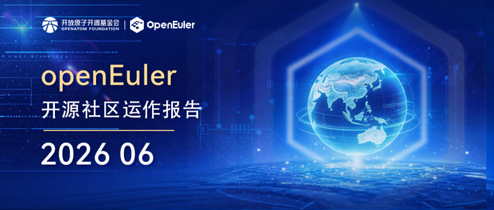

## 概述

2026年6月，OpenAtom openEuler（简称“openEuler”或“开源欧拉”）社区在稳步发展基础上持续推进技术演进与生态建设协同发展，社区规模与活跃度持续提升，用户、开发者及单位成员稳步增长，社区贡献不断积累。本月，openEuler 24.03 LTS SP4版本正式上线发布，进一步深化AI与全场景创新能力。在生态与运营方面，通过持续开展高校走访、Meetup交流及行业展会参与（如中国国际金融展、开放原子开源生态大会等），强化产业协同与人才培养，推动社区开源生态发展。在技术方面，围绕AI与操作系统深度融合持续创新，在运维知识体系、CVE自动化修复、Agent安全体系及沙箱运行环境等方向取得进展，并推动大模型生态适配与应用落地。整体来看，社区在规模增长与技术创新双轮驱动下持续强化开源底座能力与产业服务能力，加速向智能化基础设施演进。

（本月报阅读时长约8分钟）

## 社区规模

截至2026年6月30日，openEuler 社区用户累计超过725万，超过2.8万名开发者在社区持续贡献。社区单位成员达2167家，SIG组110个，累计产生301.1K个PR、150.3K条Issue、5387.3K条Comment。

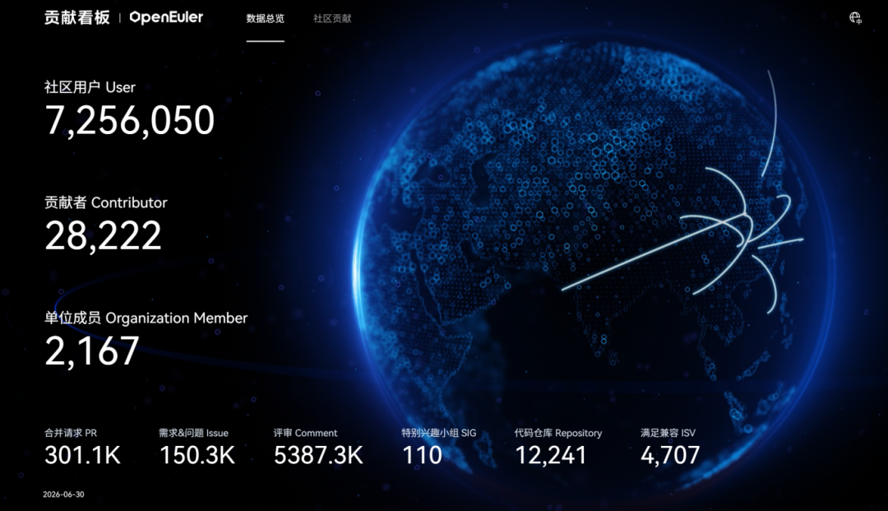

社区贡献看板（截至2026/06/30）

## 社区事件

### ➣openEuler 24.03 LTS SP4版本正式上线发布，深化AI与全场景创新

openEuler 24.03 LTS SP4 版本已正式上线发布，该版本为基于6.6内核的24.03-LTS版本增强扩展版本，面向服务器、云、AI场景，持续提供更多新特性和功能扩展，包括内核优化、灵衢超节点可靠性&易用性、NPU算力切分、推理服务快恢、沙箱、智能诊断&调优&运维、编译器、机密虚机等，给开发者和用户带来全新的体验，服务更多的领域和更多的用户。感谢来自社区39家成员单位的2006名开发者的贡献和支持，让我们携手同行，共建更好的openEuler。

openEuler 24.03 LTS SP4下载链接：<https://www.openeuler.org/zh/download/>

原文阅读：
[openEuler 24.03 LTS SP4版本正式上线发布，深化AI与全场景创新](https://mp.weixin.qq.com/s/wLWk8Slldd3n947jTXVs1A)

### ➣openEuler亮相开放原子开源生态大会，智能化基础设施建设再提速

6月25-26日，2026开放原子开源生态大会在北京圆满举办。作为开源操作系统领域的重要力量，openEuler深度参与大会开幕式、专题论坛、生态交流等多个环节，围绕“AI+全球化”战略方向，集中展示了 openEuler 在版本演进、智能化基础设施、产业协同、国际化发展和开发者共建等方面的最新成果。

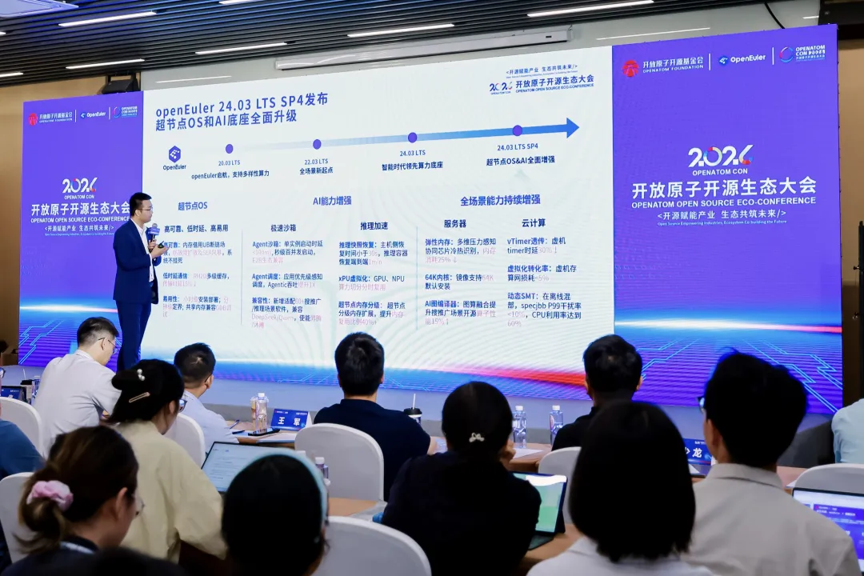

原文阅读：
[开源欧拉亮相开放原子开源生态大会，智能化基础设施建设再提速](https://mp.weixin.qq.com/s/YMeHPZHfM4_lo5TjCKGjPw)

### ➣openEuler 亮相中国国际金融展 筑牢金融行业智能化转型底座

6月16—18日，备受行业关注的中国国际金融展在上海世博展览馆圆满开展。在央行指导、上海地方政府鼎力支持下，展会集结金融领域顶尖机构与技术力量，共同探索数字金融转型新机遇。openEuler 作为领先的开源操作系统，携金融场景技术成果与生态实践重磅亮相，深度参与海外分论坛与创新技术展区，全方位展现开源操作系统在金融行业的技术实力与产业价值。

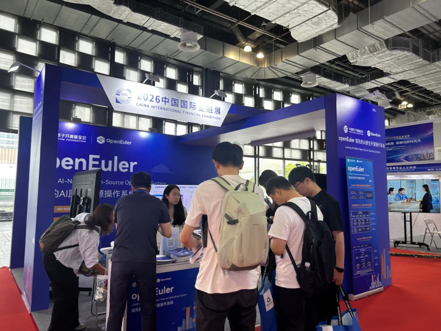

原文阅读：
[openEuler 亮相中国国际金融展 筑牢金融行业智能化转型底座](https://mp.weixin.qq.com/s/yX9-ibSHv3voqgiA_dcs5g)

### ➣openEuler技术委员会会议成功举办

6月26日，2025-2026年openEuler技术委员会线下会议在北京顺利召开，本次会议由联通数字科技有限公司承办。会议中，参会委员围绕工具链、内核安全、版本管理、包管理、AI智能组件、嵌入式开发、Rust重构、轻量化系统等核心技术板块，逐项审议社区技术规划、项目进展与落地倡议。全体委员针对各议题充分交流、充分论证，针对内核分级维护、AI工具共建、嵌入式独立工具仓、Rust改造落地节奏等事项形成统一执行方案，明确各SIG组分工与阶段推进节点。

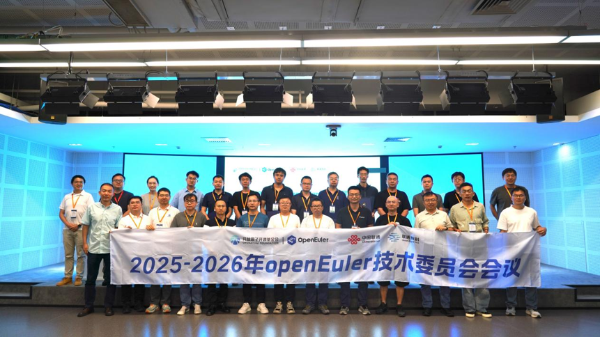

### ➣开源燎原 共筑中间件新生态 openEuler&东方通Meetup走进西安电子科技大学

6月10日，由 openEuler 与东方通社区联合举办的“轻舟泛海 云翼冲天”Meetup在西安电子科技大学成功举办。该系列活动相继走进北京、天津、武汉、青岛等城市的多所高校，持续将中间件与开源的理念传递给青年学子，开启了连接产业实践的窗口，为开源社区注入新生力量。本次西安站活动吸引了众多高校师生与业界专家，推动开源技术进入校园，推进开源人才培养计划，探讨中间件生态发展，共同助推基础软件自主创新发展进程。

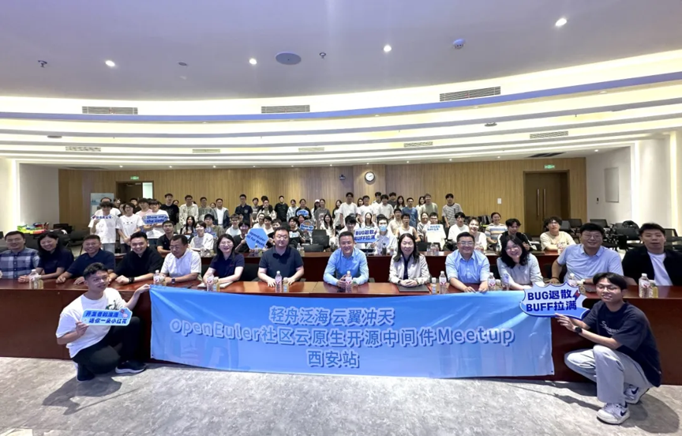

原文阅读：[开源燎原 共筑中间件新生态 东方通&openEuler Meetup走进西安电子科技大学](https://mp.weixin.qq.com/s/tofVwyZOUbhOW5FCbPedcA)

### ➣openEuler on RISC-V SIG 亮相 RISC-V 欧洲峰会，展示 RVA23 服务器系统生态进展

 6 月 8 日至 12 日，RISC-V Summit Europe 2026 在意大利博洛尼亚举行。openEuler on RISC-V SIG 围绕 “openEuler for RVA23: Building a RISC-V Server OS with Ecosystem Partners” 主题进行 Poster 展示，呈现 openEuler on RISC-V 面向 RVA23 服务器基线的阶段性进展与后续计划。

本次展示重点介绍了 openEuler 24.03 LTS SP3 对 RVA23 的支持进展，包括 UEFI ISO、QEMU 虚拟机镜像、开发板镜像等制品，以及在进迭时空 K3 平台上的安装验证。同时，openEuler on RISC-V 还围绕 RVCK 内核同源计划、工具链与基础库适配、香山 FPGA 服务器负载验证等方向，展示了 RISC-V 服务器操作系统公共底座建设进展。

后续，openEuler on RISC-V SIG 将继续面向 RVA23 及 RISC-V 服务器平台规范推进版本适配，联合生态伙伴完善 RISC-V 服务器软硬件生态。

### ➣openYuanrong 深度参与开放原子开源生态大会

openEuler核心SIG openYuanrong 深度参与6月25-26日在北京举办的开放原子开源生态大会，重点展示了在 Agent、推理及强化学习等领域的创新成果。现场干货满满，吸引了大批开发者驻足交流，项目关注度持续攀升。

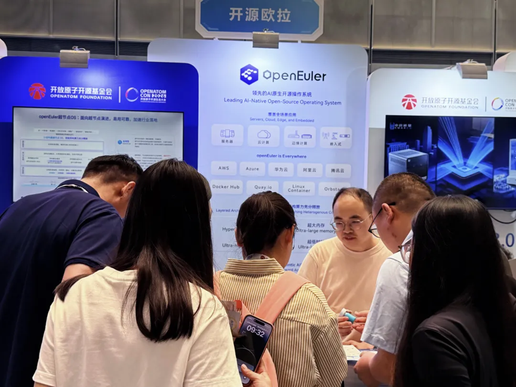

## 技术进展

### ➣openEuler社区重磅推出 Witty RAG Core，打造运维场景知识库底座

在 openEuler开源生态中，海量运维日志、故障手册、配置文档、版本更迭资料持续沉淀。散落的优质运维知识难以高效复用，成为众多运维工程师、企业技术团队的共同痛点。为破解运维知识碎片化、检索低效、落地困难等行业难题，openEuler 社区正式推出Witty RAG Core——一款面向企业级运维场景、分层解耦、高可扩展、支持全链路自定义开发的工业级 RAG 引擎底座。

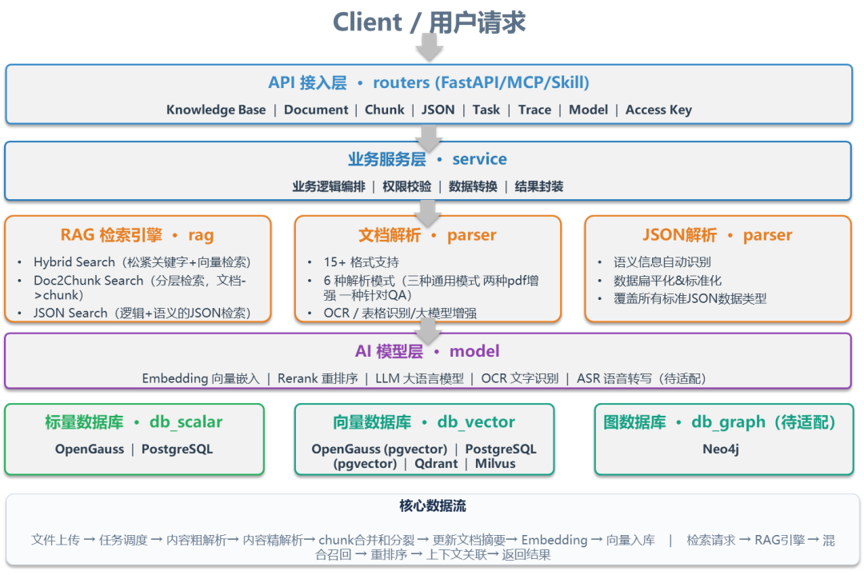

原文阅读：
[openEuler社区重磅推出 Witty RAG Core，打造运维场景知识库底座](https://mp.weixin.qq.com/s/0CapqI4cRvHs7-X1T4fBuQ)

### ➣openEuler社区AI漏洞修复平台：通过PatchFlow Agent完成内核CVE漏洞修复

在openEuler社区持续推进内核安全维护与工程效率提升的过程中，面向 CVE 修复场景构建的智能体工具 PatchFlow Agent 已在 openEuler 内核仓完成落地应用，并支撑超过 250 个 PR 成功合入，正逐步进入真实社区维护流程。

围绕 CVE 补丁处理这一任务，PatchFlow Agent 以问题分析为起点，贯通修复提交获取、受影响分支分析、补丁应用、冲突回移植、拉取请求创建等关键环节，形成了一条面向实际维护场景的可执行、可复用、可扩展流程闭环，也为多分支维护、批量回移植等任务提供了更加高效的支撑方式。

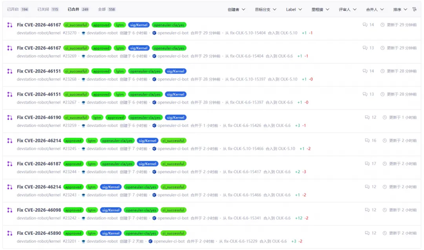

原文阅读：
[openEuler社区AI漏洞修复平台：通过PatchFlow Agent完成内核CVE漏洞修复](https://mp.weixin.qq.com/s/sXpZ2GtrjvS8taIqq-3hMg)

### ➣openEuler社区AI漏洞修复平台：基于Agent Workflow实现外围包CVE智能修复

openEuler社区持续推进海量软件包的智能化运维效能提升，其中面向外围包CVE修复场景，由“Agent编排+Harness工程”驱动的Agent Workflow智能化补丁作业系统已在600+外围包仓库完成落地应用，支撑超过110+成功合入。这套外围包CVE补丁作业系统简称为“PatchHarness”。

原文阅读：
[openEuler社区AI漏洞修复平台：基于Agent Workflow实现外围包CVE智能修复](https://mp.weixin.qq.com/s/1zQYua21ZKFTCnyq_Hs0Sg)

### ➣openEuler Agentic安全纵深防御方案：让用户敢用和放心地使用Agent

AI Agent正在快速渗透企业生产环境，但它的安全机制远未跟上能力进化的步伐。问题的根源在于意识安全、行为安全、数据安全、供应链安全这四大方面。openEuler社区发布的Agent全链路安全方案，正是为了解决这一困局而推出。

AI Agent的安全不是某一项技术能够独立解决的命题。openEuler的安全纵深防御方案，通过安全意识skill和基于TEE的AI可信意图凭据实现意识的约束和安全，通过确定性行为链路监控(AgentMoss)实现Agent全局行为透明可控，基于TEE的硬件级数据保险箱实现API/key、用户长期记忆等数据可用不可见，在三个关键维度上同时发力，形成完整的纵深防护体系。

原文阅读：
[openEuler Agentic安全纵深防御方案： 让用户敢用和放心地使用Agent](https://mp.weixin.qq.com/s/9ru8P40QkToK53RtmYr1VQ)

### ➣实时多模型调度：动态模型编排的系统级解法

当前以 LeRobot 为代表的具身智能框架，普遍采用”单模型 per Launch”的设计：系统启动时选定唯一的推理模型，整个运行周期内不切换。这在单一任务、固定场景的 Demo 阶段够用。但进入真实环境后，问题会明显变复杂。

多模型调度要解决的问题可以概括为一句话：让对的模型，在对的时刻，跑在对的设备上。
原文阅读：IB-Robot系列 | 实时多模型调度：动态模型编排的系统级解法

### ➣基于 openEuler 和 vLLM Ascend，快速上手 GLM-5.2指南

6月17日，智谱新一代旗舰基础模型GLM-5.2正式上线并开源。作为GLM系列迭代升级的重磅基座模型，GLM-5.2在上下文长度、代码能力、长程任务、智能体任务等领域实现全方位突破，从“答得好”走向“干得久”。 GLM-5.2 在前端开发、后端架构及长程任务等核心场景的成功率上，相比前一代 GLM-5.1 实现了全面提升，在处理复杂系统工程与深度调试时展现出更高的稳定性。在主流编程基准测试中，GLM-5.2 持续保持开源模型 SOTA（最优）地位，其综合能力已与海外顶尖模型 Claude Opus 4.8 处于同一可比区间。

本指南将采用 vLLM Ascend 的容器镜像启动方式，在昇腾 Atlas 800 A3 (128G × 8) 节点上运行GLM-5.2。

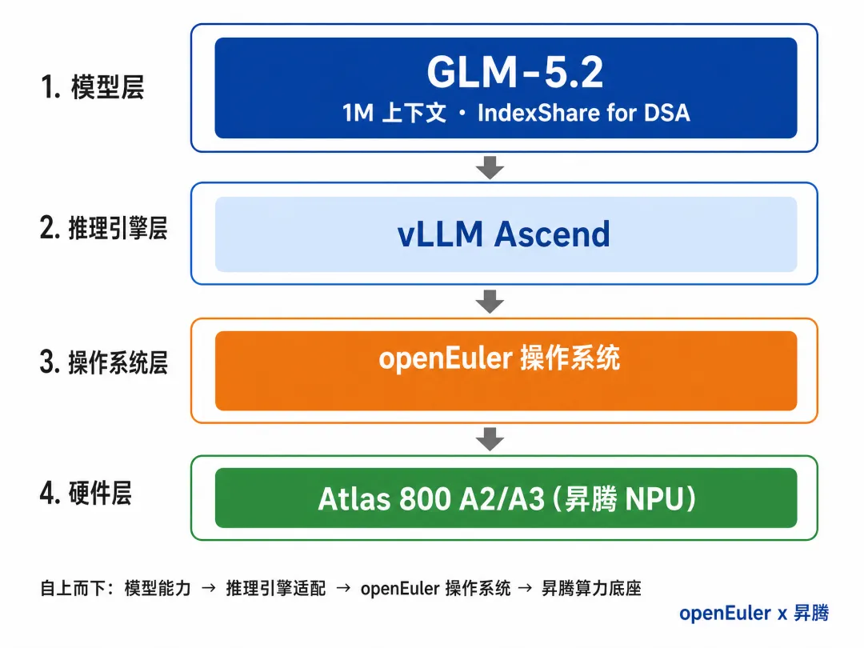

原文阅读：
[Day 0 详细操作指南！基于 openEuler 和 vLLM Ascend，教你快速上手 GLM-5.2](https://mp.weixin.qq.com/s/EoaXpmihpx69IsG1hjC_fQ)

### ➣openEuler Conch 沙箱引擎：让 AI Agent 运行现场可流转、可恢复

随着 AI Agent 走向有状态、可恢复的复杂执行环境，传统 OCI 镜像已难以覆盖沙箱启动与恢复需求。openEuler Conch 沙箱引擎围绕 AI Agent 场景，探索完整沙箱镜像体系，将 rootfs、sandbox 启动基础和运行态快照统一组织为可启动、可分发、可恢复的镜像资产，打通从镜像转换、分发到恢复的端到端链路，为智能体运行提供更安全、灵活的沙箱基础。

原文阅读：
[openEuler Conch沙箱引擎：AI Agent 需要什么样的“完整沙箱镜像”？](https://mp.weixin.qq.com/s/MpDh4gWl4mORGRvdHgi_ZQ)

### ➣UMDK在openEuler 24.03 LTS SP4版本中提供三大新特性

URMA容器EID共享模式：一种容器间共享EID的机制。屏蔽底层多代际NPU差异，通过统一命令集实现跨代际适配，一套命令即可操作容器，降低适配复杂度，提升UB易用性。

IPoURMA：提供了一种基于UB协议和硬件传输IP数据包的标准化方法。融合UB高性能特性与以太网的广泛兼容性，在UB网络能够取代以太网卡提供标准TCP协议栈的socket API，提升UB易用性。

UMQ：灵衢消息队列，将URMA语义抽象为消息队列语义，北向对接URPC以及三方xRPC，为其提供免拷贝传输、大规模连接等RPC消息通信底座能力。 

### ➣DevStation智能助手：AI Agent 交互平台的新范式

在 AI Agent 技术快速发展的背景下，如何高效地管理、编排和运行多个智能体，并为其提供丰富的工具与技能生态，成为当前 AI 基础设施领域的关键挑战。

PolyMind 是一个原生集成 agentd 服务的自托管 AI Agent 交互平台，采用前后端分离的架构设计，前端专注交互体验，后端 witty-service（agentd 运行时）负责 Agent 的完整生命周期管理和 API 服务。由 openEuler 社区孵化，致力于将 AI 对话、Agent 工作流编排与多模型管理融为一体，提供开箱即用的完整解决方案。

目前，该平台已在 Agent 运行时生命周期管理、技能生态建设、模型统一管理、安全漏洞自动化修复等方面取得了显著进展。

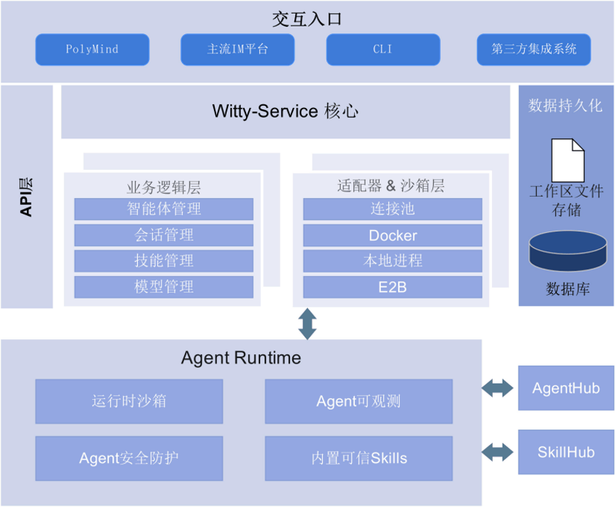

## 容器镜像更新

**统计周期**：2026年6月1日 - 2026年6月30日
**数据来源**：<https://gitcode.com/openeuler/openeuler-docker-images>

截至2026-07-01，社区公有容器镜像总量达1425个。2026年6月期间，基于24.03-LTS-SP3基础镜像已完成8个上层应用镜像的升级，80个应用镜像的新增。具体分类如下：

### 升级镜像（8 个）

| 镜像类别 | 数量 | 镜像名称 | 版本号 |
|---|---|---|---|
| Cloud | 1 | libvirt | 12.4.0 |
| Bigdata | 2 | kibana、lucene | 9.4.2、10.5.0 |
| Database | 1 | orientdb | 3.2.53 |
| Others | 4 | next、node、pacemaker、react | 16.2.7、26.3.0、3.0.2、19.2.7 |

> 说明：本期自动升级流程共触发 9 个 MR，其中 openvelinux（!2754）仅更新了版本探测脚本，未产生实际 Dockerfile 版本变更，故未计入本表。

### 新增镜像（80 个）

| 镜像类别 | 数量 | 镜像名称 | 版本号 |
|---|---|---|---|
| HPC | 38 | cactus、chaste、chroma、circos、cmaq、cmaq、code-saturne、code_aster、cps_public、cufflinks、dealii、elmer、espresso、fasta、fds、hh-suite、kalign、kb_python、meep、meryl、ncl、ncview、novoplasty、palabos、parafem、petsc、phono3py、proteinmpnn、prottest3、pwdft、qmcpack、rdkit、roms、seissol、swmm、tophat、velvet、wannier_tools | 3.2.1、2026.1、chroma-3-44-0、0.52、5.5.2Oct2024、5.5、8.0.5、f603c14、5_2_5、2.2.1、9.7.1、26.2.1、5.0.0、2.3.6、6.11.0、3.3.0、3.5.1、0.30.2、1.33.0、1.4.1、6.6.2、fbf1aec、4.3.5、2.3.0、5.0.3、3.25.1、4.1.0、1.0.1、3.4.2-release、1.0.0、4.2.0、2026_03_3、4.2、202103.Sumatra、5.2.4、2.1.2、1.2.10、2.6.2 |
| Others | 14 | bind9、fbthrift、glassfish、libyuv、mongoose、monolith、multiwfn、ndpi、rabitq-library、rust、scann、sonic-cpp、tongsuo、vvenc | 9.21.23、2026.06.22.00、710-20250515-before-cpenv、1948、7.22、135c491、cb37c53、5.0、7c2d0d7、1.95.0、1.4.2、1.0.2、8.4.0、1.14.0 |
| Cloud | 11 | cloudwego、deathstarbench、e2b、fluid、kata-containers、kubeflow、kuberay、opencloudos、openvelinux、ovirt-engine、sriov-network-operator | 0.16.2、0.4.1、2.29.4、1.0.8、3.31.0、1.10.0、1.6.2、1.2.11、1.0、4.5.7、1.6.0 |
| Bigdata | 5 | bolt、celeborn、kylin、oozie、spark | 6b54e46、0.6.3、5.0.3、5.2.1、4.1.2 |
| AI | 7 | faiss、langgraph、sglang、tensorrt-llm、torchvision、vllm-cpu、xla | 20180223、1.2.5、0.5.13、1.2.1、0.27.1、0.23.0、3b0ff80 |
| Storage | 4 | 3fs、juicefs、mooncake、reedsolomon | 22fca04、1.3.1、0.3.11.post1、1.14.1 |
| Database | 1 | redis | 5.4.1 |

容器镜像可通过 Docker Hub 拉取使用，仓库地址：[hub.docker.com/u/openeuler](https://hub.docker.com/u/openeuler)

## 软硬件兼容性测评
截至2026年6月30日，通过openEuler 软硬件兼容性测评的产品累计达2729款，6月新增40款，其中北向（ISV）新增34款，南向（IHV）新增6款。

- 兼容性列表：<https://www.openeuler.org/zh/compatibility/>

- OSV技术测评列表：<https://www.openeuler.org/zh/approve/>

## 安全公告

2026年6月，社区共发布安全公告275个，修复漏洞129个（其中 Critical 16个，High 57个，其它56个）。

openEuler社区针对在维版本例行修复漏洞，发布安全补丁。建议用户关注openEuler官网安全公告，及时安装漏洞补丁进行防护。

openEuler 安全公告：<https://www.openeuler.org/zh/security/security-bulletins/>

## 致谢

openEuler社区的发展离不开每一位参与者的共同努力。每一次代码提交、每一次技术讨论、每一次经验分享，都在不断推动社区向前发展，也共同汇聚成社区持续成长的动力。
由于社区实践与成果持续涌现，月报在整理过程中难免有所遗漏。如有尚未收录的重要进展或贡献，欢迎与我们联系补充，让更多努力被记录与传递。

在此，向为本期月报提供资料支持的各 SIG 组以及广大开发者朋友们致以诚挚的感谢与敬意。

若您希望在月报中补充相关工作内容，或对月报内容提出意见和建议，欢迎联系：contact@openeuler.io

