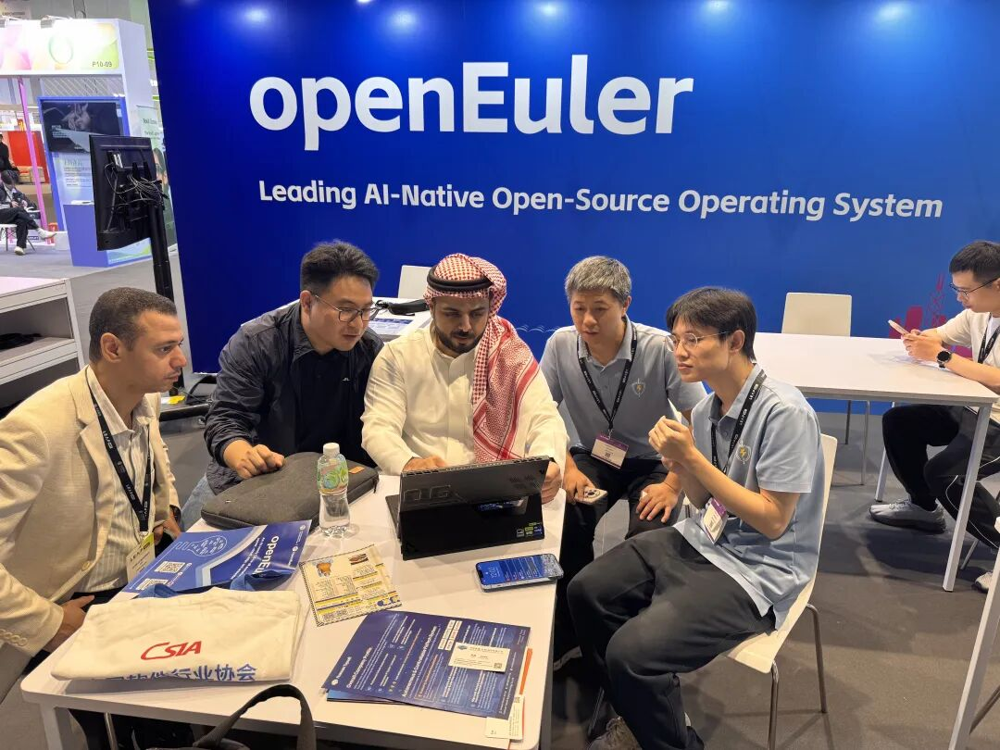
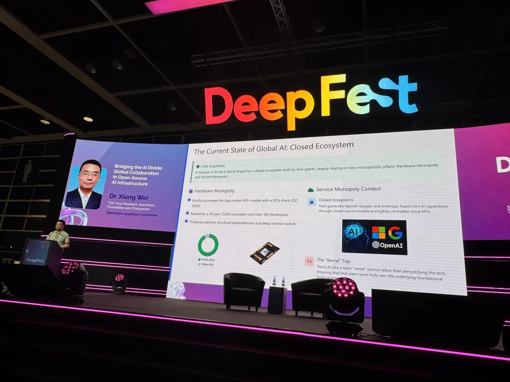

7月8日至10日，LEAP EAST 国际科技与信息技术展首度登陆亚太。作为源自沙特阿拉伯的全球旗舰科技盛会 LEAP 的亚洲专场，LEAP East 以“拓界新征程”（Into New Worlds）为主题，汇聚来自亚太、中东及全球市场的科技企业、投资者与行业领袖。OpenAtom openEuler（简称“openEuler”或“开源欧拉”）作为领先的开源操作系统，携 AI 领域技术成果与生态实践重磅亮相，深度参与分论坛与创新技术交流区，全方位展现开源操作系统的技术实力与产业价值。

## 亮相创新技术交流区，展示 AI 时代操作系统新能力

大会期间，openEuler 交流区成为现场备受关注的技术展示区域之一。重点展示了 openEuler 在 AI 技术、操作系统能力以及开源生态建设方面的最新进展，openEuler 社区超节点 OS、Agentic AI 等最新技术成果悉数登场。

现场，众多开发者、企业代表驻足交流，围绕 AI 基础设施建设、操作系统技术创新及开源生态合作等展开深入交流，共同探讨开源技术如何助力产业智能化升级。

## 聚焦全球 AI 基础设施竞争，分享开源协作实践

7月10日，在《The Race to Build Asia's AI Infrastructure》分论坛上，openEuler社区委员会主席熊伟现场分享了主题演讲《Bridging the AI Divide:Global Collaboration in Open-Source AI Infrastructure》。

演讲中，熊伟介绍了 openEuler 的生态建设成果及商业化落地成效，并与现场嘉宾一同探讨亚洲如何在下一代人工智能系统提供动力的竞赛中展开竞争，展示 openEuler 在其中的技术优势和亮点，在开源人工智能基础设施的全球协作。

本次活动上，openEuler 社区展出了多项技术创新成果，依托超节点 OS 释放异构算力、支撑 Agentic AI 迭代，协同共建开源产业生态，为数智转型提供完整实践路径。未来，社区将在 AI 领域持续深耕，以开源根技术助力 OS 高质量发展。
