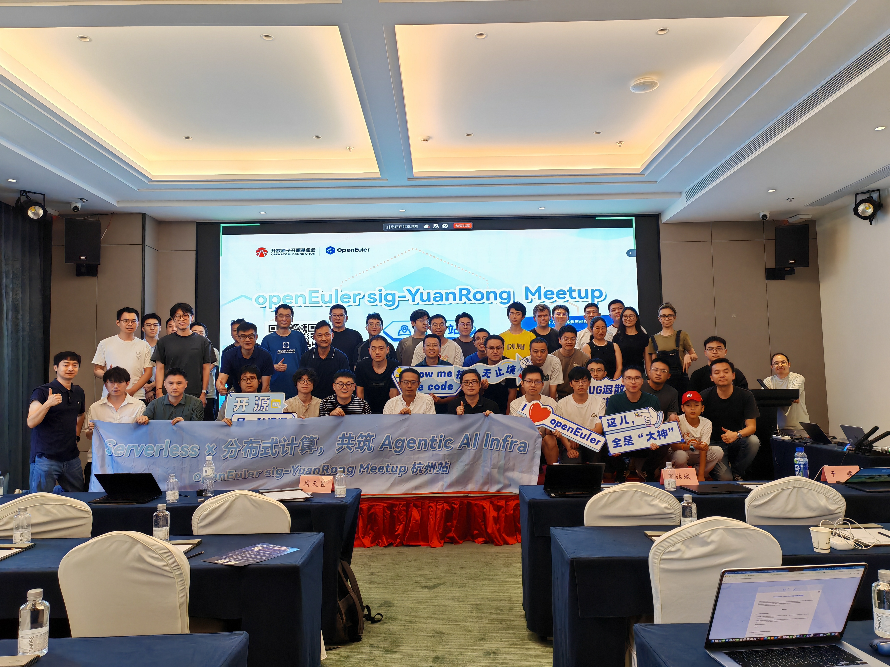
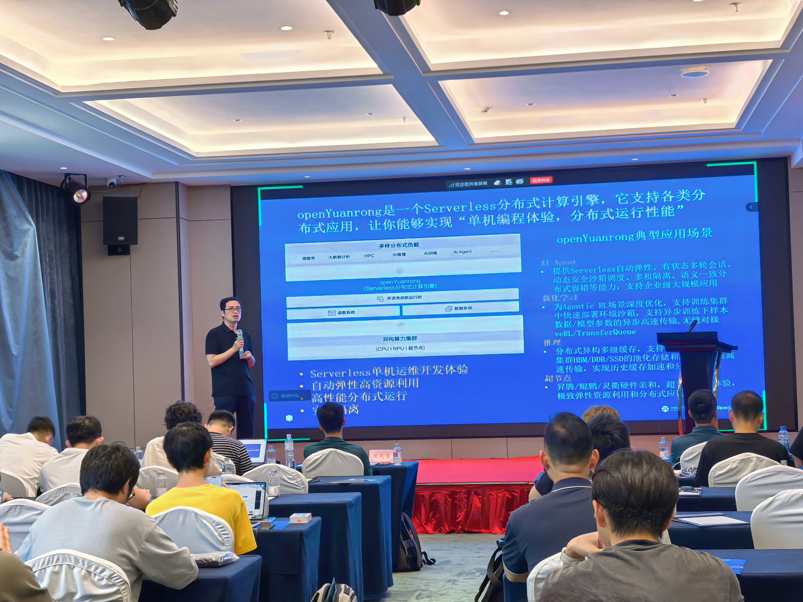
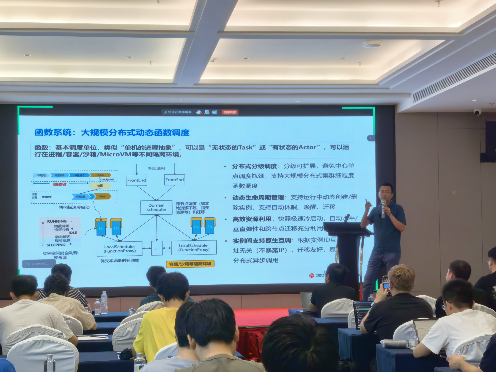
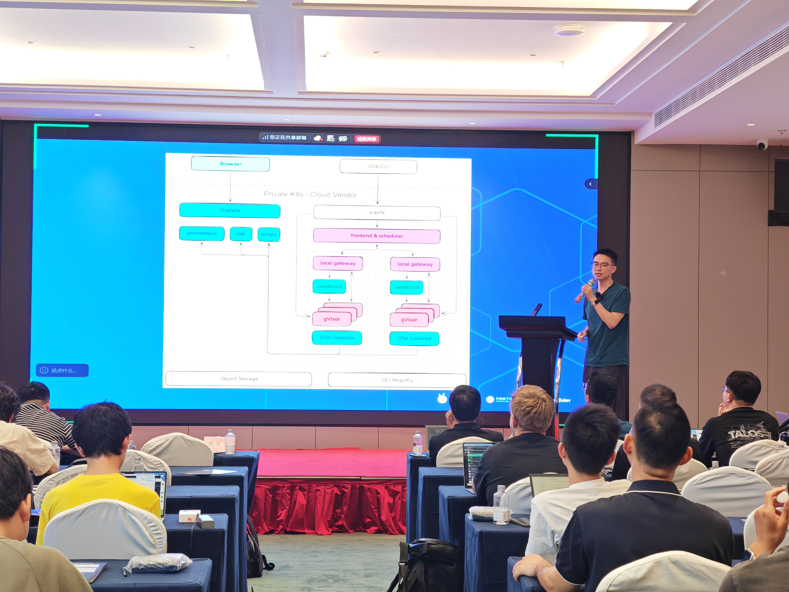
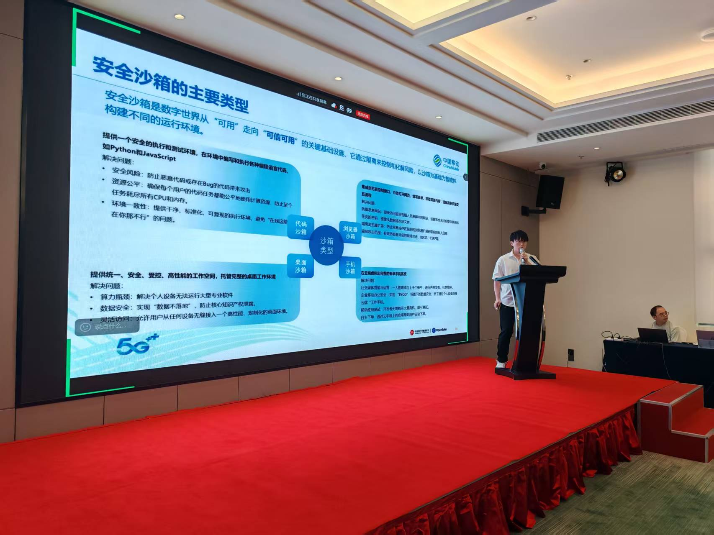
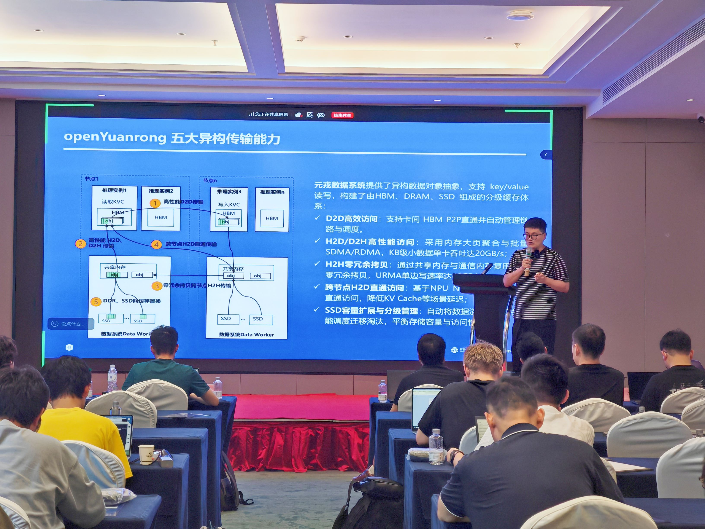
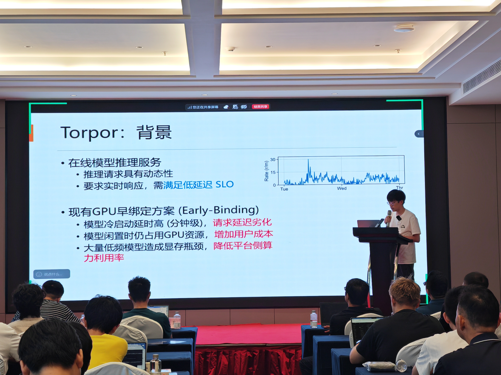

2026 年 7 月 25 日，以“Serverless × 分布式计算，共筑 Agentic AI Infra”为主题的 OpenAtom openEuler（简称“openEuler”或“开源欧拉”）sig-YuanRong Meetup 杭州站圆满举办。

本次活动聚焦 Agentic AI 时代基础设施演进方向，围绕 openYuanrong 项目技术架构、企业实践案例及未来发展趋势展开深入交流。来自企业、高校、科研机构及开源社区的技术专家、开发者齐聚一堂，与 openYuanrong 核心维护团队共同探讨 AI Agent 规模化落地过程中面临的算力调度、资源管理、安全隔离等关键挑战，交流下一代 AI 原生基础设施建设的新思路与新实践。

活动伊始，openYuanrong Maintainer 梁义发表开场分享，系统介绍了 openYuanrong 的项目定位、底层架构核心优势与主流落地应用场景，并围绕项目发展方向与社区生态建设进行了深入阐释，为本次 Meetup 拉开序幕。

▲openYuanrong Maintainer 梁义

## 聚焦企业级 Agentic AI 基础设施，探索技术演进新方向

在主题分享环节，openYuanrong Maintainer 罗站城带来《基于 openYuanrong 构建企业级 Agentic AI 基础设施》主题演讲，系统介绍了 openYuanrong 面向 AI Agent 场景打造的基础设施能力。

分享中，罗站城围绕 Agent Runtime 架构展开介绍，详细解析了 openYuanrong 在高动态弹性调度、安全隔离、长会话稳定运行等方面的技术实践，展示了如何通过云原生与分布式计算能力，支撑企业级 AI Agent 应用高效、安全、稳定运行。他表示，openYuanrong 致力于成为 Agentic AI 时代领先的企业级基础设施，通过开放协作推动技术创新，期待更多开发者与生态伙伴参与社区共建，共同完善 AI 原生基础设施生态。

▲openYuanrong Maintainer 罗站城

## 深入产业实践，多行业案例展现落地价值

在企业实践分享环节，来自金融、互联网、通信等领域的技术专家结合真实业务场景，分享了 openYuanrong 在行业应用中的探索与实践。

工商银行高级项目经理于淼分享《工商银行基于 openYuanrong 和 MindIE motor 的推理服务加速实践》，介绍了 openYuanrong 在金融业务场景中的应用探索，以及如何通过基础设施优化提升 AI 推理服务效率。

▲工商银行高级项目经理于淼

蚂蚁集团高级开发工程师周天昱带来《AKernel: Programmable Datacenter-Scale Infrastructure for Agents》主题分享，围绕面向 Agent 的数据中心级可编程基础设施展开探讨，展示了 AI 应用规模化发展背景下基础设施架构的新方向。

 ▲蚂蚁集团高级开发工程师周天昱

中国移动架构师邵欢庆与高级工程师赵宇聪带来《基于 openEuler 构建 Agent Sandbox 基础设施》分享，围绕 Agent 沙箱环境建设、安全隔离及运行支撑能力进行了深入交流。

▲中国移动架构师邵欢庆

Transfer Queue 社区 Maintainer 荣程浩分享《Transfer Queue 基于 openYuanrong 的实践》，介绍了开源项目与 openYuanrong 的结合实践，以及分布式任务调度场景中的技术探索。

▲Transfer Queue 社区 Maintainer 荣程浩

此外，香港中文大学（深圳）博士郑义云带来《AI 原生的弹性计算基础设施》专题分享，从学术研究视角分析 AI 时代计算基础设施的发展趋势，并结合行业挑战提出前沿探索方向，为产业实践提供理论参考。

▲香港中文大学（深圳）博士郑义云

## 汇聚开源力量，共筑 Agentic AI 新生态

本次 openEuler sig-YuanRong Meetup 杭州站的成功举办，不仅展示了 openYuanrong 在企业级 AI 基础设施场景中的技术探索与实践成果，也为开发者、企业伙伴与学术机构搭建了开放交流的平台。

未来，openYuanrong 将持续深耕 Serverless、分布式计算与 AI Infra 等技术方向，推动更多创新实践落地，携手全球开发者与生态伙伴，共同构建开放、协同、繁荣的 Agentic AI 基础设施生态。

