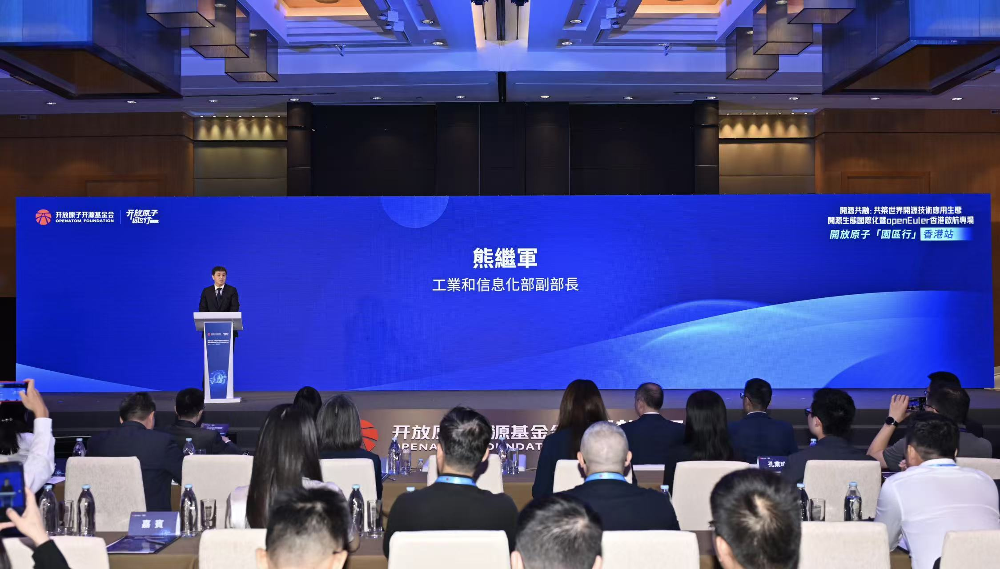
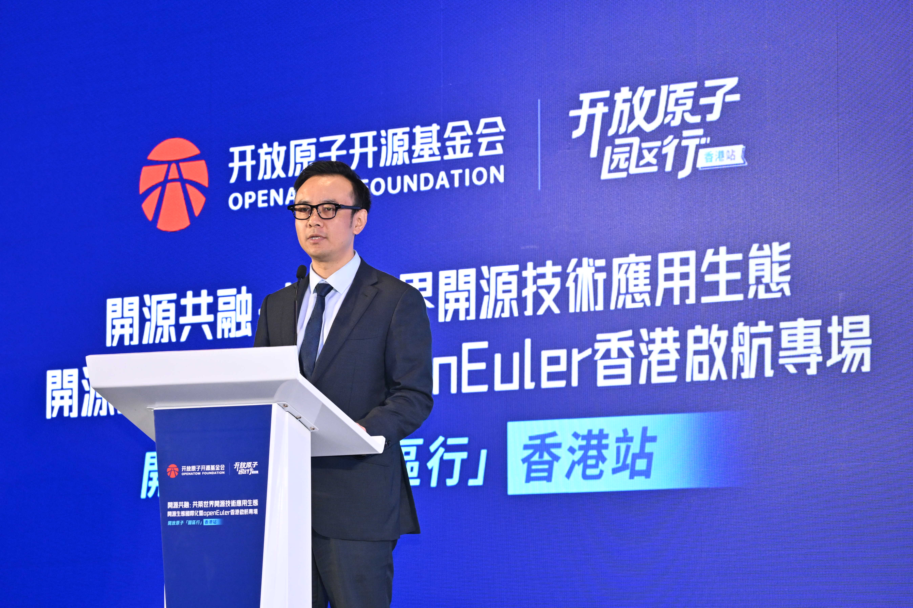
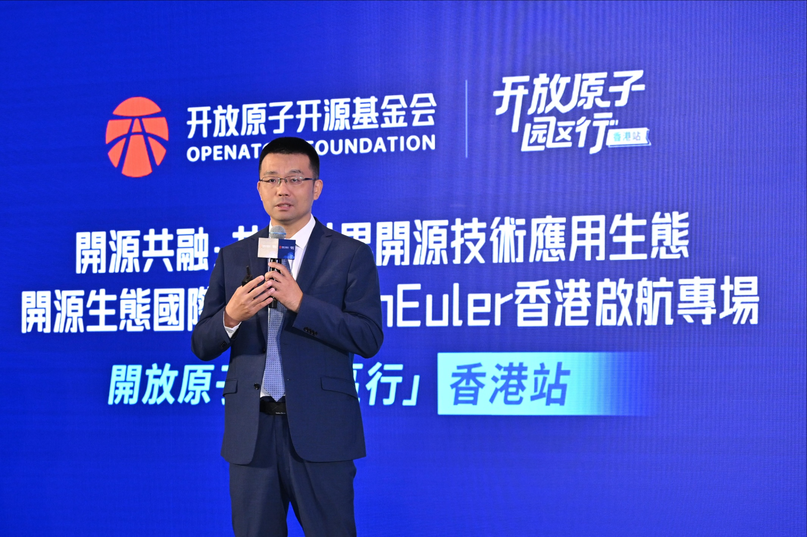
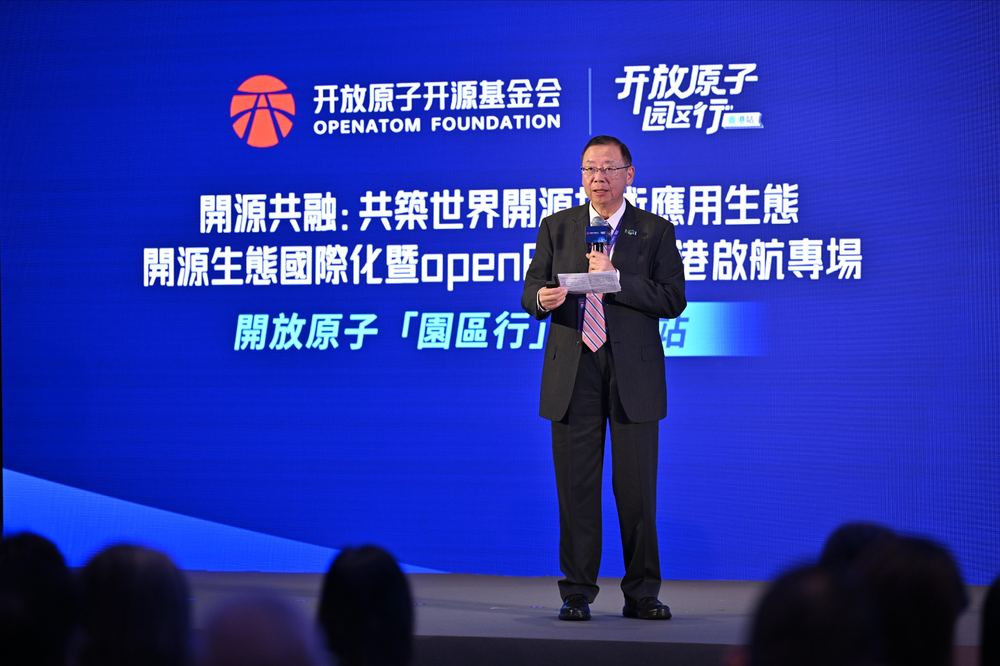
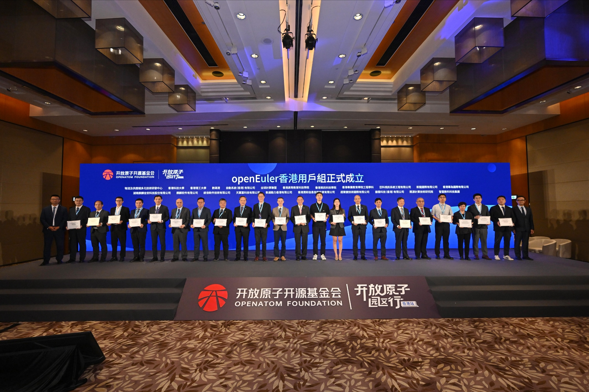
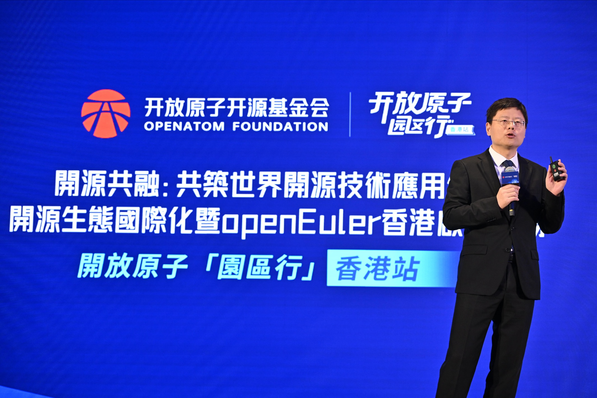
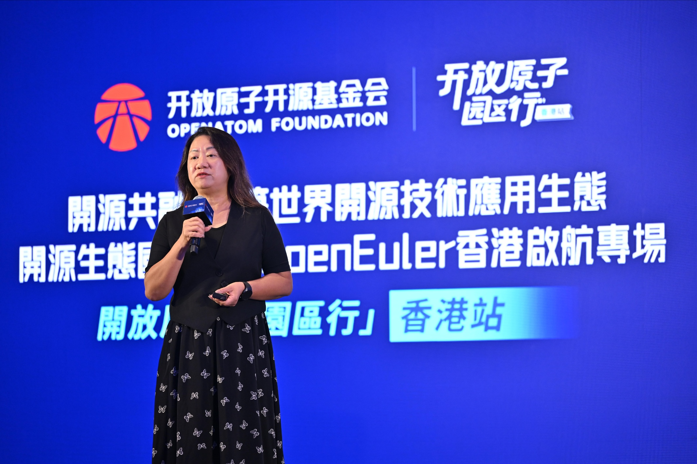
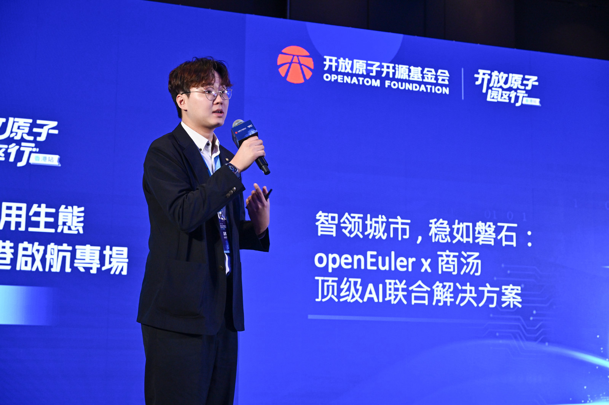
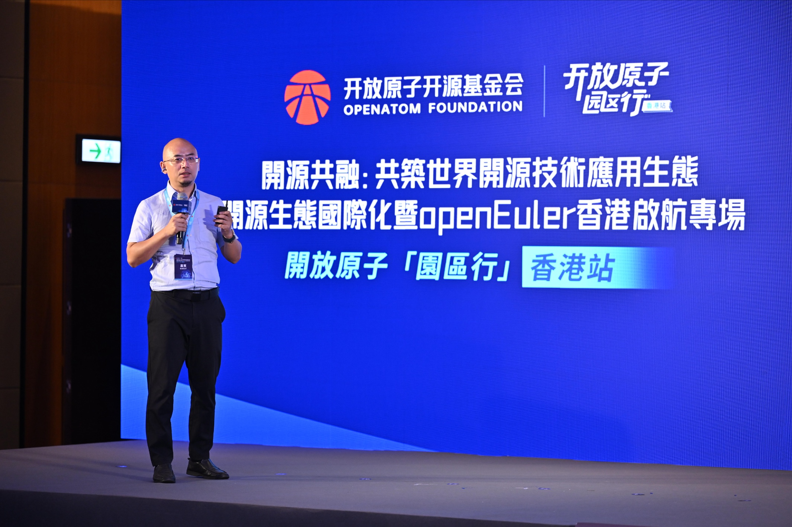
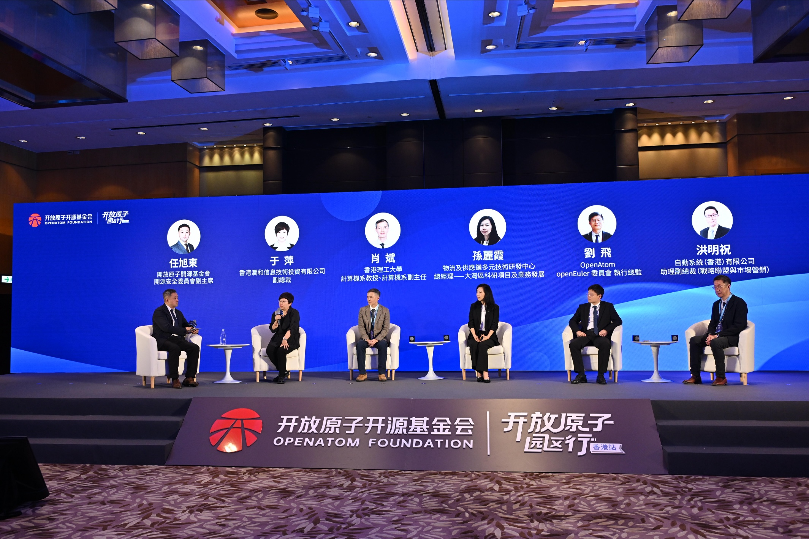

7月29日，开放原子 “园区行” 香港站 —— 开源生态国际化暨开源欧拉 （openEuler）香港启航专场活动于香港顺利举办。本次活动由开放原子开源基金会主办，香港物流及供应链多元技术研发中心（LSCM）、OpenAtom openEuler（简称“openEuler”或“开源欧拉”） 社区承办。活动汇聚香港政企机构、高等院校多方力量，共同探讨内地与香港科创协同，助力香港打造联通内地、辐射全球的开源技术枢纽。

## 立足香港联接全球 推动开源生态国际化

工业和信息化部副部长 熊继军致辞

熊继军在致辞中表示，内地与香港在科技创新领域的合作正不断走深走实，也为开源领域的深度合作开辟了广阔空间。希望各界积极参与，做开源社区的共建者；深化融合，做产业升级的推动者；开放合作，做国际交流的促进者。希望各方以此次活动为契机，深化交流合作，共同推动香港成为连接内地与全球的开源技术高地。

香港特别行政区政府创新科技及工业局工业专员（创新及科技）葛明博士致辞

葛明博士在致辞中提到，香港背靠祖国、联通世界，拥有全球一流的大学与科研机构、完善的知识产权保护制度，高国际化的营商环境。香港将依托独有优势，发挥“超级联系人”与“超级增值人”的独特作用，为国家推动开源技术“走出去”、参与全球开源治理提供坚实平台。

开放原子开源基金会副秘书长 李博发表《共筑世界开源技术应用生态》演讲

李博介绍到，开放原子开源基金会作为中国首家开源基金会，现有77个项目完成 TOC 评审、其中累计59个项目进入孵化期，涵盖 AI、区块链、云原生等领域，培育openEuler、OpenHarmony 等开源明星项目。基金会将坚定支持香港开源生态发展，依托 AtomGit夯实开源基础设施，成立openEuler香港用户组，联动校园计划、科创赛事培育本地人才，助力香港建设国际科创中心，推动优秀开源技术走向全球。

## 开源生态国际化暨openEuler香港启航 openEuler香港用户组正式成立

开放原子开源基金会TOC副主席、openEuler 委员会主席熊伟与物流及供应链多元技术研发中心（LSCM）行政总裁黄广扬共同介绍了 openEuler 社区及香港用户组未来建设规划。据介绍，openEuler 社区经过在国内的发展，积累了技术、治理和生态三大优势。香港是创新和金融中心，具备领先的专业服务和国际化人才，双方优势可以在产业转型、企业成长、人才吸引达成双赢。未来，openEuler香港用户组将完善组织运营体系、壮大核心会员队伍，并联合本地伙伴加速开源OS与智能方案的应用落地，同时深耕科研合作与人才培养，多维度推进社区生态建设。

开放原子开源基金会TOC副主席、openEuler委员会主席  熊伟

物流及供应链多元技术研发中心（LSCM）行政总裁 黄广扬

随后，在现场全体嘉宾共同见证下，香港与内地共计 22 家企业、高校代表依次上台，openEuler 香港用户组正式成立！此举标志着中国开源生态国际化通道进一步打通，香港与内地科创、产业、人才长效联动，搭建起稳定合作平台。

openEuler香港用户组成立仪式

## openEuler开源生态分享 共探生态发展新路径

活动现场，多名技术专家及用户单位代表分享了openEuler技术亮点与应用实例。

当下全球 AI 生态趋于封闭，基础设施垄断，形成巨大AI鸿沟。openEuler开源理念契合全球发展共识。openEuler 集成AI开源全栈解决方案，适配主流硬件，以开放生态赋能各行各业数字化升级。未来，香港打造成openEuler 全球化基地，助力香港与全球市场实现技术自主安全、降本增效，完善开源人才培育体系。

openEuler 委员会执行总监 刘飞发表《基于openEuler构建开源AI生态系统》演讲

LSCM在智慧港口社区系统的运行维护与管控系统中，依托 openEuler 技术优势，覆盖平台用量、数据统计、用户管理、客户服务、Dashboard等功能，为智慧港口社区系统正常运行提供保障。

物流及供应链多元技术研发中心(LSCM)特殊项目总监 伦婉霞博士发表《LSCM与openEuler应用案例：用于智慧港口社区系统的运行维护与管控系统》演讲

商汤科技搭载硬件架构与 openEuler 操作系统，实现私有化部署的智慧云端服务，支撑各类AI应用在线交互、多端协同与处理场景，高效护航大型赛事安保、城市管理、防疫保障等城市关键任务。商汤国内项目 openEuler 适配渗透率超 90%，香港及海外已有 6 项标杆重大项目规模化落地。

商汤香港技术服务中心主管 张正雄 发表《智领城市，稳如磐石：openEuler x 商汤顶级AI联合解决方案》演讲

openEuler致力构建面向超节点和Agentic AI的竞争力，打造生产级的AI底座。开箱即用方面，组件一键安装配置，分钟级部署；安全方面，构筑可控、可知、可恢复的执行环境；Token高效，通过CPU/XPU异构推理协同加速，统一算力调度，智能多级缓存等达成最优效率，切实解决企业 AI 应用落地各类难题。

openEuler技术委员会主席 胡欣蔚   发表《openEuler加速 AI 创新》演讲

圆桌讨论由开放原子开源基金会开源安全委员会副主席任旭东主持，物流及供应链多元技术研发中心（LSCM）总经理孙丽霞、openEuler 委员会执行总监刘飞、香港理工大学计算机系教授及副主任肖斌、自动系统（香港）有限公司助理副总裁洪明祝、香港润和信息技术投资有限公司副总裁于萍等嘉宾聚焦开源落地香港、加速本地数字化、培育本土开源人才、建设国际化开源产业高地等议题，立足产业实战分享观点，交流互鉴、思路碰撞。

现场圆桌讨论

香港立足亚太枢纽、联通全球市场，为 openEuler 国际化布局夯实关键支点。本次活动汇聚行业智慧，厘清开源落地香港的实施路径。未来，开放原子开源基金会将借助香港国际化资源与开放环境，织密跨境合作纽带，促进海内外产业伙伴、开源开发者资源深度交融，让 openEuler 等优秀开源项目全球化生态拓展迈向新台阶。

