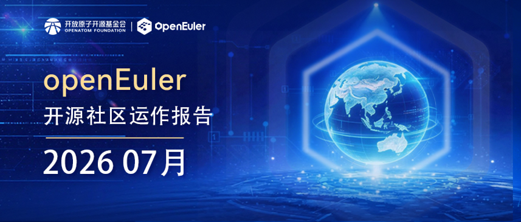
## 概述

2026年7月，OpenAtom openEuler（简称“openEuler”或“开源欧拉”）社区持续推进技术演进与生态建设协同发展，社区规模与活跃度稳步提升，用户、开发者及单位成员数量持续增长，社区贡献不断积累。截至7月底，社区用户累计超过824万，开发者超过2.8万名，单位成员达2176家，开源生态影响力持续扩大。 在生态建设方面，社区持续推进国际化生态拓展，参与开放原子“园区行”香港站活动并推动openEuler香港用户组成立，进一步强化区域开源生态连接；另外，亮相LEAP East 2026，积极参与全球开源技术交流，加速构建开放协同的国际化生态网络。在技术创新方面，社区围绕AI与操作系统融合持续探索，进一步增强Agentic AI场景适配能力；同时围绕AI原生软件工程、AI Agent交互平台、系统Agent及智能调优等方向持续布局，推动智能化基础设施能力演进。整体来看，openEuler社区持续强化开源生态连接能力与智能化技术创新能力，加速构建面向AI时代的新一代操作系统基础设施。

（本月报阅读时长约8分钟）

## 社区规模

截至2026年7月31日，openEuler 社区用户累计超过824万，超过2.8万名开发者在社区持续贡献。社区单位成员达2176家，SIG组110个，累计产生319.1K个PR、154.3K条Issue、5685.6K条Comment。

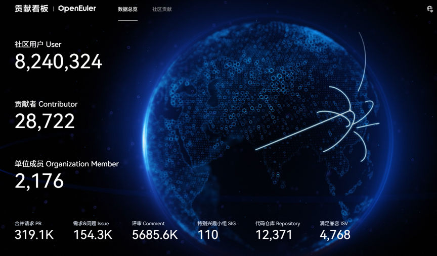

社区贡献看板（截止2026/07/31）

## 社区事件

### ➣开放原子“园区行”走进香港，共筑开源欧拉国际化开源生态

7月29日，开放原子 “园区行” 香港站 —— 开源生态国际化暨开源欧拉 （openEuler）香港启航专场活动于香港顺利举办。本次活动由开放原子开源基金会主办，香港物流及供应链多元技术研发中心（LSCM）、openEuler社区承办。活动汇聚香港政企机构、高等院校多方力量，共同探讨内地与香港科创协同，助力香港打造联通内地、辐射全球的开源技术枢纽。

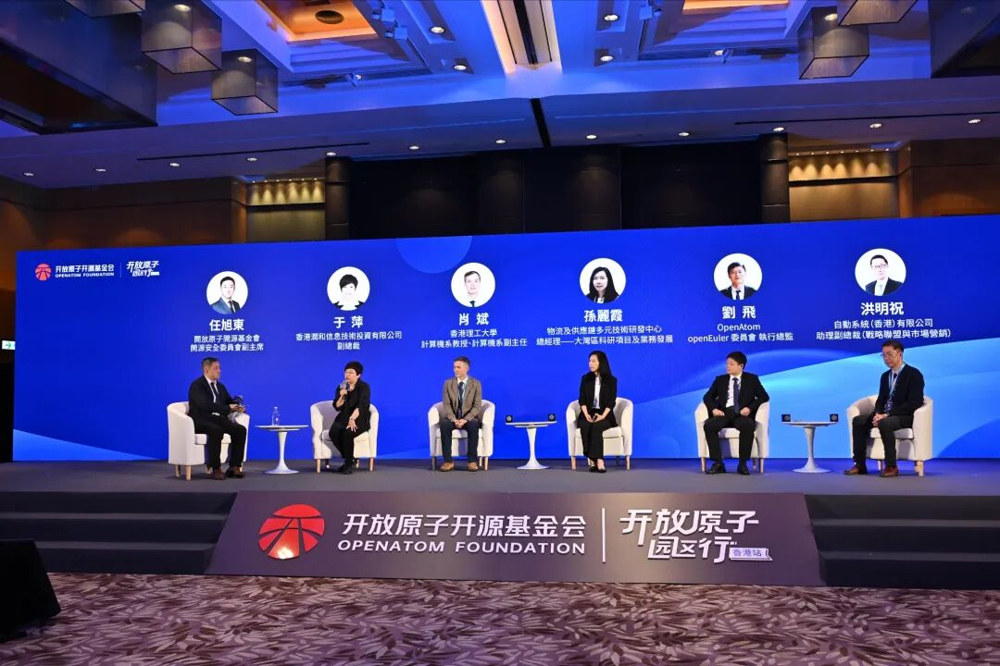

原文阅读：[开放原子“园区行”走进香港，共筑开源欧拉国际化开源生态](https://mp.weixin.qq.com/s/GfzxFnIoRxGeJ6dq997AGQ)

### ➣openEuler香港用户组正式成立

7月29日，在开放原子 “园区行” 香港站 —— 开源生态国际化暨开源欧拉 （openEuler）香港启航专场活动现场，正式宣布openEuler 香港用户组成立。近年来，openEuler社区发展迅猛，已成为中国数智基础设施的基石，并正式启动国际化进程。香港用户组的成立，标志着openEuler将以香港为枢纽，深度融入全球开源生态，吸引全球企业与开发者共建AI开源生态。

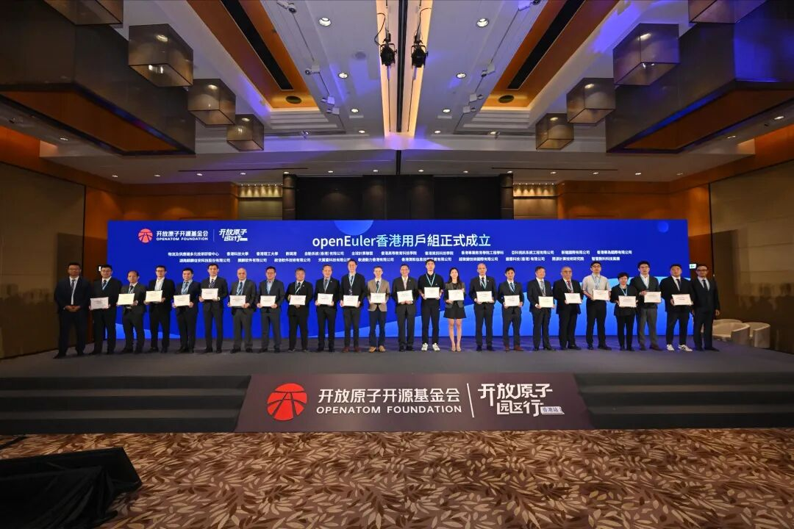

### ➣openEuler 亮相 LEAP East 2026，共探 AI 与开源未来

7月8日至10日，LEAP EAST国际科技与信息技术展首度登陆亚太。作为源自沙特阿拉伯的全球旗舰科技盛会LEAP的亚洲专场，LEAP East以“拓界新征程”（Into New Worlds）为主题，汇聚来自亚太、中东及全球市场的科技企业、投资者与行业领袖。openEuler作为领先的开源操作系统，携AI领域技术成果与生态实践重磅亮相，深度参与分论坛与创新技术交流区，全方位展现开源操作系统的技术实力与产业价值。

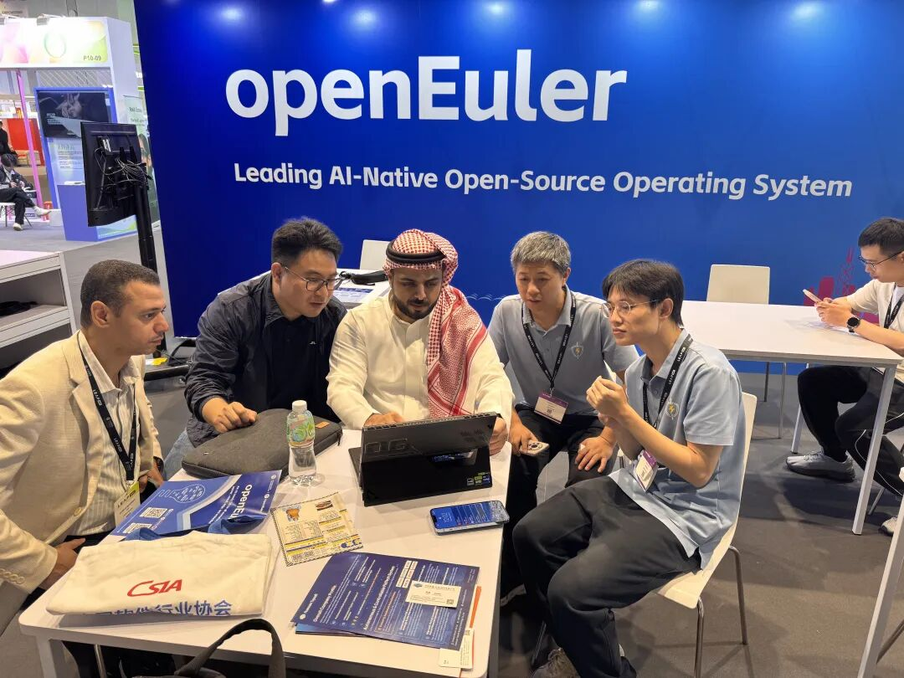

原文阅读：[openEuler 亮相 LEAP East 2026，共探 AI 与开源未来](https://mp.weixin.qq.com/s/JfaFAgteQbI4VMyEdHM1ng)

### ➣openYuanrong 亮相 ICML 2026：以开源 AI 基础设施连接全球青年学者

7月7日-9日，ICML 2026 在韩国首尔顺利召开。在openEuler社区开源的openYuanrong 携前沿技术成果与生态实践重磅亮相，在现场开展多场深度交流与展示活动。 

大会期间，openYuanrong 面向国内外高校师生及开源社区伙伴，围绕“AI 基础设施如何高效赋能训练、推理、Agent 及科学计算”等核心场景，系统展示了其在 Serverless AI、分布式应用及异构算力等领域的最新技术探索。现场交流气氛热烈，其开源理念与技术框架收获了广泛关注与高度认可。

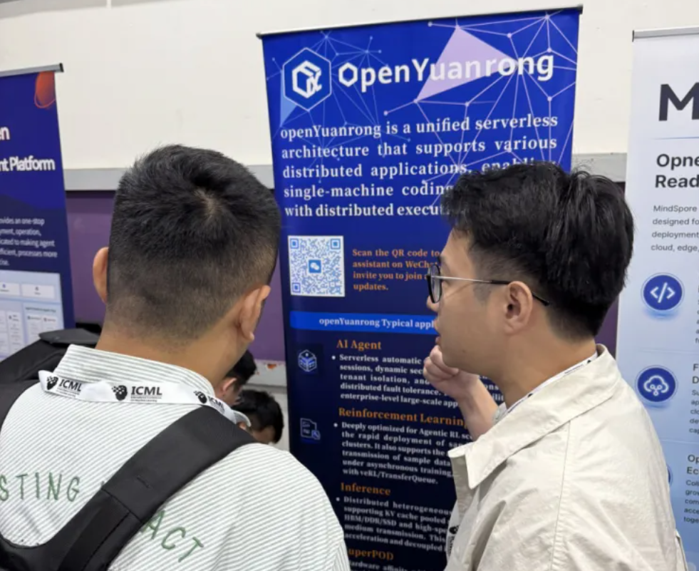

原文阅读：[openYuanrong 亮相 ICML 2026：以开源 AI 基础设施连接全球青年学者](https://mp.weixin.qq.com/s/tZE_caNWWMKP8vrVfkuvPQ)

### ➣openYuanrong 首届 Meetup 杭州站圆满举办！

7 月 25 日，以“Serverless × 分布式计算，共筑 Agentic AI Infra”为主题的 openEuler sig-YuanRong Meetup 杭州站圆满举办。本次活动聚焦 Agentic AI 时代基础设施演进方向，围绕 openYuanrong 项目技术架构、企业实践案例及未来发展趋势展开深入交流。来自企业、高校、科研机构及开源社区的技术专家、开发者齐聚一堂，与 openYuanrong 核心维护团队共同探讨 AI Agent 规模化落地过程中面临的算力调度、资源管理、安全隔离等关键挑战，交流下一代 AI 原生基础设施建设的新思路与新实践。

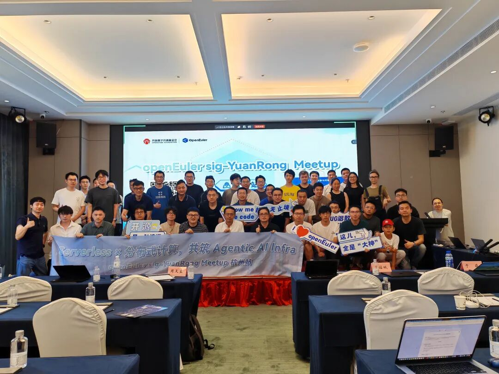

原文阅读：[openYuanrong 首届 Meetup 杭州站圆满收官，共探 Serverless 与分布式计算赋能 Agentic AI Infra 新路径](https://mp.weixin.qq.com/s/EHQwhV8Bjx9aToTYqDE3yA)

### ➣openEuler社区正式发布《生成式AI工具使用与开源贡献策略》

openEuler社区秉持开放、协同、创新的开源精神，将生成式AI与智能化Agent视为推动社区技术演进的重要生产力。社区允许贡献者在合理、透明、可审查的前提下使用生成式人工智能工具辅助贡献，但坚持“保持开放，AI开发导向”，“开发者最终负责”，“透明度，可追溯”三大核心原则。

本策略适用于贡献者向openEuler社区（包括但不限于openEuler组织下的所有代码仓库、文档库等）提交的各种形式的所有贡献：

源代码与脚本：包括各类核心代码、测试用例、构建脚本。技术文档与社区内容：包括API说明、部署指南、发布日志、Wiki页面等。配置与元数据：包括Containerfile/Dockerfile、CI/CD配置文件等。

原文阅读：[公告 | openEuler社区正式发布《生成式AI工具使用与开源贡献策略》](https://mp.weixin.qq.com/s/SNw9R-UI8KBZMSOGQsruxw)

## 技术进展

### ➣openYuanrong v0.9.0版本正式发布

7月8日，openYuanrong 团队正式发布 openYuanrong v0.9.0，重点强化Agentic AI场景适配能力，多场景核心性能与实用性大幅优化。版本针对三大核心场景完成迭代升级：Agent场景新增企业级Agent分布式运行时，赋能Agent规模化生产落地与高效运维，具备会话上下文亲和、多租户隔离、自动弹性扩容等企业级能力；AgenticRL场景优化沙箱使用体验，支持沙箱动态路由注册与反向隧道能力，打通异构集群双向网络通信壁垒；推理场景聚焦性能与可靠性提升，依托NUMA感知、链路预热优化分布式数据访问效率，升级KV Cache数据传输性能，同时支持数据异步持久化存储，强化数据可靠性与问题排查定界能力。

 原文阅读：[openYuanrong v0.9.0 正式发布，新增企业级Agent分布式运行时](https://mp.weixin.qq.com/s/ZCab0T41z0zO-vrjH1tkOQ)

### ➣openEuler intelligence SIG 提出 AI 原生软件工程范式并构建开源项目AET

2026 年，AI 已从“编码助手”进化为工程执行主体。但有个反直觉的事实越来越难忽视：AI 帮我们拔高了能力上限，却在规模、效率、质量三个维度上制造了新的挑战。 为此，openEuler intelligence SIG 提出 AI 原生软件工程（AI-Native Software Engineering）范式，并构建了开源项目 AET（Agentic Engineering Team），旨在推动企业级 AI 编码方案落地，实现可靠、可控、可演进的软件交付。

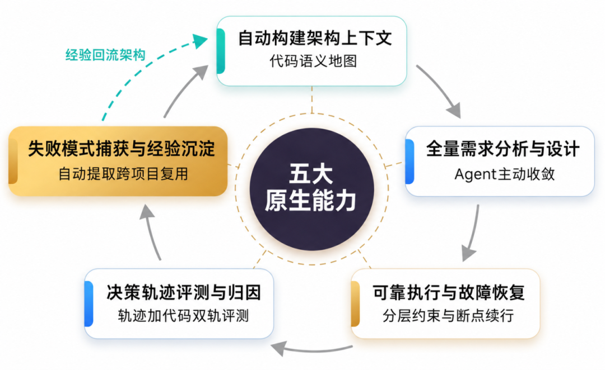

原文阅读：[openEuler Agent Infra企业级编码方案：基于AI原生软件工程范式，实现企业级软件交付可靠、可控、可演进](https://mp.weixin.qq.com/s/tjHbA0V3UnxRSv7XlVgdKQ)

### ➣openEuler 社区孵化自托管 AI Agent 交互平台——PolyMind

在 AI Agent 技术快速发展的背景下，如何高效地管理、编排和运行多个智能体，并为其提供丰富的工具与技能生态，成为当前 AI 基础设施领域的关键挑战。

面向这一需求， openEuler的创新版本DevStation，提供了一个原生集成 agentd 服务的自托管 AI Agent 交互平台——PolyMind。该平台由 openEuler 社区孵化，致力于将 AI 对话、Agent 工作流编排与多模型管理融为一体，提供开箱即用的完整解决方案。目前，PolyMind 已在 Agent 运行时生命周期管理、技能生态建设、模型统一管理、安全漏洞自动化修复等方面取得了显著进展。

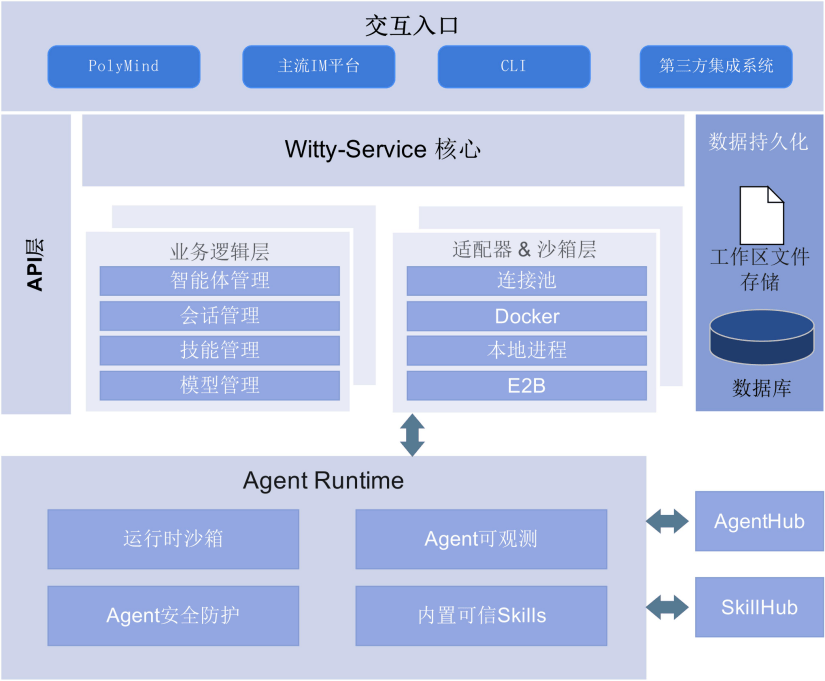

原文阅读：[DevStation智能助手：AI Agent 交互平台的新范式](https://mp.weixin.qq.com/s/exZ0n3CXXb3EclZ6UUcTew)

### ➣openEuler Agent Infra 智能调优引擎：自上而下深入识别 OS 层性能瓶颈，根因定位自主下钻，调优分析效率提升 50%+

在现代数据中心和云原生场景下，操作系统层性能调优是保障业务服务质量的关键环节。然而，随着硬件架构日趋复杂（多路NUMA、异构计算、高速存储网络），特别是超节点异构融合需求背景下，节点组件层数倍增，OS层性能瓶颈的根因定位难度正呈指数级增长。面对复杂场景下的挑战，openEuler 社区推出 Agent 时代的 OS 层智能调优引擎。

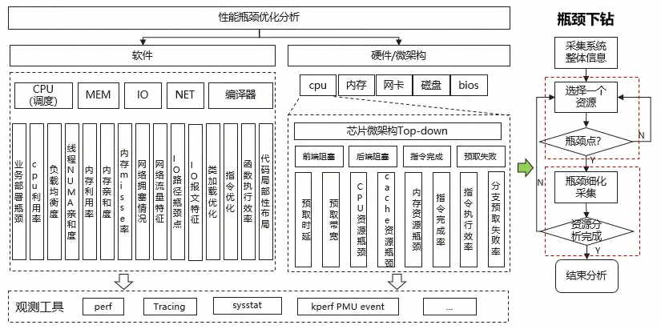

原文阅读：[openEuler Agent Infra 智能调优引擎：自上而下深入识别OS层性能瓶颈，根因定位自主下钻，调优分析效率提升50%+](https://mp.weixin.qq.com/s/NIkZrIaXBpWiZwfMrkTKZw)

### ➣AcTrail：为 Agent 应用打造系统侧观测与治理底座

随着 AI Agent 从回答工具走向生产执行主体，企业不能只依赖应用层日志或框架自报来判断其行为，而需要看清模型决策、工具调用、系统资源访问和治理处置之间的完整链路。AcTrail 通过系统侧观测与跨层行为关联能力，将进程、文件、网络、模型交互和敏感访问处置统一到可追溯的行为轨迹中，为Agent应用提供真实行为观测、行为数据可审计分析、运行过程可治理控制的能力底座。

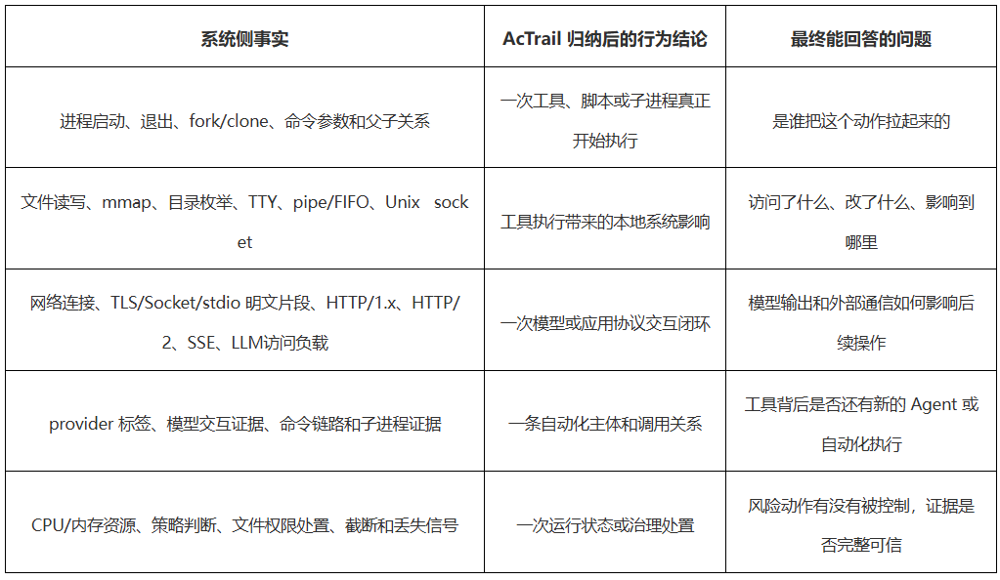

原文阅读：[AcTrail：为 Agent 应用打造系统侧观测与治理底座](https://mp.weixin.qq.com/s/9fn-7jhWmx-XEgzwpFvljQ)

### ➣服务器 OS 的系统 Agent：面向系统的自治与管理中枢

随着 AI 能力提升，AI Agent 正从单轮对话工具，进化为能执行命令、修改文件、管理进程的系统核心角色。这种能力的飞跃，让 Agent 展现出高效执行力的同时，也带来了严峻的管控挑战。为了应对该挑战，openEuler 社区提出“系统 Agent”这一新定位——其职责不仅是让单台/一组服务器具备自感知、自诊断、自优化、自修复的能力；同时向上服务于各类 Agent 应用，负责 Agent 的调度和切换；向下负责统一虚拟化、内存、网络等系统资源。旨在激活 Agent 和系统的结合能力，从而实现 AI 对真实的系统资源、系统问题的自治和优化，并进一步管理、优化在服务器 OS 上的其他海量 Agent 应用。

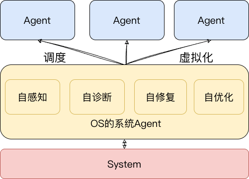

原文阅读：[openEuler Agent Infra 系列 | 服务器 OS 的系统 Agent：面向系统的自治与管理中枢](https://mp.weixin.qq.com/s/k4ubkPR-H8g852CggFJfgg)

### ➣Witty CLI： 让 openEuler 系统更智能、更高效

Witty 的整体架构自上而下贯穿用户接入、运维智能体、运维底座、智能平台、基础设施五个层次，同时覆盖通算（传统集群/单机）和智算（超节点）两种算力形态。在这套体系中，Witty CLI 是用户最直接接触的智能交互入口。它把终端变成对话窗口：用户用自然语言描述运维意图，Witty CLI 负责调度底层运维智能体、模型与知识库完成任务，覆盖通算与智算超节点两种算力形态。

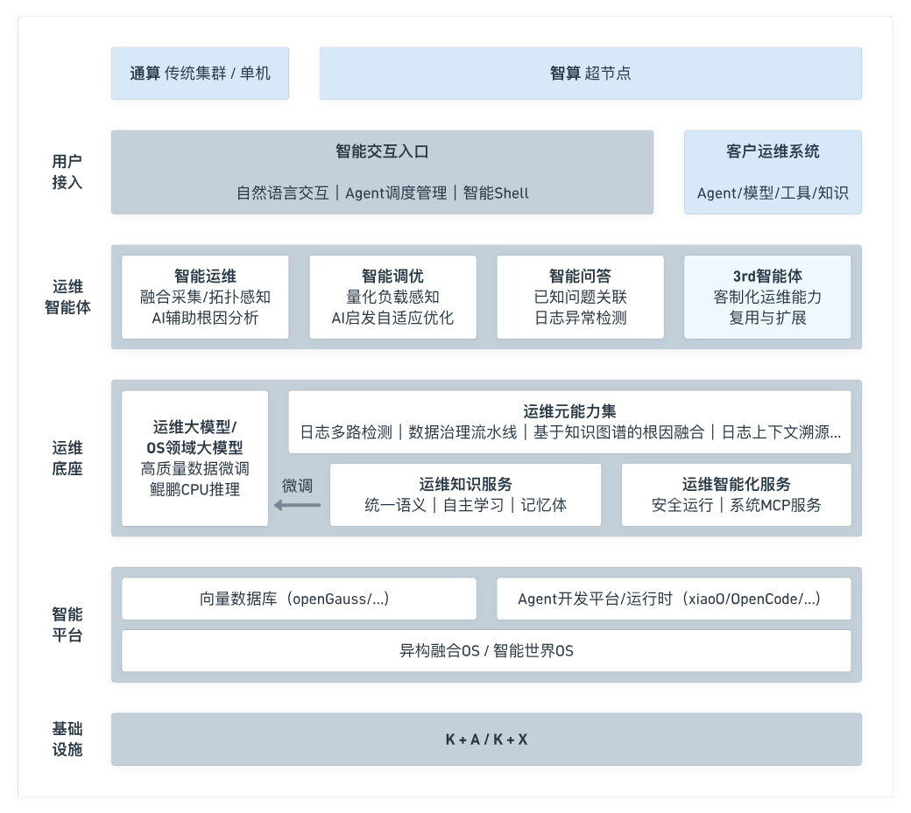

原文阅读：[对话即运维：Witty 让 openEuler 系统更智能、更高效](https://mp.weixin.qq.com/s/lnRTcCLZeXadeYawfh_W6Q)

## 容器镜像更新

- 统计周期：2026年7月1日至7月31日

- 数据来源：<https://gitcode.com/openeuler/openeuler-docker-images>

7月，openEulery应用镜像为319款已有镜像完成了基于openEuler 24.03-LTS-SP4 的适配，覆盖7大类，同时新增5个应用镜像。具体分类如下：

### 基础镜像适配（319个）

为已有软件完成基于 openEuler 24.03-LTS-SP4 基础镜像的更新。

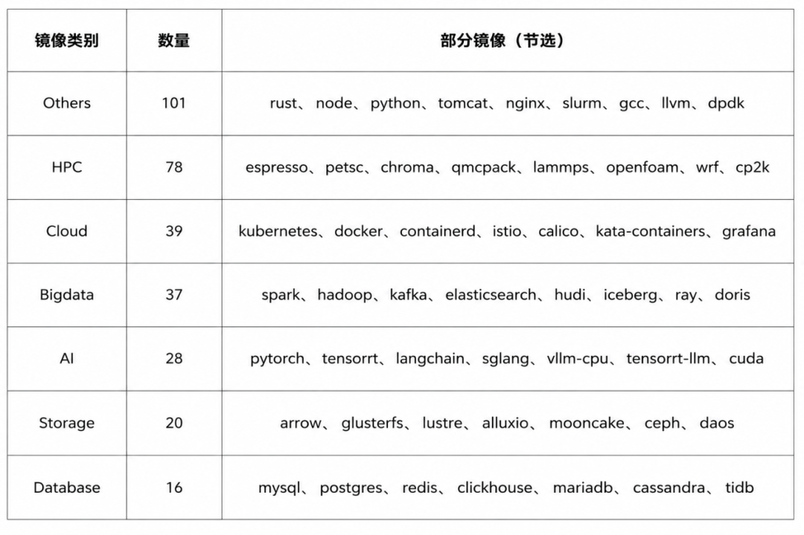

### 新增镜像（5个）

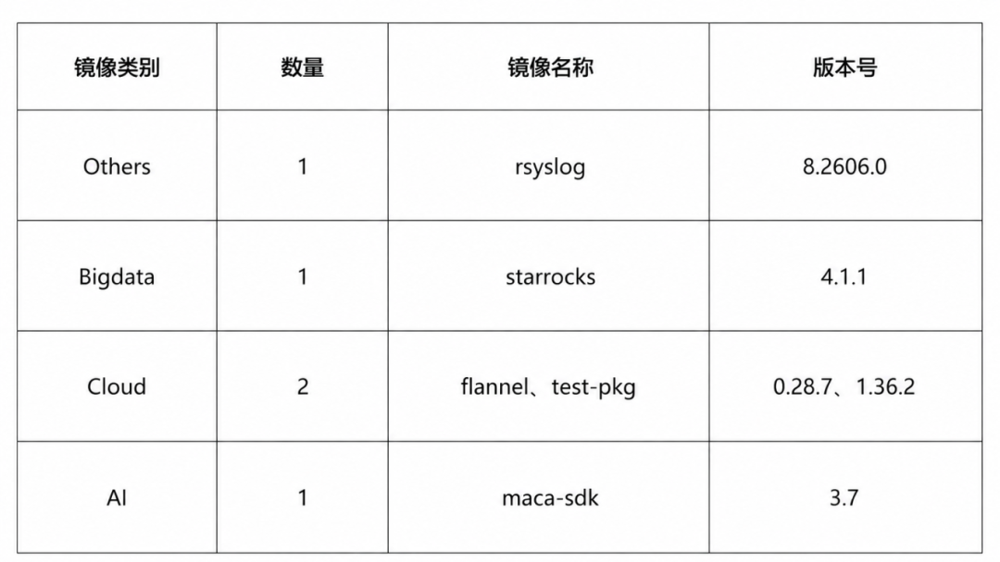

容器镜像可通过 Docker Hub 拉取使用，仓库地址：<https://hub.docker.com/u/openeuler>

## 软硬件兼容性测评

截至2026年7月31日，通过openEuler 软硬件兼容性测评的产品累计达2769款，7月新增40款，其中北向（ISV）新增38款，南向（IHV）新增1款，OSV新增1款。

- 兼容性列表：<https://www.openeuler.org/zh/compatibility/>

- OSV技术测评列表：<https://www.openeuler.org/zh/approve/>

## 安全公告
2026年7月，社区共发布安全公告387个，修复漏洞169个（其中 Critical 39个，High 67个，其它63个）。

### 重点漏洞提醒

以下漏洞评估影响较大，请重点关注。

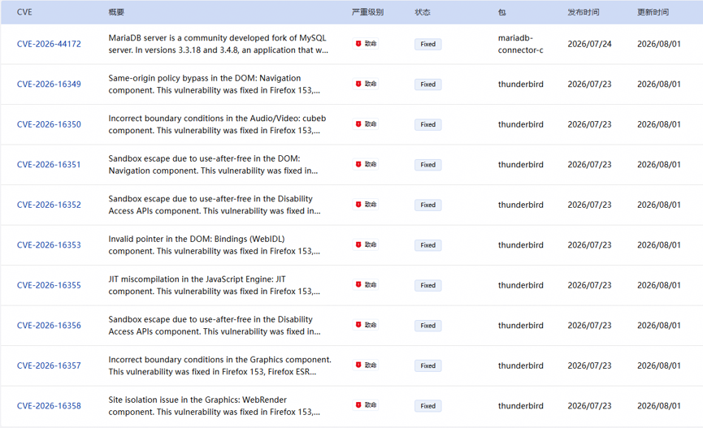
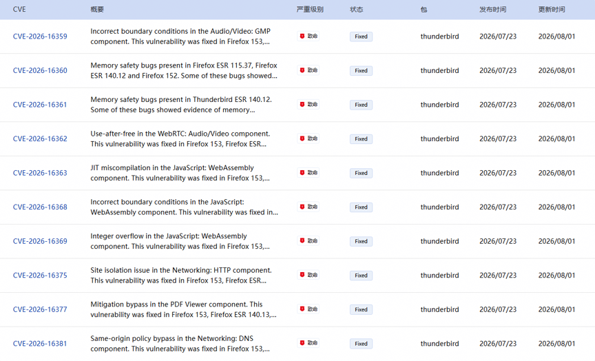
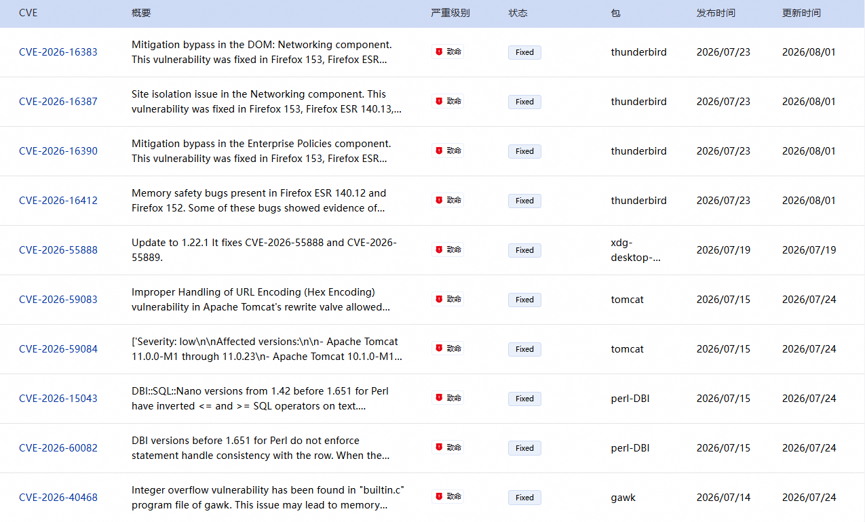
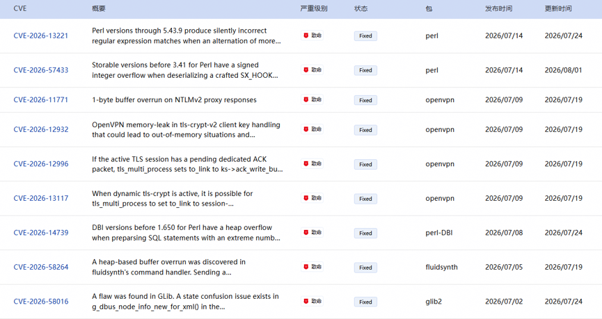

### 漏洞防护 

openEuler社区针对在维版本例行修复漏洞，发布安全补丁。建议用户关注openEuler官网安全公告，及时安装漏洞补丁进行防护。

openEuler 安全公告：

<https://www.openeuler.org/zh/security/security-bulletins/>

## 致谢

openEuler社区的发展离不开每一位参与者的共同努力。每一次代码提交、每一次技术讨论、每一次经验分享，都在不断推动社区向前发展，也共同汇聚成社区持续成长的动力。

由于社区实践与成果持续涌现，月报在整理过程中难免有所遗漏。如有尚未收录的重要进展或贡献，欢迎与我们联系补充，让更多努力被记录与传递。在此，向为本期月报提供资料支持的各 SIG 组以及广大开发者朋友们致以诚挚的感谢与敬意。

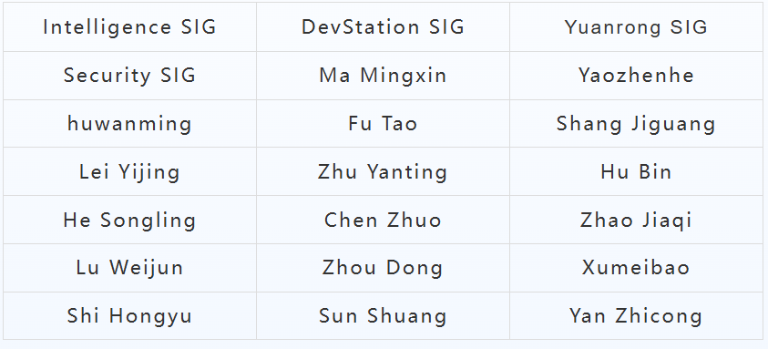

*以上排名不分先后顺序

若您希望在月报中补充相关工作内容，或对月报内容提出意见和建议，欢迎联系：contact@openeuler.io
