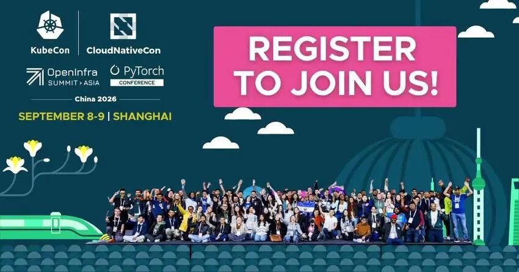
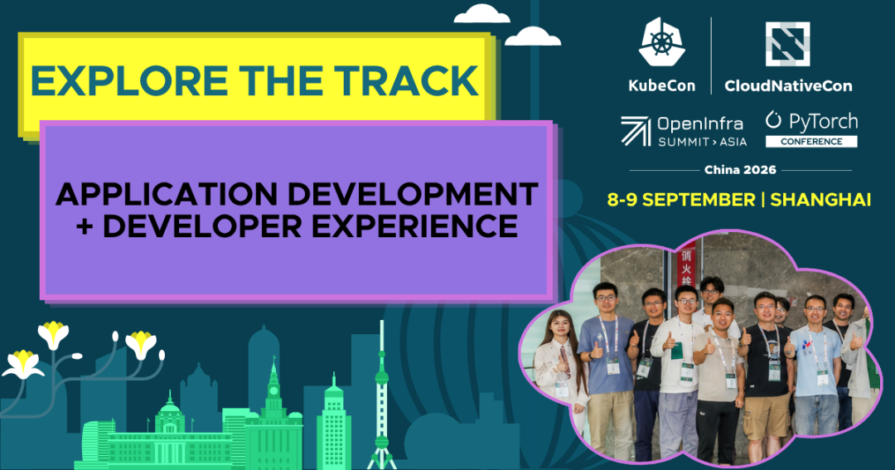

今年九月（9月7日至9日），开源社区的目光将汇聚上海。KubeCon + CloudNativeCon + OpenInfra Summit + PyTorch Conference 中国站将重磅开启，这场为期三天的技术盛会，将云原生、开源基础设施和人工智能三大社群紧密联结。

无论你是构建生产级AI平台，还是打造现代化云原生基础设施，亦或是活跃在开源项目一线，这里都将是你与先行者思想碰撞、洞见未来的绝佳舞台。大会的专题议程经过精心划分，旨在帮助参会者根据自身兴趣和专长，高效地获取知识。无论你是初入领域的新人，还是经验丰富的专家，都能在对应的专题中找到深度内容。从AI/ML系统、平台工程，到安全、可观测性、网络、硬件使能，再到新兴技术和整体云原生体验，每个专题都聚焦于云原生技术生态的不同维度。

作为大会的社区合作伙伴，OpenAtom openEuler（简称“openEuler”或“开源欧拉”）非常期待与来自当地的各位用户、技术专家和社区成员相聚，共同推进机器学习和下一代人工智能的发展。

## 专题的详细导览

🤖 **AI基础设施 + 加速器 + 性能工程**

适合谁：基础设施工程师、系统程序员、高性能计算专家、AI平台团队成员。

学什么：聚焦支撑高性能AI负载的系统与技术，包括GPU及异构硬件利用、分布式训练、运行时优化、编译器及大规模AI基础设施的内核开发。

🧠 **AI + ML + 智能体AI + 数据系统**

适合谁：AI/ML工程师、数据科学家、MLOps实践者、AI系统构建与运维团队。

学什么：覆盖云原生环境中AI/ML的完整生命周期（训练、推理、评估到生产部署），探讨数据管道、检索增强生成（RAG）架构、智能体工作流，以及生成式和多模态模型的行业落地实践。

💻 **应用开发 + 开发者体验**

适合谁：软件开发者、云原生架构师、开发者工具构建者。

学什么：探索助力开发者在云原生环境中高效构建、测试和交付软件的工具、框架与最佳实践，涵盖CI/CD流水线、API设计、开发者工作流及现代化应用架构。

☁️ **云基础设施 + 虚拟化 + 存储**

适合谁：关注云基础设施、虚拟化、存储工程及数据平台管理的专业人士。

学什么：深入云原生堆栈的核心基础设施层，包括私有云/混合云架构、虚拟化、容器基础设施、存储系统及大规模数据平台的构建与优化。

🌱 **社区 + 开源 + 入门指南**

适合谁：云原生技术新手、关注开源社区治理与贡献的爱好者，以及希望深入参与CNCF生态的任何人。

学什么：聚焦云原生采用中“人”与组织的维度，涵盖开源项目实践、社区建设、治理、文档、新手指南等，帮助个人与组织成功拥抱开源。

🚀 **新兴技术 + 研究 + 前沿议题**

适合谁：希望始终站在技术前沿的研究人员、学者、工程师及探索者。

学什么：为云原生、基础设施和AI系统领域的前沿探索性工作提供平台，探讨早期技术、先进架构、概念验证项目及突破边界的尖端研究。

⚙️ **硬件使能 + 多元化**

适合谁：基础设施工程师、硬件架构师、Kubernetes平台团队，及处理异构计算（CPU/GPU/DPU）的专家。

学什么：应对云原生环境中异构硬件的挑战与机遇，包括多厂商加速器支持、硬件感知调度、DPU/SmartNIC卸载、NUMA和内存优化、裸机生命周期管理等。

🌐 **网络 + 边缘 + 分布式系统**

适合谁：网络工程师、电信专家、分布式系统实践者、基础设施架构师。

学什么：探讨连接、服务通信、边缘计算、电信及网络功能，以及面向大规模、延迟敏感环境的分布式系统设计模式与网络技术。

📊 **运维 + 可观测性 + 可靠性**

适合谁：SRE、DevOps工程师、平台运维人员、系统管理员。

学什么：聚焦在生产环境中自信运行云原生系统所需的实践与工具，涵盖监控、追踪、调试、性能调优、应急响应及可靠性工程体系。

🏗️ **平台工程 + 云原生架构**

适合谁：平台工程师、云架构师、DevOps专业人员，负责构建和运维内部开发者平台及云原生基础设施。

学什么：学习设计并运维可扩展的云原生平台，重点关注自动化、多租户和舰队管理，并探索同时支撑传统应用和AI工作负载的架构模式。

🔒 **安全 + 隐私 + 可信计算**

适合谁：安全工程师、开发者、DevOps人员及架构师，负责设计、实现或保护云原生应用、AI系统及基础设施。

学什么：探讨云原生和AI环境特有的安全策略，涵盖威胁建模、身份凭证管理、多租户、机密计算、软件供应链安全及零信任架构。

🧑‍🔧 **维护者专场**

适合谁：希望深入了解CNCF项目运作、学习最新特性最佳实践，并希望直接向维护者反馈意见的社区成员。

学什么：CNCF项目维护者亲临分享项目最新进展、新特性的落地实践及面临的挑战，是与项目核心团队直接对话的宝贵机会。

⚡ **闪电演讲**

适合谁：希望快速获取云原生技术各方面洞见的开发者、管理员、架构师及所有感兴趣的人。

学什么：在极短时间内传递精炼的技巧、最佳实践和创新想法，是紧跟CNCF生态最新趋势的高效方式。

## 大会信息与注册

🎙️**完整专题：**

<https://www.lfopensource.cn/kubecon-cloudnativecon-openinfra-summit-pytorch-conference-china/program/explore-the-tracks-2/#maintainer-track>

🎟️ **立即注册：**

<https://www.lfopensource.cn/kubecon-cloudnativecon-openinfra-summit-pytorch-conference-china/>