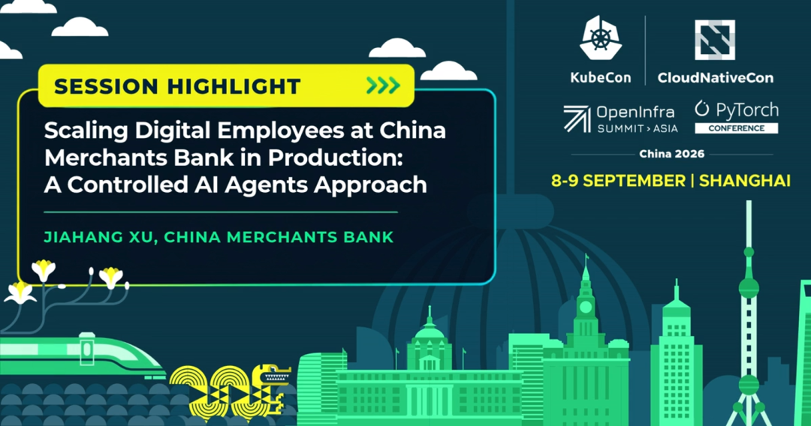
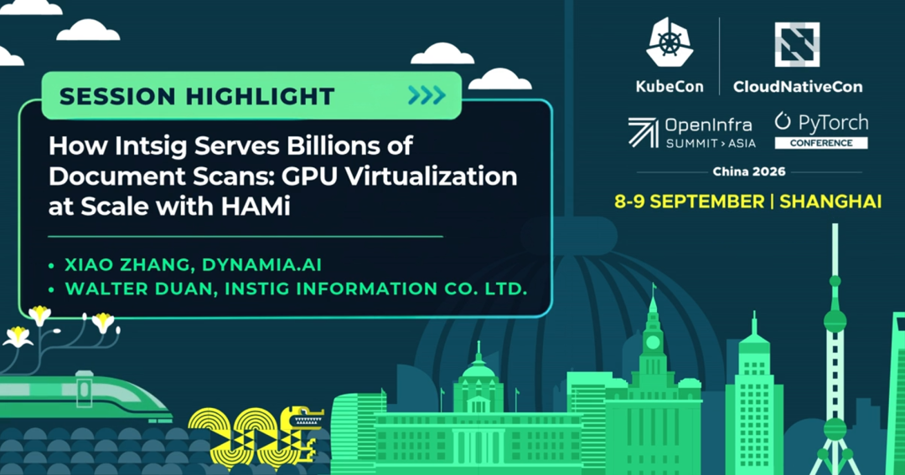
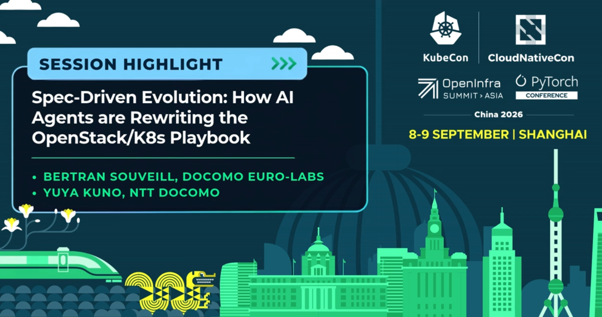
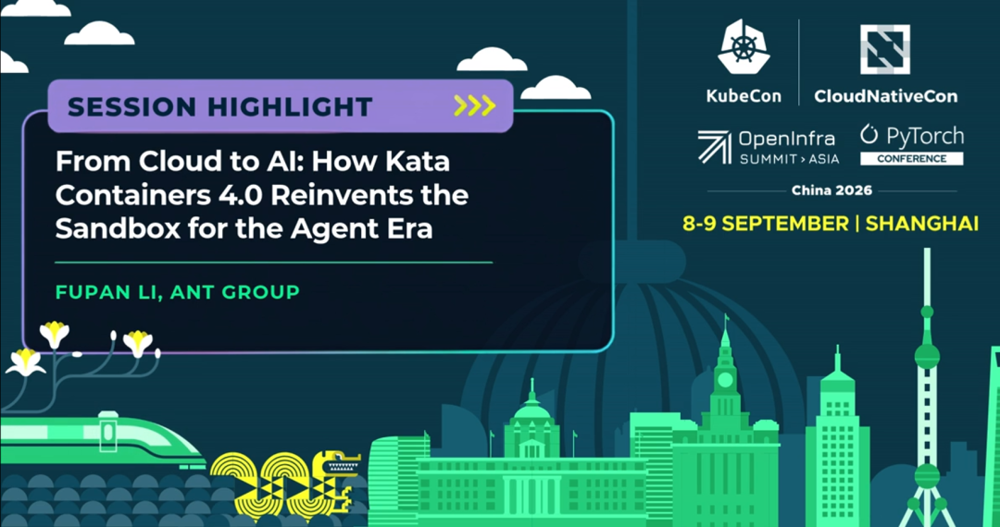
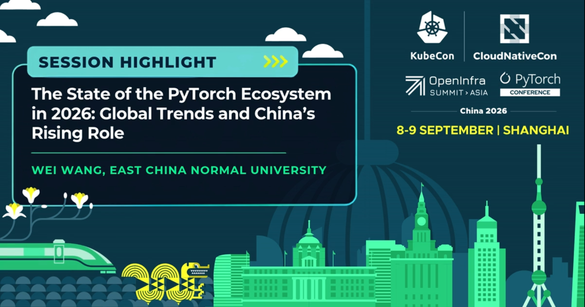
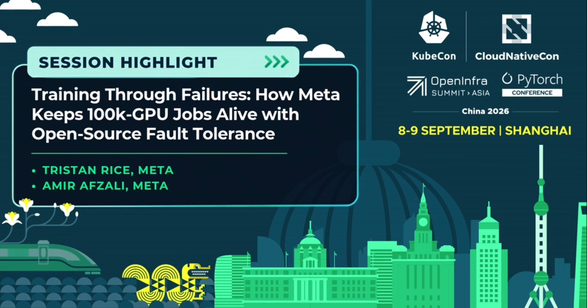
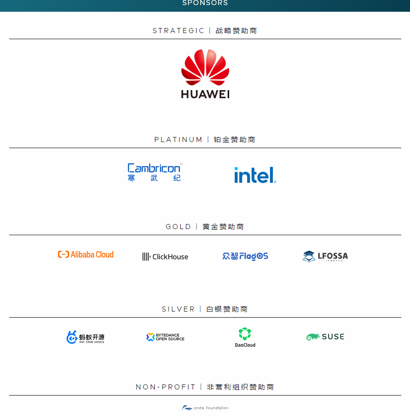

AI正在重新定义应用的开发、部署与运行方式，而开源技术正在为这一转变提供重要基础。

- 企业如何安全、可控地规模化部署AI智能体？

- 数十亿次文档扫描背后，GPU资源如何实现高效共享？

- AI智能体能否改变OpenStack与Kubernetes的开发方式？

- Kata Containers如何为智能体提供更安全的运行环境？

- 中国开发者将在全球PyTorch生态中扮演怎样的角色？

- 面对十万卡规模的训练任务，系统又该如何从故障中快速恢复？

[2026年9月7日至9日，KubeCon + CloudNativeCon + OpenInfra Summit + PyTorch Conference China将在上海举行。](https://mp.weixin.qq.com/s/OZFLJOlzHglMjVtERXSrmA)

大会将汇聚CNCF、OpenInfra与PyTorch三大开源社区，围绕Kubernetes、OpenStack、PyTorch及数十项开放技术，集中呈现云原生、开放基础设施、机器学习与下一代AI的最新实践。

作为大会的社区合作伙伴，OpenAtom openEuler（简称“openEuler”或“开源欧拉”）非常期待与来自当地的各位用户、技术专家和社区成员相聚，共同推进机器学习和下一代人工智能的发展。

以下六场精选议程，将从中国企业实践、GPU虚拟化、AI辅助开源开发、安全沙箱、PyTorch生态及超大规模训练等角度，展现云原生与AI基础设施加速融合的技术趋势。

## 01｜金融行业如何规模化部署“数字员工”？

招商银行生产环境中的数字员工规模化：一种可控的AI智能体方法

### 演讲嘉宾：

Jiahang Xu 招商银行系统架构师

招商银行已经开始将大语言模型与AI智能体从概念验证推进到大规模内部部署，并将其用于构建企业“数字员工”。然而，在高度监管的金融行业，自主智能体所具有的不确定性，也为数据安全、合规审计、系统权限及成本管理带来新的挑战。

本场分享将介绍招商银行如何基于平台工程理念，建立可控的AI智能体架构，重点包括：

- 通过标准化的“AI Agent即服务”模板简化智能体部署

- 利用Kubernetes原生微型虚拟机隔离智能体生成的代码

- 通过实时监控与确定性策略建立金融级安全护栏

- 在云环境中兼顾数据主权、可审计性与成本控制

### 适合谁？

- 金融及受监管行业的技术团队

- 企业AI平台与平台工程负责人

Kubernetes及云原生架构师

正在推动AI智能体进入生产环境的企业

### 为什么值得关注？

这不是停留在实验阶段的AI智能体案例，而是来自中国大型金融机构的生产实践。对于希望推动企业智能体规模化部署，同时确保安全、合规与可控性的团队而言，这场分享具有直接参考价值。

### 查看议程详情：

<https://www.lfopensource.cn/kubecon-cloudnativecon-openinfra-summit-pytorch-conference-china/program/schedule/?id=1225364>

## 02｜数十亿次文档扫描背后的GPU资源如何调度？

合合信息如何服务数十亿次文档扫描：基于HAMi的大规模GPU虚拟化

### 演讲嘉宾：

- Xiao Zhang，dynamia.a
- Walter Duan，合合信息（INTSIG）

当文档识别与扫描服务进入大规模生产环境，GPU资源的利用率、隔离能力、调度效率与成本控制将直接影响服务质量。

本场分享将围绕合合信息服务数十亿次文档扫描的实践，探讨如何利用CNCF项目HAMi实现大规模GPU虚拟化与资源共享。

在多租户和多工作负载环境中，如何避免GPU资源闲置？如何让不同任务安全共享算力？如何在性能、成本与资源利用率之间取得平衡？这些都是AI基础设施团队必须面对的问题。

### 适合谁？

- GPU平台与AI基础设施工程师

- Kubernetes调度及资源管理团队

- HAMi用户与社区贡献者

- 负责AI推理和计算成本优化的技术人员

### 为什么值得关注？

AI应用规模持续扩大，但GPU资源昂贵且供给有限。这场分享以真实的大规模文档处理业务为背景，将帮助开发者理解GPU虚拟化如何从技术概念进入高流量生产环境。

### 查看议程详情：

<https://www.lfopensource.cn/kubecon-cloudnativecon-openinfra-summit-pytorch-conference-china/program/schedule/?id=1221808>

## 03｜AI智能体正在改变开源软件的开发方式

规范驱动的演进：AI智能体如何改写OpenStack与Kubernetes开发范式

### 演讲嘉宾：

- Bertran Souveill，DOCOMO Euro-Labs

- Yuya Kuno，NTT DOCOMO

AI编码智能体不仅能够生成代码，也开始参与需求理解、架构设计、测试及上游开源协作。本场分享将探讨如何以技术规范为起点，让AI智能体协助生成架构提案、生产级代码与自动化测试，并应用于OpenStack Tacker等真实开源项目。重点不只是“让AI写代码”，而是如何让智能体理解技术规范、遵守项目规则，并在不破坏开放协作流程的前提下，提高开发效率。

### 适合谁？

- OpenStack与Kubernetes开发者

- AI编码智能体及开发工具团队

- 开源项目维护者与贡献者

- 平台工程和软件架构团队

### 为什么值得关注？

随着AI智能体逐渐进入软件开发生命周期，开源社区需要重新思考代码审查、规范管理、测试质量与人机协作。这场分享将帮助参会者理解，AI智能体如何在真实开源项目中参与从技术规范到代码交付的完整过程。

### 查看议程详情：

<https://www.lfopensource.cn/kubecon-cloudnativecon-openinfra-summit-pytorch-conference-china/program/schedule/?id=1224932>

04｜智能体时代需要怎样的安全沙箱？

从云计算到AI：Kata Containers 4.0如何为智能体时代重新定义沙箱

### 演讲嘉宾：

Fupan Li 蚂蚁集团

Kata Containers最初致力于为云原生工作负载提供更强的隔离能力。进入AI智能体时代后，安全沙箱的重要性正在进一步提升。当智能体可以自主生成并执行代码、调用外部工具和访问企业系统时，传统容器隔离是否足够？基础设施又该如何在安全、性能与启动速度之间取得平衡？

本场分享将介绍Kata Containers 4.0面向智能体时代的技术演进，包括：

- 注重内存安全与性能的新一代Rust运行时

- 面向不同基础设施的多Hypervisor支持

- 基于模板的快速沙箱启动机制

- 进一步扩展的机密计算能力

- 面向Linux以外环境的安全隔离探索

### 适合谁？

- Kata Containers及容器运行时用户

- 云基础设施与虚拟化工程师

- 企业AI安全及平台团队

- 需要运行不受信任代码的智能体开发者

### 为什么值得关注？

智能体越自主，安全执行环境就越重要。Kata Containers 4.0展示了安全沙箱如何从云原生基础设施能力，进一步演进为AI智能体与生产级AI平台的重要底座。

### 查看议程详情：

https://www.lfopensource.cn/kubecon-cloudnativecon-openinfra-summit-pytorch-conference-china/program/schedule/?id=1220661

05｜中国在全球PyTorch生态中的角色正在发生什么变化？

2026年PyTorch生态现状：全球趋势与中国日益重要的角色

### 演讲嘉宾：

Wei Wang 华东师范大学

PyTorch已经从深度学习框架发展为连接研究、训练、推理、分布式计算与生产部署的重要开源生态。与此同时，中国的研究人员、开发者、企业用户与开源项目，正在更加积极地参与PyTorch相关技术的开发、应用与社区建设。本场分享将从全球趋势出发，观察2026年PyTorch生态的发展状况，并讨论中国社区在技术贡献、人才培养、产业应用与全球协作中的角色。

### 适合谁？

- PyTorch开发者与研究人员

- 高校师生及AI教育工作者

- 机器学习平台和基础设施团队

- 关注中国开源AI生态发展的企业与社区成员

### 为什么值得关注？

PyTorch生态的发展不仅取决于框架本身，也取决于全球开发者、研究机构、企业与开源项目之间的协作。这场分享将帮助中国开发者从全球视角理解PyTorch生态的演进，并重新认识中国社区可以发挥的作用。

### 查看议程详情：

<https://www.lfopensource.cn/kubecon-cloudnativecon-openinfra-summit-pytorch-conference-china/program/schedule/?id=1225138>

## 06｜十万卡训练任务如何在故障中持续运行？

穿越故障完成训练：Meta如何利用开源容错技术保障十万卡任务持续运行

### 演讲嘉宾：

- Tristan Rice，Meta

- Amir Afzali，Meta

随着模型规模和训练集群不断扩大，硬件故障、网络异常、节点失效及任务中断将不再是偶发事件，而是超大规模训练过程中的常态。当一个训练任务同时使用十万张GPU时，即使单个组件的故障概率很低，整个系统仍然需要随时应对失败。本场分享将聚焦Meta在超大规模AI训练中的容错实践，探讨如何利用开源技术提高训练任务的可恢复性，并尽可能减少故障对计算进度和资源成本造成的影响。

### 适合谁？

- 大规模分布式训练工程师

- AI/HPC基础设施团队

- GPU集群运维及可靠性工程师

- 关注开源容错和训练效率的开发者

### 为什么值得关注？

大规模AI训练的挑战不仅是拥有更多GPU，更在于如何确保整个训练系统能够持续运行。Meta的十万卡实践，将为超大规模集群的故障检测、恢复机制和训练可靠性提供重要参考。

查看议程详情：

<https://www.lfopensource.cn/kubecon-cloudnativecon-openinfra-summit-pytorch-conference-china/program/schedule/?id=1223450>

## 六场议程，六个开源基础设施关键问题

这六场精选分享，呈现了云原生、开放基础设施与AI加速融合过程中需要解决的六项现实挑战：

- 企业智能体治理：如何让AI智能体在安全、合规、可审计的前提下进入生产环境？

- GPU资源效率：如何通过虚拟化与调度能力，提高有限GPU资源的使用效率？

- AI辅助软件开发：如何让AI智能体参与开源开发，同时维护代码质量与社区协作原则？

- 智能体安全隔离：如何为自主执行代码的AI智能体建立快速、可靠的硬件级安全边界？

- 全球开源AI生态：中国开发者、企业与研究机构如何更深入地参与PyTorch全球生态？

- 超大规模训练可靠性：当系统故障成为常态，如何让十万卡训练任务继续运行并控制损失？

从招商银行、合合信息和蚂蚁集团的中国企业实践，到NTT DOCOMO、Meta及全球PyTorch生态的技术观察，这些议程共同呈现了开源基础设施支撑AI规模化发展的不同路径。

这只是大会精彩议程的一部分，更多议程、讲者与场次信息，请以大会官方网站公布内容为准。

[KubeCon + CloudNativeCon + OpenInfra Summit + PyTorch Conference China还将带来更多主题演讲、技术分论坛、实操内容及社区交流活动。](https://mp.weixin.qq.com/s/OZFLJOlzHglMjVtERXSrmA)

## 活动信息

活动名称：KubeCon + CloudNativeCon + OpenInfra Summit + PyTorch Conference China 2026

**活动日期：** 2026年9月7日至9日

**9月7日：** 同期活动

**9月8日至9日：** 主题演讲、分论坛及解决方案展示

**活动地点：** 中国·上海国际会议中心

**议程时间：** 中国标准时间（UTC+8）

现场座席先到先得，建议提前查看议程并规划个人日程。

**查看完整会议议程：**

https://www.lfopensource.cn/kubecon-cloudnativecon-openinfra-summit-pytorch-conference-china/program/schedule/

**立即报名：**

https://www.lfopensource.cn/kubecon-cloudnativecon-openinfra-summit-pytorch-conference-china/register/

### 当前报名费用

企业票：人民币2,120元

个人票：人民币700元

学生及学术票：人民币355元

企业票一次报名5人及以上，可享受九折团队优惠。所有参会者须通过同一团队订单购买相同票种，并使用同一张信用卡付款。

### 赞助商

9月7日至9日，相聚上海。与CNCF、OpenInfra及PyTorch社区一起，从真实生产案例出发，探索云原生、开放基础设施与人工智能共同塑造的下一代技术架构。这只是本届大会丰富议程的一部分。更多主题演讲、技术分享与实践案例，请持续关注大会官方网站。