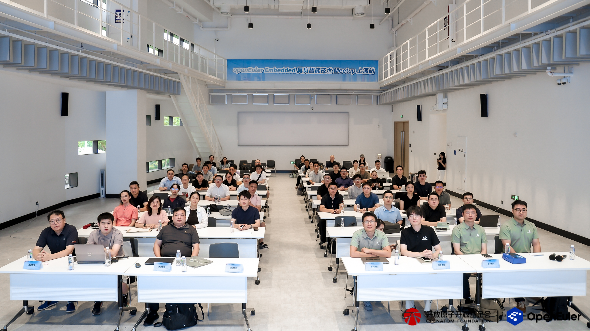
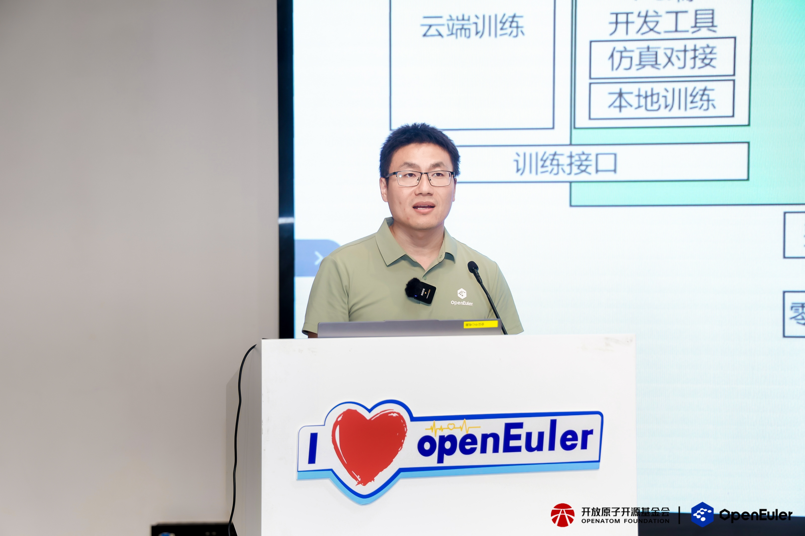
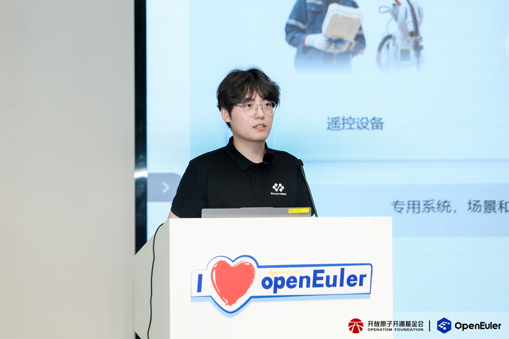
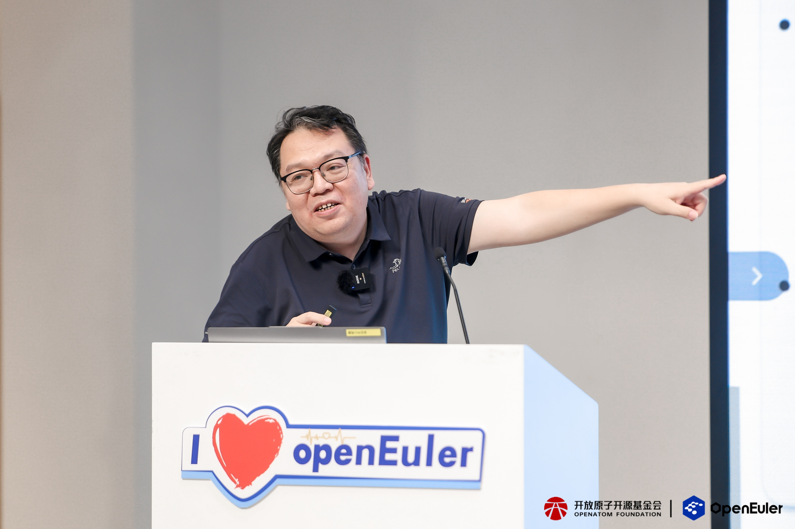
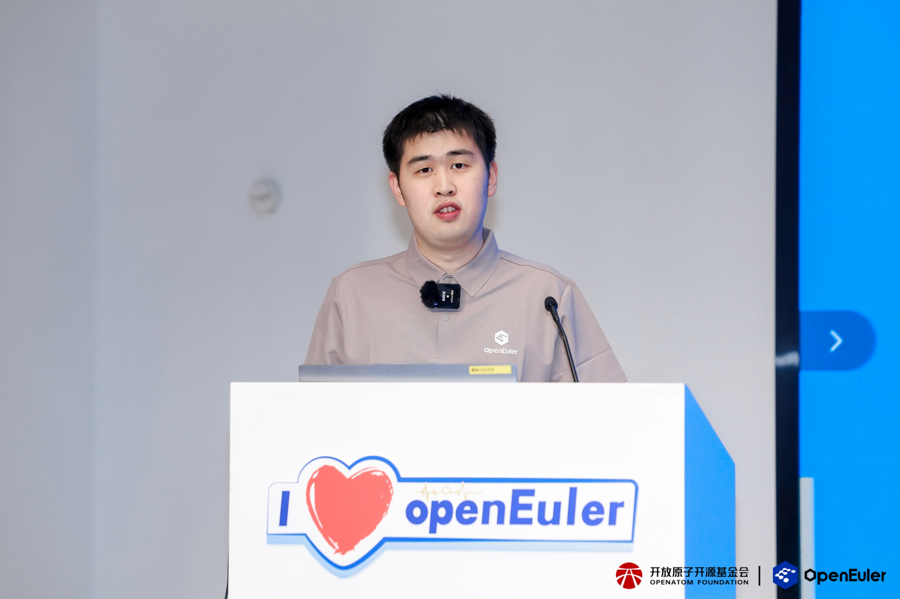
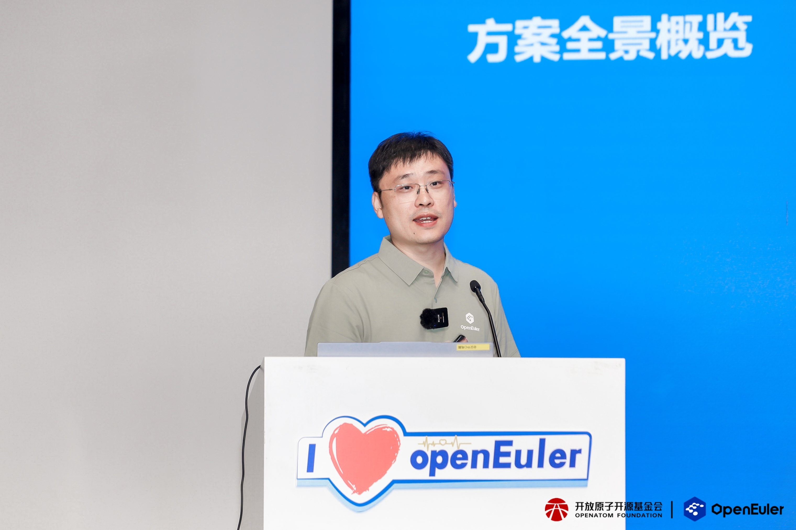
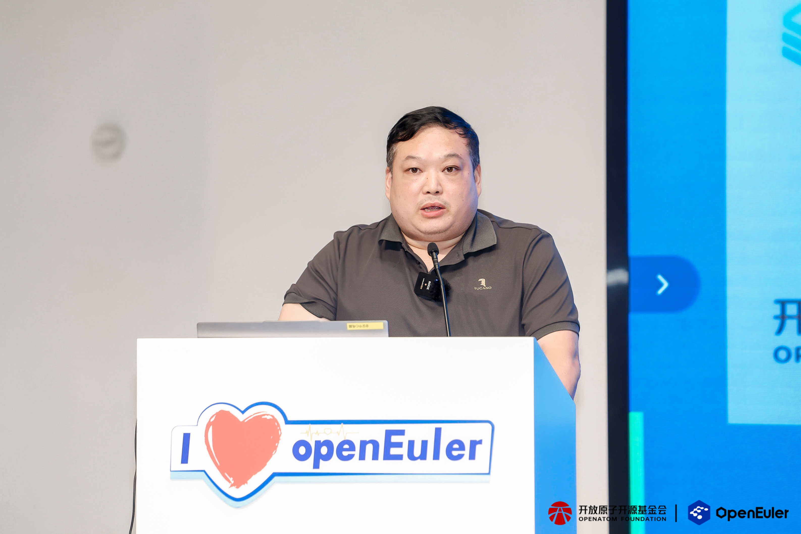

2026 年 8 月 14 日，OpenAtom openEuler（简称“openEuler”或“开源欧拉”） Embedded 具身智能技术 Meetup 上海站圆满举办。本次活动由开放原子上海开源促进中心、开源欧拉社区主办，上海市人工智能行业协会、上海市人形机器人创新孵化器协办，智元 AIMA 开发者社区支持。来自开源社区、科研院所和产业一线的技术专家与开发者齐聚现场，围绕具身智能操作系统、机器人基础设施、集群协同推理、无任务学习、无人蜂群及工业场景落地等方向展开深入交流。

▲openEuler Embedded 具身智能技术 Meetup 上海站合影

从模型能力走向物理世界，具身智能不仅需要更强的感知、决策与执行算法，也需要实时可靠的操作系统、异构算力调度、机器人中间件和工程化工具链作为支撑。六场主题分享从社区技术演进、科研探索到产业实践，呈现了具身智能技术从单机能力突破迈向群体协同与规模化应用的清晰路径。

## 01夯实系统底座，勾勒具身智能 OS 演进路线

openEuler Embedded SIG Maintainer 陈鑫带来《openEuler 社区具身智能技术进展及未来规划》主题分享。他从机器人本体、开发工具、仿真环境、云边协同和端侧算力等维度，介绍了社区面向具身智能机器人操作系统的整体设想，并重点解读 openEuler Embedded 2603 具身智能版本的阶段性能力。

围绕“开箱即用、小型化、低成本体验”，该版本打通遥操作数据采集、仿真与真机切换、模型 ROS 化和智能体调用等环节，并探索以自然语言驱动开发、由 AI 辅助移植和维护 ROS 软件包。面向后续演进，社区将持续推进异构算力统一推理框架、NPU 细粒度抢占调度、端侧强化学习、仿真工具链和具身 Agent 框架建设，为开发者提供覆盖模型、系统与本体的开放创新基座。

▲ openEuler Embedded SIG Maintainer 陈鑫

## 02连接数字智能与物理世界，构建开放基础设施

智元 AIMA 生态技术布道师陈雨果在《具身智能：构建物理世界的智能基础设施》分享中提出，具身智能的工程化需要本体、运动智能、交互智能和作业智能协同演进。真实世界中的摩擦、碰撞、形变、误差和噪声，使机器人既要具备理解和决策能力，也要在可靠性、安全性与供应链层面形成系统保障。

他结合智元在具身基座模型、真机数据集和开发平台方面的布局，介绍了灵渠 Link-U OS、灵创 LinkCraft、灵心 LinkSoul 与精灵 Genie Studio 等开放能力。其中，Genie Studio 打通“采、训、测、推”链路，帮助开发者围绕具身数据构建模型与应用；AIMA 开放生态则通过开发者、科研院校与产业伙伴协作，加速具身智能从技术验证走向规模化生产力。

▲ 智元 AIMA 生态技术布道师 陈雨果

## 03从单机耦合到可重构池化，释放集群算力价值

中国科学院软件研究所副研究员、AGIROS 智能机器人操作系统社区技术委员会主席李鹏带来《从单机耦合到可重构池化：机器人集群具身协同推理的思考与实践》。随着具身基础模型由 VLA 向世界动作模型演进，模型规模和推理开销持续攀升，传统“一台机器人绑定一个计算节点”的部署方式面临成本、功耗与续航压力。

在分享过程中提出计算池化、边缘部署与运行时可重构三项设计思路：将机器人与计算节点逻辑解耦，让多个机器人共享边缘算力；在关键任务阶段按需附着计算节点，实现“平时共享、必要时附着”。基于此构建的灵枢 Lingshu 框架，以 Manager 统一调度、Worker 提供高效 VLA 推理，并依据动作有效期联合进行节点选择和动态组批。实验显示，在 20 台机器人规模下，3 个节点即可支撑共享边缘算力池，并在关键任务时延与成功操作吞吐方面取得明显改善，为机器人集群的算力配置提供了新的工程思路。

▲中国科学院软件研究所副研究员、AGIROS社区技术委员会主席 李鹏

## 04探索无任务学习，提升跨场景泛化能力

哈尔滨工业大学博士陈圳南围绕《具身智能机器人无任务学习技术及泛化能力探索》展开分享。具身智能要实现规模化落地，需要同时跨越真实交互数据采集成本高、专家演示难以扩展，以及策略跨任务、跨场景迁移能力不足等障碍。

分享从“数据飞轮”和“无任务学习”两条路径切入：前者通过视觉语言模型进行数据质量评估，结合强化学习和云端一体化流水线，推动采集、标注、训练、部署与反馈闭环自动演进；后者强调从与目标任务无关的数据中学习碎片化知识，再通过知识检索、组合与规划完成新任务。该范式有望减少对专家数据和人工奖励设计的依赖，但知识表示、探索效率、安全约束、评估标准与理论保证仍是后续研究的重要方向。

▲ 哈尔滨工业大学博士 陈圳南

## 05从单机智能到蜂群协同，拓展无人系统应用边界

南京启诺信息技术有限公司总经理杜辉在《基于 openEuler 的具身智能与无人蜂群系统技术实践》分享中，介绍了鸿影 X2 与基于 openEuler 深度定制的 ebainaOS 如何支撑具身智能从单机应用向群体智能演进。方案以硬件算力、实时操作系统、集群协同中间件和上层应用构成四层架构，通过双层算力分离与混合任务调度，兼顾 AI 推理和高精度运动控制。

依托 ROS 2 生态兼容、端侧离线 AI、工业接口和集群自愈能力，同一套底座既可服务机器狗、无人车和单架无人机，也可扩展为大规模空地协同系统。分享展示了工业巡检、安防应急、森林防火、灾后搜救和智慧农业等应用方向，其中无人机与农业机器人协同可通过三维感知、统一调度与精准作业，提高复杂农田环境下的可靠性和作业效率。

▲ 南京启诺信息技术有限公司总经理 杜辉

## 06面向工业具身场景，推动开放方案落地

粤港澳大湾区国家技术创新中心嵌入式操作系统研发总监王雪强带来《国创 QSemOS 在工业具身场景的方案和落地实践》主题分享。他介绍，QSemOS 面向关键信息基础设施行业，以开源开放和供应链安全为基础，向下适配多类芯片与指令集，向上覆盖工业控制、感知、数据、智能和交互等场景能力。

针对传统机器人“交互、算法、控制”多板分立带来的资源分散、通信时延和系统复杂度问题，QSemOS 通过通用操作系统、实时操作系统与混合部署架构，将 AI 业务和实时控制安全隔离并统一承载。结合 AGIROS、EtherCAT、DDS 与嵌入式 AI 能力，方案已在工业机器人显控一体控制器和双臂具身机器人平台中开展实践，在降低硬件成本、改善控制周期抖动、提升开发效率和双臂协同精度等方面展现出工程价值。

▲粤港澳大湾区国家技术创新中心嵌入式操作系统研发总监 王雪强

## 07汇聚产学研力量，共建具身智能开源生态

从操作系统与异构算力，到机器人模型、数据闭环和集群调度，再到无人蜂群与工业控制实践，本次 Meetup 展示了具身智能背后多层技术体系的协同关系。算法能力决定机器人能够理解和完成什么任务，系统软件与基础设施则决定这些能力能否稳定、高效、安全地进入真实场景。活动也为社区开发者、科研人员和产业伙伴搭建了开放交流的平台。

未来，openEuler 社区将持续携手产学研各方，围绕具身智能操作系统、机器人框架、端边云协同和行业应用深化技术共创，让更多创新成果从实验室走向生产现场，共同推动开放、协同、繁荣的具身智能生态建设。