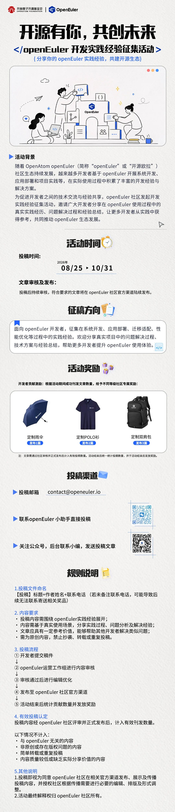

每一次实践，都是开源生态成长的见证；每一份经验，都能为更多开发者提供参考。
在使用 OpenAtom openEuler（简称：“openEuler”或“开源欧拉”）的过程中，你是否积累过系统部署、应用适配、问题定位、性能优化等方面的实践经验？是否有值得分享的解决方案和技术心得？

现在，openEuler 社区发起开发实践经验征集活动，诚邀广大开发者分享实践成果，与社区共同沉淀经验、交流技术，共建开放繁荣的开源生态！

