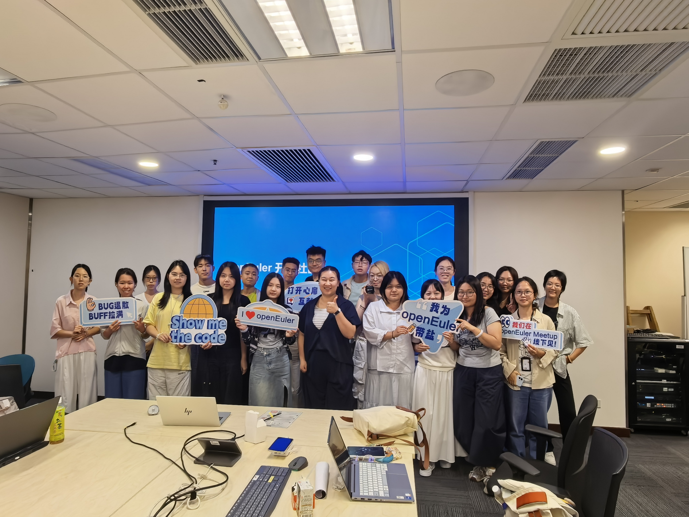
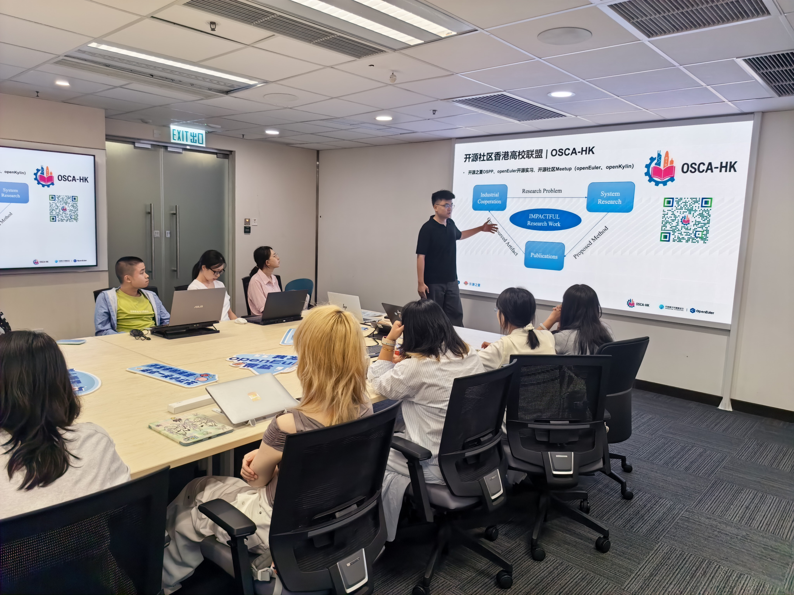
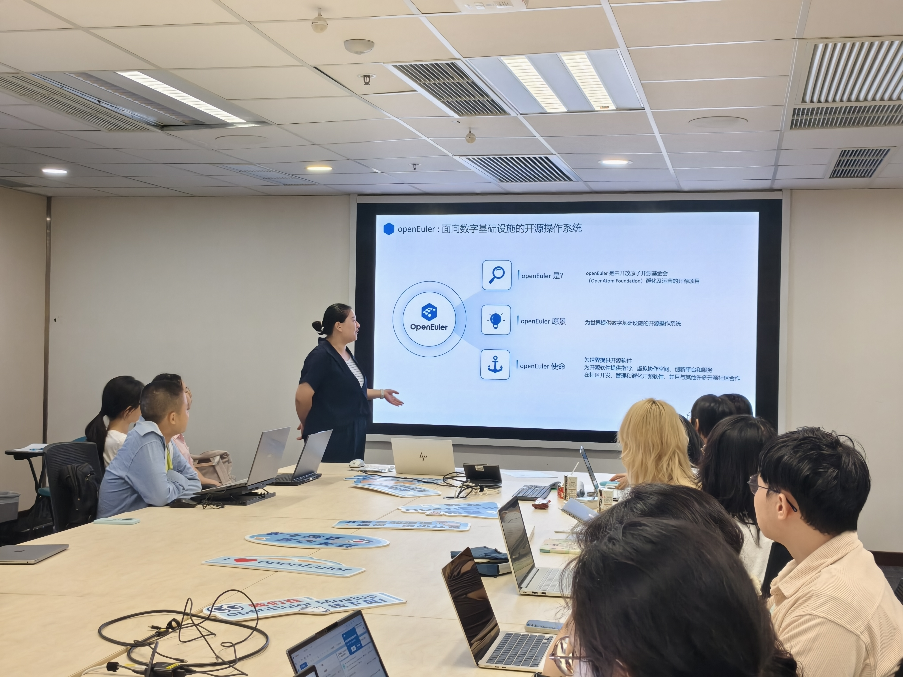
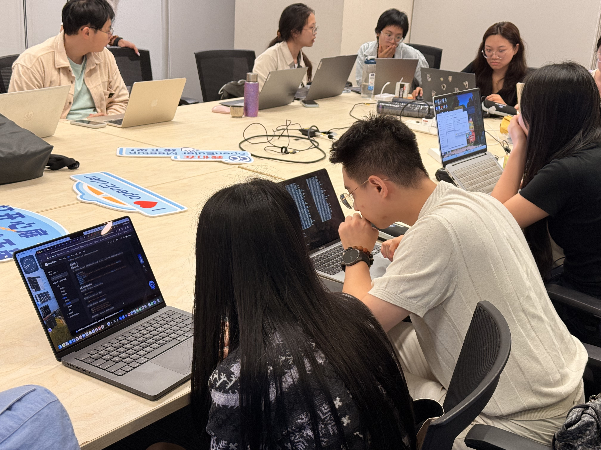
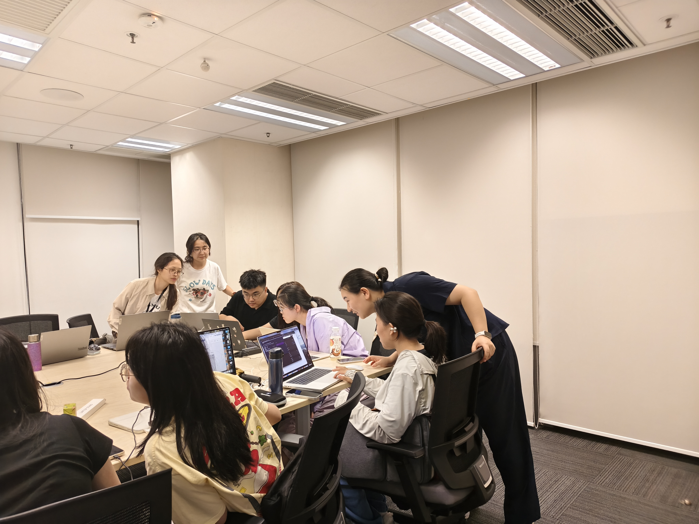
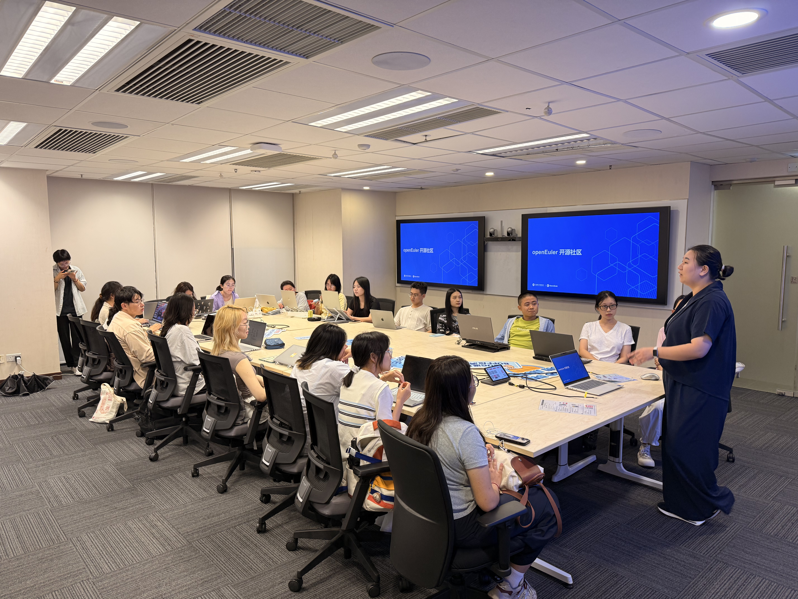

2026年8月29日，OpenAtom openEuler（简称“openEuler”或“开源欧拉”） Workshop 香港站在香港城市大学顺利举办。本次活动由 openEuler 社区主办，香港城市大学中国学生学者联合会（CityU CSSA）和香港高校开源联盟（OSCA-HK）承办，聚焦“技术分享 + 动手实践”，设置前沿技术主题分享和 openEuler 实操工坊两大环节。一方面，带领高校同学了解 AI 与操作系统内核安全领域的前沿探索；另一方面，通过从系统安装到 Issue、PR 提交的完整实践流程，让技术小白也能真正走进开源社区，完成一次真实的开源贡献。

## 01前沿技术分享：AI 与 openEuler 内核安全深度融合

活动现场，openEuler confidential computing SIG contributor、香港城市大学博士生李想带来《openEuler Intelligence 实践：从社区开发到学术研究》主题分享。分享围绕内核漏洞检测与缓解相关的开源社区实践展开，并结合自身参与 openEuler 社区的经历，介绍了从社区开发到学术研究的实践探索与心得。

同时，李想还分享了香港高校学生参与开源社区的多种方式，包括开源之夏（OSPP）、Google Summer of Code（GSoC）、OSCA-HK 开源工坊等，帮助更多高校同学了解如何从兴趣出发，找到适合自己的开源参与路径。

## 02实操工坊：零基础上手 openEuler，动手参与真实开源贡献

如果说技术分享让大家看到了开源技术的广度，那么实操工坊则让参与者真正“动手做起来”。

本次 Workshop 特别设置 openEuler 实操环节，面向技术小白，从系统安装开始，带领参与者完整体验开源社区工作流：安装系统、发现问题、定位问题、反馈问题，并通过 Issue 和 PR 参与社区贡献。

在 openEuler Doc SIG Maintainer 孙云玉的现场指导下，现场参会同学根据使用设备的不同，分为 macOS 和 Windows 两组开展实战。

结合实操过程中遇到的问题，同学们积极向 openEuler 社区反馈，共计提交 22 个 Issue、2 个 PR，主要聚焦于 Windows WSL 安装流程中的文档问题、步骤缺失等问题。这些来自真实用户场景的反馈，为社区进一步优化安装文档、完善用户体验提供了直接参考，也让参与者第一次以贡献者的身份参与到开源项目建设中。

另外，活动现场还设置了贡献激励环节，为 Issue、PR 提交数量突出的参与者颁发奖品，鼓励更多初学者从实际使用出发，发现问题、反馈问题，并通过文档优化、代码提交等多种方式参与开源共建。

## 03持续共建：让更多人一起参与开源

从一场技术分享，到一次系统安装；从发现一个文档问题，到提交 Issue 和 PR——开源并不遥远，也并非只有资深开发者才能参与。

本次 openEuler Workshop 香港站，将前沿技术分享与开源实践相结合：既带来了 AI 与操作系统内核安全领域的技术探索，也还原了普通使用者从“踩坑”到“反馈”，再到提交 Issue、PR 的真实开源工作流。开源不只是资深开发者的专利，普通使用者在使用中发现文档缺陷、流程 bug，提交 Issue 与 PR，同样是非常重要的开源贡献。

未来，OSCA-HK 将继续联合 openEuler 社区，持续在香港开展更多技术沙龙与实操工坊，为高校学生和开发者提供更多了解开源、学习开源、参与开源的机会。期待更多高校同学、开发者加入 openEuler 社区，一起参与开源共建，共同推动开源生态持续发展。
