## 概述

2026年8月，OpenAtom openEuler（简称“openEuler”或“开源欧拉”）社区持续推进技术创新与生态建设协同发展，社区规模与活跃度稳步提升。截至8月底，社区用户累计超过985.5万，开发者超过2.9万名，单位成员达2186家，SIG组111个，社区生态影响力持续扩大。在生态建设方面，社区持续加强开发者交流与开源实践推广，举办openEuler Embedded具身智能技术 Meetup上海站、openEuler Workshop香港站等活动，推动更多开发者参与社区实践；同时优化开发者服务体验，推进《openEuler 24.03 LTS SP4 快速入门》文档改版及AI友好型内容建设。在技术创新方面，社区持续深化AI与操作系统融合，围绕AI原生软件工程、Agent基础设施、AI推理、智能运维及算力优化等方向推出多项实践成果，openYuanrong v0.10.0发布，Witty、xlite等技术实践持续推进，进一步完善AI基础设施能力。

整体来看，openEuler社区持续强化AI技术创新、开发者服务与生态连接能力，加速构建面向AI时代的开放协同型操作系统基础设施。

（本月报阅读时长约8分钟）

## 社区规模

截至2026年8月31日，openEuler 社区用户累计超过985.5万，超过2.9万名开发者在社区持续贡献。社区单位成员达2186家，SIG组111个，累计产生330K+个PR、160.9K+条Issue、5951.1K+条Comment。

社区贡献看板（截至2026/08/31）

## 社区事件

### ➣openEuler Embedded 具身智能技术 Meetup 上海站圆满举办

8 月 14 日， openEuler Embedded 具身智能技术 Meetup 上海站圆满举办。本次活动由开放原子上海开源促进中心、开源欧拉社区主办，上海市人工智能行业协会、上海市人形机器人创新孵化器协办，智元 AIMA 开发者社区支持。来自开源社区、科研院所和产业一线的技术专家与开发者齐聚现场，围绕具身智能操作系统、机器人基础设施、集群协同推理、无任务学习、无人蜂群及工业场景落地等方向展开深入交流。

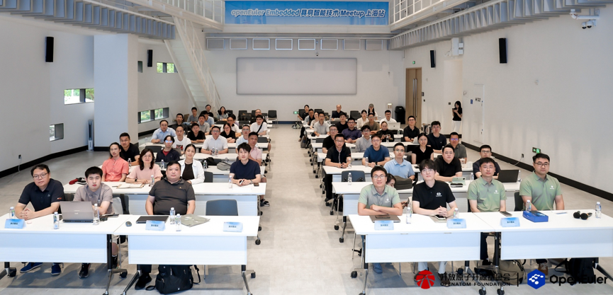

原文阅读：[具身聚力，智启未来 | openEuler Embedded 具身智能技术 Meetup 上海站圆满举办](https://mp.weixin.qq.com/s/b4Zhtjk2qBFjn02mflXqRA)

### ➣openEuler Workshop 香港站顺利举办

8月29日，openEuler Workshop 香港站在香港城市大学顺利举办。本次活动由 openEuler 社区主办，香港城市大学中国学生学者联合会（CityU CSSA）和香港高校开源联盟（OSCA-HK）承办，聚焦“技术分享 + 动手实践”，设置前沿技术主题分享和 openEuler 实操工坊两大环节。一方面，带领高校同学了解 AI 与操作系统内核安全领域的前沿探索；另一方面，通过从系统安装到 Issue、PR 提交的完整实践流程，让技术小白也能真正走进开源社区，完成一次真实的开源贡献。

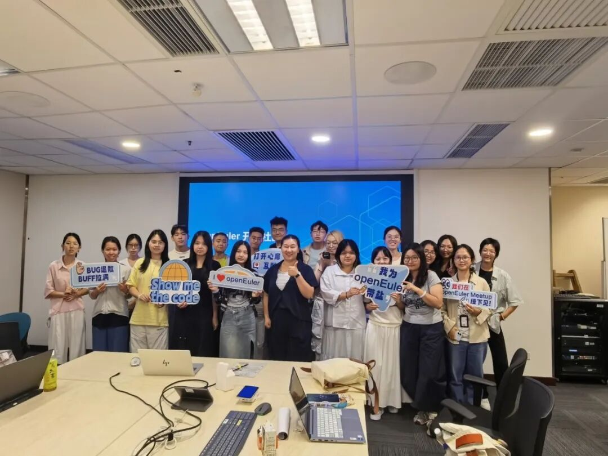

原文阅读：[活动回顾 | 从系统安装到开源贡献，openEuler Workshop 香港站带你走进开源实践](https://mp.weixin.qq.com/s/Y1yVM2KSB5bT21T_F0Q2Eg)
                                      
### ➣openEuler 社区开展开发实践经验征集活动

随着 openEuler 社区生态持续发展，越来越多开发者基于openEuler开展系统开发、应用部署和项目实践等，在实际使用过程中积累了丰富的开发经验与解决方案。

为促进开发者之间的技术交流与经验共享，openEuler社区发起开发实践经验征集活动，邀请广大开发者分享在openEuler使用过程中的真实实践经历、问题解决过程和经验总结，让更多开发者从实践中获得参考，共同推动openEuler生态发展。

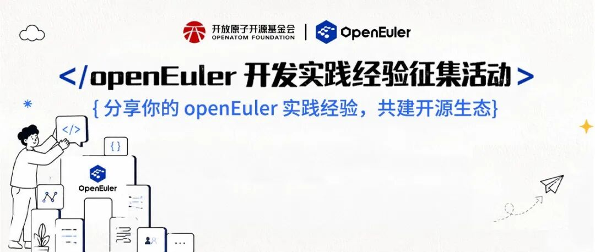

原文阅读：[有奖征集 | 分享你的openEuler开发实践经验，赢专属好礼！](https://mp.weixin.qq.com/s/w16G9sFo6XHWV_lQSs0syQ)

### ➣《openEuler 24.03 LTS SP4 快速入门》文档改版

《openEuler 24.03 LTS SP4 快速入门》面向初次接触 openEuler 的运维、管理员，覆盖镜像下载、系统安装到登录验证的完整流程，旨在降低操作系统上手门槛。而在去年社区生态健康调研里，部分使用者反馈“社区文档对新开发者不友好，文档像‘字典’，缺乏步骤化、图文并茂的入门指南”“表达不易理解，且省略关键步骤”等。
目前已针对《openEuler 24.03 LTS SP4 快速入门》开展新手专项测评，梳理实操卡点并逐一闭环整改。同时，结合当下 AI 发展趋势，以快速入门文档为试点，落地 GEO 结构化改造，优化文档适配性，实现易检索、易抓取，打造 AI 友好型内容。

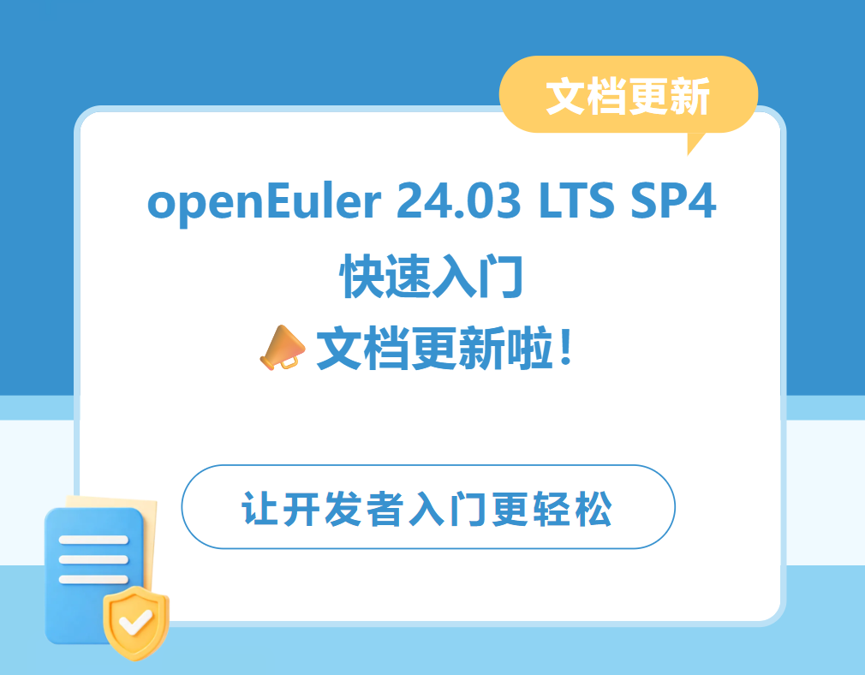

原文阅读：[《openEuler 24.03 LTS SP4 快速入门》文档改版：AI智简+人因友好，让开发者入门更轻松](https://mp.weixin.qq.com/s/k7YE7y2b2NuuJs3goFQskg)

### ➣openEuler 邀您共赴 KubeCon + CloudNativeCon + OpenInfra Summit + PyTorch Conference

9月7日至9日，KubeCon + CloudNativeCon + OpenInfra Summit + PyTorch Conference 中国站将在上海重磅开启，这场为期三天的技术盛会，将云原生、开源基础设施和人工智能三大社群紧密联结。无论你是构建生产级AI平台，还是打造现代化云原生基础设施，亦或是活跃在开源项目一线，这里都将是你与先行者思想碰撞、洞见未来的绝佳舞台。

大会的专题议程经过精心划分，旨在帮助参会者根据自身兴趣和专长，高效地获取知识。无论是初入领域的新人，还是经验丰富的专家，都能在对应的专题中找到深度内容。从AI/ML系统、平台工程，到安全、可观测性、网络、硬件使能，再到新兴技术和整体云原生体验，每个专题都聚焦于云原生技术生态的不同维度。

作为大会的社区合作伙伴， openEuler期待与来自当地的各位用户、技术专家和社区成员相聚，共同推进机器学习和下一代人工智能的发展。

原文阅读：[openEuler 邀您共赴 KubeCon + CloudNativeCon + OpenInfra Summit + PyTorch Conference](https://mp.weixin.qq.com/s/H5txx4_PYsMmoyOfZbV5_w)

## 技术进展

### ➣openEuler Agent Infra企业级编码方案：基于AI原生软件工程范式，实现企业级软件交付可靠、可控、可演进

2026 年，AI已从"编码助手"进化为工程执行主体。但有个反直觉的事实越来越难忽视：AI拔高了能力上限，却在规模、效率、质量三个维度上同时制造了新的挑战。为此， openEuler intelligence SIG组提出AI原生软件工程（AI-Native Software Engineering）范式，并构建了开源项目AET（Agentic Engineering Team），旨在推动企业级AI编码方案落地，实现可靠、可控、可演进的软件交付，欢迎使用与共建。

仓库链接：<https://atomgit.com/openeuler/agentic-engineering-team>  

 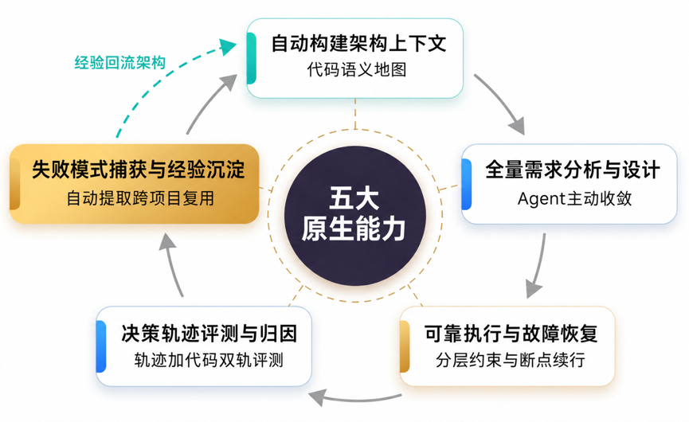     

原文阅读：[openEuler Agent Infra企业级编码方案：基于AI原生软件工程范式，实现企业级软件交付可靠、可控、可演进](https://mp.weixin.qq.com/s/tjHbA0V3UnxRSv7XlVgdKQ)

### ➣openEuler Intelligence SIG提供基于openEuler构建的官方MACA SDK Docker镜像

MACA（MetaX Accelerated Computing Architecture，亦称 MXMACA）是沐曦（MetaX）面向曦云 C500 系列通用计算 GPU 打造的异构计算软件栈，提供运行时、编译器、算子库与完整工具链，帮助开发者在沐曦 GPU 上快速构建 AI 训练、推理与 HPC 应用。

openEuler Intelligence SIG 现已提供基于 openEuler 构建的官方 MACA SDK Docker 镜像。本指南将帮助你使用 openeuler/maca-sdk 镜像，在已安装沐曦驱动的主机上快速拉起 MACA SDK 运行环境。

原文阅读：[保姆级速通！openEuler 沐曦卡 MACA SDK 容器镜像操作全指南](https://mp.weixin.qq.com/s/7aRfsLUGj4ZnZ3pvWNkl-A)

### ➣基于 openEuler 和 vLLM Ascend快速上手 Qwen3.8 指南

8月13日，阿里云通义千问首次开源Qwen-Max级别的模型Qwen3.8。Qwen3.8 是通义千问最新旗舰级基础模型，采用 MoE 混合专家架构，总参数量达 2.4 万亿，支持 100 万 Token 超长上下文。模型在自主编程、跨领域专业任务及多模态理解上实现突破，可端到端交付复杂项目，横跨法律、金融、设计等数百个专业场景，并具备长文档、长视频的深度理解能力。同时，它支持长周期任务自主规划与闭环迭代进化，提供函数调用、上下文缓存、结构化输出等完整企业级工具链，为开发者与行业应用提供强大基座支撑。

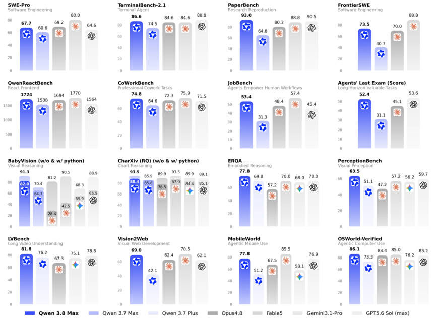

vLLM 是 PyTorch Foundation 下的开源 LLM 推理引擎，为用户和开发者提供快速、易用的 LLM 推理能力，vLLM-Ascend提供了vLLM对昇腾的支持。本指南将帮助你使用openEuler和 vLLM Ascend 在昇腾上运行 Qwen3.8。

原文阅读：[Day 0 操作指南！基于 openEuler 和 vLLM Ascend，教你快速上手 Qwen3.8](https://mp.weixin.qq.com/s/wb0G5QjLpYP9o68FUq0PLw)

### ➣openEuler 运维能力已 0 Day 适配 DeepSeek Harness：Witty Builtin Agents 直接集成，快速验证 CVE 查询与硬件兼容性能力

目前openEuler运维能力已 0 Day 适配 DeepSeek Harness。依托 Harness 的一切皆插件架构，Witty 的 Builtin Agents 以「角色提示词 + openEuler Portal MCP」的形式无缝衔接，CVE 查询、硬件兼容性分析等能力即刻可用。
本次实践不需要安装完整 Witty CLI，只需下载其 Builtin Agents，直接集成到 DeepSeek Harness 使用。

Agent 仓库位置：<https://atomgit.com/openeuler/euler-copilot-shell/tree/feat/witty-cli/packaging/builtin-agents>

官方介绍参考：<https://atomgit.com/openeuler/witty/blob/master/promotional-materials/2026-07-22-witty-cli-intro.md>

原文阅读：[openEuler 运维能力已 0 Day 适配 DeepSeek Harness：Witty Builtin Agents 直接集成，快速验证 CVE 查询与硬件兼容性能力]()

### ➣openYuanrong v0.10.0 版本正式发布：Agentic RL 与推理方向能力升级！

8月21日，openYuanrong 团队正式发布 openYuanrong v0.10.0，本次更新中，Agentic RL方向新增函数自动休眠唤醒功能；frontend 网关新增SSH/HTTP请求转发，并将Session弹性调度增强至十万级；推理方向则通过数据系统冷数据Rebalance优化内存效率，同时以动态日志采样和节点故障秒级回复提高系统可靠性。

原文阅读：[openYuanrong v0.10.0 版本：Agentic RL 与推理方向能力升级](https://mp.weixin.qq.com/s/SofunuO6I0WtRvRjlKqSXw)

### ➣openEuler 24.03 搭建 vLLM，Benchmark 数据直观出炉

openEuler作为面向全场景的新一代开源操作系统，正全面拥抱 AI 算力普惠时代。在 openEuler 24.03 及更高版本中，系统原生支持 vLLM 等主流 AI 推理框架。
虽然开源社区有基于 openEuler 和 vLLM 的预构建容器镜像，可以直接拉取使用，不过本文还是从纯净的 openEuler 和 CANN 基础容器镜像出发，从零安装并配置各个推理框架。

整个配置过程并不复杂，最终使用随机数据集跑通 Benchmark，输出 TTFT、TPOT、Throughput 等关键性能指标。

原文阅读：[一文实测！openEuler 24.03 搭建 vLLM，Benchmark 数据直观出炉](https://mp.weixin.qq.com/s/TNhQTrHzunAol6b6AWQeEQ)

### ➣Signatrust：新一代 C/S 架构签名服务平台技术解析

软件包签名是软件供应链安全的第一道防线，但传统签名方式"每种格式一套工具、私钥散落各处、缺少统一管理"。

[Signatrust](https://gitcode.com/openeuler/signatrust)（Signature + Trust + Rust）是openEuler社区开源的签名服务平台，用 Rust 实现，采用控制面/数据面分离的 C/S 架构，将 RPM/SRPM、内核模块、EFI、CMS、IMA 等多种签名场景统一到一个平台，私钥永不出服务端、密文落库、KMS 兜底。

本文从软件包签名的基本原理讲起，对比业界主流签名工具（国际与国密两条线），再深入剖析 Signatrust 的系统架构、三层密钥安全体系、客户端流水线模型以及国密合规改造中的工程挑战。

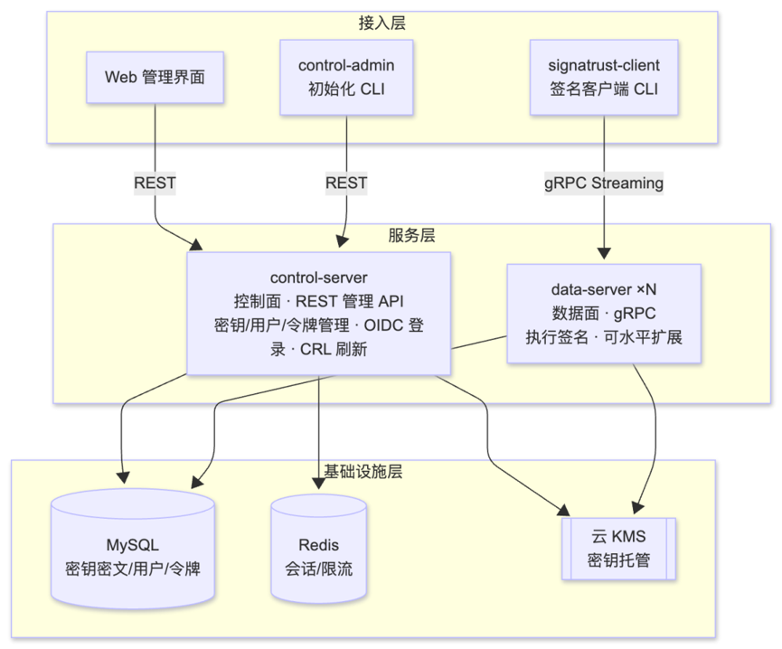

原文阅读：[Signatrust：新一代 C/S 架构签名服务平台技术解析](https://mp.weixin.qq.com/s/RVXT7aDGZor-bf73eCx-ZQ)

### ➣基于 openEuler Witty的xlite算子优化实战，TTFT提速80%+

xlite 是面向昇腾（Ascend）NPU 的高性能推理算子库与推理加速引擎，通过 vllm-ascend 接入 vLLM 生态，为大模型在昇腾硬件上的部署提供底层算子优化与图融合能力。简单来说，vLLM 负责调度与服务，vllm-ascend 负责昇腾适配，而 xlite 则专注于把每一个算子、每一条计算链路在 NPU 上跑到极致。

为提升 xlite 性能优化效率，面对复杂的代码结构与优化路径，借助了 openEuler社区开源的 [xlite-perf-optimizer-bundle](https://atomgit.com/openeuler/witty-agents/tree/master/xlite-perf-optimizer-bundle) 智能体。通过部署 xlite-perf-optimizer-bundle ，在 openEuler 环境中实现了算子分析、开发与验证流程的自动化执行，大幅降低了上手门槛并加速了优化进程。

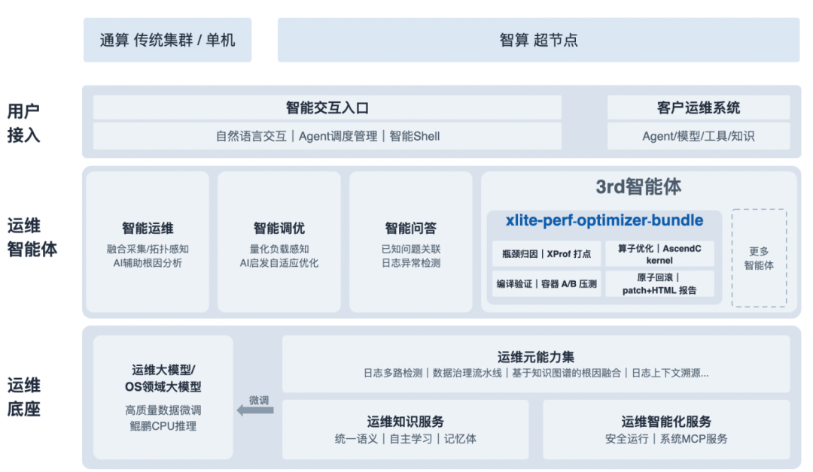

原文阅读：[从智能运维到推理调优：基于openEuler Witty的xlite算子优化实战，TTFT提速80%+](https://mp.weixin.qq.com/s/EbjikIzsw0u8ZxZ0_dQ9_g)

## 容器镜像更新

统计周期：2026年8月1日至8月31日

数据来源：<https://gitcode.com/openeuler/openeuler-docker-images>

8月，openEuler 应用镜像新增了 16 个应用镜像（HPC、Others、Database 三大分类），同时为 6 款已有镜像完成了基于 openEuler 24.03-LTS-SP4 的升级。具体分类如下：

### 新增镜像（16个）

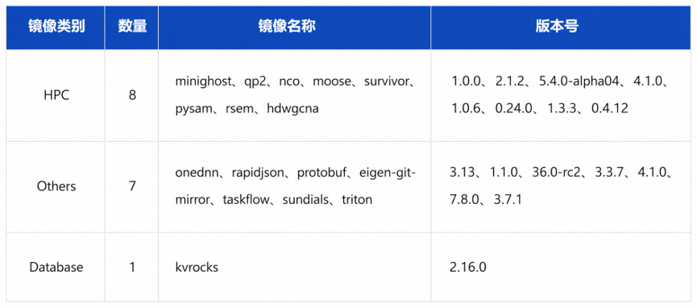

### 基于 SP4 基础镜像升级（6个）

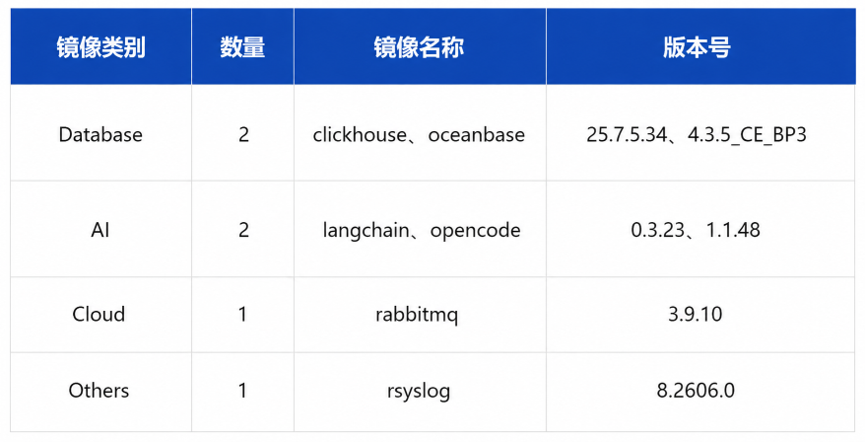

容器镜像可通过 Docker Hub 拉取使用，仓库地址：
<https://hub.docker.com/u/openeuler>

## 软硬件兼容性测评

截至2026年8月31日，通过openEuler 软硬件兼容性测评的产品达2813款，8月新增44款，其中北向（ISV）新增23款，南向（IHV）新增19款，OSV 新增2款。

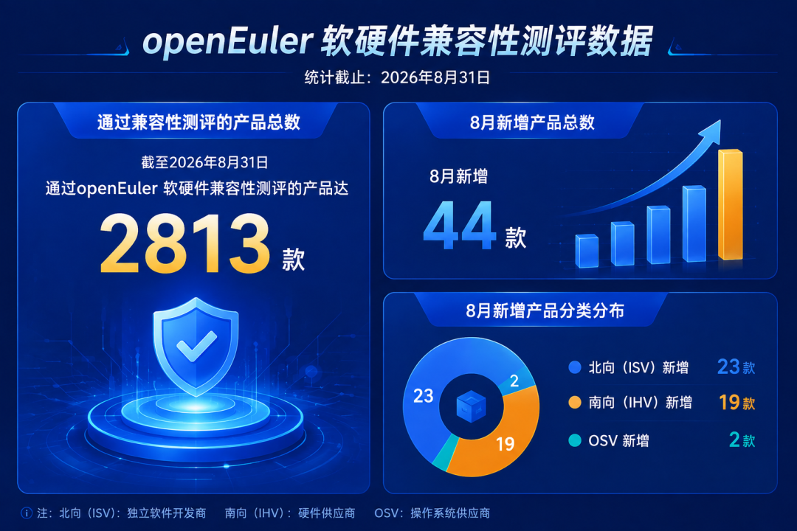

- 兼容性列表：<https://www.openeuler.org/zh/compatibility/>

- OSV技术测评列表：<https://www.openeuler.org/zh/approve/>

## 安全公告

2026年8月，社区共发布安全公告403个，修复漏洞134个（其中 Critical 39个，High 67个，其它63个）。

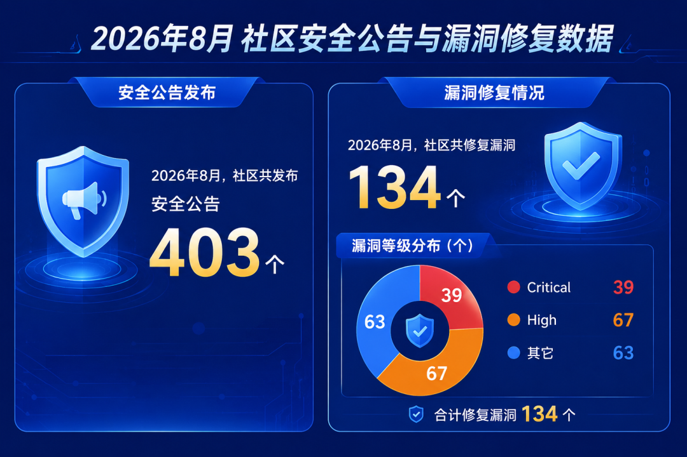

重点漏洞提醒以下漏洞评估影响较大，请重点关注。

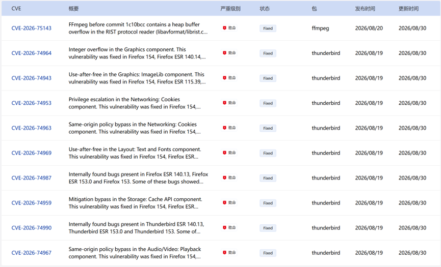

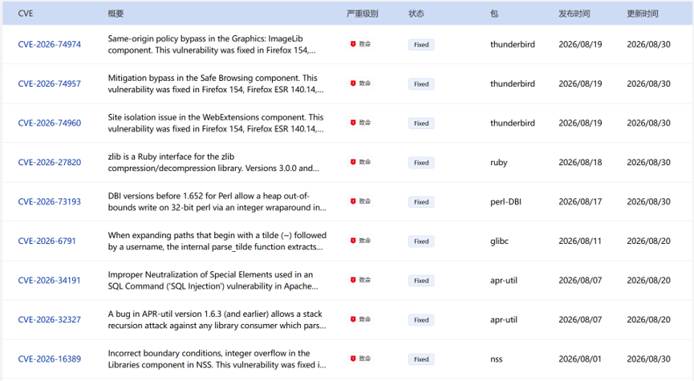

### 漏洞防护

openEuler社区针对在维版本例行修复漏洞，发布安全补丁。建议用户关注openEuler官网安全公告，及时安装漏洞补丁进行防护。

openEuler 安全公告：<https://www.openeuler.org/zh/security/security-bulletins/>

## 致谢
openEuler社区的发展离不开每一位参与者的共同努力。每一次代码提交、每一次技术讨论、每一次经验分享，都在不断推动社区向前发展，也共同汇聚成社区持续成长的动力。

由于社区实践与成果持续涌现，月报在整理过程中难免有所遗漏。如有尚未收录的重要进展或贡献，欢迎与我们联系补充，让更多努力被记录与传递。在此，向为本期月报提供资料支持的各 SIG 组以及广大开发者朋友们致以诚挚的感谢与敬意。

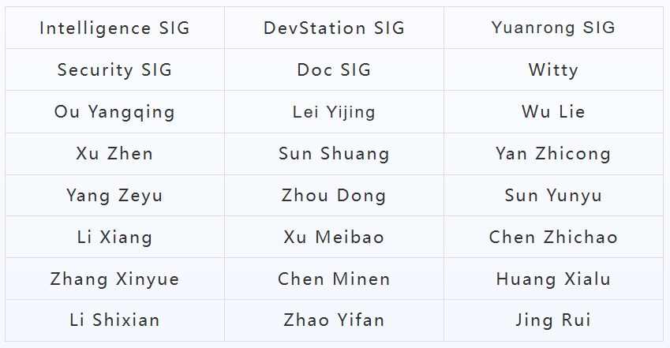
*以上排名不分先后顺序

若您希望在月报中补充相关工作内容，或对月报内容提出意见和建议，欢迎联系：contact@openeuler.io

