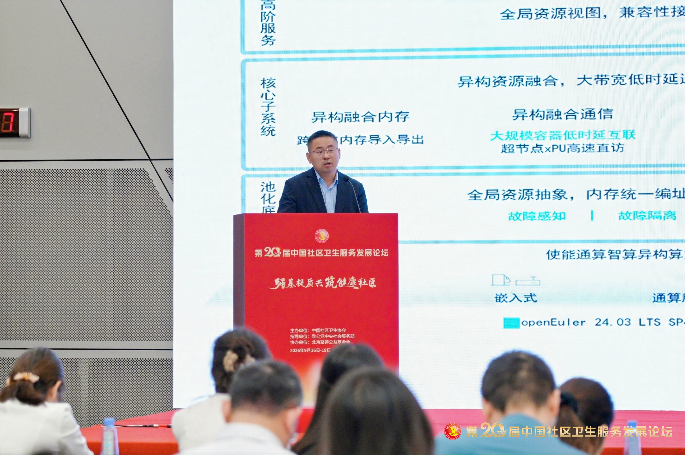
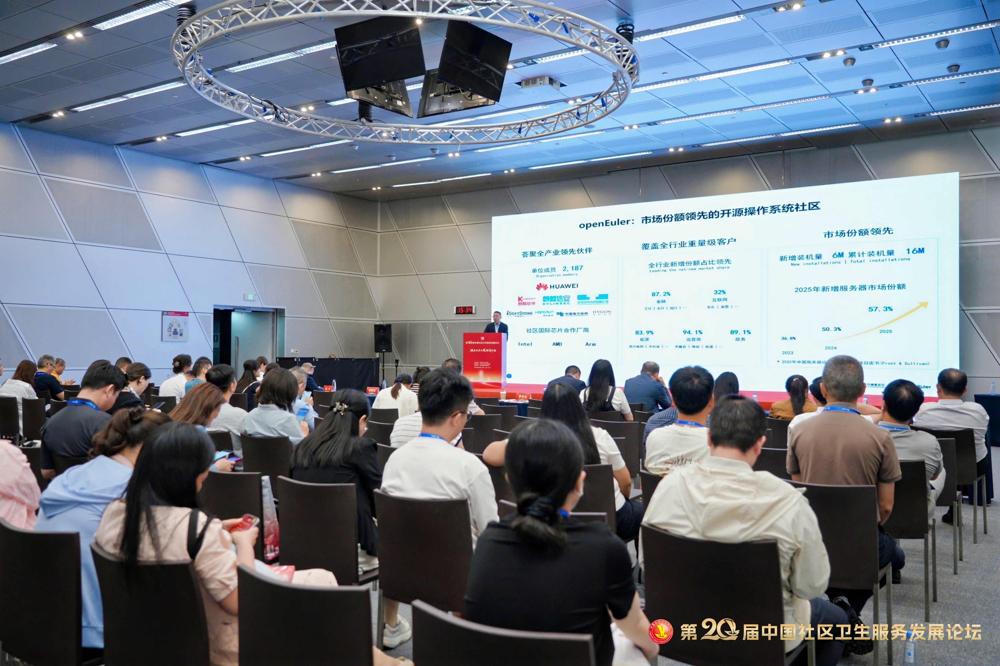

9月17日，由中国社区卫生协会主办、致公党中央社会服务部指导的第二十届中国社区卫生服务发展论坛在辽宁大连召开。OpenAtom openEuler（简称：“openEuler”或“开源欧拉”） 用户委员会主席、软通动力助理副总裁王军，作为openEuler项目群代表出席"协同共建健康社区"专题会议，并发表"开源聚力·AI原生，openEuler驱动医疗数智化创新"主题报告，分享openEuler在基层医疗、社区健康服务领域的创新实践。

openEuler 用户委员会主席，软通动力助理副总裁 王军

openEuler作为根源于中国、面向全球的开源操作系统，历经六年社区共建，实现服务器、云计算、边缘计算、嵌入式全场景覆盖以及对Arm、Intel、AMD等主流计算架构的100%兼容。目前社区汇聚2100余家单位成员、超2.9万名贡献者，国内新增服务器操作系统市场份额持续领跑，已广泛应用于互联网、能源、运营商、金融、医疗等关键行业，成为国内基础设施领域重要的开源力量。

迈入AI智能体时代，openEuler完成面向超节点与Agentic AI的技术升级，打造生产级AI操作系统底座。依托超节点OS实现异构算力池化，具备超大内存、超大带宽、百纳秒级超低时延硬件调度能力；全新Agent Infra提供极速沙箱、记忆系统、Agent安全运行时全套组件，实现Agent调用全链路可观测、推理TTFT性能优化，兼顾安全可信、开箱即用、降本增效三大核心能力，为各行业AI智能体应用提供操作系统层面原生支撑。

报告指出，当前医疗AI落地普遍面临异构算力环境复杂、多模态医疗数据孤岛突出、患者隐私合规压力大、AI智能体部署门槛高等现实难题。

本次报告重点分享了三套基于openEuler已落地的医疗联合解决方案实践成果：

- **智能医疗诊断平台（联合吉布森生物科技）**：以软通天鹤OS（基于openEuler的商业发行版）为底座，搭载"一脑多端"智慧主动健康引擎，落地AI阅片、智能分诊功能，构建"圈定高风险人群-精细化干预-早诊早治早康复"完整业务闭环，支撑癌症、慢阻肺等重点慢病的全周期健康管理。

- **StrokeAI脑卒中智能化解决方案（联合安德医智）**：依托openEuler原生AI Agent智能体框架，搭载GMEM异构内存融合技术，深度适配Atlas系列硬件，完成脑部多序列影像高速AI推理与病灶量化测算。经临床验证，该方案可使缺血性卒中患者出院后3个月复发率相对降低25.6%，有效提升脑卒中诊疗质量与患者就医满意度。

- **县域基层公卫健康管理方案（陕西康华数据）**：以openEuler为底层基座，AI健康知识库为智能引擎，打通儿童"五健"筛查、县域人群体重管理两大基层核心场景，赋能乡镇卫生院开展居民日常健康监测与健康防护，将开源技术真正下沉至基层医疗卫生一线。

医疗数智化不是单点产品的简单叠加，而是基础软件、算力硬件、临床业务与开源生态的协同创新。未来，openEuler将联合产业链医疗伙伴持续迭代打磨面向医疗场景的Agent底座，打通**"技术-场景-产业"闭环**，以开源创新力量助力我国智慧医疗、基层社区卫生服务高质量发展。