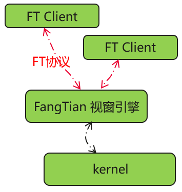

经 openEuler 社区技术委员会讨论决定，openEuler 社区正式成立 FangTian SIG。FangTian SIG由中科院软件所，华为，麒麟软件等公司共同发起成立。SIG将聚焦FangTian视窗引擎，包含显示服务，窗口管理，图形绘制、合成、送显等模块，同时推出新型FT显示协议，探索解决Linux桌面环境体验不佳的问题。    

在Linux桌面环境下，最基础，最重要的底座是显示协议。目前主流的显示协议有X11和Wayland，在Linux桌面环境有着丰富的生态。但其仍然存在许多问题，如：跨应用跨窗口的联动动效差，冗余绘制，高内存及传输低效等。  

   

FangTian 兼容支持X11/Wayland显示协议，同时也将推出全新的FT显示协议。相对传统的X11/Wayland显示协议，FT显示协议在动效、内存、系统能效等方面拥有全面的优势。这也是国内首次发起并主导的显示底层协议标准。 

FangTian将实现FT显示协议，构建出全新一代视窗引擎，配合GUI开发框架，桌面应用，从“根”上彻底解决多年来困扰Linux视窗显示的问题，为用户带来全新的显示体验，达到极高性能、流畅交互、极致动效等诸多的视效体验。

   

FangTian SIG会长期专注视窗引擎的开发及技术研究，计划发布如下特性：

* 实现FT协议， ArkUI应用的运行，达到单屏50窗@60FPS；
* 兼容X11/Wayland协议，支撑常用Linux软件；

欢迎对视窗引擎感兴趣的开发者加入  FangTian SIG 。   

 FangTian SIG Maintainer

| 姓名   | 公司                 | giteeid     |
| ------ | -------------------- | ----------- |
| 郑森文 | 中国科学院软件研究所 | zhengsenwen |
| 吴圣垚 | 中国科学院软件研究所 | shen_hua_li |
| 冯绍波 | 华为                 | ShaoboFeng  |
| 宋亚南 | 华为                 | yanansong   |
| 徐飞龙 | 华为                 | BruceXuXu   |
| 华亚东 | 麒麟软件             | hua_yadong  |

 例会时间

双周周四例会时间：上午10:00~11:00   

 微信交流群

 或添加hxt_hhg微信，回复“FangTian”

